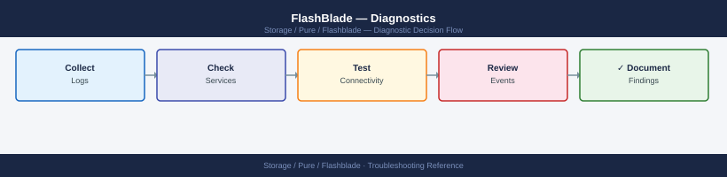

---
tags:
  - pure
  - troubleshooting
search:
  boost: 1.5
---
# FlashBlade — Diagnostics

<div class="kb-summary">
FlashBlade diagnostic commands: check array health and active alerts with purefb, inspect blade and hardware component status, diagnose NFS and S3 performance, verify replication link health, and generate the diagnostic bundle for Pure Storage support cases.

*Applies to: Pure Storage FlashBlade with Purity//FB 4.x*
</div>


```d2
direction: right

B: "B" {shape: rectangle}
C: "purefb alert list\npurefb blade list" {shape: rectangle}
D: "purefb network interface list\nCheck VIP state" {shape: rectangle}
E: "purefb array list\npurefb fs list --performance" {shape: rectangle}
F: "purefb replication list\npurefb replication arrayconnection list" {shape: rectangle}
G: "purefb array --performance\npurefb fs list --performance" {shape: rectangle}
H: "H" {shape: rectangle}
I: "Open Pure SR immediately\nDo not attempt hardware repair" {shape: rectangle}
J: "purefb hardware list\nCheck component state" {shape: rectangle}
K: "Check VIP addresses\nTest NFS mount from client" {shape: rectangle}
L: "L" {shape: rectangle}
M: "purefb network subnet list\nCheck switch port and VLAN" {shape: rectangle}
N: "Check NFS export policy\npurefb policy list" {shape: rectangle}
O: "Check used vs provisioned\nCheck thin provisioning ratio" {shape: rectangle}
P: "Check link latency and throughput\npurefb replication arrayconnection list -verbose" {shape: rectangle}
Q: "Rank filesystems by throughput\npurefb fs list --performance sort by\nwrite_bytes_per_sec" {shape: rectangle}
R: "Collect diagnostic bundle\npurefb support diag" {shape: rectangle}
S: "Open Pure Support case\nsupport.purestorage.com" {shape: rectangle}
A: "FlashBlade Issue" {shape: rectangle}

B -> C
B -> D
B -> E
B -> F
B -> G
H -> I
H -> J
D -> K
L -> M
L -> N
E -> O
F -> P
G -> Q
I -> R
J -> R
M -> R
N -> R
O -> R
P -> R
Q -> R
R -> S
```

```d2
direction: down

symptom: Identify Symptom {shape: diamond}
step_1_check_array_health_and_active: "Step 1 — Check array health and active alerts" {shape: rectangle}
step_2_check_blade_and_hardware_heal: "Step 2 — Check blade and hardware health" {shape: rectangle}
step_3_check_filesystem_and_bucket_s: "Step 3 — Check filesystem and bucket state" {shape: rectangle}
step_4_check_replication_health: "Step 4 — Check replication health" {shape: rectangle}
step_5_diagnose_performance_issues: "Step 5 — Diagnose performance issues" {shape: rectangle}
step_6_generate_diagnostic_bundle_fo: "Step 6 — Generate diagnostic bundle for Pure support" {shape: rectangle}
resolution: Resolve or Escalate {shape: oval}

symptom -> step_1_check_array_health_and_active: investigate
symptom -> step_2_check_blade_and_hardware_heal: investigate
symptom -> step_3_check_filesystem_and_bucket_s: investigate
symptom -> step_4_check_replication_health: investigate
symptom -> step_5_diagnose_performance_issues: investigate
symptom -> step_6_generate_diagnostic_bundle_fo: investigate
step_1_check_array_health_and_active -> resolution
step_2_check_blade_and_hardware_heal -> resolution
step_3_check_filesystem_and_bucket_s -> resolution
step_4_check_replication_health -> resolution
step_5_diagnose_performance_issues -> resolution
step_6_generate_diagnostic_bundle_fo -> resolution
```

## Before you begin

- **Access:** FlashBlade admin credentials (SSH to management IP or Purity//FB web GUI); Pure1 portal access
- **Gather first:** the specific symptom (client cannot mount, alert in Pure1, replication stopped, performance degraded), the affected filesystem or bucket name, and when the issue started
- **Scope:** confirm whether the issue affects one filesystem, one protocol (NFS only vs. S3), one blade, or the entire array
- **Phone-home:** verify Pure1 phone-home is active (`purefb array list` shows phone-home status) — most hardware alerts are auto-detected by Pure

---

## Step 1 — Check array health and active alerts

```bash
# Connect to FlashBlade management CLI
ssh pureuser@<flashblade-management-ip>

# Overall array status, Purity//FB version, and capacity
purefb array list
# Key fields:
#   Version: Purity//FB version (confirm matches support matrix)
#   Space.Used / Space.Total: overall capacity utilization
#   Status: online (expected); degraded = hardware issue

# All active alerts (most critical first)
purefb alert list
# Expected: no alerts; or only informational (severity=info)
# Problem: severity=warning or severity=error alerts
# Common alerts: blade degraded, drive failure, capacity > 80%, replication lag

# Include resolved alerts for history (last 7 days)
purefb alert list --filter "time>='7 days ago'" | head -50

# Audit log (admin actions — useful if a config change caused the issue)
purefb admin list --audit | tail -50
```


```text title="Expected output"
Connected to 10.20.50.15.
purity-fb-01> purefb array list
Name            Version          Status    Space.Used  Space.Total
purity-fb-01    4.10.2           online    18.2TB      102.4TB
purity-fb-01>
purity-fb-01> purefb alert list
ID      Severity  Code                    Message                          Time
1847    info      BLADE_TEMP_WARNING      Blade-3 temperature nominal      2024-01-15 14:32:10
1846    warning   DRIVE_PREDICTIVE_FAIL   Drive SSD-7-2 predictive failure 2024-01-15 13:18:45
1845    error     REPLICATION_LAG         Replication lag > 1 hour         2024-01-15 12:05:22
purity-fb-01>
purity-fb-01> purefb alert list --filter "time>='7 days ago'" | head -50
ID      Severity  Code                    Message                          Time
1847    info      BLADE_TEMP_WARNING      Blade-3 temperature nominal      2024-01-15 14:32:10
1846    warning   DRIVE_PREDICTIVE_FAIL   Drive SSD-7-2 predictive failure 2024-01-15 13:18:45
1845    error     REPLICATION_LAG         Replication lag > 1 hour         2024-01-15 12:05:22
1844    info      CAPACITY_THRESHOLD      Capacity utilization 82%         2024-01-14 09:47:33
1843    warning   BLADE_DEGRADED          Blade-5 operating in degraded    2024-01-13 16:22:11
purity-fb-01>
purity-fb-01> purefb admin list --audit | tail -50
Time                    Admin           Action          Resource        Details
2024-01-15 15:42:18     pureuser        modify          nfs-export-01   Changed access_list
2024-01-15 14:28:05     automation      create          snapshot-daily  Scheduled snapshot created
2024-01-15 13:15:33     pureuser        delete          old-vol-backup  Volume deleted
2024-01-15 12:01:22     sysadmin        modify          replication-01  Target changed to dr-site-02
2024-01-14 10:33:44     pureuser        create          nfs-export-02   New export created
purity-fb-01>
```

!!! warning "Common errors"
    **`Connection refused`** — Verify the FlashBlade management IP is correct and SSH is enabled; check firewall rules allowing port 22 to the management interface.
    **`purefb: command not found`** — Ensure you are logged into the FlashBlade CLI (after `ssh` connection succeeds); if using a jump host, SSH directly to the management IP instead.
    **`Alert severity=error or severity=warning present`** — Cross-reference the alert code and timestamp with the audit log to identify recent config changes, then consult Pure Storage support matrix for the specific alert remediation steps.
---

## Step 2 — Check blade and hardware health

```bash
# Blade health and capacity contribution
purefb blade list
# Each blade shows: Name, Status, Capacity, RawCapacity
# Expected: Status = healthy for all blades
# Problem: Status = unhealthy or failed → open Pure SR immediately

# Full chassis hardware status (power supplies, fans, chassis modules)
purefb hardware list
# Each component shows: Name, Status, Temperature
# Expected: Status = ok for all hardware
# Problem: any Status = failed or warning → open Pure SR

# Network interface status (data and management VIPs)
purefb network interface list
# Shows: name, address, enabled, speed, services (management/replication/data)
# Expected: Enabled = True and Speed > 0 for all active interfaces
```


```text title="Expected output"
Name                Status      Capacity        RawCapacity
blade-1             healthy     51.2TB          102.4TB
blade-2             healthy     51.2TB          102.4TB
blade-3             healthy     51.2TB          102.4TB
blade-4             healthy     51.2TB          102.4TB

Name                    Status      Temperature
psu-1                   ok          32C
psu-2                   ok          31C
fan-module-1            ok          28C
fan-module-2            ok          29C
chassis-controller      ok          45C

Name                Address             Enabled     Speed       Services
management-vip      10.20.1.100         True        1000Mbps    management
replication-vip     10.20.2.50          True        10000Mbps   replication
data-vip-1          10.20.3.100         True        10000Mbps   data
data-vip-2          10.20.3.101         True        10000Mbps   data
```

!!! warning "Common errors"
    **`Error: Invalid credentials or unable to connect to array`** — Verify the Pure FlashBlade management IP is reachable and your API token is valid with `purefb --version` and check network connectivity.
    **`blade-X status: unhealthy`** — Contact Pure Storage support immediately and check blade logs with `purefb blade list --verbose` to identify the specific hardware failure.
    **`network interface list: command not found`** — Ensure you are running the correct Pure FlashBlade CLI version; use `purefb network interface list` instead of `purefb network list`.
---

## Step 3 — Check filesystem and bucket state

```bash
# List all filesystems with provisioned and used capacity
purefb filesystem list
# Columns: Name, Provisioned, Space Used, % Used, NFS/SMB/HTTP enabled
# Alert: % Used > 80% = approaching full; provisioned size may need increasing

# List S3 buckets with usage
purefb bucket list
# Columns: Name, Object Count, Space Used, Account

# Check NFS export policies
purefb policy list
purefb policy list <policy-name>
# Shows which filesystem the policy applies to and the NFS rules

# Check directory services (AD / LDAP) for authentication
purefb directoryservice list
# Expected: Enabled = True and Status = connected for configured AD/LDAP

# Check SMB shares (if using SMB protocol)
purefb share list

# Check object store accounts and users
purefb objectstoreaccount list
purefb objectstoreuser list
```


```text title="Expected output"
Name             Provisioned    Space Used    % Used    NFS    SMB    HTTP
data-prod        10.0 TB        8.2 TB        82%       Yes    Yes    No
backup-archive   50.0 TB        12.5 TB       25%       Yes    No     No
dev-scratch      5.0 TB         4.8 TB        96%       Yes    Yes    Yes

Name             Object Count    Space Used    Account
archive-2024     1,247,856       45.3 GB       prod-storage
logs-retention   892,341         28.7 GB       ops-team
...

Name                    Filesystem        NFS Rules
nfs-prod-policy         data-prod         rw,no_root_squash,192.168.1.0/24
nfs-backup-policy       backup-archive    ro,root_squash,10.0.0.0/8

Name              Enabled    Status        Type
corp-ad           True       connected     Active Directory
ldap-secondary    True       connected     LDAP

Name              Filesystem        Protocol    Enabled
smb-data          data-prod         SMB3        Yes
smb-archive       backup-archive    SMB3        Yes

Name                  Created
prod-storage          2024-01-15T09:22:11Z
ops-team              2024-02-03T14:55:42Z

Name                  Account           Access Type
admin-user            prod-storage      Full
backup-svc            ops-team          Read-Only
```

!!! warning "Common errors"
    **`Error: Policy 'nfs-invalid-policy' not found`** — Verify the policy name exists with `purefb policy list` and check for typos.
    **`Error: Directory service connection failed: LDAP server unreachable`** — Confirm LDAP/AD server IP and port are correct, and network connectivity exists from the FlashBlade management interface.
    **`Error: Filesystem 'data-prod' is 96% full`** — Increase provisioned capacity immediately with `purefb filesystem update --name data-prod --provisioned <new-size>` to prevent write failures.
---

## Step 4 — Check replication health

```bash
# Replication link status and lag (ActiveDR or async replication)
purefb replication list
# Shows: Name, Status, Lag, Bytes Transferred, Paused
# Expected: Status = replicating; Lag = low (seconds to minutes for async)
# Problem: Status = broken or Paused = True

# Remote array connection details
purefb replication arrayconnection list
# Shows: remote array name, management IP, replication IPs, connection status

# Check network interface used for replication
purefb network interface list | grep replication
# Replication VIPs must be able to reach the remote array's replication VIPs

# Snapshot list (source of replication)
purefb snap list
# Shows: name, source filesystem/bucket, created time, size
```


```text title="Expected output"
Name                          Status      Lag         Bytes Transferred  Paused
prod-to-dr-fs1               replicating 45s         2.3TB              False
prod-to-dr-fs2               replicating 2m 12s      5.7TB              False
prod-to-dr-bucket-analytics  replicating 1m 8s       892GB              False

Name                    Management IP      Replication IPs              Status
flashblade-dr-01        203.0.113.42       203.0.113.100-103           connected
flashblade-dr-02        203.0.113.43       203.0.113.104-107           connected

Name              MTU    Enabled  Services
eth2              1500   True     replication
eth3              1500   True     replication

Name                    Source              Created                Size
fs1.1704067200          fs1                 2024-01-01 12:00:00  450GB
fs1.1704153600          fs1                 2024-01-02 12:00:00  455GB
bucket-daily.1704067200 analytics-bucket    2024-01-01 12:00:00  125GB
bucket-daily.1704153600 analytics-bucket    2024-01-02 12:00:00  128GB
...
```

!!! warning "Common errors"
    **`replication link status: broken`** — Verify network connectivity between replication VIPs using `ping` and check firewall rules allow port 443 bidirectionally.
    **`command not found: purefb`** — Install the Pure Storage Python SDK with `pip install purestorage` or ensure the FlashBlade CLI tools are in your PATH.
    **`connection refused on remote array`** — Confirm the remote array's replication VIPs are reachable and that the replication link was accepted on the destination array using `purefb replication arrayconnection approve`.
---

## Step 5 — Diagnose performance issues

```bash
# Array-level throughput, IOPS, and latency
purefb array --performance
# Key metrics:
#   read_bytes_per_sec / write_bytes_per_sec  → throughput
#   reads_per_sec / writes_per_sec           → IOPS
#   usec_per_read_op / usec_per_write_op     → latency in microseconds

# Filesystem-level performance (shows per-filesystem breakdown)
purefb fs list --performance
# Sort filesystems by write throughput to find hot spots
purefb fs list --performance | sort -k3 -rn

# Performance targets for FlashBlade:
#   NFS sequential I/O:   < 1 ms latency expected for large I/O
#   NFS small random I/O: < 5 ms latency
#   S3 object GET/PUT:    < 5 ms latency

# S3 bucket performance
purefb bucket list --performance

# Network interface utilization (check if NICs are saturated)
purefb network interface list
# Check Speed vs. actual throughput from purefb array --performance
```


```text title="Expected output"
=== Array Performance ===
Name              Read(B/s)      Write(B/s)     Reads/s    Writes/s   Read_Lat(us)  Write_Lat(us)
flashblade-prod   8.2GB          3.1GB          125000     45000      487           612

=== Filesystem Performance ===
Name              Throughput(B/s) IOPS           Latency(us)
data-warehouse    2.8GB           98000          521
archive-nfs       1.2GB           42000          687
backup-tier2      890MB           31000          743
temp-scratch      456MB           18000          892
...

=== S3 Bucket Performance ===
Bucket            Read(B/s)      Write(B/s)     GET_Lat(us)  PUT_Lat(us)
ml-training       1.5GB          780MB          2100         2800
logs-archive      340MB          120MB          3400         4200

=== Network Interfaces ===
Name              Speed          Status         Throughput(B/s)
eth0              100Gbps        up             8.9GB
eth1              100Gbps        up             7.2GB
eth2              100Gbps        up             6.8GB
eth3              100Gbps        up             5.1GB
```

!!! warning "Common errors"
    **`purefb: command not found`** — Ensure the Pure Storage CLI is installed and the `purefb` binary is in your PATH, or source the Pure SDK environment setup script.
    **`Error: Authentication failed`** — Verify your Pure FlashBlade credentials are configured via `purefb login` or check that your API token environment variable is set correctly.
    **`Error: No filesystems found`** — Confirm that filesystems exist on the array and your user account has read permissions; use `purefb fs list` without filters to verify connectivity.
**Common performance root causes:**

| Symptom | Check | Action |
|---|---|---|
| Low NFS throughput | Client mount options | Use `rsize=1048576,wsize=1048576` |
| High NFS latency | Network congestion | Check switch utilization and jumbo frames |
| S3 slow | Large object count in bucket | Optimize key prefix distribution |
| Blade degraded | `purefb blade list` | Open Pure SR immediately |

---

## Step 6 — Generate diagnostic bundle for Pure support

```bash
# Generate and upload diagnostic bundle (requires phone-home to be active)
purefb support diag
# This sends the diagnostic bundle to Pure Storage automatically via phone-home
# Confirmation: "Diagnostic information sent to Pure Storage support"

# If phone-home is not active, the bundle is saved locally
# Contact Pure Support to get the bundle download path

# What to include in the Pure Support case:
# - Array name and serial number: purefb array list
# - Purity//FB version: purefb array list (Version field)
# - Blade health: purefb blade list (full output)
# - Hardware health: purefb hardware list (full output)
# - Active alerts: purefb alert list (full output)
# - Filesystem or bucket details (if data-access related)
# - NFS mount options from affected clients: mount | grep nfs
# - Symptom description, start time, and business impact
```


```text title="Expected output"
Diagnostic bundle generation initiated...
Gathering system information from array fb-prod-01...
Collecting blade health data...
Collecting hardware telemetry...
Collecting alert logs...
Bundle size: 247.3 MB
Diagnostic information sent to Pure Storage support
Case reference: CS-2024-0847291
Phone-home delivery confirmed at 2024-01-15T14:32:18Z

Array Name: fb-prod-01
Serial Number: FB-7M2K9X4R1Q8V
Purity//FB Version: 4.3.2
```

!!! warning "Common errors"
    **`Error: Phone-home is not active on this array`** — Enable phone-home with `purefb phonehome --enable` or manually download the bundle from `/var/log/pure/diag/` and contact Pure Support with the file path.
    **`Error: Insufficient disk space for diagnostic bundle`** — Free at least 500 MB on the management network by removing old logs with `purefb support diag --clear-old` before retrying.
    **`Error: Connection timeout to Pure Storage support servers`** — Verify network connectivity and firewall rules allow HTTPS outbound on port 443 to `support.purestorage.com`, then retry the command.
---

## Log locations

| Source | Command | What to look for |
|---|---|---|
| Active alerts | `purefb alert list` | Hardware faults, capacity warnings, replication errors |
| Alert history | `purefb alert list --filter "time>='7 days ago'"` | Events leading up to the issue |
| Audit log | `purefb admin list --audit` | Admin configuration changes |
| Replication | `purefb replication list` | Replication lag and broken links |
| Performance | `purefb array --performance` | Throughput, IOPS, latency metrics |
| Pure1 portal | pure1.purestorage.com → Arrays → select array → Events | Phone-home events and alert timeline |

---

## See also

- [FlashBlade — Common Issues](../common-issues/)
- [FlashBlade — Escalation](../escalation/)
- [FlashBlade — Health Checks](../../operations/health-checks/)

## Verify resolution

- `purefb alert list` shows no active alerts (or only informational)
- `purefb blade list` shows all blades with Status = healthy
- NFS test mount from an affected client succeeds and I/O test (e.g., `dd if=/dev/zero of=/nfs/test bs=1M count=1000`) completes at expected throughput
- `purefb replication list` shows Status = replicating with lag within expected bounds
- `purefb array --performance` shows latency within the expected thresholds listed above
