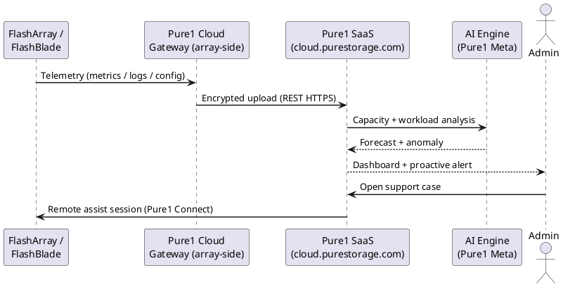

---
tags:
  - architecture
  - pure
---
# Pure1 — How It Works

<div class="kb-summary">
How It Works reference covering Architecture, High Availability.

*Applies to: Pure1*
</div>


Pure1 is Pure Storage's cloud-based management and analytics platform for FlashArray and FlashBlade systems. It requires no on-premises management infrastructure — each array connects to Pure1 directly via outbound HTTPS. Pure1 provides AI-driven analytics (Pure1 Meta), capacity forecasting, health scoring, and a REST API for programmatic fleet management.

---



## Architecture

```d2
direction: right

Arrays: "FlashArray / FlashBlade · Purity OS phonehome ·\nevery 30 seconds · HTTPS outbound" {shape: rectangle}
Pure1Cloud: "Pure1 Cloud Platform · SaaS · Pure-managed · time-\nseries DB · full resolution storage" {shape: rectangle}
Meta: "Pure1 Meta (AI) · ML health scoring · workload\nclassification · capacity forecasting" {shape: rectangle}
Dashboard: "Pure1 Dashboard · fleet management · health scores\n· alerts · capacity trends" {shape: rectangle}
TAC: "Pure Storage TAC · auto case creation · proactive\nswap · zero-touch resolution" {shape: rectangle}

Arrays -> Pure1Cloud
Pure1Cloud -> Meta
Meta -> Dashboard
Meta -> TAC
TAC -> Dashboard
```

---

## High Availability

Pure1 is managed entirely by Pure Storage as a SaaS platform. Availability SLA and disaster recovery are Pure Storage's responsibility. Customer action is not required for Pure1 infrastructure HA.

---

## See also

- [Pure1 — Design Standards](../design-standards/)
- [Pure1 — Integrations](../integrations/)
- [Pure1 — Deploy](../../deploy/)
