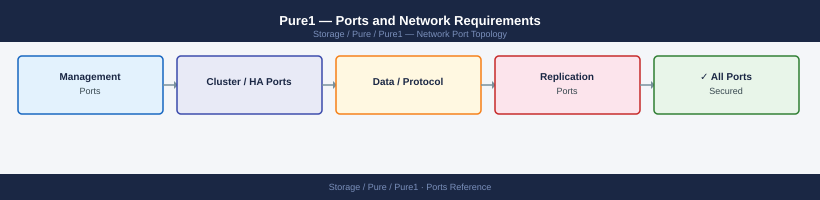

---
tags:
  - pure1
  - pure-storage
  - networking
  - firewall
  - ports
  - monitoring
description: "Firewall port reference for Pure1 (Pure Storage cloud management and analytics SaaS). Pure1 requires only outbound HTTPS from each managed array to..."
---
# Pure1 — Ports and Network Requirements

<div class="kb-summary">
Firewall port reference for Pure1 (Pure Storage cloud management and analytics SaaS). Pure1 requires only outbound HTTPS from each managed array to pure1.purestorage.com. No inbound connection from Pure to on-premises infrastructure is required.

*Applies to: Pure1 (cloud portal — no on-premises install)*
</div>


## How It Works

Pure1 is a fully SaaS-based cloud management platform. Each FlashArray and FlashBlade array ships with a built-in phone-home agent that establishes an **outbound-only** TLS connection to Pure's cloud. Administrators access Pure1 via browser at `pure1.purestorage.com` — no on-premises software is needed.

## Outbound — Arrays to Pure1 Cloud (Required)

| Port | Protocol | Source | Destination | Purpose |
|---|---|---|---|---|
| 443 | TCP | FlashArray management IP | pure1.purestorage.com | Telemetry, health data, proactive support, capacity forecasting |
| 443 | TCP | FlashBlade management IP | pure1.purestorage.com | Same as FlashArray |

## Admin Access (SaaS)

| Port | Protocol | Destination | Purpose |
|---|---|---|---|
| 443 | TCP | pure1.purestorage.com | Admin browser — Pure1 dashboard, AI-driven analytics, support cases |

## Firewall Zone Summary

| From | To | Ports | Notes |
|---|---|---|---|
| FlashArray mgmt IP | pure1.purestorage.com | 443 | Outbound only — no inbound from Pure cloud |
| FlashBlade mgmt IP | pure1.purestorage.com | 443 | Outbound only |
| Admin browsers | pure1.purestorage.com | 443 | SaaS portal |

## Verify

```bash
# From FlashArray or FlashBlade management IP — test Pure1 connectivity
curl -sk -o /dev/null -w "%{http_code}" https://pure1.purestorage.com/

# From FlashArray CLI — verify phone-home status
puremessage test

# From FlashBlade CLI — verify Pure1 telemetry
purealertalert test

# Check outbound 443 from array management network to pure1.purestorage.com
nc -zv pure1.purestorage.com 443
```


```text title="Expected output"
200
Phone home test message sent successfully. Message ID: msg-a1b2c3d4e5f6
Alert test message sent successfully to Pure1. Timestamp: 2024-01-15T14:32:18Z
Connection to pure1.purestorage.com 443 port [tcp/https] succeeded!
```

!!! warning "Common errors"
    | Error | Fix |
    |---|---|
    | `curl: (60) SSL certificate problem: self signed certificate` | Add the `-k` flag to skip certificate verification, or ensure the array's management certificate is trusted by the system CA bundle. |
    | `Connection refused` | Verify outbound HTTPS (port 443) is not blocked by firewall rules between the array management network and pure1.purestorage.com; check security group or ACL policies. |
    | `puremessage: command not found` | Ensure you are logged into the FlashArray CLI with administrative credentials and the Pure1 phone-home feature is enabled in array settings. |
## See also

- [Pure1 — Architecture](../how-it-works/)
