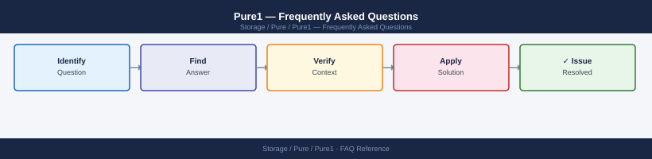

---
tags:
  - pure1
  - faq
  - operations
description: "Common questions about Pure1 operations, configuration, and troubleshooting. For step-by-step procedures, see the Operations section."
---
# Pure1 — Frequently Asked Questions

*Applies to: Pure Storage*

Common questions about Pure1 operations, configuration, and troubleshooting. For step-by-step procedures, see the <a href="index.md">Operations</a> section.

## General

**Q: What version of Pure1 is currently deployed?**
A: Pure1 is a SaaS platform — Dell manages versioning. Check release notes at support.purestorage.com. Pure1 updates automatically; no customer action required.

**Q: How do I check the current Pure1 version?**
A: `Pure1 → Help → What's New`

## Configuration

**Q: What is the default data retention period in Pure1?**
A: Pure1 retains performance and capacity data for 365 days by default. Historical data beyond 365 days is available in aggregated (daily) form for trend analysis. Real-time (1-minute) data is retained for 30 days.

**Q: How do I enable Pure1 REST API access for automation?**
A: Pure1 → Administration → API Registration → Create. Generate an API key pair. Use the Pure1 API at `https://api.pure1.purestorage.com/api/1.latest/`. Full API reference at developer.purestorage.com.

## Operations

**Q: How does Pure1 handle SaaS version updates?**
A: Pure1 updates automatically without customer involvement. New features appear in the UI with 'New' badges. Pure1 release notes are published at support.purestorage.com after each update.

**Q: What is the correct procedure to add a team member to Pure1?**
A: Pure1 → Administration → Users → Invite User. Enter email address and assign role (Array Admin, Fleet Admin, or Read-Only). The invited user receives an email to activate their Pure1 account.

## Troubleshooting

**Q: Pure1 shows 'Array Not Connected' for a system. What does it mean?**
A: The array has not sent telemetry to Pure1 for an extended period. Check the array's network connectivity to pure1.purestorage.com (port 443). Verify the proxy configuration if outbound traffic is proxied.

**Q: Pure1 dashboard is slow to load — where do I start?**
A: Pure1 is a SaaS platform — performance is managed by Pure. If consistently slow, check your local network. For large fleets (100+ arrays), use Pure1 API for bulk data retrieval instead of UI browsing.

## Backup and Recovery

**Q: Is Pure1 data backed up?**
A: Pure1 is a SaaS platform — Pure manages all data retention and backup. Array configuration backups and telemetry history are maintained by Pure. No customer backup action required.

**Q: Can I restore deleted Pure1 reports or dashboards?**
A: Custom dashboards and reports cannot be restored if deleted. Re-create them manually or export dashboard configurations (JSON) before deletion. Pure1 built-in dashboards are always available and cannot be deleted.

## See Also

- [Pure1 Operations](index.md)
- [Pure1 Troubleshooting](../../troubleshooting/)
