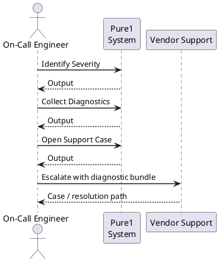

---
tags:
  - pure
description: "Pure1 vendor support: opening cases via the Pure1 portal, diagnostic bundle collection with purediag, phone escalation numbers, and remote session..."
---
# Pure1 Vendor Support

Pure1 vendor support: opening cases via the Pure1 portal, diagnostic bundle collection with `purediag`, phone escalation numbers, and remote session authorisation.

*Applies to: Pure1*

Pure Storage support is accessed via the support portal at support.purestorage.com. Support cases (SRs) can be created directly from Pure1 for array issues, and Pure support engineers can pull remote support bundles (log collections) directly from the array via the Pure1 connection without requiring on-site access.

**Information to collect before opening a case:**

- Array serial number (from Pure1 > Arrays)
- Purity version
- Pure1 alert ID (if alert-related)
- Last-seen timestamp (if telemetry issue)
- Description of symptoms and timeline

| Resource | Detail |
|---|---|
| Support portal | support.purestorage.com |
| SR creation | Via Pure1 dashboard or support portal |
| Remote log pull | Pure support can pull bundles via Pure1 (no on-site needed) |
| SLA tiers | Evergreen//One, Evergreen//Forever (check contract) |

