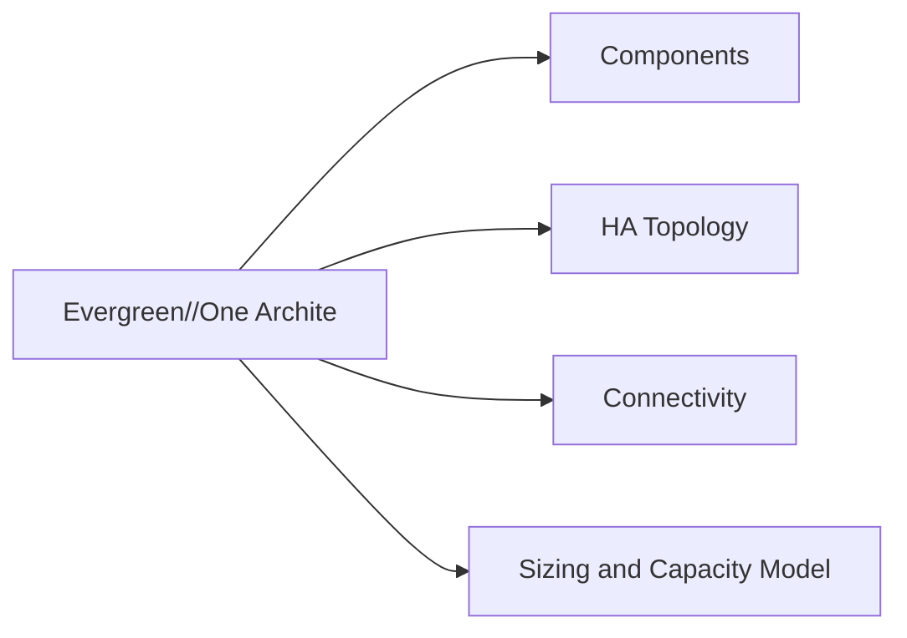

# Pure Storage Evergreen//One Architecture

## Overview

Evergreen//One is Pure Storage's Storage-as-a-Service (STaaS) consumption model. Unlike Evergreen//Forever or Evergreen//Flex — where the customer owns the subscription and hardware is refreshed in place — Evergreen//One means **Pure owns and manages the hardware**. The FlashArray or FlashBlade equipment is installed on the customer's premises (or in a designated colocation facility), but it remains Pure's property throughout the service term. The customer pays for consumed capacity on a monthly basis against a committed reserve tier, with burst capacity available on demand above the reserve.

Key distinctions from standard Evergreen:

| Aspect | Evergreen//Forever | Evergreen//One |
|---|---|---|
| Hardware ownership | Customer (subscription) | Pure Storage |
| Capacity model | Fixed entitlement, True Forward annual reconciliation | Monthly consumption billing against committed reserve |
| Hardware/firmware management | Customer-initiated upgrades (Pure executes non-disruptively) | Pure-managed, fully transparent to customer |
| SLA | Platform availability, controller refresh guarantee | 99.9999% availability SLA with performance guarantees (IOPS, bandwidth, latency) |
| Data sovereignty | Customer premises | Customer premises or designated colo — data never leaves the agreed location |

## Components

**FlashArray and FlashBlade Hardware**

Pure installs and maintains FlashArray (//X, //C, //E) and/or FlashBlade systems at the agreed physical location. Hardware selection is based on the workload tier committed in the service agreement. The customer does not select or procure hardware; Pure dimensions and deploys what is required to meet the contracted performance and capacity SLAs.

**Pure1 Management Plane**

All health monitoring, capacity tracking, SLA compliance reporting, and lifecycle management is conducted through Pure1 (https://pure1.purestorage.com). Phonehome telemetry is mandatory and always active — this is how Pure monitors SLA compliance and triggers proactive maintenance.

**Committed Reserve and Burst Tiers**

- **Reserved tier** — the minimum committed monthly capacity; billed at the reserved rate regardless of actual consumption
- **Burst tier** — capacity consumed above the reserve; billed at a higher per-TB rate; burst usage is tracked in real time in Pure1
- **Performance tier** — defined in the service agreement; specifies IOPS, bandwidth, and latency commitments for the workload type

## HA Topology

Evergreen//One deployments use the same active-active dual-controller FlashArray or scale-out FlashBlade hardware as standard Evergreen. Pure is responsible for ensuring the HA configuration meets the 99.9999% availability SLA. The customer's responsibility is to ensure host-side multipathing is correctly configured and maintained.

Pure proactively replaces components before failure where possible, using Pure1 predictive analytics. For reactive failures, Pure's SLA commits to component replacement and service restoration within the agreed response time.

ActiveCluster (synchronous replication across two Evergreen//One sites) is available as an option and can be included in the service agreement to provide RPO=0 across failure domains.

## Connectivity

Host connectivity options are the same as standard FlashArray and FlashBlade:

- FC, iSCSI, NVMe/FC, NVMe/RoCE, NVMe/TCP for block (FlashArray)
- NFS v3/v4.1, SMB 2/3, S3 object for file and object (FlashBlade)

The customer is responsible for the host-side fabric, switches, and HBAs/NICs. Pure is responsible for the array-side ports and configuration.

## Sizing and Capacity Model

Sizing for Evergreen//One is driven by:

1. **Committed reserve** — minimum TiB consumed per month; this determines the base monthly cost
2. **Burst headroom** — the maximum TiB above reserve that the deployment can serve before requiring a capacity increase request; defined in the service agreement
3. **Performance tier** — IOPS, bandwidth, and latency SLAs; Pure sizes hardware to meet these targets at the reserved capacity level
4. **Growth plan** — Pure and the customer agree on a capacity growth projection to ensure hardware can be provisioned ahead of demand; capacity increase requests require sufficient lead time (typically 30 days)

Capacity consumed is measured in TiB of raw host-written data (before data reduction). Pure's data reduction guarantee may apply depending on the service agreement terms — confirm with the Pure account team at contract signing.
