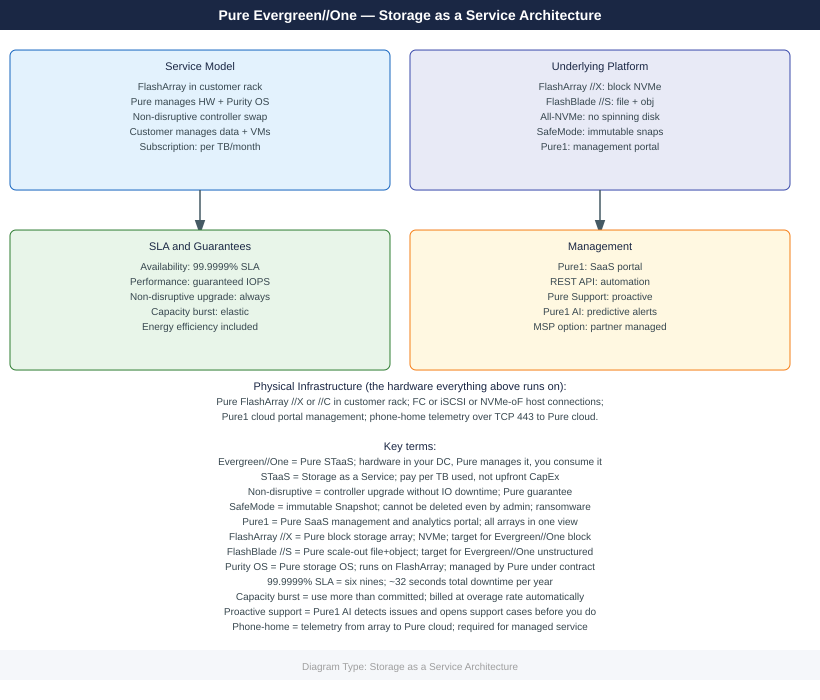
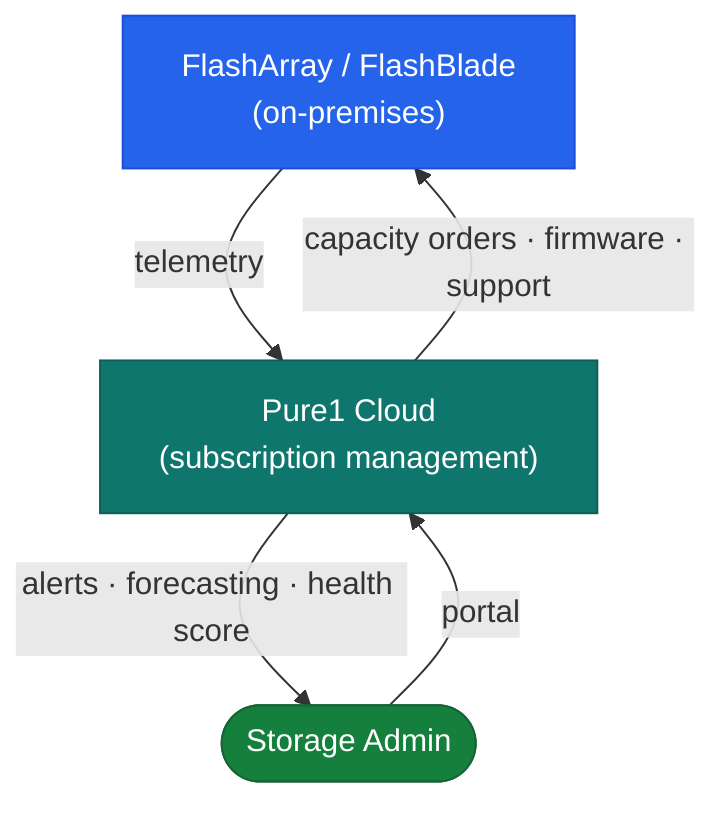
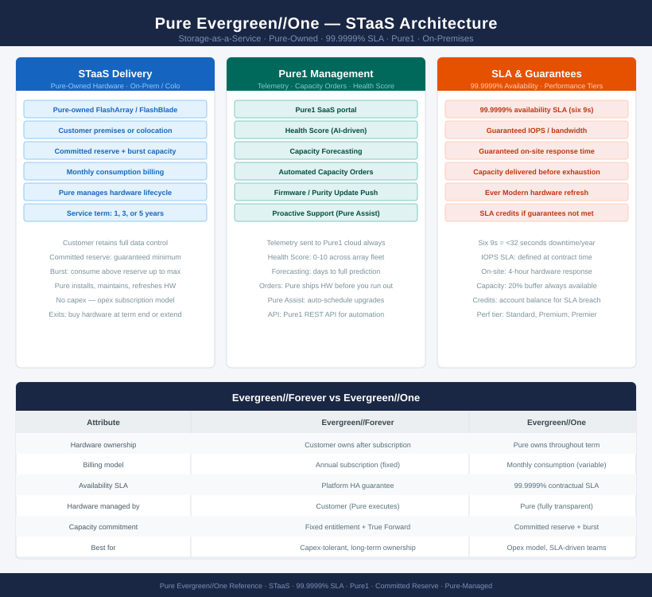

---
tags:
  - architecture
  - pure
---
# Evergreen//One — Architecture

<div class="kb-summary">
Evergreen//One is Pure's Storage-as-a-Service model. Pure owns and manages the hardware on-premises or in colocation. The customer pays for consumed capacity against a committed reserve, with a 99.9999% availability SLA and guaranteed performance tiers.

*Applies to: Evergreen//One*
</div>






Unlike Evergreen//Forever — where the customer owns the subscription and hardware is refreshed in place — Evergreen//One means Pure owns and manages the physical hardware for the duration of the service term.

| Aspect | Evergreen//Forever | Evergreen//One |
|---|---|---|
| Hardware ownership | Customer (subscription) | Pure Storage |
| Capacity model | Fixed entitlement, True Forward annual reconciliation | Monthly consumption against committed reserve |
| Hardware management | Customer-initiated (Pure executes) | Pure-managed, fully transparent |
| Availability SLA | Platform availability + controller refresh guarantee | 99.9999% with performance guarantees |

<div class="kb-grid kb-grid-3">
<a class="kb-card" href="how-it-works/"><strong>How It Works</strong><span>STaaS delivery model, components, HA topology, connectivity, and sizing.</span></a>
<a class="kb-card" href="integrations/"><strong>Integrations</strong><span>Pure1, vSphere, host connectivity, and monitoring integrations.</span></a>
<a class="kb-card" href="design-standards/"><strong>Design Standards</strong><span>Sizing standards, committed reserve guidance, and connectivity requirements.</span></a>
</div>

---

```d2
direction: right

center: "Evergreen//One" {shape: hexagon}
staas_delivery_model: "STaaS Delivery Model" {shape: rectangle}

center -> staas_delivery_model
```

## STaaS Delivery Model


