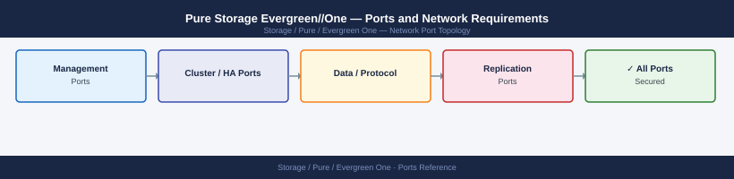

---
tags:
  - evergreen-one
  - pure-storage
  - networking
  - firewall
  - ports
  - storage-as-a-service
---
# Pure Storage Evergreen//One — Ports and Network Requirements

Pure Storage Evergreen//One is a Storage as a Service (STaaS) consumption model — Pure-owned hardware is deployed on customer premises and managed by Pure Storage. No separate Evergreen//One appliance exists; port requirements are identical to the underlying FlashArray or FlashBlade deployed.

*Applies to: Evergreen//One STaaS for FlashArray and FlashBlade*

## How It Works

Evergreen//One deploys Pure hardware on-premises under a consumption billing model. Pure Storage manages the hardware lifecycle, capacity planning, and upgrades. The array runs standard Purity software — the only operational difference is that Pure personnel access the system for maintenance via the Pure1 cloud (outbound-only from the array).

## Port Requirements — Same as Underlying Array

| Component | Ports Page |
|---|---|
| FlashArray (block storage) | [Pure Storage FlashArray — Ports](../flasharray/architecture/ports/) |
| FlashBlade (file/object) | [Pure Storage FlashBlade — Ports](../flashblade/architecture/ports/) |
| Pure1 cloud management | [Pure1 — Ports](../pure1/architecture/ports/) |

## Evergreen//One Specific — Pure Cloud Connectivity (Required)

Pure requires uninterrupted outbound access to Pure1 for remote management, metering, and capacity tracking:

| Port | Protocol | Source | Destination | Purpose |
|---|---|---|---|---|
| 443 | TCP | FlashArray/FlashBlade mgmt IP | pure1.purestorage.com | Required for STaaS billing metering, remote management, capacity enforcement |

> **Note:** Blocking port 443 to pure1.purestorage.com on Evergreen//One arrays may trigger a service contract breach — Pure requires continuous phone-home connectivity.

## Firewall Zone Summary

| From | To | Ports | Notes |
|---|---|---|---|
| Array mgmt IP | pure1.purestorage.com | 443 | Mandatory for Evergreen//One STaaS metering |
| Client hosts | Array data IPs | Per protocol | Same as FlashArray or FlashBlade standard ports |

## See also

- [Pure Storage Evergreen//One — Architecture](how-it-works/)
