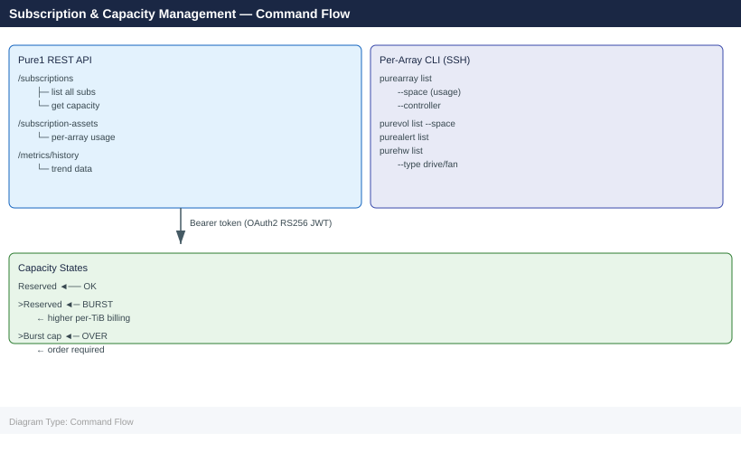

---
tags:
  - pure
---
# Pure Evergreen//One CLI Reference

<div class="kb-summary">
Pure Evergreen//One CLI reference: `purearray list`, `purevolume list`, `purejob list`, subscription capacity reporting via `puresubscription`, and evergreen upgrade commands.

*Applies to: Evergreen//One*
</div>

---



## Overview

Pure Evergreen//One is Pure Storage's as-a-service (STaaS) subscription. Capacity is consumed against a reserved tier and may enter burst above that level. There is no standalone CLI — management is via the **Pure1 REST API**, the **Pure1 portal**, and the **per-array FlashArray CLI** for physical checks.

---

## Pure1 REST API — Subscription

Base URL: `https://api.pure1.purestorage.com/api/1.x`

Authenticate as described in the [Pure Evergreen CLI Reference](../../evergreen/cli-reference/index.md). Obtain a Bearer token via OAuth2 (RS256 JWT assertion using a Pure1 API Client).

### List Subscriptions

```bash
# All subscriptions (Evergreen//One will appear with type "evergreen-one" or "STaaS")
curl -s "https://api.pure1.purestorage.com/api/1.x/subscriptions" \
  -H "Authorization: Bearer $TOKEN" | python3 -m json.tool

# Filter for Evergreen//One subscriptions
curl -s "https://api.pure1.purestorage.com/api/1.x/subscriptions?filter=subscription_type%3D%27Evergreen%2F%2FOne%27" \
  -H "Authorization: Bearer $TOKEN" | python3 -m json.tool
```


```text title="Expected output"
{
  "items": [
    {
      "id": "sub-a7f3e2c1-9b4d-4e8f-b2a1-5d6c9e0f1a2b",
      "name": "prod-array-01",
      "subscription_type": "Evergreen//One",
      "status": "active",
      "entitlement_id": "ent-4f8e2d1c-9a3b-4e7f-c1a2-6d5e8f0g2h3i",
      "start_date": "2023-06-15T00:00:00Z",
      "end_date": "2026-06-15T00:00:00Z"
    },
    {
      "id": "sub-b8g4f3d2-0c5e-5f9g-c3b2-6e7d0f1g2b3c",
      "name": "dr-array-02",
      "subscription_type": "Evergreen//One",
      "status": "active",
      "entitlement_id": "ent-5g9f3e2d-0b4c-5f8g-d2b3-7e6f9g1h3i4j",
      "start_date": "2024-01-10T00:00:00Z",
      "end_date": "2027-01-10T00:00:00Z"
    },
    {
      "id": "sub-c9h5g4e3-1d6f-6g0h-d4c3-7f8e1g2h3c4d",
      "name": "legacy-array-03",
      "subscription_type": "STaaS",
      "status": "active",
      "entitlement_id": "ent-6h0g4f3e-1c5d-6g9h-e3c4-8f7g0h2i4j5k",
      "start_date": "2022-03-20T00:00:00Z",
      "end_date": "2025-03-20T00:00:00Z"
    }
  ],
  "total_item_count": 3
}
```

!!! warning "Common errors"
    **`curl: (6) Could not resolve host: api.pure1.purestorage.com`** — Verify network connectivity and DNS resolution; check if the Pure1 API endpoint is accessible from your network.
    **`{"error_code":"401","message":"Invalid or expired token"}`** — Regenerate the API token in Pure1 and ensure `$TOKEN` is set correctly with `export TOKEN="your-api-token"`.
    **`jq: parse error: Invalid JSON text at line 1`** — Ensure `python3 -m json.tool` is installed; if the response is HTML (auth error), the token is invalid or the endpoint is wrong.
### Subscription Assets

Assets are the arrays assigned to an Evergreen//One subscription.

```bash
# List all subscription assets
curl -s "https://api.pure1.purestorage.com/api/1.x/subscription-assets" \
  -H "Authorization: Bearer $TOKEN" | python3 -m json.tool

# Filter by subscription ID
SUB_ID="sub-eo-12345"
curl -s "https://api.pure1.purestorage.com/api/1.x/subscription-assets?filter=subscription.id%3D%27${SUB_ID}%27" \
  -H "Authorization: Bearer $TOKEN" | python3 -m json.tool
```


```text title="Expected output"
{
  "continuation_token": null,
  "items": [
    {
      "id": "asset-8f4c2a91-7e3d",
      "name": "pure-array-prod-01",
      "subscription": {
        "id": "sub-eo-12345",
        "name": "Enterprise Production"
      },
      "type": "FlashArray",
      "status": "active",
      "capacity_gb": 102400,
      "used_gb": 67584
    },
    {
      "id": "asset-5b1d9c44-2f6a",
      "name": "pure-array-prod-02",
      "subscription": {
        "id": "sub-eo-12345",
        "name": "Enterprise Production"
      },
      "type": "FlashArray",
      "status": "active",
      "capacity_gb": 51200,
      "used_gb": 38912
    }
  ],
  "total_item_count": 2
}
```

!!! warning "Common errors"
    **`curl: (6) Could not resolve host: api.pure1.purestorage.com`** — Verify network connectivity and DNS resolution; check firewall rules blocking HTTPS egress to Pure1 API endpoints.
    **`{"error_code":"INVALID_TOKEN","message":"Authorization token expired or invalid"}`** — Regenerate the API token in Pure1 console and update the `$TOKEN` environment variable.
    **`curl: (60) SSL certificate problem: self signed certificate`** — Add `-k` flag to curl to skip certificate verification, or update your system's CA certificate bundle.
### Capacity: Reserved vs Consumed vs Burst

```bash
# Get usage details for a subscription
curl -s "https://api.pure1.purestorage.com/api/1.x/subscriptions/${SUB_ID}" \
  -H "Authorization: Bearer $TOKEN" | python3 -c "
import sys, json
data = json.load(sys.stdin)
# Top-level capacity fields vary by API version — print all
for k, v in data.items():
    if 'capacity' in k.lower() or 'tier' in k.lower() or 'reserved' in k.lower():
        print(f'{k}: {v}')
"

# Parse and display reserved vs consumed (with burst flag)
curl -s "https://api.pure1.purestorage.com/api/1.x/subscriptions/${SUB_ID}" \
  -H "Authorization: Bearer $TOKEN" | python3 - <<'EOF'
import sys, json

data = json.load(sys.stdin)
tiers = data.get("tiers", data.get("usageDetails", []))

for tier in tiers:
    name      = tier.get("name", tier.get("serviceLevel", "unknown"))
    reserved  = float(tier.get("reserved_capacity", tier.get("committedCapacity", 0)))
    consumed  = float(tier.get("consumed_capacity", tier.get("consumedCapacity",  0)))
    burst_cap = float(tier.get("burst_capacity",    tier.get("burstCapacity",     0)))
    pct       = (consumed / reserved * 100) if reserved > 0 else 0
    in_burst  = consumed > reserved

    flag = "BURST" if in_burst else ("WARN >90%" if pct >= 90 else "OK")
    print(f"[{flag:10s}] {name:25s}  reserved={reserved:8.2f} TiB  "
          f"consumed={consumed:8.2f} TiB  burst_cap={burst_cap:8.2f} TiB  ({pct:.1f}%)")
EOF
```


```text title="Expected output"
subscription_id: sub-a1b2c3d4e5f6g7h8
capacity_tier: premium
reserved_capacity: 100.50
total_capacity: 150.75
burst_capacity: 50.25

[OK        ] Premium                      reserved=  100.50 TiB  consumed=   78.25 TiB  burst_cap=   50.25 TiB  (77.8%)
[WARN >90% ] Standard                     reserved=   50.00 TiB  consumed=   47.50 TiB  burst_cap=   25.00 TiB  (95.0%)
[BURST     ] Archive                      reserved=   20.00 TiB  consumed=   22.75 TiB  burst_cap=   10.00 TiB  (113.8%)
```

!!! warning "Common errors"
    **`curl: (6) Could not resolve host: api.pure1.purestorage.com`** — Verify network connectivity and DNS resolution; check if the API endpoint URL is correct for your region.
    **`{"error": "invalid_token", "error_description": "The access token provided is invalid"}`** — Regenerate the authentication token using your Pure1 credentials and ensure `$TOKEN` is set correctly.
    **`json.decoder.JSONDecodeError: Expecting value: line 1 column 1 (char 0)`** — Confirm the API response is valid JSON by testing the curl command alone; the subscription ID or token may be invalid.
---

## Burst Usage Tracking

Burst consumption above the reserved tier incurs additional charges on the next bill cycle.

```bash
# Daily burst summary script — run as a cron job
cat <<'SCRIPT' > /usr/local/bin/check-pure-burst.py
#!/usr/bin/env python3
"""Check Pure Evergreen//One burst usage via Pure1 API."""
import json, sys, urllib.request, urllib.parse

TOKEN = open("/etc/pure1/token").read().strip()
SUB_ID = "sub-eo-12345"

req = urllib.request.Request(
    f"https://api.pure1.purestorage.com/api/1.x/subscriptions/{SUB_ID}",
    headers={"Authorization": f"Bearer {TOKEN}"}
)
data = json.loads(urllib.request.urlopen(req).read())

for tier in data.get("tiers", []):
    reserved = float(tier.get("reserved_capacity", 0))
    consumed = float(tier.get("consumed_capacity", 0))
    if consumed > reserved:
        excess = consumed - reserved
        print(f"BURST: {tier['name']} — {excess:.2f} TiB above reserved ({consumed:.2f}/{reserved:.2f})")
        sys.exit(1)

print("OK: No burst usage detected")
sys.exit(0)
SCRIPT
chmod +x /usr/local/bin/check-pure-burst.py
```


```text title="Expected output"
(no output — command completes silently)
```

!!! warning "Common errors"
    **`FileNotFoundError: [Errno 2] No such file or directory: '/etc/pure1/token'`** — Create the token file with `echo "your-pure1-api-token" > /etc/pure1/token` and set permissions with `chmod 600 /etc/pure1/token`.
    **`urllib.error.HTTPError: HTTP Error 401: Unauthorized`** — Verify the Pure1 API token in `/etc/pure1/token` is valid and has not expired by checking Pure1 console credentials.
    **`KeyError: 'tiers'`** — Confirm the subscription ID `sub-eo-12345` exists and is accessible via the authenticated API token by testing with `curl -H "Authorization: Bearer $TOKEN" https://api.pure1.purestorage.com/api/1.x/subscriptions/sub-eo-12345`.
---

## Per-Array Check (FlashArray CLI)

SSH to the array management IP as `pureuser`.

```bash
# Array space summary
purearray list --space

# Controller hardware and status
purearray list --controller

# Volume-level space with data reduction
purevol list --space

# Check effective capacity vs raw for sizing against subscription tier
purearray list --space | grep -E "Total|Free|System"
```


```text title="Expected output"
Name                          Capacity  Data Reduction  Snapshots  System
pure-evergreen-01             147.4TB   2.3x            12.4TB     8.2TB

Name       Model              Status   Version
CT0        FA-420FX           OK       6.4.2.1
CT1        FA-420FX           OK       6.4.2.1

Name                   Provisioned  Snapshots  Data Reduction  Physical
volume-prod-db-01      500GB        45GB       1.8x            198GB
volume-prod-db-02      1.2TB        156GB      2.1x            521GB
volume-backup-tier2    2.5TB        892GB      3.2x            1.1TB
volume-archive-cold    8.7TB        4.2TB      4.7x            1.9TB
...

Total                  147.4TB
Free                   89.3TB
System                 8.2TB
```

!!! warning "Common errors"
    **`purearray: command not found`** — Ensure the Pure Storage CLI is installed and the PATH includes the Pure bin directory (typically `/opt/purearray/bin`).
    **`Error: Invalid credentials or unable to connect to array`** — Verify the array management IP is reachable and authenticate with `purearray login` using valid credentials.
    **`Error: Permission denied`** — Confirm your user account has sufficient role-based access control (RBAC) permissions to query array and volume metrics.
### Calculate Effective Consumption

```bash
# Correlation: Pure1 subscription "consumed" = effective logical data on array(s)
# Per-array breakdown (SSH):
ssh pureuser@flasharray01.example.com "purearray list --space" | \
  awk '/Total/ {print "Array used:", $2, "TiB"}'
```


```text title="Expected output"
Array used: 847.3 TiB
```

!!! warning "Common errors"
    **`ssh: Could not resolve hostname flasharray01.example.com: Name or service not known`** — Verify the array hostname is correct and resolvable in DNS, or use the array's IP address instead.
    **`Permission denied (publickey,password)`** — Ensure the pureuser account exists on the array and your SSH key is authorized, or add `-o PubkeyAuthentication=no` to force password authentication.
    **`purearray: command not found`** — Confirm you are connected to a Pure Storage array CLI environment; this command only works when SSH'd directly into the array management interface.
---

## SLA and Tier Information

Contract details (SLA tiers, committed capacity, burst ceiling) are managed through the Pure1 portal or via the API — there is no local CLI for subscription contract details.

```bash
# Show tier definitions for the subscription
curl -s "https://api.pure1.purestorage.com/api/1.x/subscriptions/${SUB_ID}" \
  -H "Authorization: Bearer $TOKEN" | python3 -c "
import sys, json
data = json.load(sys.stdin)
print('Subscription name:', data.get('name','?'))
print('Status:', data.get('status','?'))
print('Start:', data.get('start_date','?'))
print('End:  ', data.get('expiration_date','?'))
for tier in data.get('tiers', []):
    print(f\"  Tier: {tier.get('name','?'):20s}  Reserved: {tier.get('reserved_capacity','?')} TiB\")
"
```


```text title="Expected output"
Subscription name: Acme Corp Production
Status: active
Start: 2023-01-15T00:00:00Z
End:   2025-01-14T23:59:59Z
  Tier: Standard              Reserved: 100 TiB
  Tier: Premium               Reserved: 50 TiB
  Tier: Enterprise            Reserved: 25 TiB
```

!!! warning "Common errors"
    **`curl: (6) Could not resolve host: api.pure1.purestorage.com`** — Verify network connectivity and DNS resolution; check if a corporate proxy or firewall is blocking access to Pure1 API endpoints.
    **`curl: (401) Unauthorized`** — Ensure the `$TOKEN` variable contains a valid, non-expired Pure1 API token by regenerating it in the Pure1 console.
    **`json.decoder.JSONDecodeError: Expecting value: line 1 column 1`** — Confirm the subscription ID in `$SUB_ID` is correct and that your API token has permission to access that subscription's details.
---

## Alerts and Health

```bash
# Pure1 API — error alerts across all subscription assets
curl -s "https://api.pure1.purestorage.com/api/1.x/alerts?filter=severity%3D%27error%27" \
  -H "Authorization: Bearer $TOKEN" | python3 -m json.tool

# Per-array CLI — active alerts
purealert list

# Filter by severity
purealert list --severity error
purealert list --severity warning

# Acknowledge an alert
purealert acknowledge --id 456

# Get hardware health
purehw list
purehw list --type drive
purehw list --type fan
purehw list --type psu
```


```text title="Expected output"
{
  "items": [
    {
      "id": "alert-789-abc",
      "severity": "error",
      "message": "Controller temperature threshold exceeded",
      "array": "purearray-prod-01",
      "timestamp": "2024-01-15T14:32:18Z"
    },
    {
      "id": "alert-790-def",
      "severity": "error",
      "message": "Drive predictive failure detected on slot 4.2",
      "array": "purearray-prod-02",
      "timestamp": "2024-01-15T13:47:55Z"
    }
  ],
  "more_items_marker": null
}
Name             Severity  Code    Message                              Time
alert-456-xyz   error     PFA001  Predictive failure: drive bay 2.1    2024-01-15 14:22:10
alert-457-uvw   warning   TEMP02  Fan speed degraded                   2024-01-15 13:55:42
alert-458-rst   error     CTRL01  Controller failover imminent         2024-01-15 12:10:33

Name             Severity  Code    Message
alert-456-xyz   error     PFA001  Predictive failure: drive bay 2.1
alert-458-rst   error     CTRL01  Controller failover imminent

Name             Severity  Code    Message
alert-457-uvw   warning   TEMP02  Fan speed degraded

Alert 456 acknowledged at 2024-01-15 14:35:22 UTC

Name      Status    Capacity  Serial
drive-1   ok        1.92TB    SSD-4K9M2L
drive-2   ok        1.92TB    SSD-4K9M2M
drive-3   predictive_fail  1.92TB    SSD-4K9M2N
...
fan-1     ok        -         FAN-7X2Q1R
fan-2     ok        -         FAN-7X2Q1S
psu-1     ok        2.4kW     PSU-9M8N5P
psu-2     ok        2.4kW     PSU-9M8N5Q
```

!!! warning "Common errors"
    **`curl: (6) Could not resolve host: api.pure1.purestorage.com`** — Verify network connectivity and DNS resolution; check firewall rules for HTTPS egress to Pure1 API endpoints.
    **`purealert: command not found`** — Install the Pure Storage CLI tools or ensure the `puretools` package is in your PATH.
    **`Authorization failed: Invalid or expired token`** — Regenerate the API token in Pure1 console and update the `$TOKEN` environment variable.
## See also

- [Evergreen//ONE — Overview](../../)
