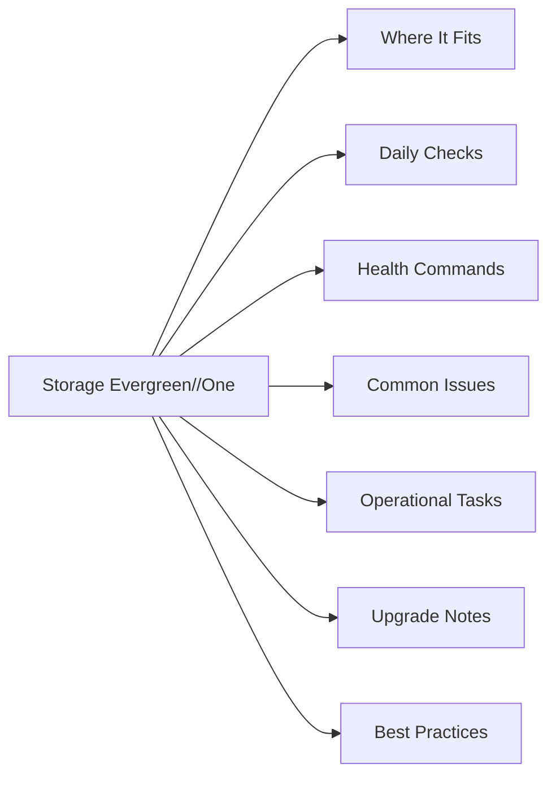

# Pure Storage Evergreen//One

<a class="kb-card" href="architecture/">
  <strong>Architecture</strong>
  HA topology, components, connectivity, and sizing.
</a>

<a class="kb-card" href="standards/">
  <strong>Standards</strong>
  Naming conventions, build baseline, and configuration checklist.
</a>

<a class="kb-card" href="lifecycle/">
  <strong>Lifecycle</strong>
  Version matrix, upgrade paths, EOL tracking, and refresh planning.
</a>

<a class="kb-card" href="operations/">
  <strong>Operations</strong>
  Daily checks, health monitoring, maintenance tasks, and runbooks.
</a>

<a class="kb-card" href="cli-reference/">
  <strong>CLI Reference</strong>
  Command reference by category with syntax and examples.
</a>

<a class="kb-card" href="scripts/">
  <strong>Scripts</strong>
  Automation scripts for daily checks, health, incident triage, and validation.
</a>

<a class="kb-card" href="troubleshooting/">
  <strong>Troubleshooting</strong>
  Common issues, diagnostic commands, log locations, and error codes.
</a>

<a class="kb-card" href="integration/">
  <strong>Integration</strong>
  VMware, backup tools, monitoring, authentication, and API integration.
</a>

<a class="kb-card" href="security/">
  <strong>Security</strong>
  Hardening checklist, RBAC, encryption, audit logging, and compliance.
</a>

<a class="kb-card" href="vendor-support/">
  <strong>Vendor Support</strong>
  Opening a case, information to collect, support portal, and SLA tiers.
</a>

## Overview

Evergreen//One is Pure Storage's Storage-as-a-Service consumption model: Pure owns and manages the hardware (on-premises or in a colocation), and customers pay per TB consumed on a monthly basis against a committed reserve tier, with burst capacity available on demand. The service includes installation, proactive monitoring via Pure1, all hardware and Purity software upgrades, and support — customers never plan or execute a storage upgrade. SLA commitments include 99.9999% availability and guaranteed performance outcomes (IOPS, bandwidth, latency) defined per workload tier; Pure credits the customer if SLAs are not met.

## Where It Fits

| Use Case |
|---|
| Organisations shifting storage from CapEx to OpEx without giving up on-premises data sovereignty |
| Workloads with variable or unpredictable capacity growth where fixed-capacity purchases are inefficient |
| Colocation environments where physical hardware management is a constraint |
| High-availability production workloads requiring a vendor-backed 99.9999% availability SLA |
| Environments requiring guaranteed latency and IOPS SLAs tied to contractual obligations |
| Teams that want Pure1 AIOps-driven monitoring without managing the underlying infrastructure |

## Daily Checks

| Check | Command | Notes |
|---|---|---|
| Review consumption vs. committed tier in Pure1 (used TB vs. reserved T |  |  |
| Check burst usage trend |  | confirm burst is not being consumed unexpectedly |
| Confirm no open SLA breach events in Pure1 under the Evergreen//One da |  |  |
| Review Pure1 health alerts for the arrays under the service |  |  |
| Validate data protection status |  | snapshots, replication, and SafeMode configuration in Pure1 |
| Confirm Pure1 phone-home is active for all arrays in the subscription |  |  |

## Health Commands

~~~bash
# All monitoring and health review is performed through the Pure1 portal
# Pure1: https://pure1.purestorage.com

# Pure1 > Arrays — array health, software version, and hardware status
# Pure1 > Evergreen//One > Consumption — used vs. committed vs. burst
# Pure1 > Evergreen//One > SLA — availability and performance SLA compliance reports
# Pure1 > Evergreen//One > Capacity — capacity growth trends and forecasting

# For array-level CLI access (if granted by Pure Support):
purearray list --space         # capacity summary
purealert list                 # active alerts
purepod list                   # replication pod and ActiveCluster status
~~~

## Common Issues

| Symptom | Likely Cause | Action |
|---|---|---|
| Burst capacity consumed unexpectedly | Rapid snapshot or volume growth, or workload spike | Review volume and snapshot space usage in Pure1; identify top consumers and engage application teams |
| SLA compliance report shows availability event | Unplanned array component failure or network disruption | Review Pure1 SLA event details; open a support case with Pure if root cause is not documented |
| SLA report shows latency breach | Workload pattern change or resource contention on shared array | Review Pure1 performance dashboards; engage Pure account team to right-size workload tier |
| Billing discrepancy vs. invoice | Burst usage not accounted for or committed tier misalignment | Compare Pure1 consumption report to invoice line items; raise with Pure account team before billing close |
| Capacity request not fulfilled on time | Insufficient lead time given to Pure for hardware provisioning | Submit capacity increase requests through Pure portal at least 30 days in advance |
| Phone-home connectivity lost | Network change or proxy reconfiguration | Confirm outbound HTTPS access to Pure1 endpoints; review proxy settings with Pure Support |

## Operational Tasks

| Task | Command |
|---|---|
| Monitor consumption vs. committed tier in Pure1 weekly and before monthly billin |  |
| Review burst usage weekly to identify unexpected growth before it impacts the in |  |
| Submit capacity increase requests through the Pure portal with sufficient lead t |  |
| Review SLA compliance reports monthly and log any breach credits with the Pure a |  |
| Work with the Pure account team quarterly to review capacity trends and adjust c |  |
| Validate SafeMode and data protection settings in Pure1 after any major workload |  |
| Review Pure1 AIOps recommendations for anomaly detection and performance optimis |  |
| Maintain accurate workload-to-tier mapping documentation for audit and billing v |  |

## Upgrade Notes

| Step | Action |
|---|---|
| 1 | Evergreen//One has no customer-managed upgrade process — Pure handles all hardware and Purity software upgrades non-disruptively |
| 2 | Upgrades are scheduled and executed by Pure Support; customers receive advance notification through Pure1 and email |
| 3 | Validate that no change freezes or maintenance windows conflict with Pure's scheduled upgrade date |
| 4 | Confirm all host paths are redundant and multipathing is active before Pure executes any upgrade (Pure will validate, but customer confirmation is good practice) |
| 5 | After upgrade, confirm Pure1 shows the new software version and no new alerts are open |
| 6 | Review SLA compliance report post-upgrade to confirm no availability events were recorded |

## Best Practices

| Recommendation | Detail |
|---|---|
| Set a Pure1 consumption alert at 80% of committed tier so | Set a Pure1 consumption alert at 80% of committed tier so there is lead time to request additional capacity |
| Review burst usage at least weekly | burst billing can add significant cost if left unmonitored |
| Work with the Pure account team on a quarterly capacity | Work with the Pure account team on a quarterly capacity review cadence to keep the committed tier accurately sized |
| Never disable Pure1 phone-home | Pure's SLA monitoring and proactive support depend on continuous telemetry |
| Document the committed reserve tier, burst limits, and SLA | Document the committed reserve tier, burst limits, and SLA thresholds in your service runbook for on-call reference |
| Align capacity increase requests with budget cycles so | Align capacity increase requests with budget cycles so approval is not a blocker to provisioning |
| Review Pure1 SLA compliance reports before each billing | Review Pure1 SLA compliance reports before each billing close and flag any discrepancies to the account team promptly |
| Use Pure1 AIOps anomaly alerts as an early warning for | Use Pure1 AIOps anomaly alerts as an early warning for workload behaviour changes before they become SLA events |
