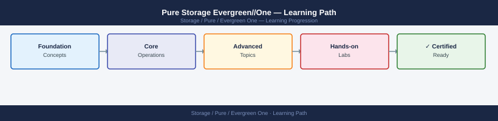

---
tags:
  - learning-path
  - pure
---
# Pure Storage Evergreen//One — Learning Path

<div class="kb-summary">
Recommended reading order for Pure Storage Evergreen//One (Storage as a Service). Follow these stages in order to build a complete mental model before managing Evergreen//One assets in production.

*Applies to: Evergreen//One*
</div>



```d2
direction: right

stage_1_architecture: "Stage 1 — Architecture" {shape: rectangle}
stage_2_deployment: "Stage 2 — Deployment" {shape: rectangle}
stage_3_operations: "Stage 3 — Operations" {shape: rectangle}
stage_4_security: "Stage 4 — Security" {shape: rectangle}
stage_5_troubleshooting: "Stage 5 — Troubleshooting" {shape: rectangle}

stage_1_architecture -> stage_2_deployment: next
stage_2_deployment -> stage_3_operations: next
stage_3_operations -> stage_4_security: next
stage_4_security -> stage_5_troubleshooting: next
```

## Stage 1 — Architecture

**Goal**: Understand the Evergreen//One STaaS model — on-premises hardware owned and managed by Pure, consumed as a service with SLA-backed capacity and consumption billing.

**Read in this order**:

- [How It Works](../architecture/how-it-works/) — STaaS delivery model (Pure owns and manages hardware on-site), reserved vs on-demand capacity tiers, consumption-based billing cycle, SLA guarantees (availability, latency, capacity response time), Pure1 as the primary management portal, and the relationship between Evergreen//One and underlying FlashArray/FlashBlade platforms
- [Design Standards](../architecture/design-standards/) — reserved capacity sizing methodology, on-demand burst planning, multi-site Evergreen//One deployments, and aligning subscription terms with workload lifecycle
- [Integrations](../architecture/integrations/) — Pure1 API for capacity and consumption reporting, integration with finance systems for chargeback/showback, and ITSM integration for service request workflows

**Why first**: Evergreen//One inverts the traditional ownership model — Pure Support engineers manage the hardware, not your team. Understanding the operational boundary (what you manage vs what Pure manages) is essential before day-to-day interactions.

---

## Stage 2 — Deployment

**Goal**: Understand how Pure provisions Evergreen//One hardware on-site, how initial capacity is activated, and how to validate access before onboarding workloads.

**Read**:

- [Architecture — How It Works](../architecture/how-it-works/) — review the provisioning section covering hardware installation by Pure, initial capacity activation in Pure1, and handoff to customer workload teams
- [Architecture — Design Standards](../architecture/design-standards/) — capacity reservation agreement structure, on-demand capacity request SLA timeframes, and network connectivity requirements Pure needs pre-installation

**Why second**: Pure installs and configures the hardware — your role at deployment is network readiness and workload onboarding. Knowing what Pure delivers vs what you configure prevents coordination gaps.

---

## Stage 3 — Operations

**Goal**: Monitor consumption against reserved allocation, request on-demand capacity proactively, and coordinate with Pure for all hardware maintenance.

**Read in this order**:

- [Health Checks](../operations/health-checks/) — run the routine first on every shift; covers Pure1 array health dashboard, capacity utilisation vs reserved tier, on-demand capacity buffer remaining, billing cycle consumption trend, and open support cases
- [CLI Reference](../operations/cli-reference/) — Pure1 API queries for consumption reporting, capacity utilisation by workload, and SLA metric export for internal reporting
- [Procedures](../operations/procedures/) — on-demand capacity request process via Pure1, hardware maintenance coordination with Pure (your role: schedule the window, Pure executes), SLA breach escalation workflow, and subscription renewal process
- [Backup & Restore](../operations/backup-restore/) — snapshot and replication management within Evergreen//One (same Purity capabilities as owned arrays), and ensuring backup SLA aligns with Evergreen//One availability guarantee
- [Scripts](../operations/scripts/) — Pure1 API scripts for consumption trend reporting, on-demand capacity threshold alerting, and SLA metric dashboards for management

**Why third**: The primary operational discipline in Evergreen//One is consumption monitoring. Reactive capacity requests cause SLA delays — proactive requests (before hitting the reserved tier ceiling) keep workloads running without interruption.

---

## Stage 4 — Security

**Goal**: Understand the shared security model — what Pure is responsible for (hardware, Purity OS) and what you own (data access, encryption keys, Pure1 account security).

**Read**:

- [Access Control](../security/access-control/) — Pure1 org and array-level RBAC, scoping Pure Support access windows, and delegating read-only Pure1 access to finance teams for billing reports
- [Authentication](../security/authentication/) — Pure1 SSO/SAML 2.0, MFA enforcement for all Pure1 portal users, API token lifecycle management, and audit log access for compliance
- [Encryption](../security/encryption/) — customer-managed encryption keys (KMIP) vs Pure-managed keys, encryption continuity through hardware maintenance by Pure, and data sovereignty considerations for regulated workloads
- [Hardening](../security/hardening/) — restricting Pure Support access to approved maintenance windows, audit log review cadence, SafeMode configuration for ransomware protection, and Pure1 network egress controls

**Why fourth**: The shared responsibility model means Pure accesses your hardware for maintenance. Defining and auditing those access windows — and ensuring encryption key custody remains with you — is the most important security discipline in Evergreen//One.

---

## Stage 5 — Troubleshooting

**Goal**: Diagnose SLA breaches, capacity provisioning delays, and Pure1 portal issues, and escalate hardware problems to Pure through the correct channels.

**Read**:

- [Common Issues](../troubleshooting/common-issues/) — on-demand capacity provisioning delays, Pure1 connectivity and reporting gaps, SLA metric discrepancies, and billing dispute resolution
- [Diagnostics](../troubleshooting/diagnostics/) — Pure1 SLA compliance reports, consumption vs billing reconciliation, support case history review, and capacity trend analysis for renewal negotiations
- [Escalation](../troubleshooting/escalation/) — Evergreen//One SLA breach escalation path, account team vs support team contact routing, and documentation requirements for SLA credit claims

**Why last**: Troubleshooting makes most sense once you know the normal operating state — expected on-demand provisioning timeframes, Pure1 reporting refresh cadence, and what SLA metrics Pure guarantees vs what falls in your operational boundary.

---

## See also

- [Evergreen One — Deploy](../../deploy/)
