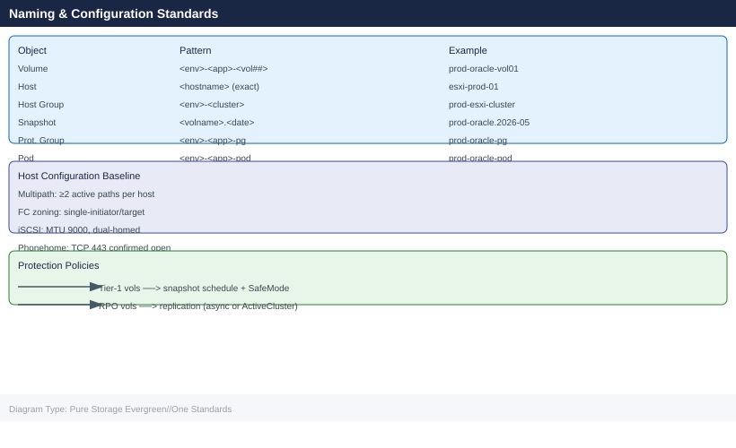

---
tags:
  - pure
---
# Pure Storage Evergreen//One Standards

<div class="kb-summary">
Pure Storage Evergreen//One Standards reference covering Naming Conventions, Build Baseline, Service Agreement Checklist.

*Applies to: Evergreen//One*
</div>



```d2
direction: down

naming_conventions: "Naming Conventions" {shape: rectangle}
build_baseline: "Build Baseline" {shape: rectangle}
service_agreement_checklist: "Service Agreement Checklist" {shape: rectangle}

naming_conventions -> build_baseline: hardens
build_baseline -> service_agreement_checklist: hardens
```

## Naming Conventions

Naming standards for Evergreen//One follow the same conventions as standard FlashArray and FlashBlade deployments. Consistent naming is important for capacity reporting, billing validation, and audit.

| Object | Pattern | Example |
|---|---|---|
| Volume | `<env>-<app>-<vol##>` | `prod-oracle-vol01`, `dev-sqldb-vol02` |
| Host | `<hostname>` (match OS hostname exactly) | `esxi-prod-01`, `rhel-app-04` |
| Host Group | `<env>-<cluster>` | `prod-esxi-cluster`, `dev-rhel-cluster` |
| Snapshot | `<volname>.<date>` | `prod-oracle-vol01.2026-05-06` |
| Protection Group | `<env>-<app>-pg` | `prod-oracle-pg` |
| Pod (ActiveCluster) | `<env>-<app>-pod` | `prod-oracle-pod` |

**Additional Evergreen//One tagging requirements:**

- Tag or document volumes with the associated workload tier (e.g., `tier-1-latency`, `tier-2-capacity`) to validate that consumption aligns with the contracted performance tier in billing reviews
- Maintain a volume-to-application mapping in the CMDB to support monthly consumption reporting and billing validation

## Build Baseline

**Hardware and Software**

Pure manages all hardware selection, firmware, and Purity software versions for Evergreen//One deployments. The customer does not choose or upgrade software. However, the following baseline requirements apply to the customer environment:

- Host multipathing must be configured and validated on all connected hosts before Pure provisions the service
- FC zoning or iSCSI network segmentation must be completed by the customer before handover
- Phonehome connectivity (outbound HTTPS port 443 to Pure1) must be confirmed before service go-live

**Data Protection Standards**

- All Tier-1 production volumes must have Pure-managed snapshot schedules configured as part of the service agreement
- SafeMode must be enabled on all protection groups for Tier-1 workloads where the service agreement includes ransomware protection options
- Replication (async or ActiveCluster) must be configured for all volumes with RPO SLA requirements — confirm replication topology is specified in the service agreement before go-live

**Capacity Reporting**

- Monthly capacity consumption reports are generated by Pure1 and shared with the customer for billing validation
- Customer must maintain documentation of all provisioned volumes and host groups to facilitate billing disputes or audit requests
- Burst consumption should be reviewed weekly — do not wait for the monthly billing close to discover unexpected burst usage

## Service Agreement Checklist

Use this checklist at service start, at each annual service review, and after a capacity true-up:

- [ ] Confirm committed reserve tier (TiB) matches current and projected workload requirements
- [ ] Confirm burst headroom is sufficient for peak demand periods
- [ ] Confirm performance tier (IOPS, bandwidth, latency SLAs) is appropriate for all workloads on the service
- [ ] Verify Pure1 phonehome is active and array health score is green before and after service go-live
- [ ] Confirm SafeMode is enabled on all Tier-1 protection groups
- [ ] Verify replication topology and RPO targets are met per the service agreement
- [ ] Schedule the next monthly capacity review and billing validation session with the Pure account team
- [ ] Confirm the CSM contact and escalation path are documented in the service runbook
- [ ] Review Pure1 SLA compliance reports for the previous period and flag any breach credits with the account team
