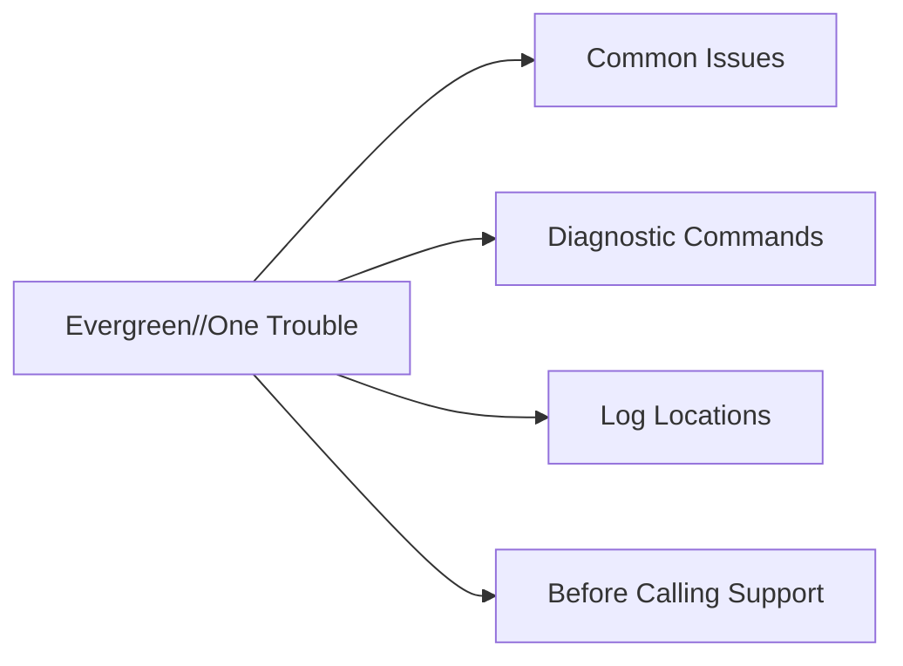

# Pure Storage Evergreen//One Troubleshooting



## Common Issues

| Symptom | Likely Cause | Action |
|---|---|---|
| Burst capacity consumed unexpectedly | Rapid snapshot accumulation, volume growth, or unplanned workload onboarding | Review Pure1 consumption dashboard; identify top capacity consumers with `purearray list --space`; engage application teams to reduce snapshot retention or volume usage; contact Pure account team if the committed reserve needs adjusting |
| SLA compliance report shows an availability event | Unplanned array component failure, network disruption, or host-side multipath failure | Review the Pure1 SLA event details for root cause; if the failure was on Pure's hardware, a credit should be applied automatically — confirm with the account team; if failure was host-side (fabric, HBA), remediate on the host |
| SLA report shows latency breach | Workload pattern change, resource contention, or performance tier under-sized for actual demand | Review Pure1 performance dashboards for the affected period; engage the Pure account team to assess whether a tier upgrade is required; open a support case if latency is still elevated |
| Billing discrepancy vs. invoice | Burst usage not accounted for in the monthly review, or committed reserve was adjusted mid-period | Compare Pure1 monthly consumption report with invoice line items day by day; raise discrepancies with the Pure account team before the invoice is finalled |
| Capacity increase request not fulfilled on time | Insufficient lead time given to Pure for hardware provisioning | Submit capacity increase requests at least 30 days in advance; for burst-heavy workloads, set a Pure1 alert at 80% of committed reserve to trigger requests proactively |
| Controller upgrade notification missed | Pure1 alert not actioned or email notification went to wrong recipient | Check Pure1 for pending upgrade notifications; confirm Pure1 alert email recipients are current — update in Pure1 under account settings |
| Pure1 phonehome connectivity lost | Proxy change, firewall rule update, or network reconfiguration | Confirm outbound HTTPS port 443 to Pure1 endpoints; check proxy settings in array management GUI; restore phonehome immediately — Pure's SLA monitoring depends on continuous telemetry |
| Host path offline after Pure-managed upgrade | Multipath not restored on host side after controller swap | Run `purehostconnection list` to confirm path state; rescan HBAs or iSCSI initiators on affected hosts; contact Pure Support if paths do not restore after rescan |

## Diagnostic Commands

For Evergreen//One, the primary monitoring interface is Pure1. Array-level CLI access may be limited or provided via Pure Support — confirm CLI access entitlements in the service agreement.

```bash
# Capacity usage breakdown
purearray list --space

# Controller and hardware component status
purearray list --controller

# All active alerts
purealert list

# Replication pod status and ActiveCluster health
purepod list

# Recent snapshots
puresnap list | head -20

# Host connection and path status
purehostconnection list

# Volume space and provisioned size
purevol list --space

# Protection group schedules
purepgroup list --schedule
```

For issues related to the service agreement, SLA compliance, or capacity billing, all investigation starts in Pure1 — not the array CLI.

## Log Locations

| Log Source | Location / Access |
|---|---|
| Pure1 consumption reports | Pure1 > Evergreen//One > Consumption — daily and monthly capacity consumed vs. reserved vs. burst |
| Pure1 SLA compliance reports | Pure1 > Evergreen//One > SLA — availability and performance SLA events, breach history, and credits |
| Pure1 health alerts | Pure1 > Alerts — all hardware and software alerts across the fleet |
| Pure1 phonehome log | Pure1 > Arrays > select array > Support > Phone Home — phonehome session history |
| Array audit log | Purity GUI > Settings > Audit Log — admin action history; also forwarded to syslog if configured |
| `purediag` output | Run on array; Pure Support can pull via phonehome if tunnel is active |

## Before Calling Support

For hardware or Purity issues:

1. **Pure1 health score and alerts** — screenshot or note the current score and any open alerts
2. **`purediag` bundle** — run `purediag` on the array; confirm phonehome is active for remote pull
3. **Current Purity version** — `purearray list`
4. **Symptom timeline** — when the issue started, what changed, what has been attempted

For service agreement, billing, or SLA issues:

1. **Pure1 consumption report** — download the monthly report for the affected billing period
2. **Pure1 SLA compliance report** — download the SLA report for the affected period
3. **Service agreement reference** — subscription or contract number from the Pure1 portal
4. **CSM contact** — Evergreen//One includes a dedicated CSM; contact the CSM directly for subscription and billing issues rather than routing through the support portal

Having consumption reports and SLA reports downloaded before contacting Pure significantly reduces time to resolution for billing and SLA credit disputes.
