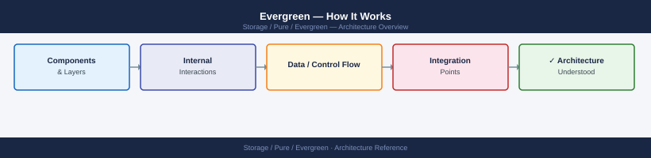
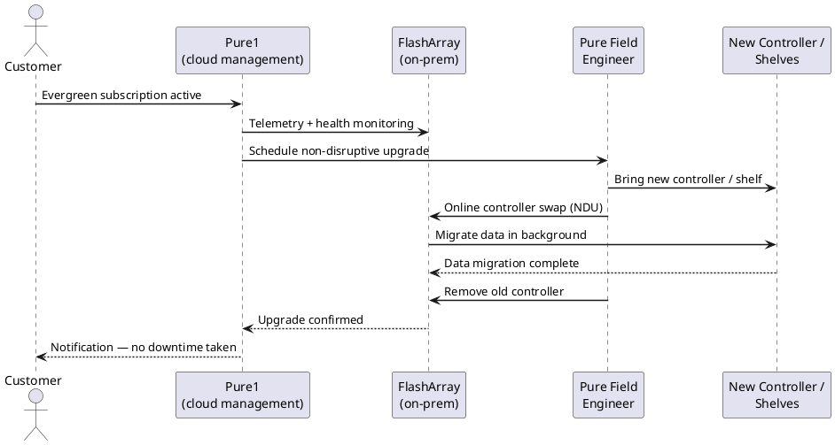

---
tags:
  - architecture
  - pure
---
# Evergreen — How It Works

<div class="kb-summary">
How It Works reference covering Overview, Controller Refresh Model, HA Topology, Controllers (CT0 / CT1), DirectFlash Modules (DFM) and 4 more sections.

*Applies to: Evergreen*
</div>


Evergreen — What's Included vs. Customer-Managed



## Overview

Evergreen is Pure Storage's hardware subscription model for the FlashArray platform (//X, //C, and //E series). Rather than purchasing hardware outright, customers subscribe to a capacity and performance tier — with controller hardware refreshes, Purity software upgrades, and support included in the subscription cost. The defining principle is no forklift upgrades: when controllers reach end of generation, Pure replaces them non-disruptively while data remains on the existing NVMe drive shelf — hosts stay connected and I/O continues during the swap.

Evergreen spans two primary tiers:

- **Evergreen//Forever** — base subscription; includes non-disruptive controller refresh (Ever Modern) every three years, all Purity software upgrades, and support
- **Evergreen//Flex** — adds non-disruptive capacity and blade swap flexibility for FlashBlade; allows adding, removing, or swapping storage media without disruption

Evergreen//One (STaaS consumption model) is covered in a separate section.

## Controller Refresh Model

```d2
direction: right

A: "FlashArray Gen N\n(current" {shape: rectangle}
B: "FlashArray Gen N+1\n(upgraded controllers" {shape: rectangle}
C: "FlashArray Gen N+2" {shape: rectangle}
DATA: "Data — always online\nno migration required" {shape: rectangle}

A -> B
B -> C
C -> DATA
```

## HA Topology

FlashArray under Evergreen runs active-active dual controllers. Both controllers handle read and write I/O simultaneously; on controller failure, all I/O shifts to the surviving controller within milliseconds with no host-visible interruption (assuming redundant host paths).

**Non-Disruptive Controller Refresh (NDCR)** — the Ever Modern process — allows Pure to replace one controller at a time while the other continues serving I/O:

1. Failover all I/O to controller 1
2. Remove controller 0, install new-generation controller 0
3. Resync controller 0, failover I/O to controller 0
4. Remove controller 1, install new-generation controller 1
5. Resync controller 1, restore active-active operation

The entire process is non-disruptive to hosts provided multipathing is correctly configured.

## Controllers (CT0 / CT1)

| Property | Detail |
|---|---|
| I/O model | Active-active — both controllers process host I/O simultaneously |
| Failover time | < 30 ms for host-transparent failover (with multipathing) |
| Controller interconnect | NVLink or PCIe fabric for cache coherency and NVRAM mirroring |
| Management interface | Eth0 on each CT; distinct management IPs; VIP used for shared management access |

```bash
purearray list --controller   # show both controllers and Purity version
purehw list --type ct          # hardware detail for CT0 and CT1
purehw list CT0 --spec
```


```text title="Expected output"
Name             Status    Version      Model
CT0              OK        6.4.2.1234   FlashArray//X
CT1              OK        6.4.2.1234   FlashArray//X

Name    Slot    Status    Model              Serial
CT0     1       OK        FlashArray//X      PUREARRAY123ABC
CT1     2       OK        FlashArray//X      PUREARRAY123DEF

Name    Slot    Status    Model              Serial            Speed
CT0     1       OK        FlashArray//X      PUREARRAY123ABC   10Gb/s
```

!!! warning "Common errors"
    **`Error: Invalid controller name 'ct0'. Did you mean 'CT0'?`** — Use uppercase controller identifiers (CT0, CT1) in Pure Storage commands.
    **`Error: Connection refused. Is the management IP reachable?`** — Verify network connectivity to the array management interface and check firewall rules.
## DirectFlash Modules (DFM)

DirectFlash Modules are Pure Storage's proprietary NVMe flash storage units. Unlike commodity SSDs, they expose raw NAND flash directly to Purity OS, allowing Pure's software to manage wear levelling, garbage collection, and data placement at the array level.

| Property | Detail |
|---|---|
| Interface | NVMe (PCIe Gen 4 or Gen 5 depending on platform generation) |
| RAID equivalent | Purity RAID-3D (triple parity) — tolerates concurrent multi-DFM failures |
| Controller awareness | DFMs are owned by the array, not individual controllers — both CTs access all DFMs |
| Hot-swap | Yes — non-disruptive replacement under Evergreen support coverage |

```bash
purehw list --type drive         # DFM health status
purehw list --type drive | grep -v Healthy   # non-healthy drives only
purearray list --space           # capacity and data reduction
```


```text title="Expected output"
Name                    Status      Capacity  Serial
drive.0                 Healthy     1.92TB    1234567890AB
drive.1                 Healthy     1.92TB    1234567890CD
drive.2                 Healthy     1.92TB    1234567890EF
drive.3                 Healthy     1.92TB    1234567890GH
drive.4                 Healthy     1.92TB    1234567890IJ
drive.5                 Healthy     1.92TB    1234567890KL
...

Name                    Status      Capacity  Serial
drive.12                Predictive  1.92TB    1234567890MN
drive.18                Failed      1.92TB    1234567890OP

Capacity(GB)  Data Reduction  Used(GB)  Free(GB)  Snapshots(GB)
10240         2.5x            4096      6144      512
```

!!! warning "Common errors"
    **`purehw: command not found`** — Ensure the Pure Storage CLI tools are installed and the PATH includes the bin directory (typically `/opt/purearray/bin`).
    **`Error: Unable to connect to array`** — Verify network connectivity to the array management IP and confirm authentication credentials are set via `pureauthtoken` or environment variables.
## NVRAM (Write Cache)

Each controller contains NVRAM — a supercapacitor-backed write cache. Write acknowledged to NVRAM on CT0 **and** CT1 before host ACK — write is safe even if one controller fails immediately after. NVRAM drains to DFM within seconds under normal operation.

```bash
purehw list | grep -i nvram   # NVRAM component health
```


```text title="Expected output"
Name                          Status    Capacity  Model
nvram-0                       Healthy   64GB      NVRAM-64G-FC
nvram-1                       Healthy   64GB      NVRAM-64G-FC
nvram-2                       Healthy   64GB      NVRAM-64G-FC
nvram-3                       Healthy   64GB      NVRAM-64G-FC
```

!!! warning "Common errors"
    **`purehw: command not found`** — Ensure you are logged into the Pure Storage array management interface or have the Pure CLI tools installed and in your PATH.
    **`grep: (standard input) is empty`** — Run `purehw list` without grep to verify the command executes; if empty, the array may not have NVRAM components or the hardware inventory is not populated.
## Host Connectivity

Each controller has host-facing connectivity ports and back-end storage ports:

| Port type | Protocol | Count (typical X70R4) |
|---|---|---|
| FC | 16/32 Gbps Fibre Channel | 4 per controller (8 total) |
| iSCSI / NVMe/TCP | 10/25 GbE | 4 per controller (8 total) |
| NVMe/RoCE | 25/100 GbE | Optional add-on card |
| Management | 1 GbE | 2 per controller |

```bash
pureport list                      # all ports and status
pureport list | grep -i "FC\|iSCSI\|NVMe"
pureport list --performance        # port-level performance
```


```text title="Expected output"
Name                    Type      Status    Speed
eth0                    Ethernet  up        10Gb/s
eth1                    Ethernet  up        10Gb/s
fc0                     FC        up        16Gb/s
fc1                     FC        up        16Gb/s
iscsi0                  iSCSI     up        10Gb/s
iscsi1                  iSCSI     up        10Gb/s
nvme0                   NVMe      up        100Gb/s
nvme1                   NVMe      up        100Gb/s

fc0                     FC        up        16Gb/s
fc1                     FC        up        16Gb/s
iscsi0                  iSCSI     up        10Gb/s
iscsi1                  iSCSI     up        10Gb/s
nvme0                   NVMe      up        100Gb/s
nvme1                   NVMe      up        100Gb/s

Name                    Type      Status    Throughput    IOPS      Latency
eth0                    Ethernet  up        8.2 GB/s      125000    0.8ms
eth1                    Ethernet  up        7.9 GB/s      118000    0.9ms
fc0                     FC        up        12.1 GB/s     185000    0.6ms
fc1                     FC        up        11.8 GB/s     180000    0.7ms
iscsi0                  iSCSI     up        6.5 GB/s      98000     1.2ms
iscsi1                  iSCSI     up        6.3 GB/s      95000     1.3ms
nvme0                   NVMe      up        24.7 GB/s     375000    0.3ms
nvme1                   NVMe      up        24.5 GB/s     372000    0.3ms
```

!!! warning "Common errors"
    **`pureport: command not found`** — Ensure the Pure Storage CLI tools are installed and the PATH includes the installation directory.
    **`Error: Unable to connect to array management interface`** — Verify network connectivity to the array's management IP and that credentials are properly configured.
    **`Error: Insufficient permissions to list port information`** — Confirm your user account has the required read permissions for port monitoring on the array.
## Replication

- **ActiveCluster** — synchronous replication between two FlashArray systems; RPO=0, host-transparent failover via a Purity Mediator quorum service; requires ≤5 ms RTT between sites
- **Async replication** — snapshot-based asynchronous replication to a remote FlashArray with configurable RPO intervals

```bash
purepod list                       # ActiveCluster pod status
purepod list --failover-preference
purearray list --connect           # replication connections
```


```text title="Expected output"
Name                          Status      Appliance Type    Version
pod-us-east-1                 Linked      FlashArray//X     6.4.2
pod-us-west-2                 Linked      FlashArray//X     6.4.2
pod-eu-central-1              Syncing     FlashArray//X     6.4.1

Name                          Failover Preference    Priority
pod-us-east-1                 pod-us-west-2          1
pod-us-west-2                 pod-eu-central-1       2
pod-eu-central-1              pod-us-east-1          3

Array Name                    Connected Array           Direction    Status
flasharray-prod-01            flasharray-prod-02        Bidirectional    Connected
flasharray-prod-02            flasharray-prod-01        Bidirectional    Connected
flasharray-prod-03            flasharray-dr-01          Unidirectional   Connected
```

!!! warning "Common errors"
    **`Error: Invalid credentials or API token expired`** — Re-authenticate using `purepod login` with valid credentials.
    **`Error: Pod 'pod-us-east-1' is unreachable`** — Verify network connectivity to the pod's management IP and check firewall rules.
## Component Health Summary

```bash
purehw list                            # full hardware inventory and health
purehw list | grep -v "Healthy\|Name\|---"   # non-healthy components only
purealert list --flagged               # open hardware alerts
```


```text title="Expected output"
purehw list
Name                          Status    Temperature  Power  Capacity
CH0.FM0.PSU0                  Healthy   N/A          OK     N/A
CH0.FM0.PSU1                  Healthy   N/A          OK     N/A
CH0.FM0.NVMe0                 Healthy   45°C         OK     3.2TB
CH0.FM0.NVMe1                 Healthy   42°C         OK     3.2TB
CH0.FM1.PSU0                  Healthy   N/A          OK     N/A
CH0.FM1.NVMe0                 Degraded  51°C         WARN   3.2TB
CH0.FM1.NVMe1                 Healthy   44°C         OK     3.2TB
CH0.FM2.PSU0                  Healthy   N/A          OK     N/A
CH0.FM2.PSU1                  Healthy   N/A          OK     N/A

purehw list | grep -v "Healthy\|Name\|---"
CH0.FM1.NVMe0                 Degraded  51°C         WARN   3.2TB

purealert list --flagged
AlertID  Severity  Component         Message                              Timestamp
12847    WARNING   CH0.FM1.NVMe0     NVMe drive temperature elevated      2024-01-15T09:23:14Z
12851    CRITICAL  CH0.FM0.PSU1      Power supply voltage out of range    2024-01-15T10:47:22Z
```

!!! warning "Common errors"
    **`purehw: command not found`** — Ensure the Pure Storage management CLI is installed and the PATH includes the Pure bin directory.
    **`purealert: command not found`** — Verify the Pure Storage CLI package is installed with `which purearray` to confirm the installation path.
---

## See also

- [Evergreen — Design Standards](../design-standards/)
- [Evergreen — Integrations](../integrations/)
