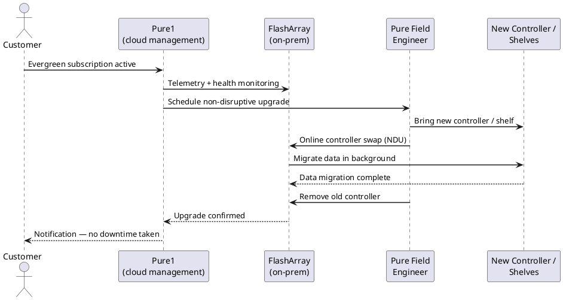
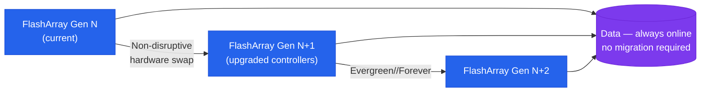

---
tags:
  - architecture
  - pure
---
# Evergreen — How It Works

<div class="kb-summary">
How It Works reference covering Overview, Controller Refresh Model, HA Topology, Controllers (CT0 / CT1), DirectFlash Modules (DFM) and 4 more sections.

*Applies to: Evergreen*
</div>


Evergreen — What's Included vs. Customer-Managed



## Overview

Evergreen is Pure Storage's hardware subscription model for the FlashArray platform (//X, //C, and //E series). Rather than purchasing hardware outright, customers subscribe to a capacity and performance tier — with controller hardware refreshes, Purity software upgrades, and support included in the subscription cost. The defining principle is no forklift upgrades: when controllers reach end of generation, Pure replaces them non-disruptively while data remains on the existing NVMe drive shelf — hosts stay connected and I/O continues during the swap.

Evergreen spans two primary tiers:

- **Evergreen//Forever** — base subscription; includes non-disruptive controller refresh (Ever Modern) every three years, all Purity software upgrades, and support
- **Evergreen//Flex** — adds non-disruptive capacity and blade swap flexibility for FlashBlade; allows adding, removing, or swapping storage media without disruption

Evergreen//One (STaaS consumption model) is covered in a separate section.

## Controller Refresh Model



## HA Topology

FlashArray under Evergreen runs active-active dual controllers. Both controllers handle read and write I/O simultaneously; on controller failure, all I/O shifts to the surviving controller within milliseconds with no host-visible interruption (assuming redundant host paths).

**Non-Disruptive Controller Refresh (NDCR)** — the Ever Modern process — allows Pure to replace one controller at a time while the other continues serving I/O:

1. Failover all I/O to controller 1
2. Remove controller 0, install new-generation controller 0
3. Resync controller 0, failover I/O to controller 0
4. Remove controller 1, install new-generation controller 1
5. Resync controller 1, restore active-active operation

The entire process is non-disruptive to hosts provided multipathing is correctly configured.

## Controllers (CT0 / CT1)

| Property | Detail |
|---|---|
| I/O model | Active-active — both controllers process host I/O simultaneously |
| Failover time | < 30 ms for host-transparent failover (with multipathing) |
| Controller interconnect | NVLink or PCIe fabric for cache coherency and NVRAM mirroring |
| Management interface | Eth0 on each CT; distinct management IPs; VIP used for shared management access |

```bash
purearray list --controller   # show both controllers and Purity version
purehw list --type ct          # hardware detail for CT0 and CT1
purehw list CT0 --spec
```

## DirectFlash Modules (DFM)

DirectFlash Modules are Pure Storage's proprietary NVMe flash storage units. Unlike commodity SSDs, they expose raw NAND flash directly to Purity OS, allowing Pure's software to manage wear levelling, garbage collection, and data placement at the array level.

| Property | Detail |
|---|---|
| Interface | NVMe (PCIe Gen 4 or Gen 5 depending on platform generation) |
| RAID equivalent | Purity RAID-3D (triple parity) — tolerates concurrent multi-DFM failures |
| Controller awareness | DFMs are owned by the array, not individual controllers — both CTs access all DFMs |
| Hot-swap | Yes — non-disruptive replacement under Evergreen support coverage |

```bash
purehw list --type drive         # DFM health status
purehw list --type drive | grep -v Healthy   # non-healthy drives only
purearray list --space           # capacity and data reduction
```

## NVRAM (Write Cache)

Each controller contains NVRAM — a supercapacitor-backed write cache. Write acknowledged to NVRAM on CT0 **and** CT1 before host ACK — write is safe even if one controller fails immediately after. NVRAM drains to DFM within seconds under normal operation.

```bash
purehw list | grep -i nvram   # NVRAM component health
```

## Host Connectivity

Each controller has host-facing connectivity ports and back-end storage ports:

| Port type | Protocol | Count (typical X70R4) |
|---|---|---|
| FC | 16/32 Gbps Fibre Channel | 4 per controller (8 total) |
| iSCSI / NVMe/TCP | 10/25 GbE | 4 per controller (8 total) |
| NVMe/RoCE | 25/100 GbE | Optional add-on card |
| Management | 1 GbE | 2 per controller |

```bash
pureport list                      # all ports and status
pureport list | grep -i "FC\|iSCSI\|NVMe"
pureport list --performance        # port-level performance
```

## Replication

- **ActiveCluster** — synchronous replication between two FlashArray systems; RPO=0, host-transparent failover via a Purity Mediator quorum service; requires ≤5 ms RTT between sites
- **Async replication** — snapshot-based asynchronous replication to a remote FlashArray with configurable RPO intervals

```bash
purepod list                       # ActiveCluster pod status
purepod list --failover-preference
purearray list --connect           # replication connections
```

## Component Health Summary

```bash
purehw list                            # full hardware inventory and health
purehw list | grep -v "Healthy\|Name\|---"   # non-healthy components only
purealert list --flagged               # open hardware alerts
```

---

## See also

- [Evergreen — Design Standards](design-standards/)
- [Evergreen — Integrations](integrations/)
