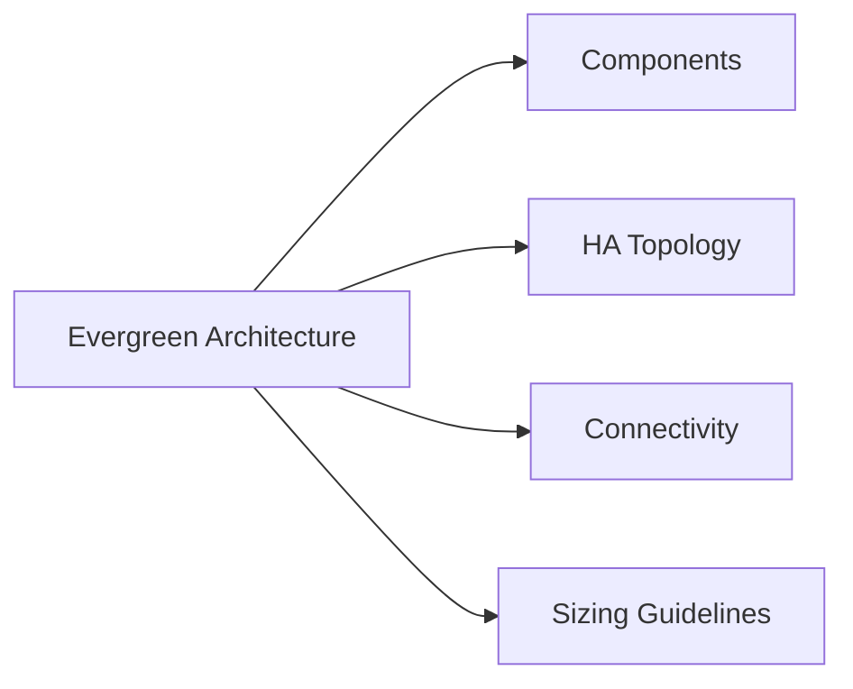

# Pure Storage Evergreen Architecture

## Overview

Evergreen is Pure Storage's hardware subscription model for the FlashArray platform (//X, //C, and //E series). Rather than purchasing hardware outright, customers subscribe to a capacity and performance tier, with controller hardware refreshes, Purity software upgrades, and support included in the subscription cost. The defining principle is no forklift upgrades: when controllers reach end of generation, Pure replaces them non-disruptively while data remains on the existing NVMe drive shelf — hosts stay connected and I/O continues during the swap.

Evergreen spans two primary tiers:

- **Evergreen//Forever** — base subscription; includes non-disruptive controller refresh (Ever Modern) every three years, all Purity software upgrades, and support
- **Evergreen//Flex** — adds non-disruptive capacity and blade swap flexibility for FlashBlade; allows adding, removing, or swapping storage media without disruption

Evergreen//One (STaaS consumption model) is covered in a separate section of this KB.

## Components

**Controllers**

Each FlashArray runs a pair of active-active controllers. The controller pair handles all I/O, runs the Purity//FA operating system, and manages the NVMe drive shelf. Controllers are replaced as part of the Ever Modern refresh cycle without data migration.

**DirectFlash Modules (DFMs)**

Pure's proprietary NVMe SSDs optimised for the Purity storage stack. DFMs remain in place during controller refreshes and across subscription generations — the subscription model is designed around the longevity of the drive shelf.

**NVMe Drive Shelves**

Expansion shelves attach to the primary controller pair to provide additional capacity. Shelves are supported across controller generations, enabling non-disruptive capacity growth throughout the subscription.

**Subscription Tiers**

| Tier | Description |
|---|---|
| Evergreen//Forever | Controller refresh included; upgrades to current-generation controllers at each refresh cycle |
| Evergreen//Flex | All Forever benefits plus non-disruptive media and capacity changes for FlashBlade deployments |

## HA Topology

FlashArray under Evergreen runs active-active dual controllers. Both controllers handle read and write I/O simultaneously; on controller failure, all I/O shifts to the surviving controller within milliseconds with no host-visible interruption (assuming redundant host paths).

**Non-Disruptive Controller Refresh (NDCR)** — the Ever Modern process — allows Pure to replace one controller at a time while the other continues serving I/O. The process is:

1. Failover all I/O to controller 1
2. Remove controller 0, install new-generation controller 0
3. Resync controller 0, failover I/O to controller 0
4. Remove controller 1, install new-generation controller 1
5. Resync controller 1, restore active-active operation

The entire process is non-disruptive to hosts provided multipathing is correctly configured on all connected hosts.

## Connectivity

FlashArray supports multiple host connectivity protocols:

| Protocol | Use Case |
|---|---|
| Fibre Channel (FC) | Block storage for VMware, bare-metal, and mission-critical applications requiring dedicated SAN fabric |
| iSCSI | Block storage over IP networks; lower cost than FC with good performance at 10/25GbE |
| NVMe/FC | NVMe over Fibre Channel for lowest latency block workloads; requires NVMe-capable HBAs |
| NVMe/RoCE | NVMe over RDMA Converged Ethernet; high-throughput, low-latency block over 25/100GbE |
| NVMe/TCP | NVMe over standard TCP/IP; broadest compatibility without requiring specialised NICs or fabric |

**Replication**

- **ActiveCluster** — synchronous replication between two FlashArray systems; RPO=0, host-transparent failover via a mediator quorum service; requires stretched fabric or IP connectivity between sites
- **Async replication** — snapshot-based asynchronous replication to a remote FlashArray with configurable RPO intervals

## Sizing Guidelines

Evergreen subscriptions are sized in TiB of usable capacity after data reduction. Pure provides a **data reduction guarantee**: if actual data reduction falls below the contracted ratio, Pure provides additional capacity at no charge.

| Series | Target Workload | Performance Profile |
|---|---|---|
| FlashArray//X | High-performance OLTP, VDI, databases | Highest IOPS and lowest latency; NVMe throughout |
| FlashArray//C | Capacity-optimised workloads, secondary storage, backups | Higher TiB per £ with QLC media; good for large sequential workloads |
| FlashArray//E | Archive and bulk cold storage at flash economics | Lowest cost per TiB; suitable for data that requires fast restore but low access frequency |

Sizing inputs: expected usable TiB (post-reduction), peak IOPS and bandwidth requirements, host protocol, and replication topology. Engage the Pure account team or use Pure1 capacity planning to model growth over the subscription term.
