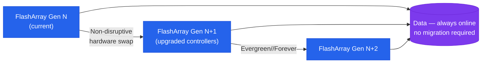

# Evergreen — Architecture

<div class="kb-summary">
Architecture reference for Pure Storage Evergreen. Covers the non-disruptive controller refresh model, active-active HA, DirectFlash Modules, host connectivity, replication options, and subscription design standards.
</div>
```
┌──────────────────────────────── Storage Pure Evergreen — Architecture ────────────────────────────────┐
│                                                                                                       │
│   ┌───────────────────────────────────────────────────────────────────────────────────────────────┐   │
│   │                  Pure architecture overview: Storage Pure Evergreen platform                  │   │
│   │                                  Protocols: Various protocols                                 │   │
│   │           Key components: Storage Pure Evergreen, Management, Monitoring, Automation          │   │
│   │          Design principles: HA, scalability, non-disruptive operations, and security          │   │
│   └───────────────────────────────────────────────────────────────────────────────────────────────┘   │
│                                                                                                       │
│    Design → deploy → configure → validate → monitor → optimise                                        │
│                                                                                                       │
│                  ▼                                ▼                                ▼                  │
│                                                                                                       │
│   ┌─────────────────────────────┐  ┌─────────────────────────────┐  ┌─────────────────────────────┐   │
│   │            Layer            │  │          Component          │  │            Notes            │   │
│   │             Core            │  │       Primary service       │  │        Main function        │   │
│   │          Management         │  │        Control plane        │  │         Admin access        │   │
│   │          Monitoring         │  │         Health/perf         │  │      Alerts/dashboards      │   │
│   │           Security          │  │         Auth/encrypt        │  │        Access control       │   │
│   │         Integration         │  │        APIs/plug-ins        │  │         Third-party         │   │
│   └─────────────────────────────┘  └─────────────────────────────┘  └─────────────────────────────┘   │
│                                                                                                       │
│                          ▼                                                 ▼                          │
│                                                                                                       │
│   ┌───────────────────────────────────────────────────────────────────────────────────────────────┐   │
│   │      Layer       │    Component     │      Function     │      Notes       │       Auth       │   │
│   │       Core       │ Primary service  │   Main function   │     See docs     │       RBAC       │   │
│   │    Management    │  Control plane   │    Admin access   │     See docs     │       RBAC       │   │
│   │    Monitoring    │   Health/perf    │  Alerts/dashboard │     See docs     │       RBAC       │   │
│   │     Security     │   Auth/encrypt   │   Access control  │     See docs     │       RBAC       │   │
│   └───────────────────────────────────────────────────────────────────────────────────────────────┘   │
│                                                                                                       │
│    Physical: Storage Pure Evergreen infrastructure · management network · monitoring                  │
│                                                                                                       │
│    Key terms:                                                                                         │
│                                                                                                       │
│    Pure               = Storage Pure Evergreen platform overview and core concepts                    │
│    Management         = management console and command-line interface for administration              │
│    Monitoring         = health and performance monitoring dashboards and alerting                     │
│    Automation         = REST API, scripting, and pipeline integration capabilities                    │
│    Security           = access control, authentication, and encryption configuration                  │
│    Backup             = backup and recovery procedures and schedule configuration                     │
│    Upgrade            = software version upgrades and firmware patching procedures                    │
│    Troubleshooting    = diagnostic procedures and common issue resolution steps                       │
│    Escalation         = vendor support escalation path and severity triage process                    │
│    Documentation      = vendor knowledge base and official product documentation                      │
│    Change management  = change ticket requirements for production modifications                       │
│    Audit log          = admin action logging for compliance and security review                       │
│                                                                                                       │
└───────────────────────────────────────────────────────────────────────────────────────────────────────┘
```


```text
Evergreen Controller Refresh — Non-Disruptive
  Current generation controllers (CT0 / CT1)
  └── NVMe flash shelves (data at rest)
          │
          ▼  Pure engineer arrives with new controller chassis
  Step 1: New CT0' installed, old CT0 removed
          │  I/O served by CT1 + CT0' during transition
          ▼
  Step 2: New CT1' installed, old CT1 removed
          │  I/O served by CT0' + CT1' — refresh complete
          ▼
  NVMe shelves reconnected to new controllers
  └── Data untouched — hosts see no interruption

  Pure1 manages schedule + lifecycle tracking
```


<div class="kb-grid kb-grid-3">
<a class="kb-card" href="how-it-works/"><strong>How It Works</strong><span>Controller refresh model, HA topology, DFMs, NVRAM, and connectivity.</span></a>
<a class="kb-card" href="integrations/"><strong>Integrations</strong><span>Pure1, True Forward capacity, VMware, backup tools, and REST API.</span></a>
<a class="kb-card" href="design-standards/"><strong>Design Standards</strong><span>Naming conventions, build baseline, and subscription checklist.</span></a>
</div>

| Tier | Description |
|---|---|
| Evergreen//Forever | Base subscription — non-disruptive Ever Modern controller refresh every 3 years, Purity upgrades, and support |
| Evergreen//Flex | Adds non-disruptive capacity and blade swap flexibility for FlashBlade |
| Evergreen//One | STaaS consumption model — Pure owns the hardware; covered separately |


