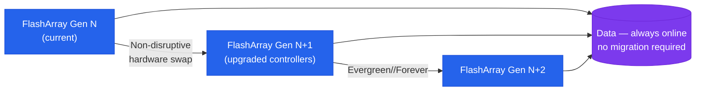

---
tags:
  - architecture
  - pure
---
# Evergreen — Architecture

<div class="kb-summary">
Architecture reference for Pure Storage Evergreen. Covers the non-disruptive controller refresh model, active-active HA, DirectFlash Modules, host connectivity, replication options, and subscription design standards.

*Applies to: Evergreen*
</div>


```text
┌───────────────────────── Pure Evergreen — Subscription Upgrade Architecture ──────────────────────────┐
│                                                                                                       │
│  Evergreen subscription ensures non-disruptive controller upgrades for life of contract;              │
│  customer owns/leases hardware; Pure delivers new controllers without downtime.                       │
│                                                                                                       │
│   ┌──────────────────────────────────────────────┐  ┌─────────────────────────────────────────────┐   │
│   │              Subscription Model              │  │                Upgrade Model                │   │
│   │           Customer purchases array           │  │          New controllers delivered          │   │
│   │        Evergreen: software + support         │  │         Shelf + drives stay in place        │   │
│   │       Annual: Purity upgrades included       │  │          Controller swap: < 30 min          │   │
│   │          Term: 3 or 5 year options           │  │         No migration of data needed         │   │
│   │          No forklift: ever promised          │  │          IO: continues during swap          │   │
│   └──────────────────────────────────────────────┘  └─────────────────────────────────────────────┘   │
│                                                                                                       │
│  Evergreen is the foundation; Evergreen//One adds Pure managing the hardware for you.                 │
│                                                                                                       │
│                          ▼                                                 ▼                          │
│                                                                                                       │
│   ┌──────────────────────────────────────────────┐  ┌─────────────────────────────────────────────┐   │
│   │             Upgrade Generations              │  │         Evergreen vs Evergreen//One         │   │
│   │          //X: NVMe director upgrade          │  │            Evergreen: you own HW            │   │
│   │          //C: capacity NVMe upgrade          │  │         Evergreen//One: Pure owns HW        │   │
│   │          //XL: extreme performance           │  │         Both: no forklift guarantee         │   │
│   │          Director modules: hot-swap          │  │          Both: Pure does controller         │   │
│   │        Same shelf across generations         │  │          //One: STaaS billing model         │   │
│   └──────────────────────────────────────────────┘  └─────────────────────────────────────────────┘   │
│                                                                                                       │
│  Physical Infrastructure (the hardware everything above runs on):                                     │
│  FlashArray chassis with drive shelves; new controllers arrive in 2U modules;                         │
│  Pure engineer does the swap on-site; drives and shelves are re-used.                                 │
│                                                                                                       │
│  Key terms:                                                                                           │
│                                                                                                       │
│  Evergreen      = Pure subscription model; controller upgrades included in contract                   │
│  Forklift       = replacing entire storage array; Evergreen specifically avoids this                  │
│  Controller     = FlashArray compute module; upgrades move to new generation                          │
│  Director module= FlashArray controller; single or dual per chassis; hot-swap                         │
│  Purity//FA     = FlashArray OS; upgrades included in Evergreen subscription                          │
│  Non-disruptive = IO continues during controller swap; no maintenance window                          │
│  //X series     = NVMe-optimized FlashArray generation (current)                                      │
│  //C series     = capacity-optimized; QLC NVMe for colder workloads                                   │
│  //XL series    = extreme performance; enterprise-scale block storage                                 │
│  Evergreen//One = STaaS variant; Pure manages hardware; customer just consumes                        │
│  Shelf reuse    = drive enclosures remain across controller generations                               │
│  3/5-year term  = common contract length; upgrade entitlement during term                             │
│                                                                                                       │
└───────────────────────────────────────────────────────────────────────────────────────────────────────┘
```

<div class="kb-grid kb-grid-3">
<a class="kb-card" href="how-it-works/"><strong>How It Works</strong><span>Controller refresh model, HA topology, DFMs, NVRAM, and connectivity.</span></a>
<a class="kb-card" href="integrations/"><strong>Integrations</strong><span>Pure1, True Forward capacity, VMware, backup tools, and REST API.</span></a>
<a class="kb-card" href="design-standards/"><strong>Design Standards</strong><span>Naming conventions, build baseline, and subscription checklist.</span></a>
</div>

| Tier | Description |
|---|---|
| Evergreen//Forever | Base subscription — non-disruptive Ever Modern controller refresh every 3 years, Purity upgrades, and support |
| Evergreen//Flex | Adds non-disruptive capacity and blade swap flexibility for FlashBlade |
| Evergreen//One | STaaS consumption model — Pure owns the hardware; covered separately |


