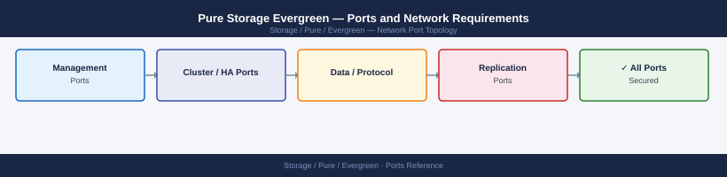

---
tags:
  - evergreen
  - pure-storage
  - networking
  - firewall
  - ports
---
# Pure Storage Evergreen — Ports and Network Requirements

Pure Storage Evergreen is a commercial subscription program — it is not a separate software product and does not introduce additional network ports. All port requirements come from the underlying FlashArray or FlashBlade hardware being managed.

*Applies to: Evergreen//Forever, Evergreen//Flex subscription programs*

## How It Works

Evergreen is Pure Storage's non-disruptive upgrade and subscription licensing model. Customers receive ongoing controller and software upgrades as part of their subscription — no separate Evergreen management plane or appliance is deployed on-premises.

The only network-level requirement specific to Evergreen is that each array can reach **pure1.purestorage.com:443** to enable proactive support, upgrade scheduling, and entitlement verification.

## Relevant Port Pages

| Component | Ports Page |
|---|---|
| FlashArray (block storage) | [Pure Storage FlashArray — Ports](../flasharray/architecture/ports/) |
| FlashBlade (file/object) | [Pure Storage FlashBlade — Ports](../flashblade/architecture/ports/) |
| Pure1 cloud telemetry | [Pure1 — Ports](../pure1/architecture/ports/) |

## Upgrade-Related Connectivity (Outbound)

| Port | Protocol | Source | Destination | Purpose |
|---|---|---|---|---|
| 443 | TCP | FlashArray/FlashBlade mgmt IP | pure1.purestorage.com | Upgrade notifications, controller swap coordination, entitlement check |

## See also

- [Pure Storage Evergreen — Architecture](how-it-works/)
