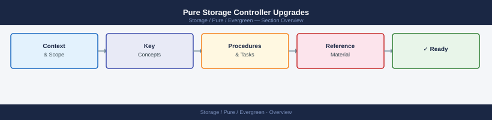

---
tags:
  - pure
---
# Pure Storage Controller Upgrades


<div class="kb-summary">
Pure Storage Controller Upgrades reference covering How Controller Upgrades Work, Customer Pre-Upgrade Responsibilities, During the Upgrade, Verifying Paths During/After Upgrade, Post-Upgrade Verification and 1 more sections.

*Applies to: Evergreen*
</div>



Under the Evergreen program, Pure Storage performs non-disruptive controller upgrades as part of the subscription — there is no hardware refresh cycle or capital expenditure.
## How Controller Upgrades Work

1. Pure Storage proactively schedules controller upgrades based on technology lifecycle
2. Customer receives advance notice (typically 90+ days)
3. The upgrade is performed non-disruptively by Pure Storage engineers
4. Active I/O continues during the upgrade — hosts see no interruption

## Customer Pre-Upgrade Responsibilities

- Confirm maintenance window with the Pure Storage team
- Verify all hosts are healthy and paths are redundant
- Ensure no in-progress background tasks (e.g., parity rebuilds) would extend the window

```bash
# Check array health before upgrade
purecli array list
purecli drive list
purecli alert list
```

Or via Pure1 / Purity GUI:
- **Storage → Array** — confirm all drives healthy
- **Analysis → Alerts** — no active critical alerts

## During the Upgrade

- Pure Storage engineers manage the process remotely or on-site
- Active controller is drained non-disruptively before replacement
- Paths fail over to the secondary controller — multipathing handles this transparently
- Expect brief I/O latency increase during path failover (seconds, not minutes)

## Verifying Paths During/After Upgrade

**On the host:**

```bash
# Linux with multipath
multipath -ll

# Windows PowerShell (MPIO)
mpclaim -s -d

# VMware
esxcli storage nmp device list
```

Confirm all expected paths are active after the upgrade completes.

## Post-Upgrade Verification

```bash
purecli array list     # Confirm new controller hardware
purecli hardware list  # All components healthy
purecli alert list     # No post-upgrade alerts
```

## Common Considerations

| Item | Detail |
|---|---|
| Downtime | None — non-disruptive by design |
| Pre-requisite | Dual-path host connectivity required |
| Scheduling | Coordinated with Pure Storage |
| Data migration | None — data stays in place |
| Host action required | None (verify paths post-upgrade) |
