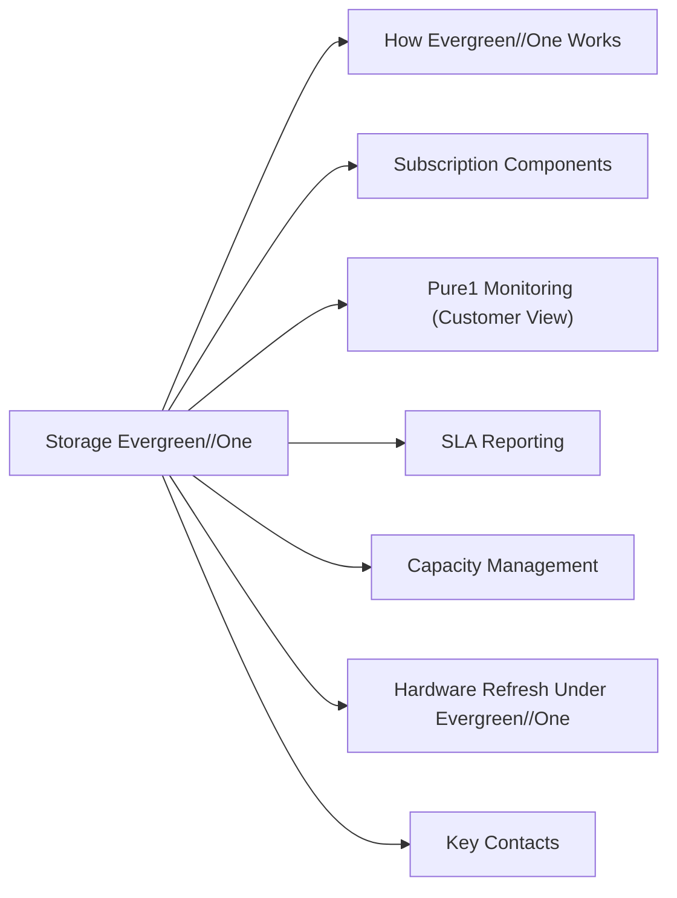

# Pure Storage Evergreen//One

Evergreen//One is Pure Storage's storage-as-a-service (STaaS) offering — a subscription model where Pure owns, manages, and refreshes hardware while the customer pays for consumed capacity.



## How Evergreen//One Works

- Customer subscribes to a guaranteed minimum capacity tier with defined performance SLAs
- Pure installs and manages all hardware on-premises
- Hardware refresh is included — no customer CapEx
- Pure guarantees:
  - **Availability SLA** — typically 99.9999% (six nines)
  - **Performance SLA** — latency thresholds per workload tier
  - **Capacity SLA** — guaranteed usable capacity

## Subscription Components

| Component | Description |
|---|---|
| Reserved capacity | Committed capacity guaranteed by Pure |
| Burst capacity | On-demand capacity above reserved; metered |
| Performance tier | Throughput and latency guarantees |
| Included services | Hardware refresh, proactive monitoring, Pure1 |

## Pure1 Monitoring (Customer View)

Customers monitor their Evergreen//One environment via **Pure1**:
- **Storage → Arrays** — array health and capacity
- **Analysis → Capacity** — consumption vs. committed
- **Analysis → Performance** — throughput and latency vs. SLA
- **Alerts** — active issues

## SLA Reporting

Pure proactively reports against committed SLAs. If a performance or availability SLA is missed, Pure provides credits per the contract terms. Engage Pure Storage Customer Success if SLA violations are suspected.

## Capacity Management

```
Pure1 → Analysis → Capacity
```

Monitor:
- Current consumption vs. reserved capacity
- Burst usage (higher cost per TB)
- Growth trend and forecast

## Hardware Refresh Under Evergreen//One

Pure manages the full hardware lifecycle:
- Proactive drive replacement
- Controller upgrades included
- All work performed non-disruptively by Pure engineers
- No customer action required beyond path verification

## Key Contacts

| Role | Contact |
|---|---|
| Customer Success Manager | Assigned at contract start |
| Technical Account Manager | Ongoing technical relationship |
| Support | Pure1 support portal |
