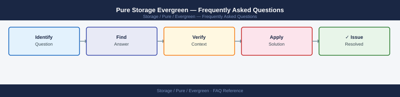

---
tags:
  - pure-evergreen
  - faq
  - operations
---
# Pure Storage Evergreen — Frequently Asked Questions

Common questions about Pure Storage Evergreen operations, configuration, and troubleshooting. For step-by-step procedures, see the <a href="index.md">Operations</a> section.

## General

**Q: How do I verify my array is enrolled in the Evergreen programme?**
A: Log in to Pure1 → Arrays → select the array → Support Contracts → confirm Evergreen subscription is active. Check that Controller Evergreen is enabled for non-disruptive controller upgrades.

**Q: How do I check the current Pure Storage Evergreen version?**
A: `Pure1 → Arrays → Support Contracts`

## Configuration

**Q: What does Evergreen//Forever include by default?**
A: Evergreen//Forever includes non-disruptive controller upgrades every 3 years (for FlashArray), software upgrades, and DirectFlash module refreshes. Capacity is not included — only the controller and software refresh.

**Q: How do I schedule a controller upgrade under Evergreen//Forever?**
A: Contact Pure Support or your account team 90 days before the 3-year refresh window. Pure coordinates the upgrade timing and performs the non-disruptive controller swap. Downtime is not required.

## Operations

**Q: How does Pure perform non-disruptive controller upgrades under Evergreen?**
A: Pure connects remotely, migrates I/O to one controller, replaces the other, then migrates back. Total host-visible impact: zero (HA failover handles I/O during swap). Typically completed in 2-4 hours per array.

**Q: What is the correct procedure to initiate an Evergreen controller refresh?**
A: Log a support case with Pure labelled 'Evergreen Controller Refresh'. Pure verifies eligibility, schedules the work, and ships new controllers. Coordinate with your maintenance window calendar.

## Troubleshooting

**Q: Pure1 shows 'Evergreen refresh due'. What does it mean?**
A: Your array is eligible for a controller refresh under the Evergreen programme. Schedule the refresh within the eligibility window — delaying too long may forfeit the refresh entitlement.

**Q: Post-Evergreen upgrade performance is different from pre-upgrade — where do I start?**
A: New controllers may have different performance characteristics (higher baseline throughput, different latency profiles). Review Pure1 performance metrics before and after. Contact Pure if performance is below pre-upgrade baselines.

## Backup and Recovery

**Q: Is there any configuration backup needed before an Evergreen upgrade?**
A: Pure backs up all array configuration as part of the upgrade process. No customer action required. However, verify your application-level backups are current before the upgrade window as a standard precaution.

**Q: What if an Evergreen upgrade causes unexpected issues?**
A: Contact Pure Support immediately. Pure can roll back the controller swap if issues occur within the upgrade window. Pure1 monitoring is active throughout the upgrade to detect anomalies.

## See Also

- [Pure Storage Evergreen Operations](index.md)
- [Pure Storage Evergreen Troubleshooting](../../../troubleshooting/index.md)
