---
tags:
  - operations
  - pure
---
# Evergreen — Procedures

<div class="kb-summary">
Pure Evergreen procedures: requesting capacity upgrades, scheduling controller refreshes, coordinating with Pure account team, and validating entitlements post-change.

*Applies to: Evergreen*
</div>

---

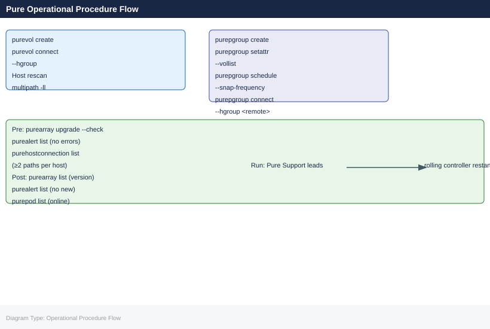

---

This page covers day-to-day operational procedures for arrays under an Evergreen subscription: change readiness, maintenance window management, controller upgrade coordination, capacity management, post-change validation, and subscription lifecycle tasks.

---

## Before you begin

- **Access:** Storage admin credentials (cluster admin or equivalent)
- **Timing:** safe to run during business hours unless a step is marked ⚠ (causes interruption)
- **Dependencies:** no active upgrades or migrations on the same infrastructure
- **Logging:** capture command output — paste into the change record on completion

---

## Change Readiness

Run this checklist before any planned change to an Evergreen FlashArray — Purity upgrade, controller refresh, volume provisioning, or replication reconfiguration.

### Pre-Change Checklist

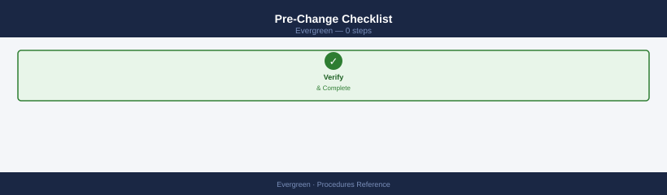

- [ ] **No active drive rebuilds** — `puredrive list` shows all drives `healthy`; no drives in `evacuating` or `recovering` state
- [ ] **No active critical alerts** — `purealert list --severity error` returns no results
- [ ] **Both controllers online** — `purearray list --controller` shows both CT0 and CT1 online running the same Purity version
- [ ] **All pods online** — `purepod list` shows all ActiveCluster pods in `online` status (if configured)
- [ ] **Mediator reachable** — `curl -sk https://<mediator-ip>/mediator/version` returns a version response (if ActiveCluster is deployed)
- [ ] **All hosts have redundant paths** — `purehostconnection list` shows no host with fewer than 2 paths; single-path hosts are an upgrade blocker
- [ ] **Replication lag within RPO** — `purepod list` shows lag within the defined RPO threshold
- [ ] **Capacity headroom sufficient** — `purearray list --space` shows at least 20% free before starting large provisioning changes
- [ ] **Snapshot count is manageable** — `puresnap list | wc -l` is below 10,000; high snapshot counts extend upgrade duration
- [ ] **Pure1 phonehome active** — Pure1 portal shows phonehome as active for this array; Pure Support visibility requires continuous telemetry
- [ ] **Change freeze status confirmed** — no outstanding change freezes in the change management system

| Item | Status | Notes |
|---|---|---|
| No drive rebuilds | | |
| No critical alerts | | |
| Both controllers online | | |
| All pods online | | |
| Mediator reachable | | |
| All hosts multi-path | | |
| Replication lag within RPO | | |
| Capacity headroom > 20% | | |
| Phonehome active | | |

---

## Purity Software Upgrade Procedure

Purity upgrades on Evergreen subscriptions are non-disruptive. Pure performs the upgrade — the customer's responsibility is to validate readiness and confirm the maintenance window. Follow this procedure for every upgrade.

### Step 1 — Confirm Target Version and Path

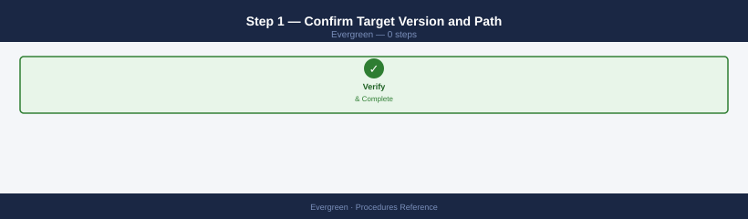

```bash
# Check current Purity version
purearray list
# Note the 'version' field

# Check upgrade readiness (non-disruptive upgrade pre-check)
purearray upgrade --check
# Output lists any blockers. All checks must pass before proceeding.

# If using the Python pre-check script:
export FA_HOST=flasharray01.example.com
export FA_API_TOKEN=<token>
python fa_upgrade_readiness.py
```

Confirm the target version with Pure Support. Pure will specify the upgrade path — never skip more than two minor versions without Pure's guidance. Verify the target version is compatible with the current controller generation using the [Pure compatibility matrix](https://support.purestorage.com/).

### Step 2 — Pre-Upgrade Actions

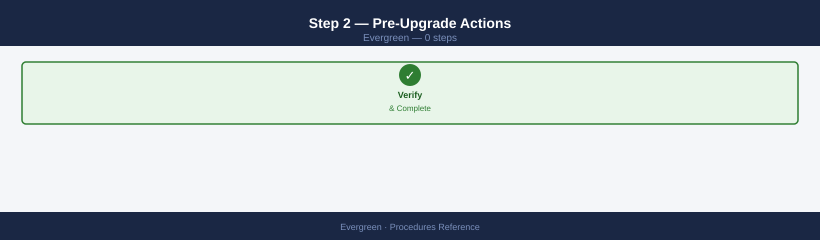

```bash
# Clean up destroyed volumes and snapshots to reduce upgrade duration
purevol eradicate --destroyed
puresnap eradicate --destroyed

# Record baseline capacity and data reduction before the upgrade
purearray list --space > /tmp/pre-upgrade-space-$(date +%Y%m%d).txt

# Record volume inventory
purevol list > /tmp/pre-upgrade-volumes-$(date +%Y%m%d).txt

# Notify application teams and storage consumers of the upgrade window
# FlashBlade upgrades are non-disruptive but protocol sessions may briefly re-establish
```

### Step 3 — Execute the Upgrade


Pure Support leads the upgrade execution. During the upgrade window:

```bash
# Monitor progress from the CLI (upgrade performs a rolling controller restart)
purearray list
# The version field updates after both controllers complete the upgrade

# Monitor host I/O latency during the upgrade window
# Pure1 > Arrays > select array > Performance
# Expect a brief latency spike (seconds) during each controller restart
```

**Host-side monitoring during upgrade:**

```bash
# Linux — watch multipath path states during the upgrade
watch -n 5 multipath -ll

# VMware — watch storage adapter path states
esxcli storage nmp device list | grep -E "naa|State"
```

### Step 4 — Post-Upgrade Validation

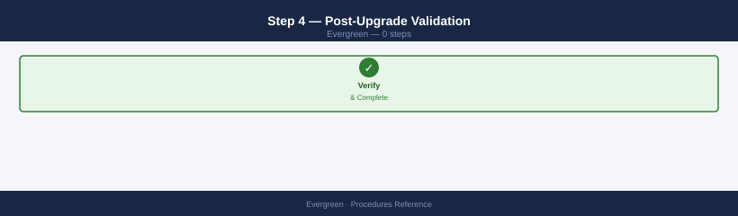

```bash
# Confirm the new Purity version is running
purearray list
# Verify 'version' field matches the target version

# Confirm no new alerts appeared during the upgrade
purealert list

# Confirm both controllers are online and running the new version
purearray list --controller

# Confirm all drives are healthy
puredrive list

# Confirm all pods are online and replicating
purepod list

# Confirm all host paths are restored
purehostconnection list

# Confirm capacity figures are unchanged (compare to pre-upgrade baseline)
purearray list --space
diff /tmp/pre-upgrade-space-$(date +%Y%m%d).txt <(purearray list --space)
```

---

## Controller Refresh Procedure (Ever Modern)

The Ever Modern controller refresh replaces the physical FlashArray controller modules while all I/O continues on the surviving controller. Pure Storage engineers perform the physical swap. The customer's role is readiness validation, maintenance window coordination, and post-upgrade verification.

### 60 Days Before the Refresh Window

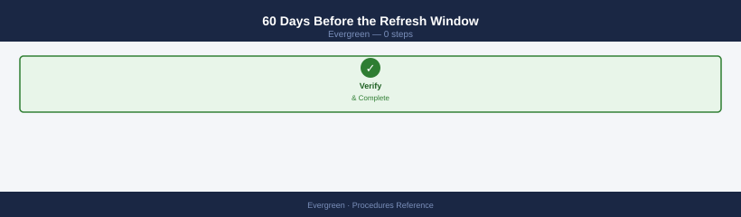

- [ ] Review the subscription dashboard in Pure1 — confirm the controller generation and refresh window deadline
- [ ] Confirm Purity software version is within the supported range for the new controller generation — an upgrade may be required before the controller refresh
- [ ] Identify all hosts connected to the array and confirm multipathing is configured on each
- [ ] Review any change freezes or maintenance blackout periods that could conflict with the Pure-scheduled window
- [ ] Notify the Pure account team of available maintenance windows (minimum 4-hour window required)

### 7 Days Before the Refresh

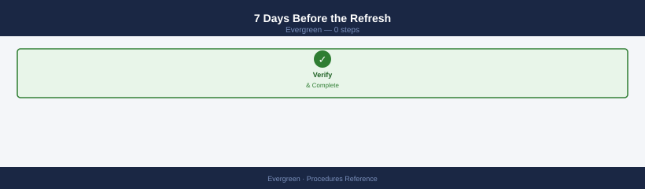

```bash
# Full pre-upgrade readiness check
purearray upgrade --check

# Confirm all hosts have redundant paths
purehostconnection list
# Any host with fewer than 2 paths must be remediated before the refresh

# Confirm ActiveCluster mediator is reachable (if configured)
purepod list --mediator
curl -sk https://<mediator-ip>/mediator/version

# Review and clean up excess snapshots
puresnap list --space | head -20
# Eradicate snapshots beyond the retention window to reduce refresh duration
```

### During the Refresh Window

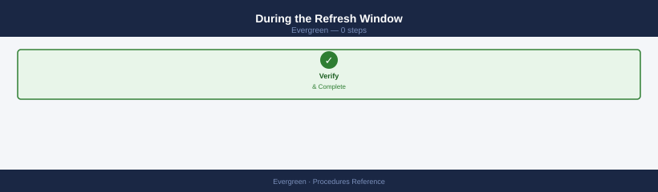

Pure Storage engineers manage the physical replacement. The refresh sequence:

1. Pure drains I/O from controller 0 (all I/O shifts to controller 1)
2. Pure removes controller 0 hardware and installs the new-generation module
3. Controller 0 rejoins the cluster; I/O is redistributed to active-active
4. Pure drains I/O from controller 1 (all I/O shifts to new controller 0)
5. Pure removes controller 1 hardware and installs the new-generation module
6. Controller 1 rejoins the cluster; normal active-active operation resumes

**Customer action during the refresh:**

```bash
# Monitor host I/O on the array from a monitoring tool or watch CLI
# Expect latency spikes during each controller drain/rejoin event (< 30 seconds each)

# Watch multipath from a representative Linux host
watch -n 2 multipath -ll | grep -E "policy|status|active|failed"
```

### Post-Refresh Validation

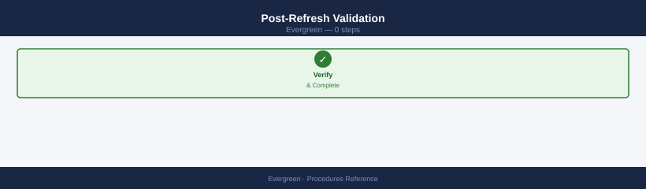

```bash
# Confirm both controllers are online and running the new hardware generation
purearray list --controller
# The 'model' or 'type' field should reflect the new controller generation

# Confirm no new alerts
purealert list

# Confirm all drives are healthy
puredrive list

# Confirm all host paths are restored
purehostconnection list

# Confirm all pods are online
purepod list

# Confirm capacity figures are unchanged
purearray list --space
```

**Update CMDB records:** Document the new controller generation, the refresh date, and the next scheduled refresh window. Update subscription renewal date tracking if the refresh resets the lifecycle clock.

---

## Capacity Management Procedures

### Provisioning a New Volume

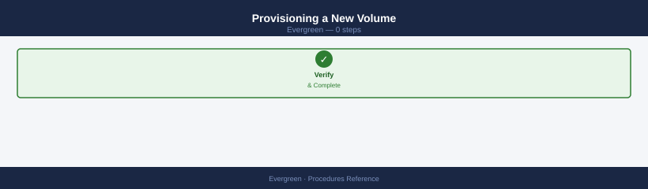

```bash
# Create a volume (thin-provisioned; actual space consumed as data is written)
purevol create --size 10T prod-oracle-vol03

# Connect the volume to a host group
purevol connect --hgroup prod-oracle-cluster prod-oracle-vol03

# Verify the volume is connected
purevol list --connection prod-oracle-vol03

# On the host — rescan to discover the new LUN
# Linux:
for host in /sys/class/scsi_host/host*; do echo "- - -" > $host/scan; done
multipathd reconfigure
multipath -ll | grep -A 5 <new_lun_naa>

# VMware:
esxcli storage core adapter rescan --all
esxcli storage nmp device list | grep <new_lun_naa>
```

### Expanding an Existing Volume

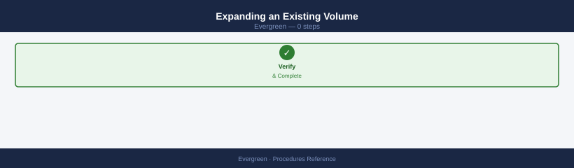

Volume expansion is non-disruptive and online. The host OS must rescan to see the new size after expansion.

```bash
# Expand the volume to 20 TiB
purevol setattr --size 20T prod-oracle-vol03

# Verify the new size
purevol list prod-oracle-vol03

# On Linux — rescan the device to pick up the new size
# First, identify the device by its NAA ID from the multipath output
echo "1" > /sys/block/sdb/device/rescan
# Or trigger a multipath resize:
multipathd resize map <device_name>

# On VMware — rescan storage
storage rescan --adapter vmhba0 --type lun
# Then extend the VMFS datastore if required
```

### Protection Group Management

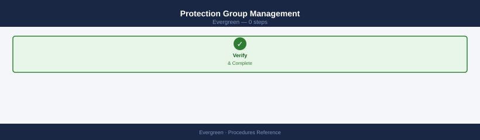

All production volumes should be members of a protection group with replication to the DR site.

```bash
# Create a protection group for Oracle
purepgroup create prod-oracle-pg

# Add volumes to the protection group
purepgroup setattr --vollist prod-oracle-vol01,prod-oracle-vol02,prod-oracle-vol03 prod-oracle-pg

# Create a snapshot schedule — every 4 hours, retain 72 hours (18 snapshots)
purepgroup schedule \
    --snap-frequency 14400 \
    --snap-retention 259200 \
    prod-oracle-pg

# Connect the protection group to the remote replication target
purepgroup connect --hgroup remote-lon02 prod-oracle-pg

# Verify replication is active
purepgroup list --replication prod-oracle-pg
```

---

## Subscription Lifecycle Procedures

### Annual True Forward Review

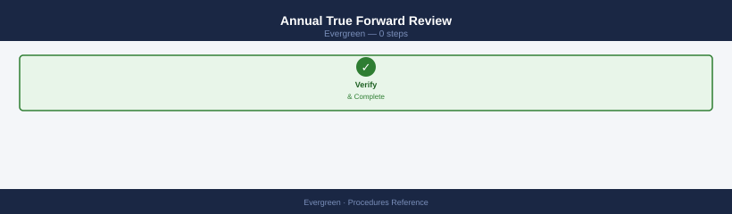

Conduct this review 60 days before the annual True Forward review date.

```bash
# Pull current capacity data for the review
purearray list --space > ~/true-forward-capacity-$(date +%Y%m%d).txt

# Identify the largest capacity consumers
purevol list --space | sort -k 2 -rh | head -20 >> ~/true-forward-capacity-$(date +%Y%m%d).txt

# Snapshot space consumption
puresnap list --space | sort -k 3 -rh | head -20 >> ~/true-forward-capacity-$(date +%Y%m%d).txt
```

Prepare the following for the True Forward meeting with the Pure account team:

| Data Point | Source |
|---|---|
| Current used capacity (TiB) | `purearray list --space` |
| Current data reduction ratio | `purearray list --space` |
| 12-month capacity growth trend | Pure1 > Capacity > Trend graph |
| Projected capacity requirement for next 12 months | Calculated from trend + planned workloads |
| Contracted data reduction guarantee | Contract or Pure1 subscription dashboard |
| Current vs. contracted ratio | Compare above two |

If the current data reduction ratio is below the contracted guarantee, document this clearly and raise it with the Pure account team — Pure should provide additional capacity at no charge for the shortfall period.

### Subscription Renewal Preparation

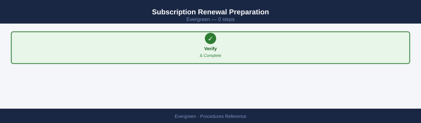

Begin renewal preparation 90 days before the current term expires:

- [ ] Review current committed capacity vs. actual usage trend in Pure1
- [ ] Review controller generation and whether an Ever Modern refresh is included in the renewal
- [ ] Confirm the contracted data reduction guarantee is still appropriate for the current workload mix
- [ ] Prepare a 2–3 year capacity growth projection for renewal negotiations
- [ ] Confirm the renewal includes all required Purity features (e.g., ActiveCluster, SafeMode) that are currently licensed
- [ ] Schedule a renewal discussion with the Pure CSM and account executive

---

## Post-Change Validation

Run after any configuration change, upgrade, or maintenance window:

```bash
# Health summary
purearray list
purearray list --controller
purearray list --hardware

# Alert check — confirm no new alerts
purealert list

# Drive health
puredrive list

# Replication
purepod list
purepod list --replicating

# Host paths
purehostconnection list

# Capacity — compare to pre-change baseline
purearray list --space
```

Application-layer validation:

- [ ] Confirm production workload I/O is normal — check application response times and error logs
- [ ] Test connectivity from at least one representative host per protocol (FC, iSCSI, NVMe)
- [ ] Confirm snapshot schedules are running — `puresnap list` shows recent snapshots for key protection groups
- [ ] Confirm replication is active and lag is within RPO — `purepod list --replicating`
- [ ] Update the change management ticket with post-change validation results and close the window

Document the change completion time, the engineer who performed it, and any deviations from the planned procedure in the CMDB record for the array.

## Submit a Non-Disruptive Controller Upgrade Request

When an Evergreen//Forever entitlement includes a controller upgrade, the request is raised through Pure Support. Pure performs the upgrade without requiring downtime on the storage side.

1. Log in to **Pure1** and navigate to **Support → Cases → New Case**
2. Enter the subject as "Evergreen Controller Upgrade" and describe the array serial number and target controller generation
3. Pure Support schedules the upgrade window and confirms compatibility with the current Purity version
4. During the upgrade window, Pure engineers perform the non-disruptive controller swap following the rolling replacement sequence
5. After the upgrade, verify the new controller generation is active:

```bash
# Confirm both controllers are online with the new hardware generation
purearray list --controllers
# The 'type' or 'model' field should reflect the updated controller generation
```

Confirm no new alerts appeared after the refresh and that all host paths are fully restored before closing the change record.

## Track Hardware Refresh Timeline

Evergreen//Forever entitlement includes scheduled hardware refreshes. Use Pure1 to track the refresh window and plan accordingly.

1. Log in to **Pure1** and navigate to **My Fleet → select array**
2. Select the **Hardware** tab and note the current controller and shelf generation
3. Cross-reference the controller generation with the Evergreen//Forever entitlement terms to identify the refresh window deadline
4. If the refresh window is within 90 days, notify the Pure account team to confirm the scheduled date and any pre-requisites (Purity version compatibility, maintenance blackouts)
5. Update the CMDB record with the controller generation, the refresh window deadline, and the planned refresh date

Ensure Purity is at a supported version for the target controller generation before the refresh window arrives. Pure will specify the required upgrade path if a Purity upgrade is needed before the hardware refresh.

## Confirm Purity Upgrade Eligibility

Before scheduling a Purity upgrade, confirm the array is eligible and that the target version is appropriate for the current hardware and workload.

1. Log in to **Pure1** and navigate to **Software → select array**
2. Review the **Available Upgrades** list — Pure1 shows only versions compatible with the current controller and Purity release line
3. Run the Upgrade Advisor: Pure1 evaluates array health, snapshot count, ActiveCluster pod state, and host path counts and flags any blockers
4. Review all Upgrade Advisor findings and resolve any blockers before scheduling
5. Schedule the upgrade via Pure1 or initiate via CLI with Pure Support engaged:

```bash
# Initiate Purity upgrade to a specific target version
purearray upgrade --version <target>
# Pure Support must be engaged before running this command in production
```

Confirm the upgrade readiness check passes without blockers before setting the maintenance window: `purearray upgrade --check`.

---

## Verify

- `purearray upgrade --check` returns no blocking issues before running the upgrade
- After upgrade: `purearray get --version` returns the expected target version
- Array health: `purehw list` and `puredrive list` show no failed components
- Performance metrics are within baseline 30 minutes after the upgrade completes

---

## See also

- [Evergreen — Health Checks](health-checks/)
- [Evergreen — CLI Reference](cli-reference/)
