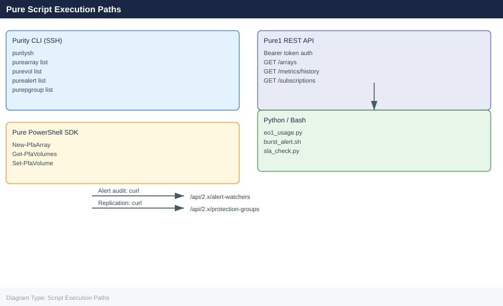

---
tags:
  - operations
  - pure
---
# Evergreen — Script Reference

<div class="kb-summary">
Script Reference reference covering Subscription Capacity Report, Alert Configuration Audit, Evergreen//One SLA Consumption Tracker, Protection Group Replication Status.

*Applies to: Evergreen*
</div>




## Before you begin

- **Access:** Storage admin credentials (cluster admin or equivalent)
- **Timing:** safe to run during business hours unless a step is marked ⚠ (causes interruption)
- **Dependencies:** no active upgrades or migrations on the same infrastructure
- **Logging:** capture command output — paste into the change record on completion

---

## Subscription Capacity Report

Queries Pure1 API to report consumed vs committed TiB across all arrays in the Evergreen subscription.

```python
#!/usr/bin/env python3
"""
pure1-capacity-report.py
Requires: pip install requests
"""
import requests, json, os

PURE1_API_BASE = "https://api.pure1.purestorage.com/api/1.0"
API_TOKEN = os.environ.get("PURE1_API_TOKEN", "")

def get_auth_header():
    resp = requests.post(
        f"{PURE1_API_BASE}/oauth2/1.0/token",
        data={"grant_type": "urn:ietf:params:oauth:grant-type:token-exchange",
              "subject_token": API_TOKEN,
              "subject_token_type": "urn:ietf:params:oauth:token-type:jwt"}
    )
    resp.raise_for_status()
    return {"Authorization": f"Bearer {resp.json()['access_token']}"}

def main():
    headers = get_auth_header()

    arrays = requests.get(f"{PURE1_API_BASE}/arrays", headers=headers).json()
    metrics = requests.get(
        f"{PURE1_API_BASE}/metrics/history",
        headers=headers,
        params={"names": "array_total_capacity,array_data_reduction",
                "resolution": 86400000}
    ).json()

    print(f"{'Array':<30} {'Model':<15} {'Capacity TiB':>14}")
    print("-" * 62)
    for a in arrays.get("items", []):
        print(f"{a.get('name','?'):<30} {a.get('model','?'):<15} "
              f"{a.get('capacity', 0) / 2**40:>13.2f}")

if __name__ == "__main__":
    main()
```

## Alert Configuration Audit

Lists current alert notification rules across all arrays managed by Evergreen//One or Evergreen//Flex.

```bash
#!/usr/bin/env bash
# pure-alert-audit.sh
# Audits alert rules on a single FlashArray
ARRAY_IP="<array-ip>"
TOKEN="<api-token>"

echo "=== Alert Rules on $ARRAY_IP ==="
curl -s -k -H "x-auth-token: $TOKEN" \
    "https://$ARRAY_IP/api/2.16/alert-watchers" | jq -r '.items[] | "\(.name)\t\(.enabled)"'

echo ""
echo "=== Open Alerts ==="
curl -s -k -H "x-auth-token: $TOKEN" \
    "https://$ARRAY_IP/api/2.16/alerts?filter=state%3D%27open%27" | \
    jq -r '.items[] | "[\(.severity)] \(.summary)"'
```


```text title="Expected output"
=== Alert Rules on 192.168.1.50 ===
array-connectivity	true
capacity-threshold	true
performance-degradation	true
hardware-failure	true
replication-lag	false

=== Open Alerts ===
[warning] Array temperature approaching threshold
[critical] Replication link down: remote-array-02
[warning] Snapshot space utilization at 87%
```

!!! warning "Common errors"
    **`curl: (60) SSL certificate problem: self signed certificate`** — Add `-k` flag to curl command to skip certificate verification (already present in script, but verify SSL_CERT_FILE environment variable isn't overriding it).
    **`jq: parse error: Invalid JSON`** — Ensure the API token is valid and not expired; regenerate token in FlashArray management console if needed.
    **`curl: (7) Failed to connect to 192.168.1.50 port 443: Connection refused`** — Verify the array IP address is correct and the management interface is reachable with `ping` or `nc -zv`.
## Evergreen//One SLA Consumption Tracker

Tracks consumed TiB vs SLA committed TiB over time, alerting when within 90% of commitment.

```bash
#!/usr/bin/env bash
# evg-sla-check.sh
# Requires pure1 CLI or jq + curl with Pure1 token
COMMITTED_TIB=500   # edit to match your commitment
TOKEN="<pure1-token>"

CONSUMED=$(curl -s -k -H "Authorization: Bearer $TOKEN" \
    "https://api.pure1.purestorage.com/api/1.0/subscriptions" | \
    jq '[.items[].consumed_tib] | add // 0')

PCT=$(echo "scale=1; $CONSUMED * 100 / $COMMITTED_TIB" | bc)
echo "Consumed: ${CONSUMED} TiB / ${COMMITTED_TIB} TiB committed (${PCT}%)"

THRESHOLD=90
if (( $(echo "$PCT >= $THRESHOLD" | bc -l) )); then
    echo "WARNING: SLA consumption above ${THRESHOLD}% threshold"
fi
```


```text title="Expected output"
Consumed: 487.3 TiB / 500 TiB committed (97.5%)
WARNING: SLA consumption above 90% threshold
```

!!! warning "Common errors"
    **`curl: (60) SSL certificate problem: self signed certificate in certificate chain`** — Remove the `-k` flag if connecting to a trusted Pure1 endpoint, or ensure your CA bundle is current with `update-ca-certificates`.
    **`jq: error (at <stdin>:1): Cannot index array with string "items"`** — Verify the Pure1 API response format matches your API version; check the token validity and subscription endpoint with `curl -H "Authorization: Bearer $TOKEN" https://api.pure1.purestorage.com/api/1.0/subscriptions | jq .` to inspect the actual structure.
    **`bc: command not found`** — Install bc with `apt-get install bc` (Debian/Ubuntu) or `yum install bc` (RHEL/CentOS).
## Protection Group Replication Status

```bash
#!/usr/bin/env bash
# pg-replication-status.sh
ARRAY_IP="<source-array-ip>"
TOKEN="<api-token>"

echo "=== Protection Group Replication Status ==="
curl -s -k -H "x-auth-token: $TOKEN" \
    "https://$ARRAY_IP/api/2.16/protection-groups" | \
    jq -r '.items[] | "\(.name)\t replication_enabled=\(.replication_enabled // "N/A")"'
```


```text title="Expected output"
=== Protection Group Replication Status ===
pg-prod-db01	 replication_enabled=true
pg-prod-db02	 replication_enabled=true
pg-backup-tier1	 replication_enabled=false
pg-archive-cold	 replication_enabled=N/A
pg-disaster-recovery	 replication_enabled=true
```

!!! warning "Common errors"
    **`curl: (7) Failed to connect to 10.20.15.42 port 443: Connection refused`** — Verify the array IP is correct and the management interface is accessible on port 443.
    **`jq: parse error: Invalid JSON text at line 1`** — Confirm the API token is valid and hasn't expired; an invalid token returns HTML error pages instead of JSON.
    **`curl: (60) SSL certificate problem: self signed certificate`** — Add `-k` flag to the curl command to skip SSL verification (already present in the script, so ensure it's not being overridden by shell aliases).
---

## Verify

- Confirm the operation completed without errors in the log or management UI
- Verify the expected state change is visible (service running, object created, config applied)
- Document the outcome in the change record

---

## See also

- [Evergreen — Procedures](../procedures/)
- [Evergreen — CLI Reference](../cli-reference/)
- [Evergreen — Health Checks](../health-checks/)
