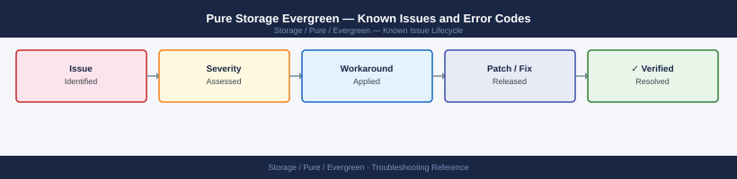

---
tags:
  - troubleshooting
  - evergreen
  - pure-storage
  - known-issues
---
# Pure Storage Evergreen — Known Issues and Error Codes

Evergreen is a commercial subscription program — it has no dedicated software or appliance. All operational known issues are tracked in the underlying array (FlashArray or FlashBlade) known-issues pages. This page covers Evergreen-specific subscription and upgrade process issues.

*Applies to: Evergreen//Forever, Evergreen//Flex*

## Before you begin

- Evergreen is a subscription program — all operational port/software issues are tracked against the underlying FlashArray or FlashBlade hardware.
- For controller swap scheduling or upgrade process questions, contact **Pure Storage Customer Success**.

## Upgrade Process Issues

| Error / Symptom | Affected Versions | Cause | Workaround / Fix | Fixed In |
|---|---|---|---|---|
| Controller swap window missed — array shows old controller | Any | Pure scheduling gap; controller not swapped during agreed maintenance window | Contact Pure Customer Success to reschedule controller swap | N/A |
| `Cannot upgrade — Pure1 connectivity required` message | Purity 6.x | Non-disruptive controller upgrade requires active phone-home | Restore Pure1 connectivity (TCP 443 to pure1.purestorage.com); retry upgrade scheduling | N/A |

## See also

- [Pure Storage FlashArray — Known Issues](../../flasharray/troubleshooting/known-issues.md)
- [Pure Storage FlashBlade — Known Issues](../../flashblade/troubleshooting/known-issues.md)
- [Pure1 — Known Issues](../../pure1/troubleshooting/known-issues.md)
