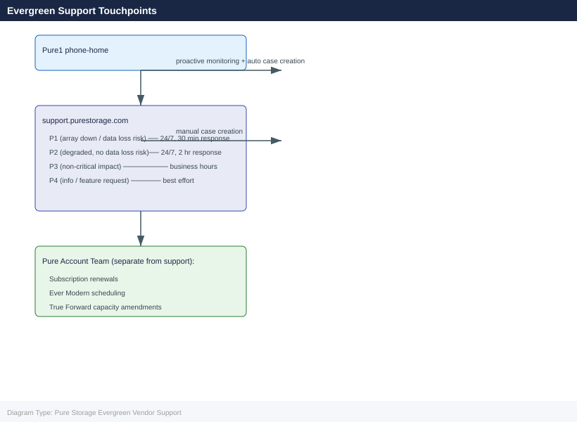
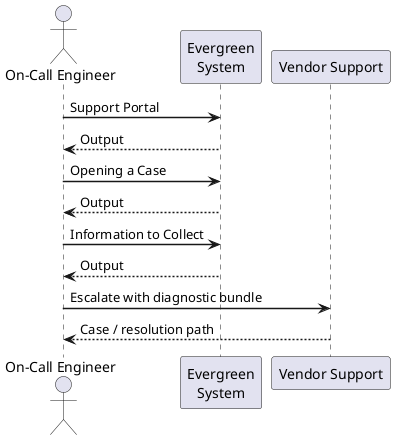

---
tags:
  - pure
---
# Pure Storage Evergreen Vendor Support

<div class="kb-summary">
Pure Storage Evergreen Vendor Support reference covering Support Portal, Opening a Case, Information to Collect, SLA Tiers, Escalation Path.

*Applies to: Evergreen*
</div>





## Support Portal

Pure Storage support is accessed through the support portal at **https://support.purestorage.com**.

All arrays under an Evergreen subscription have phonehome telemetry active via Pure1 (https://pure1.purestorage.com). Pure1 provides a unified view of array health, open support cases, subscription status, and lifecycle milestones. For hardware faults detected by phonehome, Pure1 can automatically open a support case and initiate part dispatch — for many hardware failures, a replacement arrives before the customer is aware of the fault.

Ensure phonehome is active at all times. To verify:

```bash
purearray phonehome --status
```


```text title="Expected output"
Phone Home Status Report
========================
Status: ENABLED
Last Phone Home: 2024-01-15 14:32:18 UTC
Next Scheduled Phone Home: 2024-01-22 14:32:18 UTC
Phone Home Proxy: proxy.internal.company.com:8080
Connectivity: ONLINE
Last Successful Transmission: 2024-01-15 14:32:45 UTC
Data Collected: 2.3 MB
Transmission Success Rate: 99.8%
Last Error: None
```

!!! warning "Common errors"
    **`purearray: command not found`** — Ensure the Pure Storage CLI tools are installed and the PATH includes the installation directory (typically `/opt/purearray/bin`).
    **`Error: Unable to connect to array management interface`** — Verify network connectivity to the array's management IP and that SSH credentials are properly configured.
    **`Phone Home service is DISABLED`** — Run `purearray phonehome --enable` to activate phone home functionality for vendor support.
## Opening a Case

When opening a case manually through the support portal or by phone, provide:

| Field | How to Obtain |
|---|---|
| Array serial number | `purearray list` or Purity GUI > System > Array |
| Purity//FA version | `purearray list` — look for the `version` field |
| Subscription entitlement ID | Pure1 > Subscription dashboard — the contract or subscription reference number |
| Symptom description | Clear description of what is failing, when it started, and what changed |
| Impact severity | Production down, degraded, or non-critical — set accurately to receive correct SLA response |

For controller refresh or Ever Modern scheduling issues, also have the subscription renewal date and the current controller generation ready.

## Information to Collect

Run the following before or immediately after opening a case:

```bash
# Array identity and Purity version
purearray list

# Full diagnostic bundle (Pure Support can pull via phonehome)
purediag

# All active alerts
purealert list

# Drive health and status
puredrive list

# Capacity usage summary
purearray list --space

# Controller and hardware component status
purearray list --hardware

# Host path and connection status
purehostconnection list

# Replication pod and ActiveCluster status
purepod list
```


```text title="Expected output"
Name                          Version           Revision
purearray-prod-01             6.4.2.0           20240115_165432

Name      Status    Capacity      Used          Available     Snapshots
purearray Healthy   102.4 TB      67.8 TB       34.6 TB       18.2 TB

AlertId    Severity    Component         Message                              Timestamp
alert-442  warning     controller-1      Temperature threshold approaching    2024-01-15 14:32:18
alert-441  info        drive-slot-12     Predictive failure detected          2024-01-15 13:45:22

Slot    Status      Capacity      Model              Serial
0       Healthy     3.84 TB       PURE-SSD-NVMe-4   PFE2K4B001A2
1       Healthy     3.84 TB       PURE-SSD-NVMe-4   PFE2K4B001A3
2       Degraded    3.84 TB       PURE-SSD-NVMe-4   PFE2K4B001A4
...

Controller    Status      Model              Temp(C)    FanSpeed
controller-0  Healthy     FA-m70-2U          38         45%
controller-1  Healthy     FA-m70-2U          42         52%

Host                    Connection    Status      Paths
esx-host-01.prod        FC            Connected   4
esx-host-02.prod        FC            Connected   4
esx-host-03.prod        iSCSI         Connected   2
...

PodName              Status      Replication    ActiveCluster
pod-us-east-01       Synced      Healthy        primary
pod-us-west-01       Synced      Healthy        secondary
```

!!! warning "Common errors"
    **`purearray: command not found`** — Install the Pure Storage CLI tools or ensure the PATH includes the Pure management tools directory.
    **`Error: Array unreachable at 192.168.1.100`** — Verify network connectivity to the array management IP and confirm credentials are set via `pureauthenticate`.
    **`Error: Insufficient privileges for this operation`** — Ensure your user account has the required Pure Storage role permissions (typically "Administrator" or "Operator").
Attach `purediag` output to the case if phonehome is offline. If phonehome is active, inform the support engineer that the diagnostic bundle is available for remote pull.

## SLA Tiers

| Priority | Response Time | Description |
|---|---|---|
| P1 | 1 hour, 24x7 | Production system down or critically impaired; no workaround available |
| P2 | 4 hours, 24x7 | Production system degraded with a workaround in place; operation is impacted |
| P3 | Next business day | Non-critical issue; system operational with minor or no user impact |
| P4 | Best effort | General enquiry, feature request, or documentation question |

Follow P1 and P2 case submissions with a direct phone call to the Pure Support line to ensure immediate engineer engagement.

## Escalation Path

**Standard escalation — within a case:**

1. Request escalation to a duty manager through the support portal or by asking the support engineer — this triggers senior support resource assignment
2. For sustained or complex incidents, ask the support engineer to engage a Pure Solutions Architect or senior engineer for additional expertise

**Customer Success Manager (CSM):**

Evergreen subscriptions include a dedicated CSM. The CSM is the primary point of contact for:

- Subscription lifecycle issues (renewal, True Forward, controller refresh scheduling)
- Escalating unresolved support cases to Pure management
- Quarterly business reviews and capacity planning discussions
- Advocacy for feature requests or prioritisation within Pure's product roadmap

Contact your CSM directly for any subscription-related concern rather than routing through the support portal. For major incidents impacting production, the CSM can mobilise account team and engineering resources in parallel with the support case.

**Pure TAM (Technical Account Manager):**

Customers with a TAM engagement can escalate major incidents to the TAM for cross-functional coordination across support, engineering, and account management.
