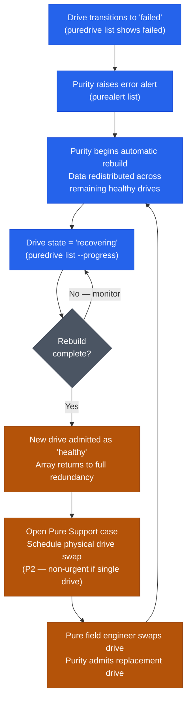
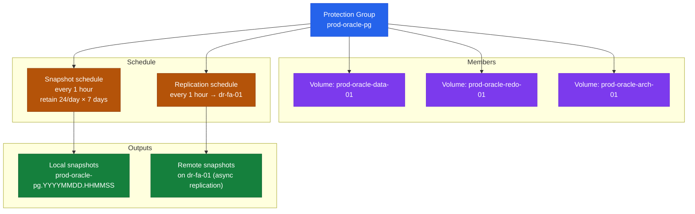

# FlashArray — Components

## Hardware Components

### Controllers (CT0, CT1)

FlashArray ships with two controllers in every chassis, designated CT0 and CT1. Both controllers are active simultaneously — there is no hot-standby controller. Each runs a complete instance of Purity//FA OS and both serve host I/O at all times, with volume ownership distributed across the pair using ALUA (Asymmetric Logical Unit Access).

Controller hardware varies by model generation, but each controller includes:

- Multi-core Intel or AMD CPUs dedicated to Purity OS processes
- NVMe-attached NVRAM (non-volatile write cache) — write acknowledgements are sent to the host only after data is committed to NVRAM on both controllers, providing crash consistency without sacrificing latency
- Internal NVMe fabric connecting the controller to the drive shelf
- Host-facing I/O modules (FC, iSCSI, NVMe/FC, NVMe/RoCE, or NVMe/TCP depending on model and configuration)
- Dedicated management Ethernet port for CLI, GUI, REST API, and Pure1 phone-home
- Dedicated replication Ethernet ports for inter-array replication traffic

**Controller health commands:**

```bash
# Show both controllers, Purity version, and status
purearray list --controller

# Show all hardware including controller components
purehw list --type ct

# Show individual controller hardware detail
purehw list CT0 --spec
purehw list CT1 --spec
```

**Controller failover behaviour:**

If one controller fails — whether due to hardware fault, Purity process crash, or a scheduled NDU (non-disruptive upgrade) restart — the surviving controller takes ownership of all volumes within seconds. Hosts with proper multipathing experience no I/O interruption because the multipath driver automatically promotes the surviving paths. The failed controller reboots automatically and rejoins the active-active pair once Purity confirms it is healthy; volume ownership rebalances back to the original distribution without any manual intervention.

| Condition | Behaviour |
|---|---|
| One controller fails or restarts | Surviving controller owns all volumes; I/O continues for correctly multipathed hosts |
| Both controllers restart simultaneously | I/O pauses until first controller returns; only occurs during an unplanned double failure |
| NDU upgrade | Controllers restart one at a time; non-disruptive for multipathed hosts |
| Controller rejoin after recovery | Volume ownership automatically rebalances; no manual steps required |

---

### NVMe Drives and Drive Shelves

FlashArray //X and //C series use direct-attached NVMe SSDs housed in the primary chassis. Expansion shelves can be added to increase capacity without replacing controllers (Evergreen model).

- **//X series:** TLC NVMe SSDs optimised for high IOPS and low latency (sub-100 µs)
- **//C series:** QLC NVMe SSDs optimised for cost-per-TB; higher sequential throughput, moderate latency
- **//E series:** High-density QLC drives at maximum capacity per chassis; for large-scale consolidation

Drive health is continuously monitored by Purity. A failed drive triggers an automatic rebuild — Purity redistributes the data across the remaining drives using an internal RAID-like mechanism called RAID-HD (or DFM — Direct Flash Module protection depending on generation). The rebuild runs in the background and does not pause host I/O.



```bash
# List all drives and their health state
puredrive list

# Show drive specification (capacity, type, bay location)
puredrive list --spec

# Show drive status with bay location (e.g., CH0.BAY10)
puredrive list CH0.BAY10

# Initiate a drive admission after physical insertion (if not auto-admitted)
puredrive admit
```

**Drive states:**

| State | Meaning | Action |
|---|---|---|
| `healthy` | Drive operating normally | None |
| `recovering` | Purity is rebuilding data to/from this drive | Monitor; do not pull the drive during rebuild |
| `failed` | Drive has failed; Purity has taken it offline | Open a support case; schedule drive replacement |
| `missing` | Drive bay is empty or drive not detected | Verify physical seating; open support case if drive is present but undetected |
| `evicting` | Purity is migrating data off the drive before removal | Wait for eviction to complete before pulling |

---

### NVRAM (Non-Volatile Write Cache)

Each controller contains an NVRAM module — a battery-backed (or capacitor-backed) write cache. All host write I/O is acknowledged only after data has been written to the NVRAM on both controllers. This provides:

- Sub-millisecond write acknowledgement without waiting for flash media writes
- Crash consistency: if a controller fails immediately after acknowledging a write, the surviving controller has the data in its NVRAM and will destage it to flash
- Symmetric write latency regardless of which controller owns the volume

NVRAM health is monitored by Purity and reported via `purehw list --type nvram`.

---

### Host Interface Modules

FlashArray uses swappable I/O modules in each controller to provide host-facing connectivity. The available module types depend on the array model:

| Module Type | Protocol | Port Speed | Notes |
|---|---|---|---|
| FC (16 Gb) | Fibre Channel | 16 Gb/s | Standard SAN fabric; requires FC switches and zoning |
| FC (32 Gb) | Fibre Channel / NVMe/FC | 32 Gb/s | Required for NVMe/FC host connectivity |
| iSCSI / NVMe/TCP | Ethernet | 10 GbE / 25 GbE | IP-based block storage; MTU 9000 recommended |
| NVMe/RoCE | Ethernet (RoCE v2) | 25 GbE / 100 GbE | Lowest latency NVMe-oF over RDMA-capable Ethernet |

Each controller has multiple I/O module bays, allowing mixed protocol support (e.g., FC for production and iSCSI for replication).

```bash
# List all ports with type, speed, and status
pureport list

# FC ports only (for zoning reference — note WWNs)
pureport list --type fc

# Ethernet ports only
pureport list --type eth

# Show hardware component details for FC ports
purehw list --type fc
purehw list CT0.FC0
```

---

### Replication and Management Interfaces

Separate from the host-facing I/O modules, each controller provides dedicated Ethernet interfaces for:

- **Management:** SSH (Purity CLI), HTTPS (Purity GUI and REST API), SNMP, syslog, SMTP (alert relay), and Pure1 phone-home
- **Replication:** Inter-array replication traffic for async protection groups and ActiveCluster synchronous replication

Separating replication and management traffic from host I/O is a best practice — replication traffic can be significant (especially for large data sets or initial seeding) and must not compete with host I/O on the same interfaces.

```bash
# Show all network interfaces (management, replication, iSCSI data)
purenetwork list

# Show DNS configuration
puredns list

# Show NTP configuration
purearray list --ntpserver
```

---

## Software Components

### Purity//FA Operating System

Purity//FA is the operating system running on every FlashArray. It manages all data services — thin provisioning, deduplication, compression, snapshots, replication, and performance QoS — as well as the array's HA state machine, drive management, and phone-home telemetry.

Key Purity data services:

| Service | Description |
|---|---|
| **Thin provisioning** | Volumes consume only the flash capacity they actually use; the allocated size is a logical ceiling |
| **Inline deduplication** | Identical data blocks across all volumes are stored once; deduplication is always-on and requires no configuration |
| **Inline compression** | Data is compressed before being written to flash using a combination of pattern removal and block compression |
| **Snapshots** | Space-efficient, crash-consistent point-in-time copies; no performance impact at creation; writable clones can be made from any snapshot |
| **Protection Groups** | Policy-based snapshot scheduling and async replication targeting; multiple volumes can be grouped under a single PG for consistency |
| **ActiveCluster** | Synchronous replication in a pod construct; RPO=0, transparent active-active access from both sites |
| **ActiveDR** | Async replication for DR; recovery via pod promotion at the DR site |
| **SafeMode** | Admin-delete-locked snapshots; snapshot deletion requires a dual-approval process via Pure Support |
| **QoS** | Per-volume IOPS and bandwidth limits; protects shared workloads from noisy neighbours |

```bash
# Show Purity version and array name
purearray list

# Show array space with data reduction metrics
purearray list --space

# Real-time performance statistics
purearray monitor
purearray monitor --latency
purearray monitor --iops
purearray monitor --bandwidth
```

---

### Pure1 Cloud Management

Pure1 is Pure Storage's SaaS management, monitoring, and AI analytics platform. Every FlashArray phones home to Pure1 over HTTPS (port 443) automatically once registered.

**Core Pure1 capabilities:**

| Capability | Description |
|---|---|
| Fleet-wide health dashboard | Single pane of glass for all registered FlashArrays |
| AI-driven anomaly detection | Pure1 Meta analyses workload patterns and alerts on abnormal latency or capacity trends before they become problems |
| Capacity forecasting | Projects days-to-full for each array based on historical consumption trends |
| Upgrade readiness reporting | Pre-checks array compatibility and flags blockers before a Purity upgrade |
| SLA reporting | For Evergreen//One customers: availability, performance, and ransomware recovery SLA tracking |
| Support integration | Cases opened in the support portal are automatically linked to the array's Pure1 telemetry; support engineers can view diagnostic data without a manual upload |

```bash
# Check phone-home connectivity status
purearray list --phonehome

# Send diagnostic data to Pure Support (for open case)
purearray phonehome send

# Open remote assist tunnel to Pure Support
purearray remoteassist --action open
purearray remoteassist --status
```

---

### SafeMode Snapshots

SafeMode is a data protection feature that makes snapshot retention policies immutable at the array level. Once enabled:

- Protection group snapshot schedules and retention policies cannot be modified or disabled without a dual-approval process involving Pure Support
- Individual snapshots cannot be deleted by any local admin (including `array_admin`) until the retention window expires
- Volume eradication (permanent deletion) requires a delay — SafeMode inserts a minimum eradication timer to prevent immediate data destruction

SafeMode is designed to protect against ransomware attacks where an attacker has gained admin credentials to the array and attempts to destroy backups before encrypting production data.

**Enabling SafeMode:** Contact Pure Support. SafeMode activation requires a Pure Support engineer and cannot be enabled unilaterally from the array CLI or GUI. This is intentional — the dual-approval design ensures that SafeMode cannot be bypassed by a single compromised admin account.

```bash
# Verify SafeMode status
purearray list --safemode
```

> SafeMode is a one-way configuration change for the retention lock. Once a snapshot is locked, it cannot be unlocked by array admins. Plan retention windows carefully before enabling.

---

### Pods (ActiveCluster)

A pod is the logical container for ActiveCluster — Pure's synchronous replication technology. Volumes placed inside a pod are transparently accessible from both arrays in the pod with zero RPO and active-active I/O from both sites. Hosts at either site write to their local array; Purity synchronously replicates every write to the remote array before acknowledging to the host.

**Pod components:**

| Component | Role |
|---|---|
| Pod | Named logical container for volumes and replication state |
| Member arrays | The two FlashArrays participating in the pod (stretched) |
| Purity Mediator | An external tiebreaker service (cloud-hosted or on-premises) that arbitrates which array survives during a split-brain event |
| Failover preference | Optional preference for which array takes full ownership during a planned failover |

```bash
# Create a pod
purepod create oracle-pod

# Stretch the pod to a remote array (initiates synchronous replication)
purepod add --array site-b-fa-01 oracle-pod

# Create a volume inside the pod
purevol create --size 4T oracle-pod::oracle-data-01

# List all pods and their stretch status
purepod list

# Show mediator status for a pod
purepod list --mediator oracle-pod

# Show which array has failover preference
purepod list --failover-preference oracle-pod
```

---

### Protection Groups

Protection groups (PGs) are the primary mechanism for coordinating crash-consistent snapshots and async replication across multiple volumes. A PG can include volumes, host groups, or hosts as members.



```bash
# Create a protection group
purepgroup create prod-oracle-pg

# Add volumes to the protection group
purepgroup addvollist prod-oracle-pg --vollist prod-oracle-data-01,prod-oracle-redo-01

# Set a snapshot schedule (hourly snaps, retain 24/day, keep 7 days)
purepgroup schedule prod-oracle-pg \
    --snap-enabled true \
    --snap-frequency 3600 \
    --snap-per-day 24 \
    --snap-for-days 7

# Add a replication target (async replication to remote array)
purepgroup connect prod-oracle-pg --target dr-fa-01

# Set replication schedule
purepgroup schedule prod-oracle-pg \
    --replicate-enabled true \
    --replicate-frequency 3600

# List all protection groups and schedules
purepgroup list
purepgroup list --schedule

# Take an on-demand snapshot of a protection group
purepgroup snap --pgroup prod-oracle-pg --suffix premigration-$(date +%Y%m%d)

# List protection group snapshots
purepgroup listsnaps prod-oracle-pg
```
