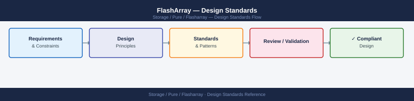

---
tags:
  - architecture
  - pure
---
# FlashArray — Design Standards

FlashArray design standards — host group naming conventions, volume layout, protection group design, and replication architecture.

*Applies to: FlashArray Purity 6.x*

FlashArray Design Checklist — Key Areas

For Linux DM-Multipath, use the Pure Storage recommended `multipath.conf` settings (available from Pure Support): `path_grouping_policy multibus`, `path_checker tur`, `failback immediate`, `no_path_retry 18`.

---

## See also

- [FlashArray — How It Works](../how-it-works/)
- [FlashArray — Integrations](../integrations/)
- [FlashArray — Deploy](../../deploy/)
