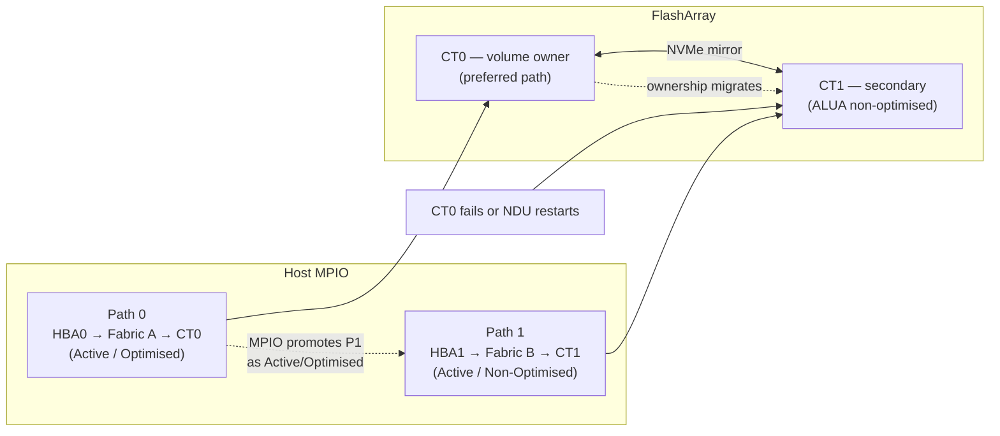

# FlashArray — How It Works


<div class="kb-summary">
How It Works reference covering Overview, HA Topology, ActiveCluster (Pods), Protection Groups, SafeMode.
</div>

## Overview

Pure Storage FlashArray is an all-flash block storage platform running Purity//FA OS. It is purpose-built for block workloads — databases, virtualisation, and latency-sensitive applications — and is designed around three core principles: all-flash always (no spinning disk tiering), active-active dual-controller high availability with no single point of failure, and non-disruptive operations including upgrades, hardware replacement, and capacity expansion.

FlashArray ships in three product lines:

- **//X series** — NVMe-based, highest performance; targets Tier-1 databases and NVMe/FC or NVMe/RoCE workloads
- **//C series** — QLC NAND, capacity-optimised; targets secondary workloads, backup staging, and dev/test at lower cost per TB
- **//E series** — Maximum density with high-capacity QLC drives; targets large-scale consolidation at the lowest $/TB

All models share the same Purity//FA OS, the same CLI and REST API surface, and the same operational model.

## HA Topology

FlashArray operates in an active-active dual-controller configuration. Both CT0 and CT1 serve host I/O simultaneously — there is no standby controller. Volume ownership is distributed across both controllers; load balancing occurs via ALUA (Asymmetric Logical Unit Access).

**Failover behaviour:**

1. If one controller fails (hardware fault, NDU restart, or Purity upgrade), the surviving controller takes ownership of all volumes within seconds.
2. Hosts with proper multipathing (at least two active paths, one to each controller) experience no I/O interruption — the multipath driver promotes the surviving paths immediately.
3. The failed controller reboots automatically and rejoins the active-active pair once healthy; volume ownership rebalances back.
4. There is no manual intervention required for controller failover or rejoin under normal circumstances.

**Requirements for zero-impact failover:**

- Every host must have at least two HBAs or NICs connected to the array, one per controller
- Fabric zoning (FC) or iSCSI network design must ensure paths reach both CT0 and CT1
- Host multipath driver (DM-Multipath, Windows MPIO, or VMware PSP) must be active and configured for ALUA


```
┌─────────────────────────────────── Pure FlashArray — How It Works ────────────────────────────────────┐
│                                                                                                       │
│   ┌───────────────────────────────────────────────────────────────────────────────────────────────┐   │
│   │         Write I/O Path: Host to HBA to Controller to NVRAM to Dedup/Compress to Flash         │   │
│   │           Step 1: Host writes LUN; controller receives I/O on FC / iSCSI / NVMe port          │   │
│   │         Step 2: Write lands in NVRAM on active CT; mirrored to peer CT via NVRAM link         │   │
│   │          Step 3: ACK returned to host after NVRAM mirror; data is durable before ACK          │   │
│   │     Step 4: Purity destages NVRAM to DirectFlash: hash dedup then compress then write DFM     │   │
│   └───────────────────────────────────────────────────────────────────────────────────────────────┘   │
│                                                                                                       │
│    Host sees < 1 ms latency; NVRAM absorbs burst while destage happens asynchronously                 │
│                                                                                                       │
│                  ▼                                ▼                                ▼                  │
│                                                                                                       │
│   ┌─────────────────────────────┐  ┌─────────────────────────────┐  ┌─────────────────────────────┐   │
│   │      NVRAM Write Buffer     │  │   Dedup / Compress Engine   │  │   DirectFlash (DFM) Layer   │   │
│   │      CT0 NVRAM: primary     │  │ Global hash: SHA fingerprint│  │  NVMe-native: no FTL layer  │   │
│   │    CT1 NVRAM: mirror copy   │  │  Pattern: zero-block detect │  │ DFM wear-levelled by Purity │   │
│   │   ACK: after both mirrors   │  │   LZ4: inline compression   │  │   Hot/warm/cold data tiers  │   │
│   │ Capacitor backup: safe flush│  │    Reduction: 4:1 typical   │  │    NAND: MLC/QLC modules    │   │
│   │    NVRAM drain on destage   │  │  Written unique chunks only │  │   SSD life: Purity manages  │   │
│   └─────────────────────────────┘  └─────────────────────────────┘  └─────────────────────────────┘   │
│                                                                                                       │
│    HA failover: CT0 fails, CT1 takes all I/O; NVRAM safe; < 30 s transparent failover                 │
│                                                                                                       │
│                  ▼                                ▼                                ▼                  │
│                                                                                                       │
│   ┌───────────────────────────────────────────────────────────────────────────────────────────────┐   │
│   │    Write Path    │    Read Path     │    HA Failover    │   Dedup Stats    │    CLI Verify    │   │
│   │ Host to CT NVRAM │  CT to DFM read  │ CT0 heartbeat lost│ puredataset list │  purearray get   │   │
│   │Mirror to peer CT │ Cache hit first  │   CT1 takes over  │ Data reduction % │purearray monitor │   │
│   │   ACK to host    │  NVRAM prefetch  │     < 30 s RTO    │  Unique data GB  │  puredrive list  │   │
│   │ Destage to flash │No rebuild needed │  Transparent host │ Space savings %  │ purevolume list  │   │
│   └───────────────────────────────────────────────────────────────────────────────────────────────┘   │
│                                                                                                       │
│  Physical Infrastructure (the hardware everything above runs on):                                     │
│  CT0 + CT1 controllers · NVRAM DIMMs · DirectFlash modules · SAS/NVMe shelf interconnect · FC switch  │
│                                                                                                       │
│  Key terms:                                                                                           │
│                                                                                                       │
│  NVRAM mirror  = Synchronous mirror of write buffer between CT0 and CT1 before host ACK               │
│  Destage       = Process of draining NVRAM writes to flash; runs continuously in background           │
│  Inline dedup  = Deduplication applied on every I/O before write; global hash fingerprint             │
│  LZ4           = Compression algorithm used by Purity; fast, low-CPU, good ratio on block data        │
│  DFM           = DirectFlash Module; Pure-custom NVMe SSD with no FTL overhead layer                  │
│  FTL           = Flash Translation Layer; removed in DFM so Purity handles flash mapping directly     │
│  Data reduction= Ratio of logical written to physical flash used; includes dedup + compression        │
│  Capacitor     = Backup power on NVRAM; ensures safe flush to flash on power loss                     │
│  HA failover   = Automatic controller failover; CT1 adopts all I/O from failed CT0 within 30 s        │
│  Read path     = Reads served from NVRAM cache or DirectFlash; no read penalty from dedup             │
│  Zero-block    = Pattern-detected zero blocks stored as metadata only; highest dedup ratio            │
│  Heartbeat     = Inter-controller health signal; loss triggers failover to surviving controller       │
│                                                                                                       │
└───────────────────────────────────────────────────────────────────────────────────────────────────────┘
```

## Protection Groups

Protection groups coordinate crash-consistent snapshots and async replication across multiple volumes.

```bash
purepgroup create prod-oracle-pg
purepgroup addvollist prod-oracle-pg --vollist prod-oracle-data-01,prod-oracle-redo-01
purepgroup schedule prod-oracle-pg --snap-enabled true --snap-frequency 3600 --snap-for-days 7
purepgroup connect prod-oracle-pg --target dr-fa-01
purepgroup snap --pgroup prod-oracle-pg --suffix premigration-$(date +%Y%m%d)
purepgroup list --schedule
```

## SafeMode

SafeMode makes snapshot retention policies immutable at the array level. Once enabled, protection group schedules and retention policies cannot be modified without a dual-approval process via Pure Support, and individual snapshots cannot be deleted by any local admin until the retention window expires. Designed to protect against ransomware attacks where an attacker has gained admin credentials.

**Enabling SafeMode:** contact Pure Support — activation requires a Pure Support engineer and cannot be done from the CLI. This is intentional.

```bash
purearray list --safemode   # verify SafeMode status
```
