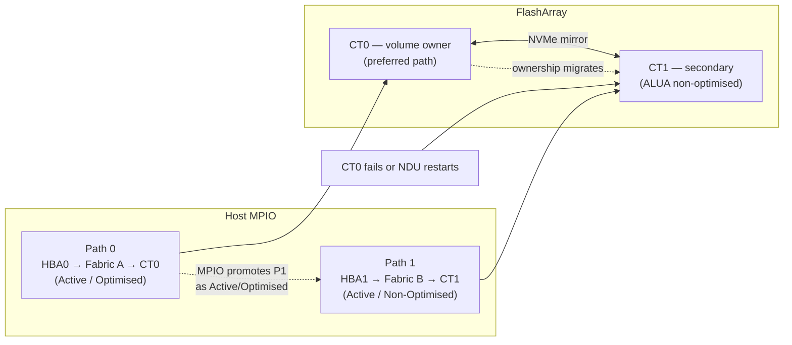

# FlashArray — How It Works

## Overview

Pure Storage FlashArray is an all-flash block storage platform running Purity//FA OS. It is purpose-built for block workloads — databases, virtualisation, and latency-sensitive applications — and is designed around three core principles: all-flash always (no spinning disk tiering), active-active dual-controller high availability with no single point of failure, and non-disruptive operations including upgrades, hardware replacement, and capacity expansion.

FlashArray ships in three product lines:

- **//X series** — NVMe-based, highest performance; targets Tier-1 databases and NVMe/FC or NVMe/RoCE workloads
- **//C series** — QLC NAND, capacity-optimised; targets secondary workloads, backup staging, and dev/test at lower cost per TB
- **//E series** — Maximum density with high-capacity QLC drives; targets large-scale consolidation at the lowest $/TB

All models share the same Purity//FA OS, the same CLI and REST API surface, and the same operational model.

## HA Topology

```
  ┌─────────────────────────────────────────────────────────────────────┐
  │                     FlashArray Chassis                              │
  │                                                                     │
  │  ┌────────────────────┐  NVMe fabric  ┌────────────────────┐       │
  │  │     CT0            ├───────────────┤     CT1            │       │
  │  │  (Controller 0)    │  mirror/sync  │  (Controller 1)    │       │
  │  │  FC / iSCSI / NVMe │               │  FC / iSCSI / NVMe │       │
  │  └─────────┬──────────┘               └──────────┬─────────┘       │
  │            │                                     │                 │
  │  ┌─────────▼─────────────────────────────────────▼─────────┐       │
  │  │                    NVMe / SSD Drive Shelf                │       │
  │  └──────────────────────────────────────────────────────────┘       │
  └──────────────┬────────────────────────────────┬────────────────────┘
                 │ FC / NVMe-oF / iSCSI            │ FC / NVMe-oF / iSCSI
        ┌────────▼────────┐                ┌──────▼──────────┐
        │   FC Switch A   │                │   FC Switch B   │
        └────────┬────────┘                └───────┬─────────┘
                 │                                 │
         ┌───────▼─────────────────────────────────▼───────┐
         │  ESXi-01   ESXi-02   DB-01   DB-02   APP-01     │
         │   HBA0      HBA0     HBA0    HBA0    HBA0       │
         │   HBA1      HBA1     HBA1    HBA1    HBA1       │
         └─────────────────────────────────────────────────┘
                         Host Layer (MPIO / ALUA)
```

FlashArray operates in an active-active dual-controller configuration. Both CT0 and CT1 serve host I/O simultaneously — there is no standby controller. Volume ownership is distributed across both controllers; load balancing occurs via ALUA (Asymmetric Logical Unit Access).

**Failover behaviour:**

1. If one controller fails (hardware fault, NDU restart, or Purity upgrade), the surviving controller takes ownership of all volumes within seconds.
2. Hosts with proper multipathing (at least two active paths, one to each controller) experience no I/O interruption — the multipath driver promotes the surviving paths immediately.
3. The failed controller reboots automatically and rejoins the active-active pair once healthy; volume ownership rebalances back.
4. There is no manual intervention required for controller failover or rejoin under normal circumstances.

**Requirements for zero-impact failover:**

- Every host must have at least two HBAs or NICs connected to the array, one per controller
- Fabric zoning (FC) or iSCSI network design must ensure paths reach both CT0 and CT1
- Host multipath driver (DM-Multipath, Windows MPIO, or VMware PSP) must be active and configured for ALUA



## Connectivity

| Protocol | Media | Port Speed | Notes |
|---|---|---|---|
| FC | Fibre Channel | 16 Gb / 32 Gb | Traditional SAN fabric; requires FC switches and zoning |
| iSCSI | Ethernet | 10 GbE / 25 GbE | IP-SAN; jumbo frames (MTU 9000) recommended |
| NVMe/FC | Fibre Channel | 32 Gb | NVMe-oF over FC; requires NVMe-capable HBAs and FC switches |
| NVMe/RoCE | Ethernet (RoCE v2) | 25 GbE / 100 GbE | NVMe-oF over RDMA Ethernet; requires RoCE-capable NICs |
| NVMe/TCP | Ethernet | 25 GbE / 100 GbE | NVMe-oF over standard TCP/IP; no special fabric required |

Network requirements: management on dedicated 1/10 GbE; replication on dedicated VLAN (10 GbE minimum); iSCSI data with MTU 9000 end-to-end; Pure1 phone-home via outbound HTTPS (443) to `*.purestorage.com`.

## Purity//FA Data Services

| Service | Description |
|---|---|
| Thin provisioning | Volumes consume only actual flash capacity; allocated size is a logical ceiling |
| Inline deduplication | Identical blocks across all volumes stored once; always-on, no configuration required |
| Inline compression | Data compressed before flash write using pattern removal and block compression |
| Snapshots | Space-efficient, crash-consistent point-in-time copies; writable clones available from any snapshot |
| Protection Groups | Policy-based snapshot scheduling and async replication; multiple volumes grouped for consistency |
| ActiveCluster | Synchronous replication in a pod; RPO=0, active-active access from both sites |
| ActiveDR | Async replication for DR; recovery via pod promotion at DR site |
| SafeMode | Admin-delete-locked snapshots; deletion requires dual-approval via Pure Support |
| QoS | Per-volume IOPS and bandwidth limits; protects shared workloads from noisy neighbours |

```bash
purearray list --space     # capacity and data reduction metrics
purearray monitor          # real-time performance (latency, IOPS, bandwidth)
purearray monitor --latency
```

## ActiveCluster (Pods)

A pod is the logical container for ActiveCluster synchronous replication. Volumes inside a pod are transparently accessible from both arrays with zero RPO — Purity synchronously replicates every write to the remote array before acknowledging to the host. A Purity Mediator tiebreaker service arbitrates split-brain events.

```bash
purepod create oracle-pod
purepod add --array site-b-fa-01 oracle-pod   # stretch to remote array
purevol create --size 4T oracle-pod::oracle-data-01
purepod list                                   # show pods and stretch status
purepod list --mediator oracle-pod             # mediator connectivity status
purepod list --failover-preference oracle-pod
```

## Protection Groups

Protection groups coordinate crash-consistent snapshots and async replication across multiple volumes.

```bash
purepgroup create prod-oracle-pg
purepgroup addvollist prod-oracle-pg --vollist prod-oracle-data-01,prod-oracle-redo-01
purepgroup schedule prod-oracle-pg --snap-enabled true --snap-frequency 3600 --snap-for-days 7
purepgroup connect prod-oracle-pg --target dr-fa-01
purepgroup snap --pgroup prod-oracle-pg --suffix premigration-$(date +%Y%m%d)
purepgroup list --schedule
```

## SafeMode

SafeMode makes snapshot retention policies immutable at the array level. Once enabled, protection group schedules and retention policies cannot be modified without a dual-approval process via Pure Support, and individual snapshots cannot be deleted by any local admin until the retention window expires. Designed to protect against ransomware attacks where an attacker has gained admin credentials.

**Enabling SafeMode:** contact Pure Support — activation requires a Pure Support engineer and cannot be done from the CLI. This is intentional.

```bash
purearray list --safemode   # verify SafeMode status
```
