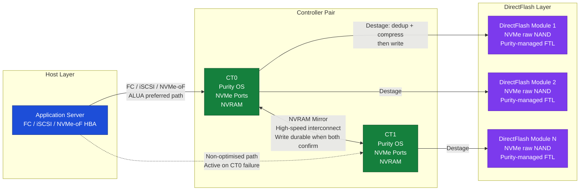
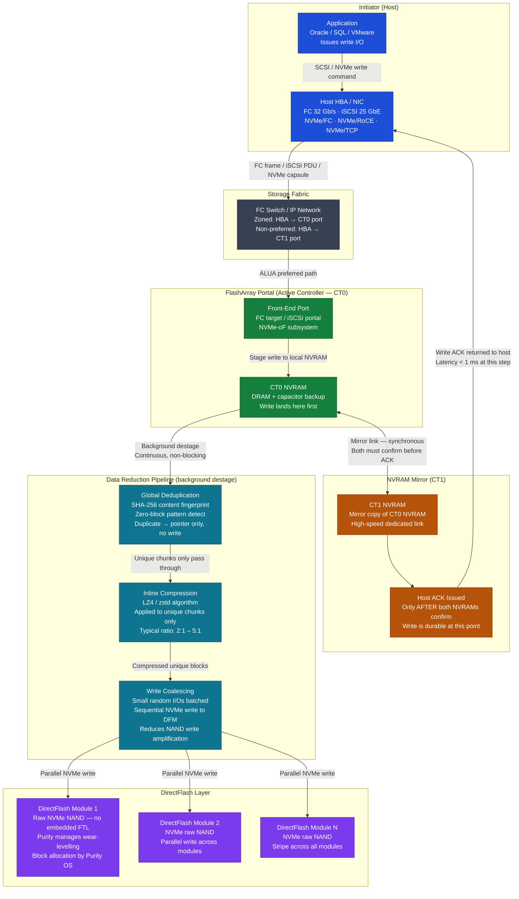

# Pure FlashArray — How It Works


<div class="kb-summary">
Internal architecture and data-path reference: controller pair, NVRAM write path, Purity data reduction pipeline, read/write paths, Protection Groups, ActiveDR, ActiveCluster, and host connectivity.
</div>

## Architecture Overview

FlashArray is an all-NVMe (FA//X and FA//C) or all-flash (FA//m) block storage array built on a dual-controller, active-active architecture. There is no concept of a primary and secondary controller — both CT0 and CT1 serve host I/O simultaneously at all times. The array is designed so that any single hardware failure (a controller, a DirectFlash Module, an NVMe shelf, or a port) does not interrupt host I/O.

The three product lines share the same Purity//FA operating environment and the same management surface:

| Product Line | Media | Primary Use Case |
|---|---|---|
| FA//X | NVMe TLC NAND | Tier-1 databases, latency-sensitive workloads, NVMe-oF |
| FA//C | NVMe QLC NAND | Secondary storage, backup staging, dev/test |
| FA//E | High-capacity QLC | Large-scale consolidation at lowest $/TB |

DirectFlash Modules (DFMs) are the distinguishing hardware element of FA//X. Unlike standard SSDs, DFMs expose raw NAND directly via PCIe/NVMe, bypassing the embedded Flash Translation Layer (FTL). Purity manages flash wear-levelling, garbage collection, and block allocation at the OS level — giving it full visibility and control over the flash media, which eliminates write amplification introduced by a conventional SSD controller.

## Controller Architecture

Each FlashArray contains exactly two controllers: CT0 and CT1. They share access to the same NVMe shelves or DirectFlash Modules through a dual-ported NVMe fabric on the backplane.

Key hardware components per controller:

| Component | Role |
|---|---|
| Multi-core CPU | Runs Purity//FA OS; handles I/O scheduling, deduplication, compression, and management |
| NVRAM (DRAM + capacitor) | Write buffer; absorbs incoming writes before destage to flash |
| NVRAM mirror interconnect | High-speed dedicated link between CT0 and CT1; synchronises NVRAM in real time |
| NVMe host ports | FC, iSCSI, or NVMe-oF ports presented to hosts |
| Capacitor backup | Protects in-flight NVRAM data on power loss; ensures safe flush to flash |

The NVRAM mirror is the durability guarantee. A host write is acknowledged only after both CT0 and CT1 have recorded the write in their respective NVRAMs. If a controller fails mid-write, the surviving controller holds a complete copy of all pending writes and serves I/O without interruption.

## Purity Operating Environment

Purity//FA is the operating system that runs on both controllers. It is a purpose-built storage OS — not a general-purpose Linux distribution — tuned entirely for flash I/O patterns. Core responsibilities:

- **I/O scheduling** — distributes I/O across both controllers and all DFMs; balances load dynamically
- **Inline data reduction** — deduplication and compression on every write before data hits flash
- **Thin provisioning** — volumes consume physical capacity only for written data; overprovisioning is expected
- **Protection Groups** — defines snapshot consistency groups and async replication schedules
- **Replication** — ActiveDR (async) and ActiveCluster (sync) replication to remote arrays
- **REST API** — all management operations are available via versioned REST; the GUI and CLI are API consumers
- **Pure1 integration** — telemetry, capacity forecasting, and AI-driven support sent to Pure's cloud analytics platform

Non-disruptive upgrades (NDU) of Purity are performed by restarting one controller at a time. The surviving controller carries all I/O while the other upgrades, then roles reverse. The host experiences no I/O interruption if multipathing is correctly configured.

## Data Reduction Pipeline

All writes pass through the data reduction pipeline in Purity before touching flash media. The pipeline is inline — it runs synchronously on the write path, not as a background post-process.

```text
┌─────────────────────────────────── Pure FlashArray — How It Works ────────────────────────────────────┐
│                                                                                                       │
│   ┌───────────────────────────────────────────────────────────────────────────────────────────────┐   │
│   │         Write I/O Path: Host to HBA to Controller to NVRAM to Dedup/Compress to Flash         │   │
│   │           Step 1: Host writes LUN; controller receives I/O on FC / iSCSI / NVMe port          │   │
│   │         Step 2: Write lands in NVRAM on active CT; mirrored to peer CT via NVRAM link         │   │
│   │          Step 3: ACK returned to host after NVRAM mirror; data is durable before ACK          │   │
│   │     Step 4: Purity destages NVRAM to DirectFlash: hash dedup then compress then write DFM     │   │
│   └───────────────────────────────────────────────────────────────────────────────────────────────┘   │
│                                                                                                       │
│    Host sees < 1 ms latency; NVRAM absorbs burst while destage happens asynchronously                 │
│                                                                                                       │
│                  ▼                                ▼                                ▼                  │
│                                                                                                       │
│   ┌─────────────────────────────┐  ┌─────────────────────────────┐  ┌─────────────────────────────┐   │
│   │      NVRAM Write Buffer     │  │   Dedup / Compress Engine   │  │   DirectFlash (DFM) Layer   │   │
│   │      CT0 NVRAM: primary     │  │ Global hash: SHA fingerprint│  │  NVMe-native: no FTL layer  │   │
│   │    CT1 NVRAM: mirror copy   │  │  Pattern: zero-block detect │  │ DFM wear-levelled by Purity │   │
│   │   ACK: after both mirrors   │  │   LZ4: inline compression   │  │   Hot/warm/cold data tiers  │   │
│   │ Capacitor backup: safe flush│  │    Reduction: 4:1 typical   │  │    NAND: MLC/QLC modules    │   │
│   │    NVRAM drain on destage   │  │  Written unique chunks only │  │   SSD life: Purity manages  │   │
│   └─────────────────────────────┘  └─────────────────────────────┘  └─────────────────────────────┘   │
│                                                                                                       │
│    HA failover: CT0 fails, CT1 takes all I/O; NVRAM safe; < 30 s transparent failover                 │
│                                                                                                       │
│                  ▼                                ▼                                ▼                  │
│                                                                                                       │
│   ┌───────────────────────────────────────────────────────────────────────────────────────────────┐   │
│   │    Write Path    │    Read Path     │    HA Failover    │   Dedup Stats    │    CLI Verify    │   │
│   │ Host to CT NVRAM │  CT to DFM read  │ CT0 heartbeat lost│ puredataset list │  purearray get   │   │
│   │Mirror to peer CT │ Cache hit first  │   CT1 takes over  │ Data reduction % │purearray monitor │   │
│   │   ACK to host    │  NVRAM prefetch  │     < 30 s RTO    │  Unique data GB  │  puredrive list  │   │
│   │ Destage to flash │No rebuild needed │  Transparent host │ Space savings %  │ purevolume list  │   │
│   └───────────────────────────────────────────────────────────────────────────────────────────────┘   │
│                                                                                                       │
│  Physical Infrastructure (the hardware everything above runs on):                                     │
│  CT0 + CT1 controllers · NVRAM DIMMs · DirectFlash modules · SAS/NVMe shelf interconnect · FC switch  │
│                                                                                                       │
│  Key terms:                                                                                           │
│                                                                                                       │
│  NVRAM mirror  = Synchronous mirror of write buffer between CT0 and CT1 before host ACK               │
│  Destage       = Process of draining NVRAM writes to flash; runs continuously in background           │
│  Inline dedup  = Deduplication applied on every I/O before write; global hash fingerprint             │
│  LZ4           = Compression algorithm used by Purity; fast, low-CPU, good ratio on block data        │
│  DFM           = DirectFlash Module; Pure-custom NVMe SSD with no FTL overhead layer                  │
│  FTL           = Flash Translation Layer; removed in DFM so Purity handles flash mapping directly     │
│  Data reduction= Ratio of logical written to physical flash used; includes dedup + compression        │
│  Capacitor     = Backup power on NVRAM; ensures safe flush to flash on power loss                     │
│  HA failover   = Automatic controller failover; CT1 adopts all I/O from failed CT0 within 30 s        │
│  Read path     = Reads served from NVRAM cache or DirectFlash; no read penalty from dedup             │
│  Zero-block    = Pattern-detected zero blocks stored as metadata only; highest dedup ratio            │
│  Heartbeat     = Inter-controller health signal; loss triggers failover to surviving controller       │
│                                                                                                       │
└───────────────────────────────────────────────────────────────────────────────────────────────────────┘
```

Deduplication is global across all volumes in the array — a block written to a database volume that matches a block on a backup volume is stored once. There is no per-volume scope limitation. The data reduction ratio is displayed in real time via the GUI or CLI (`purearray get --space`).

## Read Path

Reads follow a cache-first sequence:

1. Host issues a read request via FC, iSCSI, or NVMe-oF
2. The owning controller checks NVRAM — if the block was recently written and is still in the write buffer, it is served directly from NVRAM (sub-100µs)
3. If not in NVRAM, Purity reads from the DirectFlash Modules via the NVMe fabric
4. Purity decompresses the data on the way out (hardware-accelerated on FA//X)
5. Deduplication is transparent on reads — the dedup hash table maps logical addresses to physical blocks; the host receives assembled data with no extra latency step
6. Data is returned to the host — typical read latency is under 200µs end-to-end

There is no read penalty from deduplication. Reads are served by both controllers simultaneously, with ALUA used to designate preferred and non-preferred paths per volume.

## Write Path

1. Host issues a write via FC, iSCSI, or NVMe-oF to the volume's preferred controller
2. The active controller receives the write and writes it to local NVRAM
3. The NVRAM mirror interconnect replicates the write to the peer controller's NVRAM — this step completes before the host ACK is sent
4. The ACK is returned to the host — at this point the write is durable (survives a controller failure)
5. The background destage process drains NVRAM writes to DirectFlash Modules via the data reduction pipeline described above
6. Destage is continuous and parallel — it does not block new incoming writes

Peak write throughput is bounded by NVRAM size (how much write burst the array can absorb). Sustained write throughput is bounded by flash write bandwidth. On FA//X models with multiple DFMs, sustained write bandwidth is typically in the tens of GB/s range.

## Mermaid Diagram: I/O Architecture



## Protection Groups and Snapshots

A Protection Group (pgroup) defines a set of volumes that must be snapped together to form a crash-consistent point-in-time copy. All volumes in a pgroup are snapped atomically — the snapshot represents the exact same moment for every member volume.

Snapshot behaviour:

- **Instant creation** — snapshots are pointer-based; no data is copied at creation time. A snapshot of 50 TB of volumes takes milliseconds and consumes no additional space at the moment of creation.
- **Space efficiency** — only changed blocks after the snapshot consume additional physical space. Unchanged blocks are shared between the live volume and all snapshots referencing them.
- **Schedules** — pgroups support automated snapshot schedules with configurable frequency and retention period (e.g., hourly for 7 days, daily for 30 days).
- **AsyncDR** — pgroups can be connected to a target FlashArray and replicate snapshots asynchronously for disaster recovery.

Key parameters per pgroup schedule:

| Parameter | Description |
|---|---|
| `snap-frequency` | How often a local snapshot is taken (in seconds) |
| `snap-for-days` | How long local snapshots are retained |
| `replicate-frequency` | How often snapshots are sent to the replication target |
| `replicate-for-days` | How long replicated snapshots are retained on the target |

## ActiveDR and ActiveCluster

Pure provides two tiers of replication, suited to different RPO and RTO requirements.

**ActiveDR (asynchronous)**

- Replicates snapshots asynchronously from a source FlashArray to a target FlashArray
- RPO is configurable — as low as 30 seconds for critical pgroups
- The target volumes are accessible read-only during normal operation
- On failover, an administrator promotes the target volumes to read-write; hosts are remapped to the target array
- Designed for geographic DR where the network between sites has measurable latency

**ActiveCluster (synchronous)**

- Provides synchronous, zero-RPO replication between two FlashArrays across a campus or metropolitan distance (typically <5 ms RTT)
- Uses the Pod construct — a pod contains volumes replicated synchronously across both sites
- Both copies are active simultaneously — hosts at both sites can read and write to the same volumes
- A mediator (hosted in Pure1 cloud or a third site) provides arbitration in the event of a network partition — it prevents split-brain by designating which site should remain active
- On a site failure, the surviving site's FlashArray continues serving I/O with zero data loss and transparent host failover (if the host's multipath software supports ALUA-based path selection)

| Feature | ActiveDR | ActiveCluster |
|---|---|---|
| RPO | ~30 seconds | 0 (synchronous) |
| RTO | Minutes (admin action) | Seconds (automatic) |
| Distance | Any (async) | Typically <5 ms RTT |
| Both sites active | No (target read-only) | Yes (active-active pod) |
| Mediator required | No | Yes |

## Host Connectivity

FlashArray presents volumes as block devices regardless of the host protocol used. All host protocol options are fully supported on the same array hardware simultaneously.

| Protocol | Speed | Notes |
|---|---|---|
| FC | Up to 32 Gb/s | Standard for enterprise SAN; requires FC fabric |
| iSCSI | 10–25 GbE | IP-based; lower cost fabric; suitable for most workloads |
| NVMe/FC | Up to 32 Gb/s | NVMe over Fibre Channel; lowest latency on FC fabrics |
| NVMe/RoCE | 25–100 GbE | NVMe over RDMA; requires RoCE-capable NICs and switches |
| NVMe/TCP | 25 GbE+ | NVMe over TCP; no special hardware required beyond standard Ethernet |

Host configuration guidelines:

- Zone each host HBA to ports on **both** CT0 and CT1 to ensure paths to both controllers
- Configure ALUA on the host multipath driver — this allows FlashArray to designate preferred paths and allows transparent failover on controller restart or NDU
- Pure recommends at least two paths per host, one to each controller; four paths (two per controller) for critical workloads

**Pure1** is Pure Storage's cloud management portal. It ingests telemetry from all registered FlashArrays and provides centralised capacity planning, anomaly detection, AI-driven support case pre-population, and predictive replace notifications for hardware components — without requiring a separate on-premises management VM.

## DirectFlash I/O Path — Write Journey with Inline Data Reduction

The diagram below traces a single host write from the initiator HBA all the way to a DirectFlash Module, showing exactly where inline deduplication and compression occur, how the NVRAM mirror creates the durability guarantee before any ACK is sent, and how the destage pipeline lands data on raw NAND.



Key points illustrated:

- The host ACK is sent only after both CT0 and CT1 NVRAMs have recorded the write — durability is guaranteed before data ever reaches flash
- Deduplication runs first (SHA fingerprint lookup); duplicate blocks never enter the compression or write pipeline at all
- Compression (LZ4/zstd) runs only on unique post-dedup chunks, avoiding wasted CPU cycles on already-known duplicates
- The destage to DirectFlash Modules is entirely background and non-blocking — new host writes continue landing in NVRAM while previous writes drain to flash in parallel
- DirectFlash Modules receive pre-coalesced sequential writes from Purity, which is what eliminates the write-amplification penalty that a conventional SSD FTL would introduce

## Key Terms Glossary

| Term | Definition |
|---|---|
| DirectFlash Module (DFM) | Pure-designed NVMe flash module that exposes raw NAND to Purity, bypassing the standard SSD Flash Translation Layer |
| NVRAM | Non-volatile RAM used as a write buffer on each controller; mirrored to the peer controller before host ACK is sent |
| Purity | The operating system running on FlashArray controllers; handles I/O, data reduction, replication, and management |
| ActiveDR | Pure's asynchronous replication feature; replicates Protection Group snapshots to a remote FlashArray with configurable RPO |
| ActiveCluster | Pure's synchronous replication feature; provides RPO=0 active-active stretched volumes across two FlashArrays |
| Protection Group | A named set of volumes that are snapped together atomically to form a crash-consistent point-in-time copy |
| Snapshot | A pointer-based, instant, space-efficient point-in-time copy of one or more volumes; no data is copied at creation |
| Deduplication | Inline global process that computes a SHA fingerprint per data chunk and stores only one copy of any duplicate chunk |
| Compression | Inline data reduction using LZ4 and zstd algorithms applied to unique (post-dedup) data before it is written to flash |
| Mediator | A third-party arbitration service (hosted in Pure1 or a third site) used by ActiveCluster to prevent split-brain on network partition |
| Pure1 | Pure Storage's cloud analytics and management portal; provides fleet-wide visibility, AI-driven support, and capacity forecasting |
| FlashArray | Pure Storage's block storage platform; available in FA//X (NVMe), FA//C (QLC), and FA//E (high-density) product lines |
