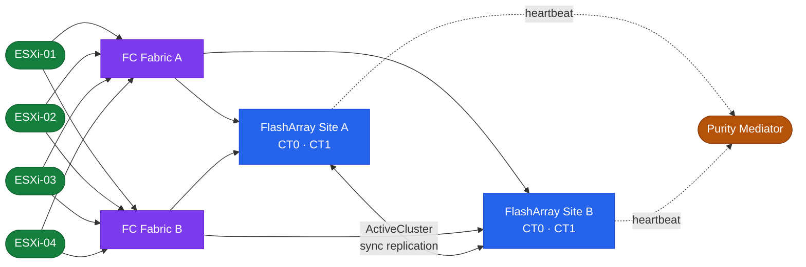

# FlashArray — Architecture

Architecture reference for Pure Storage FlashArray. Covers the dual-controller HA model, product lines (//X/C/E), host connectivity protocols (FC, iSCSI, NVMe-oF), Purity data services, ActiveCluster synchronous replication, and design standards.

<a class="kb-card" href="how-it-works/"><strong>How It Works</strong>HA topology, Purity data services, ActiveCluster, and protection groups.</a>
<a class="kb-card" href="integrations/"><strong>Integrations</strong>VMware, backup tools, Pure1, authentication, and REST API.</a>
<a class="kb-card" href="design-standards/"><strong>Design Standards</strong>Naming conventions, sizing, build baseline, and configuration checklist.</a>

| Model | Flash Type | Target Workload |
|---|---|---|
| FlashArray //X | TLC NVMe | Tier-1 databases, VDI, NVMe/FC or NVMe/RoCE latency-sensitive block |
| FlashArray //C | QLC NVMe | Secondary storage, backup staging, dev/test at lower cost per TB |
| FlashArray //E | High-density QLC | Large-scale consolidation at the lowest $/TB |

All models run Purity//FA OS and share the same dual-controller active-active HA model, CLI, and REST API surface.

