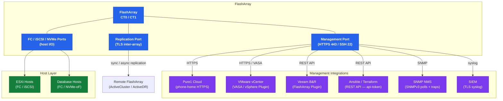

# FlashArray — Integrations

```
FlashArray Integration Map
┌──────────────────────────────────────────────────────────────┐
│                        FlashArray                            │
│  ┌──────────┐  ┌──────────┐  ┌──────────┐  ┌──────────┐      │
│  │ FC/iSCSI │  │  Mgmt    │  │  Repl    │  │  NVMe-oF │      │
│  │ data     │  │  HTTPS   │  │  port    │  │  data    │      │
│  └────┬─────┘  └────┬─────┘  └────┬─────┘  └──────────┘      │
└───────┼─────────────┼─────────────┼──────────────────────────┘
        │             │             │
        ▼             ├──► Pure1 (phone-home HTTPS)
  ESXi / Linux        ├──► vCenter VASA / Plugin
  DB Hosts            ├──► Veeam / Commvault (REST API)
                      ├──► Ansible / Terraform (REST API)
                      ├──► SNMP NMS (SNMPv3)
                      └──► SIEM (TLS syslog)
                      │
                      └──────────────► Remote FlashArray
                                       (ActiveDR / ActiveCluster)
```

## Integration Architecture Overview



## VMware Integration

Pure Storage provides a native vSphere integration stack for FlashArray:

**Pure Storage Plugin for VMware vSphere (vSphere Plugin / PSO):**

- Install the Pure Storage Plugin via VMware Marketplace or directly from Pure Support
- The plugin adds a "Pure Storage" panel in vCenter under the array's management view
- Enables VM-level snapshot management directly from vCenter — create, clone, and recover snapshots per VM without leaving vCenter
- Supports overwrite-protected volume snapshots tied to VM snapshot consistency groups

**VASA (vStorage APIs for Storage Awareness):**

- Register the FlashArray VASA provider in vCenter: `vCenter > Storage Providers > Add` with the FlashArray management IP and credentials
- VASA enables vVols (Virtual Volumes) — each VM's disks become individual FlashArray volumes, enabling per-VM QoS, snapshot, and replication policies
- Required to use vVols datastores; traditional VMFS datastores do not require VASA

**Integration steps:**

1. Create a dedicated service account on FlashArray with `storage_admin` role for vCenter integration
2. Register VASA provider in vCenter using the FlashArray management IP
3. Create a vVols datastore in vCenter pointing to the FlashArray Protocol Endpoint volume
4. Optionally install the vSphere Plugin for enhanced snapshot and management UI
5. Configure VM Storage Policies in vCenter to map workload tiers to FlashArray QoS settings

## Backup Integration

**Veeam Backup & Replication:**

- Install the Veeam Plug-in for Pure Storage FlashArray (available from Pure Support)
- Configure the FlashArray as a storage integration plugin in Veeam's Storage Infrastructure
- Veeam uses FlashArray snapshot APIs to create instant, application-consistent snapshots before backup jobs begin — reduces backup window and eliminates performance impact on production
- Veeam Instant VM Recovery can use FlashArray snapshots as a recovery point source

**Commvault:**

- Commvault IntelliSnap integrates with FlashArray via the REST API
- Configure a FlashArray array instance in Commvault's storage library
- IntelliSnap creates FlashArray snapshots as a pre-backup step, then backs up from the snapshot rather than live data

**Veritas NetBackup:**

- NetBackup Snapshot Client integrates with FlashArray via the NetBackup FlashArray agent
- Configure the FlashArray as a snapshot host; NetBackup orchestrates snapshot creation and backup-from-snapshot workflows

## Pure1 Monitoring

FlashArray phones home to Pure1 automatically over HTTPS (port 443) once registered.

**Phone-home requirements:**
- Outbound HTTPS from FlashArray management interface to `*.purestorage.com`
- If a proxy is required: configure via `purearray setattr --proxy <proxy_url>`

**Pure1 capabilities:**
- Fleet-wide health dashboard, hardware fault detection, and capacity forecasting
- AI-driven performance anomaly detection (Pure1 Meta)
- Upgrade readiness reports and prescriptive upgrade path recommendations
- SLA compliance reporting for Evergreen//One customers
- Support case creation and diagnostic upload integration

**Verify phone-home status:**

```bash
# Check phone-home/support tunnel status on the array
purearray list --phonehome
```

## Authentication

**Active Directory (AD):**

1. Join the FlashArray to AD: `puredirectoryservice setattr --base-dn <base_dn> --bind-user <user> --bind-password <pwd> --domain <domain> --uri ldaps://<dc_ip>`
2. Create admin groups in AD mapped to FlashArray roles (e.g., `purearray-admins` → `array_admin`)
3. Test AD login with a domain account before removing local accounts
4. Configure the group-to-role mapping: `pureadmin setattr --role array_admin --group <ad_group>`

**LDAP (non-AD):**

- Configure LDAP URI, base DN, bind credentials, and user/group attribute mapping under Directory Service settings
- Supports OpenLDAP, Red Hat Directory Server, and similar LDAP providers

**SAML SSO:**

- Supported on Purity//FA 6.x and later
- Configure the FlashArray as a SAML Service Provider in your IdP (Okta, Azure AD, ADFS)
- Export the FlashArray SP metadata and import into the IdP
- Set `puredirectoryservice saml` configuration with IdP metadata URL and certificate

## REST API

**Base URL:** `https://<array_management_ip>/api/<version>/`

Current API version: `2.x` (Purity//FA 6.x uses API 2.x; legacy 1.x also supported for compatibility)

**Authentication:**

```bash
# Obtain an API token (requires local account or AD account with API access)
curl -s -k -X POST "https://<array_ip>/api/login" \
  -H "Content-Type: application/json" \
  -d '{"username":"pureuser","password":"<password>"}' \
  -c /tmp/fa_cookies.txt

# Use the session cookie for subsequent requests
curl -s -k -X GET "https://<array_ip>/api/2.x/arrays" \
  -b /tmp/fa_cookies.txt | jq .

# Alternatively, use an API token directly (recommended for automation)
curl -s -k -X GET "https://<array_ip>/api/2.x/arrays" \
  -H "x-auth-token: <api_token>" | jq .
```

**Generate an API token for a service account:**

```bash
# On the array CLI
pureadmin create --role array_admin svc-monitoring
pureadmin apitoken create svc-monitoring
# Copy the token and store in a secrets manager
```

**Common API calls:**

```bash
# Get array status
GET /api/2.x/arrays

# List volumes
GET /api/2.x/volumes

# List active alerts
GET /api/2.x/alerts?filter=state%3D%27open%27

# Get array capacity
GET /api/2.x/arrays?space=true
```

Full API reference: [Pure Storage API documentation](https://support.purestorage.com/bundle/m_fa_rest_api)
