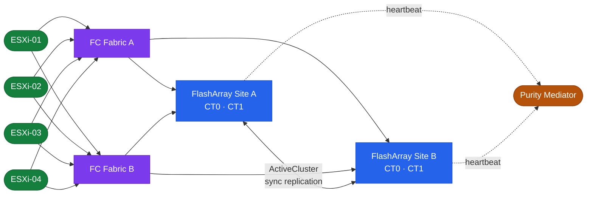
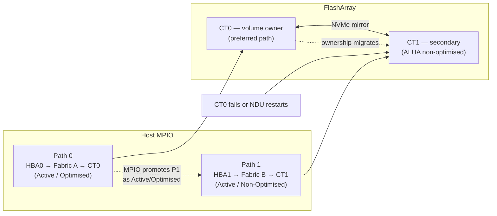

# FlashArray — Overview

## ActiveCluster Topology



## Overview

Pure Storage FlashArray is an all-flash block storage platform running Purity//FA OS. It is purpose-built for block workloads — databases, virtualisation, and latency-sensitive applications — and is designed around three core principles: all-flash always (no spinning disk tiering), active-active dual-controller high availability with no single point of failure, and non-disruptive operations including upgrades, hardware replacement, and capacity expansion.

FlashArray ships in three product lines:

- **//X series** — NVMe-based, highest performance; targets Tier-1 databases and NVMe/FC or NVMe/RoCE workloads
- **//C series** — QLC NAND, capacity-optimised; targets secondary workloads, backup staging, and dev/test at lower cost per TB
- **//E series** — Maximum density with high-capacity QLC drives; targets large-scale consolidation at the lowest $/TB

All models share the same Purity//FA OS, the same CLI and REST API surface, and the same operational model.

## HA Topology

```
  ┌─────────────────────────────────────────────────────────────────────┐
  │                     FlashArray Chassis                              │
  │                                                                     │
  │  ┌────────────────────┐  NVMe fabric  ┌────────────────────┐       │
  │  │     CT0            ├───────────────┤     CT1            │       │
  │  │  (Controller 0)    │  mirror/sync  │  (Controller 1)    │       │
  │  │                    │               │                    │       │
  │  │  FC / iSCSI / NVMe │               │  FC / iSCSI / NVMe │       │
  │  └─────────┬──────────┘               └──────────┬─────────┘       │
  │            │                                     │                 │
  │  ┌─────────▼─────────────────────────────────────▼─────────┐       │
  │  │                    NVMe / SSD Drive Shelf                │       │
  │  └──────────────────────────────────────────────────────────┘       │
  └──────────────┬────────────────────────────────┬────────────────────┘
                 │ FC / NVMe-oF / iSCSI            │ FC / NVMe-oF / iSCSI
        ┌────────▼────────┐                ┌───────▼─────────┐
        │   FC Switch A   │                │   FC Switch B   │
        │  (Fabric A)     │                │  (Fabric B)     │
        └────────┬────────┘                └───────┬─────────┘
                 │                                 │
         ┌───────▼──────────────────────────────────▼──────┐
         │  ESXi-01   ESXi-02   DB-01   DB-02   APP-01     │
         │   HBA0      HBA0     HBA0    HBA0    HBA0       │
         │   HBA1      HBA1     HBA1    HBA1    HBA1       │
         │  (Fabric A) paths ──── (Fabric B) paths         │
         └─────────────────────────────────────────────────┘
                         Host Layer (MPIO / ALUA)
```

FlashArray operates in an active-active dual-controller configuration. Both CT0 and CT1 serve host I/O simultaneously — there is no standby controller. Volume ownership is distributed across both controllers, and load balancing occurs automatically via ALUA (Asymmetric Logical Unit Access).

**Failover behaviour:**

1. If one controller fails (hardware fault, NDU restart, or Purity upgrade), the surviving controller takes ownership of all volumes within seconds.
2. Hosts with proper multipathing (at least two active paths, one to each controller) experience no I/O interruption — the multipath driver promotes the surviving paths immediately.
3. The failed controller reboots automatically and rejoins the active-active pair once healthy; volume ownership rebalances back.
4. There is no manual intervention required for controller failover or rejoin under normal circumstances.

**Requirements for zero-impact failover:**

- Every host must have at least two host bus adapters (HBAs) or NICs connected to the array, one per controller
- Fabric zoning (FC) or iSCSI network design must ensure paths reach both CT0 and CT1
- Host multipath driver (e.g., HPE 3PAR MPIO, native MPIO on Windows, DM-Multipath on Linux) must be active and configured for ALUA



## Connectivity

| Protocol | Media | Port Speed | Notes |
|---|---|---|---|
| FC | Fibre Channel | 16 Gb / 32 Gb | Traditional SAN fabric; requires FC switches and zoning |
| iSCSI | Ethernet | 10 GbE / 25 GbE | IP-SAN; jumbo frames (MTU 9000) recommended |
| NVMe/FC | Fibre Channel | 32 Gb | NVMe-oF over FC fabric; requires NVMe-capable HBAs and FC switches |
| NVMe/RoCE | Ethernet (RoCE v2) | 25 GbE / 100 GbE | NVMe-oF over RDMA-capable Ethernet; requires RoCE-capable NICs and switches |
| NVMe/TCP | Ethernet | 25 GbE / 100 GbE | NVMe-oF over standard TCP/IP; no special fabric requirements |

**Network requirements:**

- Management network: dedicated 1 GbE or 10 GbE; accessible from admin workstations and Pure1 cloud
- Replication network: 10 GbE minimum; dedicated VLAN recommended for ActiveCluster and async replication traffic
- iSCSI data network: MTU 9000 (jumbo frames) end-to-end including host NICs and switch uplinks
- Pure1 phone-home: outbound HTTPS (port 443) to `*.purestorage.com`; can traverse a proxy
