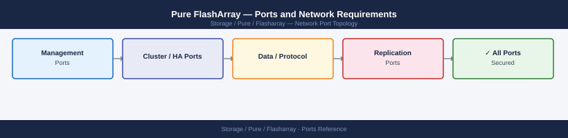

---
tags:
  - pure-storage
  - flasharray
  - networking
  - firewall
  - ports
  - storage
---
# Pure FlashArray — Ports and Network Requirements

<div class="kb-summary">
Firewall port reference for Pure Storage FlashArray. Covers Purity management, iSCSI and NVMe-oF/TCP data paths, ActiveCluster synchronous replication, Pure1 cloud management, and VMware vSphere integration.

*Applies to: Purity//FA 6.x*
</div>


## Before you begin

- FlashArray has two network roles: management (mgmt0/mgmt1) and data (iSCSI/NVMe-oF/Fibre Channel ports)
- Management port is a dedicated 1G interface — all API, SSH, SNMP, and Pure1 traffic uses this
- Data ports (et0, et2, etc.) are 10/25/100G and carry only iSCSI or NVMe-oF/TCP — never mix management and data traffic
- Fibre Channel ports are not IP-based — no firewall rules needed, only zoning
- ActiveCluster (synchronous replication) uses a dedicated replication port on both arrays — must be reachable bidirectionally

---

## Inbound — Management Traffic

| Port | Protocol | Source | Purpose |
|---|---|---|---|
| 443 | TCP | Admin workstations, Ansible, vSphere plugin | Purity GUI (HTTPS), REST API v1/v2 |
| 22 | TCP | Jump hosts | SSH — Purity CLI |
| 80 | TCP | Clients | HTTP — redirects to 443 |
| 161 | UDP | Monitoring server | SNMP polling (inbound to array) |

---

## Outbound — Array to External

| Port | Protocol | Destination | Purpose |
|---|---|---|---|
| 162 | UDP | SNMP trap receiver | SNMP traps |
| 514 | UDP/TCP | Syslog server | Syslog forwarding |
| 123 | UDP | NTP server | Time sync |
| 25 | TCP | SMTP relay | Alert email delivery |

---

## Pure1 Cloud Management (Outbound)

Pure1 requires outbound HTTPS from the management port only.

| Port | Protocol | Destination | Purpose |
|---|---|---|---|
| 443 | TCP | pure1.purestorage.com | Telemetry, capacity analytics, Evergreen subscription |
| 443 | TCP | support.purestorage.com | Secure Remote Assist (CloudAssist) — inbound SSH tunnel via HTTPS |

CloudAssist establishes an **outbound HTTPS tunnel** to Pure Support — no inbound firewall hole required from Pure's support side.

---

## Data Protocols — iSCSI

| Port | Protocol | Source | Destination | Purpose |
|---|---|---|---|---|
| 3260 | TCP | Host iSCSI initiator | FlashArray iSCSI port IP | iSCSI block storage |

Each iSCSI port on the array has its own IP (et0, et2, etc. — see `purenetwork list`). Configure multipath across both controllers.

---

## Data Protocols — NVMe-oF/TCP (Purity 6.3+)

| Port | Protocol | Source | Destination | Purpose |
|---|---|---|---|---|
| 4420 | TCP | NVMe/TCP host | FlashArray NVMe port IP | NVMe over TCP block storage |
| 8009 | TCP | NVMe/TCP host | FlashArray NVMe port IP | NVMe-oF discovery |

---

## ActiveCluster — Synchronous Replication

ActiveCluster pairs two FlashArrays for synchronous block replication (RPO = 0). Replication uses the management interface or a dedicated replication port (check `purepod list` for replication IPs).

| Port | Protocol | Between | Purpose |
|---|---|---|---|
| 8776 | TCP | Array A replication IP ↔ Array B replication IP | ActiveCluster synchronous replication data |
| 443 | TCP | Array A mgmt ↔ Array B mgmt | REST API — pod coordination, status, and failover orchestration |

---

## ActiveDR — Asynchronous Replication (Purity 6.1+)

| Port | Protocol | Between | Purpose |
|---|---|---|---|
| 443 | TCP | Array A mgmt → Array B mgmt | REST API — async replication orchestration |
| 8776 | TCP | Array A replication IP → Array B replication IP | Async data transfer |

---

## VMware vSphere Integration

| Port | Protocol | Source | Destination | Purpose |
|---|---|---|---|---|
| 443 | TCP | vCenter Server | FlashArray management IP | vSphere Plugin — array API calls (VASA, VAAI) |
| 443 | TCP | FlashArray management IP | vCenter Server | VASA registration callback |

The Pure Storage vSphere Plugin registers the array as a VASA provider through vCenter.

---

## Active Directory Integration (for Admin RBAC)

| Port | Protocol | Destination | Purpose |
|---|---|---|---|
| 389 | TCP | Active Directory DCs | LDAP — admin user authentication |
| 636 | TCP | Active Directory DCs | LDAPS (recommended) |
| 88 | TCP/UDP | Active Directory DCs | Kerberos |

---

## Firewall Zone Summary

| From | To | Ports | Notes |
|---|---|---|---|
| Admin clients | Array management IP | 443, 22 | GUI, REST API, SSH |
| Monitoring | Array management IP | 161 UDP | SNMP polling |
| Host iSCSI initiators | Array iSCSI port IPs | 3260 | Per iSCSI VLAN; all iSCSI ports |
| NVMe/TCP hosts | Array NVMe port IPs | 4420, 8009 | Purity 6.3+ |
| Array management IP | pure1.purestorage.com | 443 | Pure1 telemetry + CloudAssist |
| Array A replication IP | Array B replication IP | 8776 | ActiveCluster / ActiveDR; bidirectional |
| Array A mgmt | Array B mgmt | 443 | Pod API coordination; bidirectional |
| vCenter | Array management IP | 443 | vSphere plugin and VASA |

---

## Verify

```bash
# From admin workstation — test API
curl -sk -o /dev/null -w "%{http_code}" https://<array-mgmt-ip>/api/2.x/array
# Expected: 401 (auth required) or 200 with token

# From admin workstation — test SSH
ssh pureuser@<array-mgmt-ip>

# From iSCSI host — discover targets
iscsiadm -m discovery -t sendtargets -p <array-iscsi-port-ip>:3260

# From NVMe/TCP host — discover controllers
nvme discover -t tcp -a <array-nvme-ip> -s 4420

# From Purity CLI — check replication connectivity (ActiveCluster)
purepod list
purereplication list

# From Purity CLI — check Pure1 connectivity
purearray list --connection
```

---

## See also

- [Pure FlashArray — Architecture](../how-it-works/)
- [Pure FlashArray — Deploy](../../deploy/)
- [Pure FlashArray — Operations](../../operations/)
- [Pure FlashArray — Troubleshooting](../../troubleshooting/)
