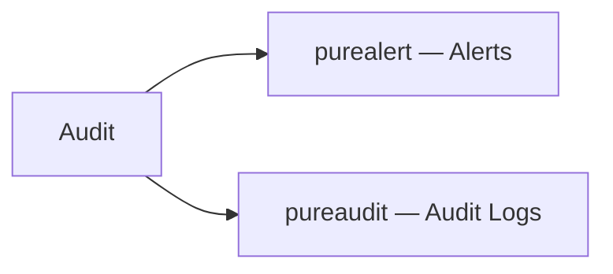

# Alerts & Audit

> Part of the [Pure FlashArray CLI Reference](../).



---

## purealert — Alerts

Manages alert history and notification email recipients.

```bash
purealert list
purealert list --flagged
purealert list --filter "state='open'"
purealert list --filter "state='closed'"
purealert list --filter "severity='critical'"
purealert list --filter "issue='failure'"
purealert flag 121212
purealert unflag 121212
purealert acknowledge <ID>
```

---

## pureaudit — Audit Logs

Displays and manages audit log records.

```bash
pureaudit list
pureaudit list --limit 10
pureaudit list --sort user
pureaudit list --filter 'user = "root"'
pureaudit list --filter 'command="purepod"'
pureaudit list --filter 'command="purepod" and subcommand="create"'
pureaudit list --filter 'command="purepod" and user="pureuser"'
pureaudit list --filter "action='create'"
```
