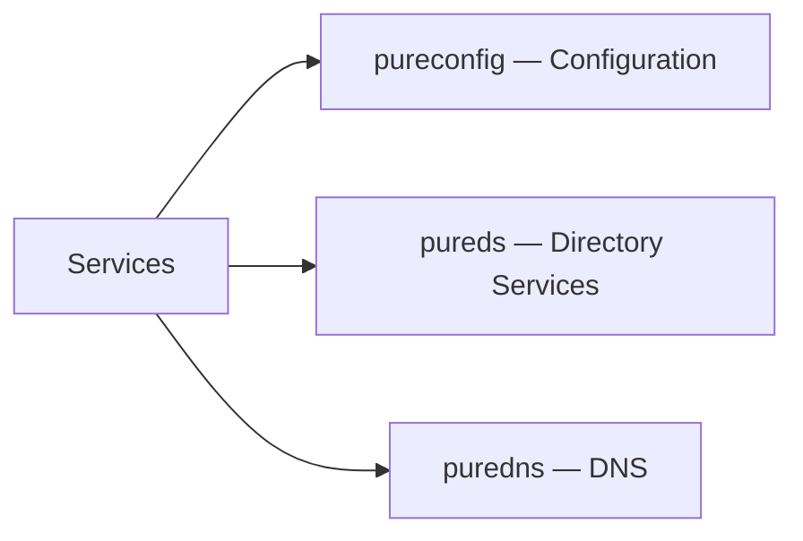

# Configuration & Directory Services

> Part of the [Pure FlashArray CLI Reference](../).



---

## pureconfig — Configuration

Reproduces the current array configuration.

```bash
pureconfig list
pureconfig list --all
pureconfig list --object
pureconfig list --object <type>
pureconfig list --system
```

---

## pureds — Directory Services

Manages Active Directory and LDAP integration.

```bash
pureds list
pureds check
```

---

## puredns — DNS

Manages DNS attributes for the array's administrative network.

```bash
puredns list
puredns setattr --domain test.com --nameservers 192.168.0.10,192.168.2.11
puredns setattr --domain ""
puredns setattr --nameservers ""
```
