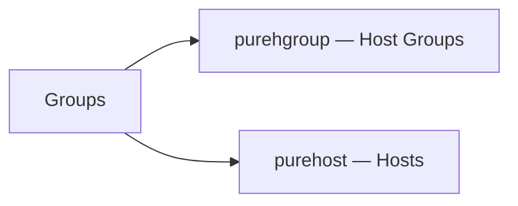

# Hosts & Host Groups

> Part of the [Pure FlashArray CLI Reference](../).



---

## purehgroup — Host Groups

Displays and manages Host Group objects.

```bash
# Create / delete / rename
purehgroup create MY-HOSTS
purehgroup create MY-HOSTS --hostlist MY-HOST-001,MY-HOST-002
purehgroup delete MY-HOSTS
purehgroup delete MY-HOSTS_1 MY-HOSTS-2
purehgroup rename MY-HOSTS YOUR-HOSTS

# List
purehgroup list
purehgroup list --connect
purehgroup list --connect MY-HOSTS
purehgroup list --host
purehgroup list --space
purehgroup list --filter "host_list='MY-SERVER-001'"

# Connect / disconnect volumes
purehgroup connect MY-HOSTS --vol MY_VOL_001
purehgroup connect MY-HOSTS --vol MY_VOL_001 --lun 100
purehgroup disconnect MY-HOSTS --vol MY_VOL_001

# Manage host membership
purehgroup setattr MY-HOSTS --hostlist MY-HOST-002,MY-HOST-003
purehgroup setattr MY-HOSTS --addhostlist MY-HOST-002,MY-HOST-003
purehgroup setattr MY-HOSTS --remhostlist MY-HOST-002,MY-HOST-003
purehgroup setattr MY-HOSTS --hostlist ""
purehgroup addhost --hostlist <h1,h2> <hg>
purehgroup remhost --hostlist <h1> <hg>
```

---

## purehost — Hosts

Displays and manages Host objects.

```bash
# Create / delete / rename
purehost create MY-SERVER-001
purehost create MY-SERVER-001 --wwnlist 1000000000000001,10:00:00:00:00:00:00:01
purehost create MY-SERVER-001 MY-SERVER-002
purehost delete MY-SERVER-001
purehost delete MY-SERVER-001 MY-SERVER-002
purehost rename MY-SERVER-001 YOUR-SERVER-001

# List
purehost list
purehost list --all
purehost list --connect
purehost list --connect --private
purehost list --connect --shared
purehost list --personality
purehost list --wwn
purehost list --iqn
purehost list MY-SERVER*
purehost list MY-SERVER-001
purehost list MY-SERVER-001 --connect
purehost list MY-SERVER-001 --personality
purehost list --filter "wwn='1000000000000003'"

# Connect / disconnect volumes
purehost connect MY-SERVER-001 --vol MY_VOL_001
purehost connect MY-SERVER-001 --vol MY_VOL_001 --lun 10
purehost connect MY-SERVER-001 MY-SERVER-002 --vol MY_VOL_001
purehost disconnect MY-SERVER-001 --vol MY_VOL_001
purehost disconnect MY-SERVER-001 MY-SERVER-002 --vol MY_VOL_001

# Manage WWNs, iQNs, and personality
purehost setattr MY-SERVER-001 --wwnlist 1000000000000003
purehost setattr MY-SERVER-001 --addwwnlist 1000000000000003
purehost setattr MY-SERVER-001 --remwwnlist 1000000000000003
purehost setattr MY-SERVER-001 --wwnlist ""
purehost setattr MY-SERVER-001 --personality esxi
purehost setattr MY-SERVER-001 --personality solaris
purehost addwwn MY-SERVER-001 --wwn <wwn>
purehost remwwn MY-SERVER-001 --wwn <wwn>
purehost addiqn MY-SERVER-001 --iqn <iqn>

# Monitor
purehost monitor --bandwidth
purehost monitor --iops
```
