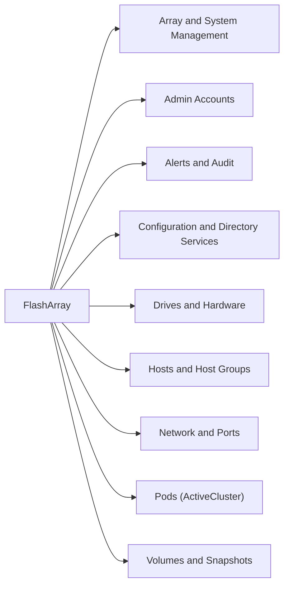

# Pure Storage FlashArray CLI Reference

Commonly used Purity CLI commands for managing Pure FlashArray all-flash storage systems. Connect via SSH to the array's management IP and log in as `pureuser` or another admin account.



---


<div class="kb-grid kb-grid-1">

<a class="kb-card" href="alerts-audit/">
  <strong>Alerts & Audit</strong>
  <span>Alerts & Audit notes, checks, commands, and references.</span>
</a>

<a class="kb-card" href="csv-exports/">
  <strong>CSV Exports</strong>
  <span>CSV Exports notes, checks, commands, and references.</span>
</a>

<a class="kb-card" href="network-ports/">
  <strong>Network Ports</strong>
  <span>Network Ports notes, checks, commands, and references.</span>
</a>

<a class="kb-card" href="pods/">
  <strong>Pods</strong>
  <span>Pods notes, checks, commands, and references.</span>
</a>

</div>
## Array & System Management

These commands show you the array's identity, monitor overall performance, and configure system-level settings like banners, timeouts, and NTP. Also covers firmware upgrades and remote support (phonehome).

```bash
# Array identity and attributes
purearray list
purearray list --controller
purearray list --space
purearray list --ntpserver
purearray list --syslogserver
purearray list --banner
purearray list --console-lockout
purearray list --connection-key

# Performance monitoring — overall array I/O stats
purearray monitor
purearray monitor --latency
purearray monitor --bandwidth
purearray monitor --iops
purearray monitor --size
purearray monitor --queue-depth

# Configure array settings
purearray setattr --name <new_name>
purearray setattr --banner <text>
purearray setattr --idle-timeout <mins>
purearray setattr --scsi-timeout <secs>
purearray setattr --proxy <url>

# Firmware upgrades
purearray upgrade list
purearray upgrade download --version <v>

# Phonehome / remote support (sends diagnostics to Pure Support)
purearray phonehome list
purearray phonehome send
purearray remoteassist --action open
purearray remoteassist --action close
purearray remoteassist --status
```

---

## Admin Accounts

Admin accounts control who can log in and what they can do. Pure supports role-based access and API tokens for automation. API tokens are used by scripts, monitoring tools, and integrations to authenticate without a password.

```bash
# Create user with API token
pureadmin create testuser --api-token
pureadmin create testuser --api-token --timeout 2h
pureadmin create testuser --role storage_admin

# Delete user / token
pureadmin delete --api-token
pureadmin delete testuser
pureadmin delete testuser --api-token

# Global settings (password policy, lockouts, SSO)
pureadmin global list
pureadmin global list --lockout
pureadmin global disable --single-sign-on
pureadmin global enable --single-sign-on
pureadmin global setattr --lockout-duration 1m
pureadmin global setattr --max-login-attempts 3
pureadmin global setattr --min-password-length 8

# List accounts
pureadmin list
pureadmin list --api-token
pureadmin list --api-token --expose
pureadmin list --lockout

# Manage lockouts and attributes
pureadmin refresh testuser
pureadmin refresh --clear
pureadmin refresh --clear testuser
pureadmin reset testuser --lockout
pureadmin setattr testuser --password
pureadmin setattr testuser --role array_admin
```

---

## Alerts & Audit

Alerts notify you when something needs attention on the array. The audit log records every command run by every user — useful for security investigations and compliance. You can flag important alerts for follow-up.

### purealert — Alerts

```bash
purealert list
purealert list --flagged
purealert list --filter "state='open'"
purealert list --filter "state='closed'"
purealert list --filter "severity='critical'"
purealert list --filter "issue='failure'"
purealert flag 121212
purealert unflag 121212
purealert acknowledge <ID>
```

### pureaudit — Audit Logs

```bash
pureaudit list
pureaudit list --limit 10
pureaudit list --sort user
pureaudit list --filter 'user = "root"'
pureaudit list --filter 'command="purepod"'
pureaudit list --filter 'command="purepod" and subcommand="create"'
pureaudit list --filter "action='create'"
```

---

## Configuration & Directory Services

`pureconfig` shows you the current array configuration — useful for documentation or pre-change baselines. `pureds` integrates the array with Active Directory or LDAP. `puredns` sets the array's DNS resolver.

```bash
# pureconfig — current array configuration
pureconfig list
pureconfig list --all
pureconfig list --object
pureconfig list --object <type>
pureconfig list --system

# pureds — directory services (Active Directory / LDAP)
pureds list
pureds check

# puredns — DNS configuration
puredns list
puredns setattr --domain test.com --nameservers 192.168.0.10,192.168.2.11
puredns setattr --domain ""
puredns setattr --nameservers ""
```

---

## Drives & Hardware

These commands show the health of flash drives and hardware components in the array. Drives are identified by bay (e.g., `CH0.BAY10`). The `purehw` command covers everything from fans and power supplies to FC ports and NVMe modules.

```bash
# puredrive — flash drives
puredrive list
puredrive list --spec
puredrive list --total
puredrive list CH0.BAY10
puredrive list CH0.BAY10 --pack
puredrive admit

# purehw — hardware components
purehw list
purehw list --spec
purehw list --type bay
purehw list --type bay --spec
purehw list --type ct       # controllers
purehw list --type eth      # Ethernet ports
purehw list --type fc       # Fibre Channel ports
purehw list --type fan
purehw list --type psu      # power supply units
purehw list --type nvram
purehw list --type sas
purehw list --spec --type drive
purehw list CT0 --spec
purehw list CT0.FC0
```

---

## Hosts & Host Groups

A host represents a server connecting to the array. You register the server's HBA WWNs or iSCSI IQNs to the host object, then connect volumes to the host. Host groups let you manage access for multiple servers at once (e.g., a vSphere cluster).

### purehgroup — Host Groups

```bash
# Create / delete / rename
purehgroup create MY-HOSTS
purehgroup create MY-HOSTS --hostlist MY-HOST-001,MY-HOST-002
purehgroup delete MY-HOSTS
purehgroup rename MY-HOSTS YOUR-HOSTS

# List
purehgroup list
purehgroup list --connect
purehgroup list --connect MY-HOSTS
purehgroup list --host
purehgroup list --space
purehgroup list --filter "host_list='MY-SERVER-001'"

# Connect / disconnect volumes
purehgroup connect MY-HOSTS --vol MY_VOL_001
purehgroup connect MY-HOSTS --vol MY_VOL_001 --lun 100
purehgroup disconnect MY-HOSTS --vol MY_VOL_001

# Manage host membership
purehgroup setattr MY-HOSTS --hostlist MY-HOST-002,MY-HOST-003
purehgroup setattr MY-HOSTS --addhostlist MY-HOST-002,MY-HOST-003
purehgroup setattr MY-HOSTS --remhostlist MY-HOST-002,MY-HOST-003
purehgroup setattr MY-HOSTS --hostlist ""
purehgroup addhost --hostlist <h1,h2> <hg>
purehgroup remhost --hostlist <h1> <hg>
```

### purehost — Hosts

```bash
# Create / delete / rename
purehost create MY-SERVER-001
purehost create MY-SERVER-001 --wwnlist 1000000000000001,10:00:00:00:00:00:00:01
purehost delete MY-SERVER-001
purehost rename MY-SERVER-001 YOUR-SERVER-001

# List
purehost list
purehost list --all
purehost list --connect
purehost list --connect --private
purehost list --connect --shared
purehost list --personality
purehost list --wwn
purehost list --iqn
purehost list MY-SERVER*
purehost list MY-SERVER-001 --connect

# Connect / disconnect volumes
purehost connect MY-SERVER-001 --vol MY_VOL_001
purehost connect MY-SERVER-001 --vol MY_VOL_001 --lun 10
purehost disconnect MY-SERVER-001 --vol MY_VOL_001

# Manage WWNs, iQNs, and personality
purehost setattr MY-SERVER-001 --wwnlist 1000000000000003
purehost setattr MY-SERVER-001 --addwwnlist 1000000000000003
purehost setattr MY-SERVER-001 --remwwnlist 1000000000000003
purehost setattr MY-SERVER-001 --wwnlist ""
purehost setattr MY-SERVER-001 --personality esxi
purehost setattr MY-SERVER-001 --personality solaris
purehost addwwn MY-SERVER-001 --wwn <wwn>
purehost addiqn MY-SERVER-001 --iqn <iqn>

# Monitor
purehost monitor --bandwidth
purehost monitor --iops
```

---

## Network & Ports

`purenetwork` shows IP interfaces (management, replication, iSCSI). `pureport` shows physical FC and Ethernet ports — you need the FC port WWNs to configure SAN zoning between the array and your switches.

```bash
# List all network interfaces (management, replication, iSCSI)
purenetwork list
purenetwork list --resolve-hostnames

# List all array ports
pureport list

# FC ports only (get WWNs for SAN zoning)
pureport list --type fc

# Ethernet ports only
pureport list --type eth

# Filter to a specific controller
pureport list --raw --filter "name='CT0.FC*'"
pureport list --raw --filter "name='CT1.FC*'"

# Show connected host initiator ports
pureport list --initiator

# Filter by WWN
pureport list --initiator --raw --filter "initiator.wwn='1000000000000001'"

# Bandwidth monitoring
pureport monitor --bandwidth
```

### FC Port WWNs (for SAN Zoning)

```bash
pureport list --type fc
# The 'wwn' column shows the array-side WWN for each FC port.
# Zone each host initiator port to the array target WWNs.
```

### Common Port Issues

| Issue | Check | Action |
|---|---|---|
| Host can't see array via FC | Port WWN not zoned | Verify SAN zoning matches `pureport list --type fc` |
| iSCSI sessions not establishing | IP reachability | Ping array iSCSI IP from host |
| Bandwidth below expected | Port speed | `pureport list --type eth` — check link speed |
| Initiator not registering | WWN mismatch | Verify host HBA WWN vs. registered initiator |

---

## Pods (ActiveCluster)

Pods enable synchronous replication between two FlashArray systems. Both arrays see the same volumes simultaneously — if one array fails, the other continues serving I/O with zero data loss (RPO=0). Used for active-active high availability across sites.

```bash
# Create / destroy / recover
purepod create MYPOD001
purepod create MYPOD001 MYPOD002
purepod clone MYPOD001 MYPOD002
purepod rename MYPOD001 YOURPOD001
purepod destroy MYPOD001
purepod eradicate MYPOD001
purepod recover MYPOD001

# List
purepod list
purepod list MYPOD001
purepod list --pending
purepod list --pending-only
purepod list --footprint
purepod list --mediator
purepod list --failover-preference
purepod list --on ARRAY02
purepod listobj --type vol MYPOD001
purepod listobj --type array MYPOD001

# Stretch / demote / failover
purepod add --array PFAX70-REMOTE MYPOD001
purepod remove --array PFAX70-REMOTE MYPOD001
purepod demote MYPOD001
purepod setattr --failover-preference ARRAY002 MYPOD001

# Replica links (async replication)
purepod replica-link list
purepod replica-link create PRDPOD001 --remote ARRAY002 --remote-pod DRPOD001
purepod replica-link delete PRDPOD001 --remote-pod DRPOD001
purepod replica-link pause PRDPOD001 --remote ARRAY002 --remote-pod DRPOD001
purepod replica-link resume PRDPOD001 --remote ARRAY002 --remote-pod DRPOD001
purepod replica-link monitor --replication
```

---

## Volumes & Snapshots

Volumes are the block storage devices that hosts connect to. Pure volumes are thin-provisioned — they don't consume physical space until data is actually written. Snapshots are instant, space-efficient point-in-time copies.

```bash
# Create / delete / recover
purevol create --size 10G MY_VOLUME_001
purevol create --size 10G MY_VOLUME_001 --bw-limit 10M
purevol create --size 1G MYPOD001::MY_VOL_001
purevol create --source <vol> <new_vol>          # copy/clone a volume
purevol destroy MY_VOL_001
purevol eradicate MY_VOL_001
purevol eradicate --all
purevol recover MY_VOL_001
purevol rename MY_VOL_001 MY_VOL_002

# List
purevol list
purevol list MY_VOL_001
purevol list MY_VOL*
purevol list --all
purevol list --snap
purevol list --pending
purevol list --pending-only
purevol list --shared
purevol list --total
purevol list --space --sort size,total
purevol list --snap --space
purevol list --filter "size='20T'"
purevol list --filter "size > 100G"

# Connect / disconnect volumes to hosts
purevol connect MY_VOL_001 --host MY-SERVER-001
purevol connect MY_VOL_001 --host MY-SERVER-001 --lun 10
purevol connect MY_VOL_001 --hgroup MY-HOSTS
purevol disconnect MY_VOL_001 --host MY-SERVER-001
purevol disconnect MY_VOL_001 --hgroup MY-HOSTS

# Modify volumes
purevol setattr --size 2G MY_VOL_001          # resize
purevol setattr --bw-limit 1M MY_VOL_001      # bandwidth limit
purevol setattr --readonly MY_VOL_001
purevol truncate --size 1G MY_VOL_001

# Copy / move
purevol copy MY_VOL_001 MY_VOL_002
purevol copy MY_VOL_001 MY_VOL_002 --overwrite
purevol copy --snapshot <snap> <target>
purevol move vol001 MYPOD001
purevol move MYPOD001::vol001 ""

# Snapshots — instant point-in-time copies
purevol snap MY_VOL_001
purevol snap MY_VOL_001 --suffix PRD
purevol snap MY_VOL_001 --expiration <time>

# Monitor performance
purevol monitor
purevol monitor --iops
purevol monitor --latency
purevol monitor --historical 24h
```

---

## CSV Exports

Use `--csv` with any list command to export data to a CSV file. This is useful for inventory reports, audits, and capacity planning. Use SSH redirection to save to a file on your local machine.

```bash
# Run from a remote terminal:
ssh pureuser@<array_ip> "purevol list --csv" > local_file.csv
```

### Array & System

```bash
purearray list --csv > array_inventory.csv
purearray list --space --csv >> array_inventory.csv
purearray list --controller --csv >> array_inventory.csv
purearray list --ntpserver --csv >> array_inventory.csv
purearray monitor --csv >> array_performance.csv
purearray monitor --latency --csv >> array_performance.csv
purearray monitor --bandwidth --csv >> array_performance.csv
purearray monitor --iops --csv >> array_performance.csv
```

### Volumes & Data

```bash
purevol list --csv > volume_report.csv
purevol list --all --csv >> volume_report.csv
purevol list --snap --csv >> volume_report.csv
purevol list --space --csv >> volume_report.csv
purevol list --filter "size > 100G" --csv >> filtered_volumes.csv
purevol monitor --csv > volume_performance.csv
purevol monitor --historical 24h --csv >> volume_performance.csv
```

### Hosts & Connectivity

```bash
purehost list --csv > host_mapping.csv
purehost list --all --csv >> host_mapping.csv
purehost list --connect --csv >> active_connections.csv
purehost list --wwn --csv >> initiator_list.csv
purehost list --iqn --csv >> initiator_list.csv
purehost monitor --bandwidth --csv >> host_performance.csv
purehgroup list --csv > group_mapping.csv
purehgroup list --host --csv >> group_mapping.csv
purehgroup list --space --csv >> group_mapping.csv
```

### Hardware & Health

```bash
purehw list --csv > hardware_health.csv
purehw list --type eth --csv >> hardware_health.csv
purehw list --type fc --csv >> hardware_health.csv
purehw list --type fan --csv >> hardware_health.csv
purehw list --type psu --csv >> hardware_health.csv
puredrive list --csv > drive_inventory.csv
pureport list --csv > port_config.csv
pureport list --initiator --csv >> port_config.csv
```

### Admin & Security

```bash
pureadmin list --csv > admin_users.csv
pureadmin list --lockout --csv >> security_report.csv
pureadmin list --api-token --csv >> admin_users.csv
purealert list --csv > system_alerts.csv
purealert list --filter "state='open'" --csv >> critical_alerts.csv
pureaudit list --csv > audit_trail.csv
pureds list --csv > directory_services.csv
puredns list --csv >> network_config.csv
```
