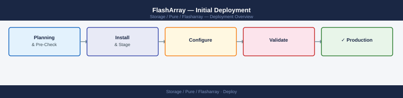
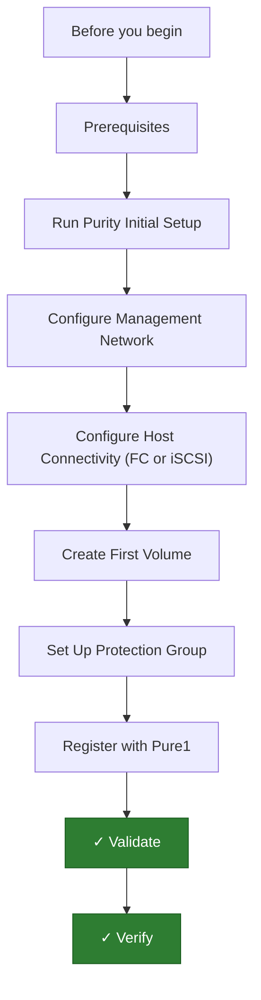

---
tags:
  - deployment
  - pure
search:
  boost: 1.5
---

## Before you begin

- **Access:** admin credentials for the target system and any upstream dependencies (DNS, NTP, vCenter, directory services)
- **Timing:** safe to run during a scheduled maintenance window; allow 1-2 hours for initial deployment
- **Dependencies:** network connectivity verified; DNS resolvable; NTP configured; any licence keys available
- **Logging:** record every IP address, hostname, and credential set assigned during this deployment

---

# FlashArray — Initial Deployment



This guide covers deploying a Pure Storage FlashArray (//X, //C, or //XL series) from physical installation through validated host connectivity. All steps apply to Purity//FA 6.x.

---




## Prerequisites

**Hardware:**

- FlashArray chassis with controller modules installed (dual controllers for HA)
- DirectFlash modules (NVMe flash) populated — Pure ships arrays at the ordered capacity
- 25GbE or 100GbE switches for iSCSI or NVMe-oF connectivity (or FC switches for Fibre Channel)
- OOB management network switch with DHCP for initial discovery, or pre-configured static IP

**Network planning:**

| Component                    | IP / Port       |
|------------------------------|-----------------|
| Management VIP               | 10.0.0.50       |
| CT0 management               | 10.0.0.51       |
| CT1 management               | 10.0.0.52       |
| iSCSI data VIF (CT0)         | 10.0.10.10      |
| iSCSI data VIF (CT1)         | 10.0.10.11      |

**Software:**

- Purity//FA 6.x (pre-installed at factory — verify the version post-setup)
- Pure Storage Host Utilities installed on each host (Linux, Windows, VMware ESXi)
- Pure1 account for monitoring (register at `pure1.purestorage.com`)
- NTP server accessible from the management network

---

## Run Purity Initial Setup

**Locate the array on the network:**

1. After racking and powering on, the array management interface acquires an IP via DHCP on the management switch. Check your DHCP server for the lease, or connect directly via serial console (9600/8N1) to read the assigned IP from the console output.
2. Browse to `https://<dhcp_assigned_ip>` and log in using the credentials in the Quick Start Guide shipped with the array.

**Run the initial setup wizard:**

1. Accept the EULA.
2. The **Initial Setup Wizard** presents the following screens in order:
   - **Array name:** Set a short DNS-compatible name (e.g., `fa-prod-01`).
   - **Management network:** Enter the management VIP, CT0 management IP, CT1 management IP, subnet mask, and gateway.
   - **DNS:** Enter primary and secondary DNS server IPs.
   - **NTP:** Enter the NTP server address. Accurate time is critical for replication consistency.
   - **SMTP / Alert email:** Enter a relay server and destination email for alerts.
   - **Admin password:** Set a strong password. Pure recommends integrating with LDAP or SAML after initial setup.
3. Click **Finish**. Purity applies the configuration and reconnects at the new management VIP.

**Verify Purity version and array health:**

1. Log in at `https://<management_vip>`.
2. Navigate to **Storage > Array**. All hardware components should show green.
3. Note the Purity version from **System > Software**. If the version is not current, check Pure1 for available upgrades.

---

## Configure Management Network

After the wizard, fine-tune the management network configuration.

1. Navigate to **System > Network**.
2. Verify that CT0 and CT1 management IPs and the management VIP are correct.
3. Confirm the DNS configuration resolves correctly:

```bash
# Via Purity CLI (SSH to management VIP as pureuser)
puredns resolve --hostname your.ntp.server
```

4. Set the time zone:

```bash
puretime set --timezone Europe/London
puretime list
# Verify NTP sync status is "Synced"
```

5. Configure the management interface for a dedicated management VLAN if required:

Navigate to **System > Network > Management Interfaces** and set the VLAN tag on the management ports.

---

## Configure Host Connectivity (FC or iSCSI)

**FC Connectivity:**

1. Navigate to **Storage > Ports**. FC target port WWPNs are listed per controller.
2. Record the WWPNs for CT0 and CT1 — you will use these for SAN zoning.
3. Create zones on your FC switches:
   - One zone per host HBA port, including that HBA's WWN and the FlashArray FC target ports it should reach.
   - Best practice: zone each host HBA to both CT0 and CT1 FC ports for HA.
4. After zoning, log in to the Purity UI. Navigate to **Storage > Hosts** and click **Create Host**.
5. The host's WWPNs should appear automatically after zoning is established. Select them and click **Create**.

**iSCSI Connectivity:**

1. Navigate to **System > Network > Data Interfaces (iSCSI)**.
2. Configure iSCSI VIFs on both controllers:
   - Click **Edit** on each interface and assign the IP address, subnet mask, and MTU (9000 recommended).
   - Ensure both CT0 and CT1 iSCSI interfaces are on the same iSCSI VLAN as the hosts.
3. On the host (Linux example):

```bash
# Install and enable iSCSI initiator
yum install -y iscsi-initiator-utils
systemctl enable --now iscsid

# Discover the FlashArray iSCSI targets
iscsiadm -m discovery -t st -p 10.0.10.10

# Log in to all targets
iscsiadm -m node -L all

# Install Pure Host Package for optimal multipath settings
# (Download from support.purestorage.com)
rpm -ivh pure-storage-host-utilities-<version>.x86_64.rpm
```

4. Register the host in Purity by entering its IQN manually:

Navigate to **Storage > Hosts > Create Host**. Enter the host name and IQN.

---

## Create First Volume

1. Navigate to **Storage > Volumes > Create Volume**.
2. Enter:
   - Volume name (e.g., `vol_sql01_data`)
   - Size (e.g., `500G`) — volumes are thin-provisioned; actual capacity is consumed as data is written
   - Protection group (optional — assign to an existing protection group for automated snapshots)
3. Click **Create**.

**Connect the volume to a host:**

1. Select the volume, click **Connect**.
2. Select the host created above (e.g., `linux_host01`).
3. LUN assignment is automatic unless specified.
4. Click **Connect Volume**.

**Verify on the host:**

```bash
rescan-scsi-bus.sh
multipath -ll
# The Pure FlashArray volume should appear with model "PURE"
# Expect 4 paths for single-fabric iSCSI (2 per controller) or 4-8 for FC
```

---

## Set Up Protection Group

Protection groups enable consistent snapshot schedules and replication across volumes.

1. Navigate to **Storage > Protection Groups > Create Protection Group**.
2. Name the group (e.g., `pg_sql_prod`).
3. Add volumes: click **Add Volumes** and select the SQL data and log volumes.
4. Add a snapshot schedule:
   - Click **Edit Schedule**
   - Frequency: every 1 hour
   - Retention: 24 snapshots (24-hour local retention)
   - Replicate to: select the target array (if replication is configured)
   - Replication retention: keep replicated snapshots for 7 days
5. Click **Apply**.

**Test an on-demand snapshot:**

1. Select the protection group, click **Take Snapshot**.
2. Navigate to **Storage > Snapshots** and confirm the snapshot appears.

---

## Register with Pure1

1. Navigate to **System > Support** and enable **Phone Home**.
2. Confirm outbound HTTPS access from the management network to `support.purestorage.com` on TCP 443.
3. Log in to `https://pure1.purestorage.com` with your Pure Storage portal account.
4. The array appears automatically after Phone Home is enabled (within 30 minutes).
5. In Pure1:
   - Navigate to **Alerts** and configure email notification recipients.
   - Review the **Capacity** forecast graph to confirm usable space projections.
   - Register any open support cases for tracked issues.

---

## Validate

1. From the Purity UI, navigate to **Storage > Array** and confirm all controllers, shelves, and drives show green.
2. Confirm the volume has correct path count from the host:

```bash
multipath -ll
# Each path should show status "active ready"
```

3. Run a write/read I/O test:

```bash
dd if=/dev/zero of=/dev/mapper/<pure_mpath_dev> bs=1M count=2048 oflag=direct
dd if=/dev/mapper/<pure_mpath_dev> of=/dev/null bs=1M count=2048 iflag=direct
```

4. Check no errors in `/var/log/messages` or the multipath log.
5. Verify the protection group snapshot schedule is running: navigate to **Storage > Snapshots** and confirm hourly snapshots are being created.
6. In Pure1, confirm the array shows as **Connected** and no critical alerts are active.

---

## Verify

- **Cluster health:** all nodes show online in the management UI
- **Volume access:** mount a test LUN/NFS export from a host and confirm read/write
- **Replication:** confirm replication partner shows last-sync within RPO window

---

## See also

- [Flasharray — Procedures](../operations/procedures/)
- [Flasharray — Common Issues](../troubleshooting/common-issues/)
- [Flasharray — How It Works](../architecture/how-it-works/)
