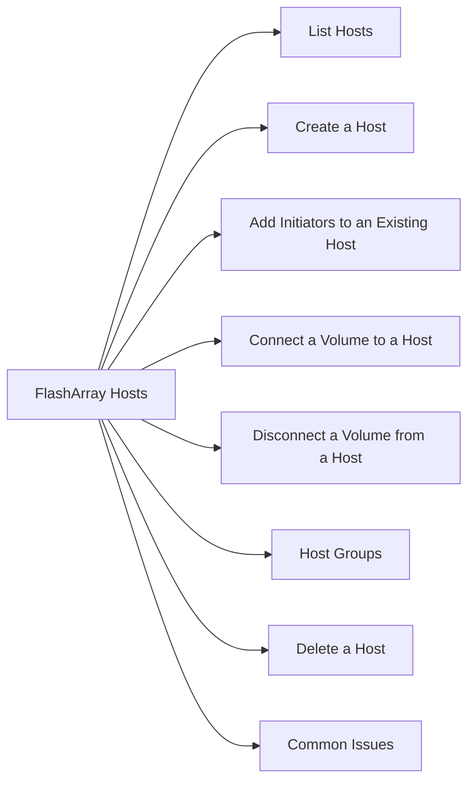

# FlashArray Hosts

Hosts in Pure Storage represent the servers (physical or virtual) that are granted access to volumes via iSCSI IQN or Fibre Channel WWN registration.



## List Hosts

```bash
purecli host list
purecli host list --connect   # show volume connections
```

## Create a Host

```bash
# Create host with FC WWNs
purecli host create <hostname> --wwns <wwn1,wwn2>

# Create host with iSCSI IQNs
purecli host create <hostname> --iqns <iqn1>

# Create host with NVMe NQNs
purecli host create <hostname> --nqns <nqn1>
```

## Add Initiators to an Existing Host

```bash
# Add WWN
purecli host update <hostname> --add-wwns <new_wwn>

# Add IQN
purecli host update <hostname> --add-iqns <new_iqn>
```

## Connect a Volume to a Host

```bash
purecli host connect <hostname> --vol <volume_name>
```

This creates the host-to-volume connection (analogous to LUN masking on traditional arrays).

## Disconnect a Volume from a Host

```bash
purecli host disconnect <hostname> --vol <volume_name>
```

## Host Groups

For clustered hosts (e.g., ESXi cluster), use host groups so volumes can be connected to all members:

```bash
# Create host group
purecli hgroup create <hostgroup_name>

# Add hosts to group
purecli hgroup update <hostgroup_name> --add-hosts <hostname1,hostname2>

# Connect volume to host group
purecli hgroup connect <hostgroup_name> --vol <volume_name>

# List host group connections
purecli hgroup list --connect
```

## Delete a Host

```bash
# Disconnect all volumes first
purecli host disconnect <hostname> --vol <volume_name>

# Delete host
purecli host delete <hostname>
```

## Common Issues

| Issue | Check | Action |
|---|---|---|
| Volume not visible to host | Connection exists? | `purecli host list --connect` |
| Duplicate WWN error | WWN already registered | Remove from old host entry |
| Host group volume not seen | All hosts in group? | `purecli hgroup list` |
| iSCSI host not connecting | IQN correct | Verify IQN on host with `iscsiadm` |
