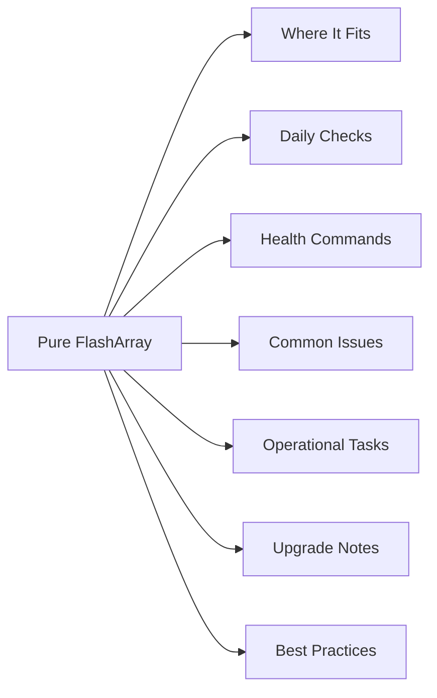

# Pure FlashArray

<a class="kb-card" href="cli-reference/">
  <strong>CLI Reference</strong>
  purevol, purehost, purehgroup, purepod, pureport, pureadmin, and more.
</a>

<a class="kb-card" href="operations/">
  <strong>Operations</strong>
  Daily checks, health check, change readiness, incident triage, maintenance window, and post-change validation.
</a>

<a class="kb-card" href="architecture/">
  <strong>Architecture</strong>
  Architecture overview, components, and design patterns.
</a>

<a class="kb-card" href="health-checks/">
  <strong>Health Checks</strong>
  Health check procedures and validation steps.
</a>

<a class="kb-card" href="lifecycle/">
  <strong>Lifecycle</strong>
  Installation, upgrades, patching, and decommission.
</a>

<a class="kb-card" href="protection-groups/">
  <strong>Protection Groups</strong>
  Snapshot scheduling, replication, and retention policies.
</a>

<a class="kb-card" href="security/">
  <strong>Security</strong>
  Security configuration, hardening, and access control.
</a>

<a class="kb-card" href="standards/">
  <strong>Standards</strong>
  Configuration standards, naming conventions, and baselines.
</a>

<a class="kb-card" href="scripts/">
  <strong>Scripts</strong>
  Python REST API health check, ActiveCluster monitor, Bash volume report, and Ansible playbook.
</a>

<a class="kb-card" href="vendor-support/">
  <strong>Vendor Support</strong>
  Support bundles, case management, and escalation paths.
</a>

## Overview

Pure Storage FlashArray is an all-flash block storage platform running Purity//FA OS, available in the //X series (NVMe-based, highest performance), //C series (QLC flash, capacity-optimized), and //E series (maximum density). All models run in an active-active dual-controller configuration with no single point of failure, and support FC, iSCSI, NVMe/FC, NVMe/RoCE, and NVMe/TCP host protocols. Fleet-wide monitoring, AI-driven analytics, and workload planning are delivered via Pure1 cloud management without requiring on-premises management infrastructure.

## Where It Fits

| Use Case |
|---|
| Tier-1 block storage for databases (Oracle, SQL Server, SAP HANA) requiring sub-millisecond latency |
| VMware vSphere datastores (VMFS and vVols) with vSphere Plugin integration for VM-level management |
| NVMe/FC or NVMe/RoCE for latency-sensitive workloads demanding the lowest possible response time |
| ActiveCluster (synchronous replication) for metro/stretch cluster deployments requiring zero RPO and transparent host failover across two sites within 5ms RTT |
| Dev/test provisioning via instant FlashArray snapshot clones (space-efficient, no copy required) |
| VDI boot volume acceleration with predictable, consistent IOPS regardless of load |

## Daily Checks

| Check | Command | Notes |
|---|---|---|
| Check active alerts | `purealert list` | resolve any critical or warning alerts before they escalate |
| Review drive health | `puredrive list` | confirm no drives are in `failed` or `recovering` state |
| Review array capacity and data reduction ratio | `purearray list --space` |  |
| Check ActiveCluster pod replication status | `purepod list --replicating` | confirm pods show `replicating: true` |
| Review recent snapshots and confirm retention policies are expiring older snaps as expected | `puresnap list` |  |
| Check host and host group connectivity | `purehost list` | confirm expected volume connections |
| Review performance metrics for latency or throughput anomalies | `purearray monitor` |  |
| Confirm both controllers are healthy and running the same Purity version | `purearray list --controller` |  |

## Health Commands

~~~bash
# Show array name, Purity version, and overall status
purearray list

# Show controller status and firmware version
purearray list --controller

# Show array capacity, data reduction, and space usage
purearray list --space

# List all active alerts
purealert list

# List all drives and their health state
puredrive list

# List all volumes with size and connection info
purevol list

# List all hosts and their connected volumes
purehost list

# List all host groups
purehgroup list

# List ActiveCluster pods and replication state
purepod list --replicating

# List all FC/iSCSI/NVMe ports and their status
pureport list

# List snapshots
puresnap list

# Show real-time performance (latency, IOPS, bandwidth)
purearray monitor
~~~

## Common Issues

| Symptom | Likely Cause | Action |
|---|---|---|
| Drive in `failed` or `recovering` state | NVMe drive failure; array begins automatic rebuild | Run `puredrive list` to confirm; array self-heals — monitor rebuild progress; open support case if rebuild stalls |
| Host loses paths to volumes | FC zone misconfiguration, iSCSI network issue, or HBA failure | Run `purehost list` and `pureport list`; verify zoning on FC switches or iSCSI network reachability; check host multipath driver |
| ActiveCluster pod mediator communication failure | Network disruption between arrays and the Purity Mediator service | Check `purepod list`; verify Mediator service is reachable from both arrays; pods continue replicating if inter-array link is healthy even without mediator |
| Snapshot retention causing unexpected capacity growth | Snapshot schedule creating more snaps than the expiry policy is deleting | Run `puresnap list` to audit; reduce snapshot frequency or shorten retention window in the protection group schedule |
| Purity upgrade causes brief controller failover | Non-disruptive upgrade (NDU) performs rolling controller restart | Expected behavior — hosts with proper multipathing (at least 2 paths) will not see any I/O interruption; verify multipath before upgrade |
| Volume not visible to host after provisioning | Volume connected to host but not to the correct host group, or host WWN/IQN not registered | Run `purehost list --connection`; confirm the correct WWN or IQN is registered and the volume is connected to the host or host group |

## Operational Tasks

| Task | Command |
|---|---|
| Provision a new volume | `purevol create --size <size> <volname>`, `purehgroup addvol --vollist <volname> <hgroupname>` |
| Register a new host and add its initiators | `purehost create <hostname>`, `purehost setifs --wwn <wwn> <hostname>` |
| Create and stretch an ActiveCluster pod | `purepod create <podname>`, `purepod stretch --add-array <remote_array> <podname>` |
| Take an on-demand snapshot | `puresnap create --vol <volname> <snapname>` |
| Create a volume clone from snapshot for dev/test | `purevol copy <snapname> <newvolname>` |
| Perform a Purity upgrade | `purearray upgrade --check` |
| Manage admin accounts and API tokens | `pureadmin list`, `pureadmin create` |
| Review and acknowledge alerts | `purealert list`, `purealert flag --flagged false <alert_id>` |

## Upgrade Notes

| Step | Action |
|---|---|
| 1 | Log into Pure1 to review the upgrade readiness report for your array — Pure1 pre-checks compatibility and flags any blockers before you start |
| 2 | Confirm your target Purity version is within the supported N-2 window relative to the current release to maintain support coverage |
| 3 | Verify host multipathing is active and each host has at least two active paths to the array — the NDU process performs a rolling controller restart and hosts with a single path will see an I/O pause |
| 4 | For ActiveCluster environments, confirm both arrays in the pod are healthy and replicating before upgrading; upgrade one array at a time |
| 5 | Download the Purity upgrade image from Pure Support portal and stage it on the array: `purearray upgrade --stage <image>` |
| 6 | Run the pre-upgrade check: `purearray upgrade --check` to validate readiness and identify any warnings |
| 7 | Execute the upgrade during a maintenance window: `purearray upgrade --exec`; monitor progress with `purearray list` until both controllers return to the new version |

## Best Practices

| Recommendation | Detail |
|---|---|
| Always connect volumes through host groups (`purehgroup`) rather than individual hosts | this simplifies management and ensures consistent access policies as hosts are added or replaced |
| Use a consistent volume naming convention such as | Use a consistent volume naming convention such as `<env>-<app>-<vol##>` (e.g., `prod-oracle-vol01`) to make automation and troubleshooting faster |
| Configure Pure1 monitoring and set up email or webhook alerts for hardware faults, capacity thresholds, and replication health | do not rely solely on CLI polling |
| Test ActiveCluster pod failover in a maintenance window at least annually | confirm hosts continue serving I/O during a simulated site failure and that the mediator functions correctly |
| Keep Purity within the N-2 supported version window | running older versions risks missing critical bug fixes and losing support eligibility |
| Schedule protection group snapshot policies to align with | Schedule protection group snapshot policies to align with application RPO requirements and set expiry windows to prevent uncontrolled capacity growth from retained snapshots |
| Use the FlashArray vSphere Plugin for VMware environments | it enables VM-level snapshot management directly from vCenter and integrates with VASA for vVols support |
| Review Pure1 AI-driven performance recommendations (Pure1 | Review Pure1 AI-driven performance recommendations (Pure1 Meta) quarterly to identify workload imbalances or right-sizing opportunities before they become capacity or performance issues |
