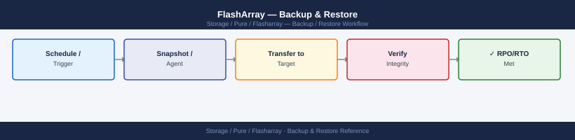
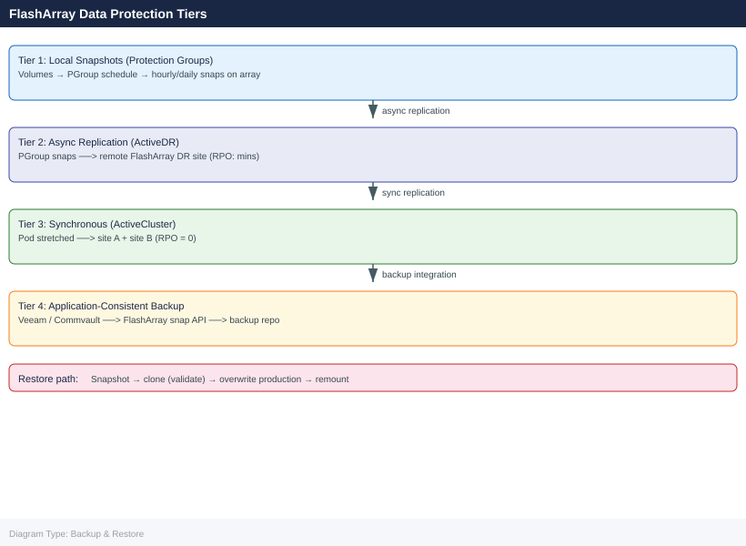

---
tags:
  - operations
  - pure
---
# FlashArray — Backup & Restore

<div class="kb-summary">
Backup & Restore reference covering Protection Group Snapshot Configuration, Restore Procedures, Backup Validation, Snapshot Capacity Management, Backup Integration with Veeam.

*Applies to: FlashArray Purity 6.x*
</div>




FlashArray provides multiple data protection tiers. Choose the tier that matches your RPO and RTO requirements for each workload.

| Tier | Technology | RPO | RTO | Use Case |
|---|---|---|---|---|
| Local snapshots (protection groups) | PGroup snapshot schedules | Minutes to hours | Minutes (for clone/mount) | Operational recovery; accidental deletion; application rollback |
| Async replication (ActiveDR) | PGroup async replication to remote array | Minutes to hours | 15–30 minutes (manual pod promote) | DR recovery at a secondary site |
| Synchronous replication (ActiveCluster) | Pod-based sync replication | Zero (RPO=0) | Zero (transparent failover) | Metro HA; zero-downtime site failure |
| SafeMode snapshots | Immutable PGroup snapshots | Same as local schedule | Same as local snapshot restore | Ransomware recovery; protection against admin-level data destruction |
| Application-consistent backup | Veeam / Commvault / NBU via FlashArray snapshot API | RPO of backup schedule | Application-dependent | Long-term retention; offsite backup; compliance archive |

---

## Before you begin

- **Access:** Storage admin credentials (cluster admin or equivalent)
- **Timing:** safe to run during business hours unless a step is marked ⚠ (causes interruption)
- **Dependencies:** no active upgrades or migrations on the same infrastructure
- **Logging:** capture command output — paste into the change record on completion

---

## Protection Group Snapshot Configuration

Protection groups (PGroups) are the primary vehicle for snapshot-based data protection. Every production volume set should belong to at least one protection group with an active snapshot schedule.

### Create and Configure a Protection Group

```bash
# Create a protection group
purepgroup create prod-oracle-pg

# Add volumes to the protection group
purepgroup addvollist prod-oracle-pg \
    --vollist prod-oracle-data-01,prod-oracle-data-02,prod-oracle-redo-01,prod-oracle-redo-02,prod-oracle-arch-01

# List protection group members
purepgroup listobj prod-oracle-pg --member-type volume

# Set a snapshot schedule:
# - Snap every 1 hour
# - Keep 24 snapshots per day
# - Retain daily snapshots for 7 days
purepgroup schedule prod-oracle-pg \
    --snap-enabled true \
    --snap-frequency 3600 \
    --snap-per-day 24 \
    --snap-for-days 7

# Verify the schedule is active
purepgroup list prod-oracle-pg --schedule
```


```text title="Expected output"
prod-oracle-pg
prod-oracle-data-01
prod-oracle-data-02
prod-oracle-redo-01
prod-oracle-redo-02
prod-oracle-arch-01
Name                          Volumes  Snapshots  Source  Schedule
prod-oracle-pg                5        0          self    enabled
Snap Frequency                3600s (1h)
Snapshots Per Day             24
Snapshot Retention (days)     7
Snap Enabled                  true
Last Snapshot                 2024-01-15T09:47:22Z
```

!!! warning "Common errors"
    **`Error: Protection group 'prod-oracle-pg' already exists`** — Use `purepgroup list` to verify existing groups, or delete the group first with `purepgroup destroy prod-oracle-pg`.
    **`Error: Volume 'prod-oracle-data-02' not found or not available`** — Verify volume names with `purevol list` and ensure all volumes are provisioned before adding to the protection group.
    **`Error: Cannot set schedule on protection group without replication target`** — Configure a replication target with `purepgroup setreplication prod-oracle-pg --target <target-array>` before enabling snapshot schedules.
**Schedule parameter guidance:**

| Parameter | Value | Meaning |
|---|---|---|
| `--snap-frequency` | Seconds | How often a snapshot is taken; 3600 = hourly, 14400 = every 4 hours |
| `--snap-per-day` | Integer | Maximum snapshots retained per calendar day |
| `--snap-for-days` | Integer | How many days worth of per-day snapshots to keep |
| `--snap-enabled` | `true`/`false` | Enables or disables the snapshot schedule |

**Retention calculation:** `snap-per-day × snap-for-days` gives the maximum snapshot count on the array from this schedule. For hourly snapshots with 24/day and 7 days: up to 168 snapshots per PG. Monitor capacity consumption with `puresnap list --space`.

---

### Async Replication to a Remote Array

```bash
# Establish a connection to the remote array (run on local array)
purearray connect --management-address <remote_mgmt_ip> \
    --replication-address <remote_repl_ip> \
    --type replication \
    remote-dr-fa-01

# Verify the connection is established
purearray list --connection

# Add the remote array as a replication target on the protection group
purepgroup connect prod-oracle-pg --target remote-dr-fa-01

# Set a replication schedule (replicate every 4 hours)
purepgroup schedule prod-oracle-pg \
    --replicate-enabled true \
    --replicate-frequency 14400

# Verify replication is running
purepgroup list prod-oracle-pg --schedule
purepgroup list prod-oracle-pg --replication
```


```text title="Expected output"
Connected to remote array remote-dr-fa-01 (10.20.50.15)
Replication address: 10.20.50.16
Connection type: replication
Connection status: connected

Name                  Management IP    Replication IP   Type         Status
remote-dr-fa-01       10.20.50.15      10.20.50.16      replication  connected

Protection group prod-oracle-pg connected to target remote-dr-fa-01

Schedule updated for prod-oracle-pg
Replication enabled: true
Replication frequency: 14400 seconds (4 hours)

Name             Schedule Status    Replicate Enabled   Frequency
prod-oracle-pg   active             true                14400s

Protection Group: prod-oracle-pg
Replication Target: remote-dr-fa-01
Last Replication: 2024-01-15 09:32:14 UTC
Next Replication: 2024-01-15 13:32:14 UTC
Replication Status: healthy
Snapshots Replicated: 847
```

!!! warning "Common errors"
    **`Error: Connection failed to 10.20.50.15 — verify the remote management IP is reachable and the arrays have network connectivity on both management and replication networks.`** — Verify network connectivity and correct IP addresses with `ping` and `traceroute`.
    **`Error: Protection group 'prod-oracle-pg' not found`** — Confirm the protection group name exists on the local array using `purepgroup list`.
    **`Error: Remote array 'remote-dr-fa-01' is not connected`** — Ensure the initial `purearray connect` command completed successfully before attempting to add it as a replication target.
---

### Take an On-Demand Snapshot

Take manual snapshots before changes, migrations, or maintenance windows:

```bash
# On-demand snapshot with a descriptive suffix
purepgroup snap \
    --pgroup prod-oracle-pg \
    --suffix premigration-$(date +%Y%m%d)

# List all snapshots for a protection group
purepgroup listsnaps prod-oracle-pg

# List with space usage
puresnap list --space
```


```text title="Expected output"
Created snapshot: prod-oracle-pg.premigration-20240315
prod-oracle-pg.premigration-20240315

Name                                    Created                  Source
prod-oracle-pg.premigration-20240315    2024-03-15 14:32:18 UTC prod-oracle-pg
prod-oracle-pg.premigration-20240314    2024-03-14 09:15:42 UTC prod-oracle-pg
prod-oracle-pg.premigration-20240313    2024-03-13 22:47:19 UTC prod-oracle-pg

Name                                    Snapshots  Physical(GB)  Virtual(GB)  Data Reduction
prod-oracle-pg.premigration-20240315    1          127.4         512.8        4.0x
prod-oracle-pg.premigration-20240314    1          119.2         512.8        4.3x
prod-oracle-pg.premigration-20240313    1          115.6         512.8        4.4x
prod-oracle-pg.premigration-20240312    1          108.9         512.8        4.7x
...
```

!!! warning "Common errors"
    **`Error: Protection group 'prod-oracle-pg' not found`** — Verify the protection group name with `purepgroup list` and ensure it exists on the array.
    **`Error: Insufficient space to create snapshot`** — Check available capacity with `purearray list --space` and delete old snapshots or add capacity if needed.
---

## Restore Procedures

### Restore a Volume from a Protection Group Snapshot

Use this procedure when recovering from accidental data corruption, application rollback, or logical data loss. Always restore to a clone first for validation before overwriting production.

**Step 1 — Identify the recovery point:**

```bash
# List all snapshots for the protection group
purepgroup listsnaps prod-oracle-pg

# The output shows snapshot names in the format:
# prod-oracle-pg.<suffix>  e.g.  prod-oracle-pg.premigration-20260501

# List individual volume snapshots inside a PG snapshot
purevol list prod-oracle-pg.premigration-20260501.*
```


```text title="Expected output"
Name                                    Source                  Created
prod-oracle-pg.premigration-20260501    prod-oracle-pg          2026-05-01 14:32:18 PDT
prod-oracle-pg.daily-20260430           prod-oracle-pg          2026-04-30 23:00:02 PDT
prod-oracle-pg.hourly-20260501-1400     prod-oracle-pg          2026-05-01 14:00:15 PDT
prod-oracle-pg.hourly-20260501-1300     prod-oracle-pg          2026-05-01 13:00:08 PDT
prod-oracle-pg.weekly-20260428          prod-oracle-pg          2026-04-28 02:15:33 PDT

Name                                              Source                              Size
prod-oracle-pg.premigration-20260501.oradb01     prod-oracle-pg.premigration-20260501  2.3T
prod-oracle-pg.premigration-20260501.oradb02     prod-oracle-pg.premigration-20260501  1.8T
prod-oracle-pg.premigration-20260501.oralog      prod-oracle-pg.premigration-20260501  847G
prod-oracle-pg.premigration-20260501.oratemp     prod-oracle-pg.premigration-20260501  512G
```

!!! warning "Common errors"
    **`Error: Protection group 'prod-oracle-pg' not found`** — Verify the protection group name with `purepgroup list` and ensure it exists on the array.
    **`Error: No snapshots found matching 'prod-oracle-pg.premigration-20260501.*'`** — Check that the snapshot name is spelled correctly and exists using `purepgroup listsnaps prod-oracle-pg`.
**Step 2 — Clone the snapshot to a temporary volume for validation:**

```bash
# Create a writable clone of the snapshot for validation
purevol copy \
    prod-oracle-pg.premigration-20260501.prod-oracle-data-01 \
    restore-validate-oracle-data-01

# Connect the clone to a validation host
purehost connect validate-host-01 --vol restore-validate-oracle-data-01

# Mount and validate the data on the validation host before overwriting production
```


```text title="Expected output"
Volume copy started: prod-oracle-pg.premigration-20260501.prod-oracle-data-01 → restore-validate-oracle-data-01
Copy progress: 100%
Volume restore-validate-oracle-data-01 created successfully (847.3 GB)

Host Connection Details:
  Host: validate-host-01
  Volume: restore-validate-oracle-data-01
  LUN: 2
  WWN: 600144588c4c3f0000005a6e2d8c0001
  Connection Status: Connected

Ready for mount and validation on validate-host-01
```

!!! warning "Common errors"
    **`Error: Volume 'prod-oracle-pg.premigration-20260501.prod-oracle-data-01' not found`** — Verify the snapshot name matches exactly using `purevol list --snap` and check for typos in the source volume name.
    **`Error: Host 'validate-host-01' not found or not initialized`** — Ensure the validation host exists and is registered on the array with `purehost list`, and that its WWNs are properly configured.
**Step 3 — Overwrite production volume (disruptive — requires host quiesce):**

```bash
# Quiesce or stop the application on the host before proceeding
# Disconnect the production volume from the host
purehost disconnect prod-oracle-01 --vol prod-oracle-data-01

# Overwrite production volume with snapshot content
purevol copy \
    prod-oracle-pg.premigration-20260501.prod-oracle-data-01 \
    --overwrite \
    prod-oracle-data-01

# Reconnect to the host
purehost connect prod-oracle-01 --vol prod-oracle-data-01

# Rescan HBA on the host; mount filesystem; validate at application layer
```

---

### Restore a Volume from a Volume-Level Snapshot

For individual volume snapshots (taken with `purevol snap` or `puresnap create`):

```bash
# List snapshots for a specific volume
purevol list prod-oracle-data-01.*

# Example output: prod-oracle-data-01.preupgrade-20260501

# Clone to a validation volume first
purevol copy prod-oracle-data-01.preupgrade-20260501 restore-validate-01

# After validation, overwrite production (disconnect host first)
purevol copy prod-oracle-data-01.preupgrade-20260501 \
    --overwrite prod-oracle-data-01
```

---

### Restore from an Async Replication Snapshot at the DR Site

For recovery at the DR site from a replicated PGroup snapshot:

```bash
# On the DR array — list replicated snapshots
purepgroup listsnaps prod-oracle-pg --on local
# Snapshots replicated from the production array appear here

# Create a volume from the replicated snapshot on the DR array
purevol copy \
    prod-oracle-pg.premigration-20260501.prod-oracle-data-01 \
    dr-restore-oracle-data-01

# Connect to DR hosts and mount for recovery
purehost connect dr-oracle-01 --vol dr-restore-oracle-data-01
```

---

### ActiveDR: Pod Promotion for DR Failover

ActiveDR uses a replica-link between pods on the production and DR arrays. To activate the DR site (promote the DR pod to writable):

```bash
# On the DR array — check the replica-link status
purepod replica-link list

# Promote the DR pod to primary (makes volumes writable on DR)
# This is a planned failover operation — coordinate with the application team
purepod demote prod-oracle-pod     # On production array (demotes prod pod)
# OR
purepod promote dr-oracle-pod      # On DR array (promotes DR pod)

# Verify pod is promoted and volumes are writable
purepod list dr-oracle-pod
purevol list dr-oracle-pod::*
```

For unplanned failover (production array is offline), promote the DR pod without demoting production first, then reconcile after production is restored.

---

### Recover a Destroyed Volume (Undelete)

Volumes that have been destroyed (`purevol destroy`) remain in a pending-eradication state for 24 hours (or longer if SafeMode is enabled). They can be recovered during this window.

```bash
# List all destroyed volumes awaiting eradication
purevol list --pending

# Recover a destroyed volume (returns it to active state)
purevol recover prod-oracle-data-01

# Verify the volume is back in active state
purevol list prod-oracle-data-01

# Reconnect to the host if needed
purehost connect prod-oracle-01 --vol prod-oracle-data-01
```

> If `purealert list` shows a volume was eradicated (permanent deletion after 24 hours), recovery is not possible from the array. Recovery requires restoring from a protection group snapshot.

---

### Recover a Destroyed Protection Group Snapshot

```bash
# List pending (not yet eradicated) snapshots
puresnap list --pending

# Recover a pending snapshot
puresnap recover prod-oracle-pg.premigration-20260501

# Verify it is available
purepgroup listsnaps prod-oracle-pg
```

---

## Backup Validation

### After Any Restore Operation

- [ ] Rescan HBA on the host side — on Linux: `echo "- - -" > /sys/class/scsi_host/hostX/scan`; on Windows: rescan disks in Disk Management or `rescan` in diskpart; on ESXi: rescan in vCenter
- [ ] Confirm the filesystem is mountable and passes fsck / chkdsk if appropriate
- [ ] Validate data integrity at the application layer — test database connectivity, run application smoke tests, confirm expected row counts or file checksums
- [ ] Run `purealert list` — confirm no alerts were generated by the restore activity
- [ ] Verify the protection group schedule is still active after the restore: `purepgroup list --schedule`
- [ ] Document the restore in the change log: timestamp, snapshot used, volumes restored, engineer, outcome, and sign-off

---

## Snapshot Capacity Management

Snapshots consume capacity proportional to the changed data between the snapshot and the current volume state (space-efficient / redirect-on-write). Uncontrolled snapshot retention causes unexpected capacity growth.

```bash
# List all snapshots with space usage (sorted by size, largest first)
puresnap list --space --sort size-

# Check total snapshot space consumption
purearray list --space
# Review the 'snapshot' field in the space output

# Check protection group schedule and retention
purepgroup list --schedule

# Eradicate snapshots that are past retention and no longer needed
# (Snapshots past their expiry are deleted automatically by the schedule)
# To manually eradicate a specific snapshot:
puresnap eradicate prod-oracle-pg.old-snapshot-20250101

# Eradicate all pending snapshots (use with caution)
puresnap eradicate --all
```

**Capacity thresholds:**

| Snapshot Capacity | Action |
|---|---|
| < 10% of array capacity | Normal; no action |
| 10–20% of array capacity | Review retention policy; confirm schedules are expiring old snaps |
| > 20% of array capacity | Investigate; identify PGs with runaway retention; reduce `snap-for-days` or `snap-per-day` |

---

## Backup Integration with Veeam

Veeam Backup & Replication integrates with FlashArray via the Pure Storage Veeam Plug-in, allowing Veeam to use FlashArray snapshots as a pre-backup step.

**Configuration overview:**

1. Install the Veeam Plug-in for Pure Storage on the Veeam server
2. In Veeam, add the FlashArray as a storage system under `Storage Infrastructure > Add Storage`
3. Provide the array management IP and a `storage_admin` API token
4. In the Veeam backup job, enable `Storage snapshots` as the backup source
5. Veeam creates a FlashArray snapshot before the backup job, mounts it on a proxy server, and backs up from the snapshot rather than live data

**Verify Veeam snapshot jobs from the array:**

```bash
# Snapshots created by Veeam appear with a 'VEEAM' suffix in the name
puresnap list | grep -i veeam

# Check protection groups Veeam is managing
purepgroup list | grep -i veeam
```

> The service account API token provided to Veeam requires `storage_admin` role — it needs to create and delete snapshots and protection groups. Do not give it `array_admin`.

---

## Verify

- Confirm the operation completed without errors in the log or management UI
- Verify the expected state change is visible (service running, object created, config applied)
- Document the outcome in the change record

---

## See also

- [FlashArray — Procedures](../procedures/)
- [FlashArray — Health Checks](../health-checks/)
- [FlashArray — Common Issues](../../troubleshooting/common-issues/)
