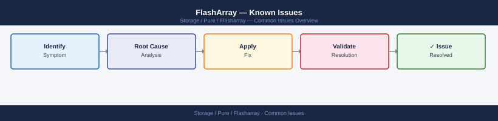
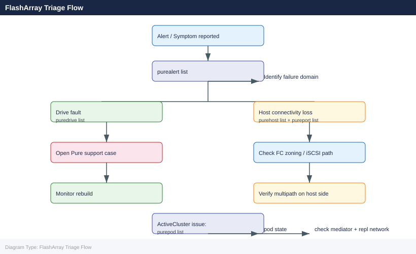

---
tags:
  - operations
  - pure
---
# FlashArray — Known Issues


<div class="kb-summary">
Known Issues reference covering Quick Reference, Incident Triage, Performance Issues, Latency Targets.

*Applies to: FlashArray Purity 6.x*
</div>





```d2
direction: right

hub: "FlashArray\nOperations" {shape: hexagon}
quick_reference: "Quick Reference" {shape: rectangle}
incident_triage: "Incident Triage" {shape: rectangle}
performance_issues: "Performance Issues" {shape: rectangle}
latency_targets: "Latency Targets" {shape: rectangle}
verify: "Verify" {shape: rectangle}

hub -> quick_reference
hub -> incident_triage
hub -> performance_issues
hub -> latency_targets
hub -> verify
```

## Before you begin

- **Access:** Storage admin credentials (cluster admin or equivalent)
- **Timing:** safe to run during business hours unless a step is marked ⚠ (causes interruption)
- **Dependencies:** no active upgrades or migrations on the same infrastructure
- **Logging:** capture command output — paste into the change record on completion

---

## Quick Reference

| Symptom | Likely Cause | Action |
|---|---|---|
| Drive in `failed` or `recovering` state | NVMe or SAS SSD failure; Purity begins automatic rebuild | Run `puredrive list` to confirm state; monitor rebuild with `puredrive list --progress`; open Pure support case if rebuild stalls or multiple drives fail |
| Host loses all paths to volumes | FC zone misconfiguration, iSCSI network outage, or both HBAs failed | Run `purehost list` and `pureport list`; verify FC zoning on switches; confirm iSCSI connectivity and routing; check host HBA status |
| Host loses one path (single-path warning) | One HBA, port, or FC switch path failed | Identify the failed path via `purehost list --connection`; check the physical port and cable on the affected array port; investigate FC switch or iSCSI switch for port errors |
| ActiveCluster pod mediator unreachable | Network change between arrays and Purity Mediator service | Run `purepod list`; verify Mediator IP is reachable from both arrays on port 443; pods continue replicating across the inter-array link even without Mediator — Mediator is only required for tiebreaker during split-brain |
| ActiveCluster pod out of sync (`unhealthy` or `paused`) | Inter-array replication link down or overloaded | Run `purepod list` for pod status; check replication network path; confirm replication interface is `up` on both arrays with `pureport list`; check for bandwidth saturation |
| Unexpected capacity growth | Snapshot retention not expiring old snaps; volume over-provisioning | Run `puresnap list --space` to identify largest consumers; check protection group schedules with `purepgroup list --schedule`; expire or eradicate stale snapshots |
| Purity upgrade hangs or fails mid-way | Pre-check condition not met; drive fault during upgrade | Check `purearray upgrade --status`; review upgrade logs; contact Pure Support with upgrade log output — do not reboot controllers manually |
| Volume not visible on host after provisioning | Volume connected to host but not to the correct host group, or host WWN/IQN not registered | Run `purehost list --connection` and `purehgroup list --connection`; confirm the host's WWN or IQN is registered; confirm volume is connected to the host or its host group; rescan HBA on the host side |
| Array reporting high latency (> 1 ms reads) | Workload spike, QoS limit, or drive rebuild consuming controller resources | Run `purearray monitor` for real-time latency/IOPS; run `purevol list --monitor` to identify top consumers; check for active drive rebuilds with `puredrive list` |
| Controller shows `not ready` or missing | Controller hardware failure or Purity process crash | Run `purearray list --controller`; confirm the surviving controller is serving I/O; open a P1 Pure support case immediately |

## Incident Triage

- [ ] Run `purealert list` first — active alerts are the fastest path to identifying the failure domain
- [ ] Run `puredrive list` — a failed or rebuilding drive is the most common hardware event
- [ ] Check host connectivity: `purehost list` — verify which hosts have lost paths; confirm expected path counts per host
- [ ] Check ActiveCluster pod state: `purepod list` — a pod in `unhealthy` or `paused` state indicates a replication or mediator event
- [ ] Review Pure1 portal for array-level health events, historical latency spikes, or capacity anomalies
- [ ] For latency issues: run `purearray monitor` and check which volumes are consuming the most IOPS/bandwidth
- [ ] If all paths lost to a host: check FC zoning or iSCSI network connectivity from the host side before escalating to Pure Support

| Question | Answer |
|---|---|
| What does `purealert list` show? | |
| Are any drives in failed or recovering state? | |
| Which hosts have lost connectivity? | |
| Is the ActiveCluster pod state healthy? | |
| Is this a single-array or dual-site issue? | |

## Performance Issues

| Symptom | Check | Action |
|---|---|---|
| High latency (> 1ms) | Volume performance | Check queue depth, host I/O pattern |
| Array fully loaded | IOPS at max | Apply QoS to top consumers |
| Latency spikes | Specific volume | Investigate host application |
| Low data reduction | Workload incompressible | Expected for encrypted/compressed data |

```bash
# Real-time array performance
purearray monitor

# Per-volume performance
purevol monitor --latency
purevol monitor --iops

# Set IOPS limit on a volume
purevol setattr <volume_name> --iops-limit 5000

# Set bandwidth limit
purevol setattr <volume_name> --bw-limit 1G

# Remove QoS limit
purevol setattr <volume_name> --iops-limit 0
```

## Latency Targets

| Range | Status | Action |
|---|---|---|
| < 500 µs read/write | Normal | None |
| 500 µs – 1 ms | Elevated | Investigate |
| > 1 ms | Abnormal | Check queue depth, host connectivity, array load |

---

## Verify

- Confirm the operation completed without errors in the log or management UI
- Verify the expected state change is visible (service running, object created, config applied)
- Document the outcome in the change record

## See also

- [FlashArray — Backup & Restore](backup-restore.md)
- [FlashArray — CLI Reference](cli-reference.md)
- [FlashArray — Health Checks](health-checks.md)
- [FlashArray — Operations](index.md)
- [FlashArray — Architecture](../architecture/)
- [FlashArray — Initial Deployment](../deploy/)
- [FlashArray — Security](../security/)
- [FlashArray — Troubleshooting](../troubleshooting/)
