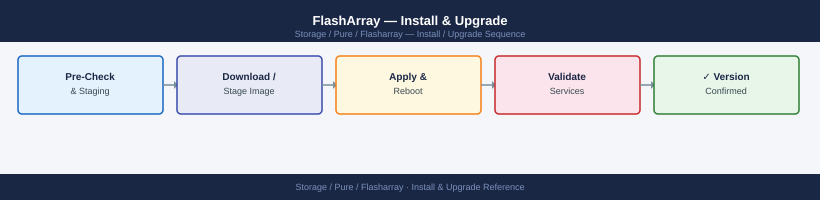
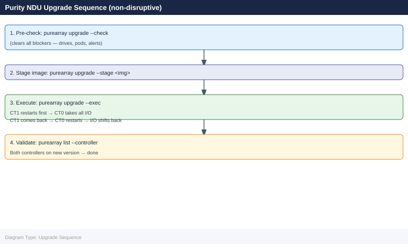

---
tags:
  - operations
  - pure
---
# FlashArray — Install & Upgrade


<div class="kb-summary">
Install & Upgrade reference covering Purity Version Matrix, Upgrade Paths, Refresh Planning, EOL Tracking.

*Applies to: FlashArray Purity 6.x*
</div>





## Before you begin

- **Access:** Storage admin credentials (cluster admin or equivalent)
- **Timing:** safe to run during business hours unless a step is marked ⚠ (causes interruption)
- **Dependencies:** no active upgrades or migrations on the same infrastructure
- **Logging:** capture command output — paste into the change record on completion

---

## Purity Version Matrix

| Version | Release Date | End of Support | Notes |
|---|---|---|---|
| Purity//FA 6.6.x | Q4 2024 | Q4 2027 (est.) | Current major; NVMe//X enhancements, SafeMode v2 |
| Purity//FA 6.5.x | Q2 2024 | Q2 2027 (est.) | Recommended for //C series QLC deployments |
| Purity//FA 6.4.x | Q4 2023 | Q4 2026 (est.) | ActiveCluster mediator API v2; long-term support candidate |
| Purity//FA 6.3.x | Q2 2023 | Q2 2026 (est.) | Approaching end of active support — plan upgrade |
| Purity//FA 6.2.x | Q4 2022 | Q4 2025 (est.) | End of support approaching — upgrade required |
| Purity//FA 6.1.x | Q2 2022 | Reached EOS | No longer supported — immediate upgrade required |
| Purity//FA 6.0.x | Q4 2021 | Reached EOS | No longer supported — immediate upgrade required |

> Always verify current support status at [Pure Support Portal](https://support.purestorage.com) — Pure updates EOS dates per release cycle.

## Upgrade Paths

Pure Storage follows an **N-2 support policy**: the two most recent major/minor release trains receive full support including bug fixes and security patches. Versions older than N-2 lose support eligibility.

**Supported upgrade sequences:**

- Direct upgrade within a minor train is always supported (e.g., 6.4.0 → 6.4.5)
- Cross-minor upgrades are supported if within the N-2 window (e.g., 6.3.x → 6.5.x)
- Skipping more than two minor versions may require an intermediate upgrade stop — always verify in Pure1 before upgrading
- Purity//FA 5.x to 6.x requires an upgrade path through a specific 6.0.x release — Pure Support will prescribe the exact sequence

**Upgrade pre-checks:**

```bash
# Confirm current version
purearray list

# Run upgrade readiness check
purearray upgrade --check

# Stage the upgrade image
purearray upgrade --stage <image_path>

# Execute upgrade (non-disruptive)
purearray upgrade --exec
```

**Key rules:**

- Never upgrade both controllers in an ActiveCluster pod simultaneously — upgrade one array at a time
- Always validate host multipathing before upgrading — single-path hosts will see an I/O pause during NDU controller restart
- Use Pure1 upgrade planning tool to confirm the target version is compatible with your hardware generation

## Refresh Planning

FlashArray hardware refreshes are managed through the Evergreen subscription model (non-disruptive controller swap) or a traditional CapEx forklift.

| Trigger | Action | Lead Time |
|---|---|---|
| Subscription controller upgrade due | Schedule Ever Modern controller upgrade with Pure account team | 30–60 days |
| Controller generation out of support | Evaluate hardware refresh or upgrade subscription tier | 90–180 days (procurement) |
| Capacity headroom below 20% | Initiate shelf or blade expansion through Evergreen//Flex or procurement | 4–12 weeks (delivery varies) |
| Purity version approaching N-2 boundary | Plan and execute Purity upgrade before support lapses | Schedule within 90 days |
| End-of-support hardware | Begin procurement/refresh planning | 6–12 months before EOL |

**Evergreen non-disruptive refresh process:**

1. Pure account team schedules controller swap date
2. Pure Support engineer performs the physical controller replacement
3. Data remains in place — no migration or host reconfiguration required
4. Purity OS upgrade to the version supported by the new controller generation may be required

## EOL Tracking

| Version | Status | Recommended Action |
|---|---|---|
| Purity//FA 6.2.x | Approaching EOS | Upgrade to 6.4.x or 6.5.x within 90 days |
| Purity//FA 6.1.x | End of Support | Upgrade immediately — no bug fixes or security patches |
| Purity//FA 6.0.x | End of Support | Upgrade immediately |
| Purity//FA 5.3.x and earlier | End of Support | Upgrade required — consult Pure Support for upgrade path |
| FA-300 / FA-400 hardware | End of Life | Hardware refresh required — contact Pure account team |

Maintain a quarterly review of Pure's published compatibility matrix and EOL announcements. Subscribe to Pure Support notifications for your array's Purity version to receive advance EOS warnings.

---

## Verify

- Confirm the operation completed without errors in the log or management UI
- Verify the expected state change is visible (service running, object created, config applied)
- Document the outcome in the change record

---

## See also

- [FlashArray — Procedures](procedures/)
- [FlashArray — Health Checks](health-checks/)
- [FlashArray — Deploy](../deploy/)
