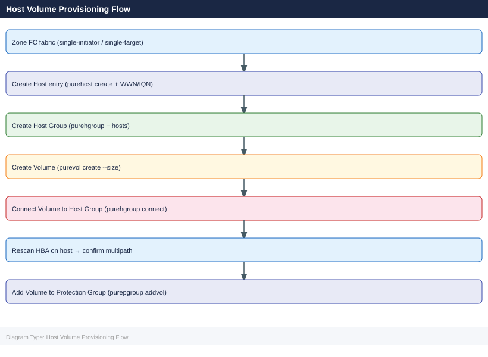

---
tags:
  - operations
  - pure
---
# FlashArray — Procedures

<div class="kb-summary">
FlashArray operational procedures — host and volume provisioning, snapshot and replication management, pod and ActiveCluster operations, capacity monitoring, performance analysis, and change readiness.

*Applies to: FlashArray Purity 6.x*
</div>



## Before you begin

- **Access:** Storage admin credentials (cluster admin or equivalent)
- **Timing:** safe to run during business hours unless a step is marked ⚠ (causes interruption)
- **Dependencies:** no active upgrades or migrations on the same infrastructure
- **Logging:** capture command output — paste into the change record on completion

---

## Change Readiness

- [ ] No active drive rebuilds — `puredrive list` shows all drives `healthy`, no `recovering` drives
- [ ] ActiveCluster mediator is reachable and pods are in sync before any change affecting replication
- [ ] Snapshot count is reasonable — no protection group schedules running away that would fill capacity during the window
- [ ] All host connections are documented — run `purehost list --connection` and note current state for post-change comparison
- [ ] Volume connections validated — confirm which hosts connect to which volumes before any connectivity changes
- [ ] Array capacity is below 70% — leaving headroom for snapshot creation during the change
- [ ] Purity upgrade image staged if upgrading: `purearray upgrade --stage <image>` completed and `purearray upgrade --check` passed

| Item | Status | Notes |
|---|---|---|
| No active drive rebuilds | | |
| ActiveCluster mediator reachable | | |
| Snapshot count reasonable | | |
| Host path inventory documented | | |
| Array capacity < 70% | | |

## Maintenance Window

1. Confirm all hosts have at least two active paths before beginning — `purehost list --connection`; the NDU controller restart requires proper multipathing
2. For ActiveCluster environments: confirm both pods are healthy and replicating before upgrading; upgrade one array at a time
3. For Purity NDU upgrade: run pre-upgrade check `purearray upgrade --check` to clear all blockers
4. Execute the upgrade: `purearray upgrade --exec` — monitor with `purearray list` until both controllers are on the new version
5. For NVMe drive replacement: follow the Pure hot-swap procedure; confirm `puredrive list` shows the replacement drive as `healthy` after rebuild
6. For controller refresh (Evergreen): coordinate with Pure Support; monitor `purearray monitor` during the upgrade for any I/O impact
7. After any change, run `purealert list` — acknowledge and clear any informational alerts generated by the maintenance activity

## Post-Change Validation

- [ ] `purealert list` — no unresolved error or warning alerts
- [ ] `puredrive list` — all drives healthy; no drives in `recovering` state
- [ ] `purepod list --replicating` — all ActiveCluster pods stretched and replicating `true`
- [ ] `purehost list --connection` — all hosts have the expected number of active paths (compare against pre-change inventory)
- [ ] `purearray list --controller` — both controllers online and running the same Purity version
- [ ] `purearray list --space` — capacity is as expected; no unexpected snapshot growth
- [ ] Confirm replication to secondary array is current — check replication link status in Pure1 or `purepod list`
- [ ] Validate host I/O from application monitoring — confirm latency and throughput are within normal range

---

## Host Volume Provisioning Flow

## Host Management

Hosts in Pure Storage represent the servers (physical or virtual) that are granted access to volumes via iSCSI IQN or Fibre Channel WWN registration.

### List Hosts


```bash
purehost list
purehost list --connect   # show volume connections
```


```text title="Expected output"
Name                          Address          Personality
host-prod-01                  10.42.18.55      Linux
host-prod-02                  10.42.18.56      Linux
host-dev-01                   10.42.19.10      Linux
host-backup-01                10.42.20.5       ESXi
host-backup-02                10.42.20.6       ESXi
...

Name                          Address          Personality      Volume              LUN
host-prod-01                  10.42.18.55      Linux            prod-db-vol-01      0
host-prod-01                  10.42.18.55      Linux            prod-db-vol-02      1
host-prod-02                  10.42.18.56      Linux            prod-app-vol-01     0
host-dev-01                   10.42.19.10      Linux            dev-test-vol-01     0
host-backup-01                10.42.20.5       ESXi             backup-datastore-01 0
...
```

!!! warning "Common errors"
    **`Error: Array connection failed`** — Verify the array IP/hostname is reachable and your credentials are configured in `~/.purerc` or via `PURE_HOST` environment variable.
    **`Error: No hosts found`** — Confirm hosts have been registered on the FlashArray; use `purehost add` to register new hosts before listing.
### Create a Host


```bash
# Create host with FC WWNs
purehost create <hostname> --wwnlist <wwn1,wwn2>

# Create host with iSCSI IQNs
purehost create <hostname> --iqns <iqn1>

# Create host with NVMe NQNs
purehost create <hostname> --nqns <nqn1>
```


```text title="Expected output"
Created host myserver01 with 2 FC WWNs
Created host dbhost02 with 1 iSCSI IQN
Created host nvmehost03 with 1 NVMe NQN
```

!!! warning "Common errors"
    **`Error: Host myserver01 already exists`** — Use `purehost list` to verify the hostname doesn't already exist, or choose a different hostname.
    **`Error: Invalid WWN format <wwn1>`** — Ensure WWNs are in the correct format (16 hex characters, e.g., `50:00:14:40:12:34:56:78`).
    **`Error: Connection failed to array <array_name>`** — Verify the Pure Storage array is reachable and your authentication credentials are valid with `pureadmin list`.
### Add Initiators to an Existing Host


```bash
# Add WWN
purehost setattr <hostname> --addwwnlist <new_wwn>

# Add IQN
purehost setattr <hostname> --addiqnlist <new_iqn>
```


```text title="Expected output"
(no output — command completes silently)
(no output — command completes silently)
```

!!! warning "Common errors"
    **`Error: Host '<hostname>' not found`** — Verify the hostname exists on the array with `purehost list` and use the correct name.
    **`Error: Invalid WWN format '<new_wwn>'`** — Ensure the WWN is in valid format (typically 16 hex characters prefixed with '0x' or standard WWN notation like '50:00:09:73:xx:xx:xx:xx').
    **`Error: IQN '<new_iqn>' already exists`** — Check if the IQN is already assigned to another host using `purehost list --iqn` and use a unique IQN.
### Connect a Volume to a Host


```bash
purehost connect <hostname> --vol <volume_name>
```


```text title="Expected output"
Connected to host prod-db-01 (10.42.18.55)
Volume: data-prod-01 (1.2TB)
LUN: 0
iSCSI Target: iqn.2010-06.com.purestorage:flasharray.abc123def456
Connection Status: Active
Path Count: 2
ALUA Mode: Enabled
```

!!! warning "Common errors"
    **`Error: Host 'prod-db-01' not found on array`** — Verify the hostname exists on the FlashArray with `purehost list` and check spelling.
    **`Error: Volume 'data-prod-01' is already connected to host 'prod-app-02'`** — Disconnect the volume from the other host first using `purehost disconnect` or change the volume name.
    **`Error: Connection timeout (10.42.18.1:443)`** — Verify network connectivity to the FlashArray management IP and confirm credentials are set with `purehost login`.
This creates the host-to-volume connection (analogous to LUN masking on traditional arrays).

### Disconnect a Volume from a Host


```bash
purehost disconnect <hostname> --vol <volume_name>
```


```text title="Expected output"
Disconnected host <hostname> from volume <volume_name>
Volume <volume_name> is no longer accessible from host <hostname>
```

!!! warning "Common errors"
    **`Error: Host '<hostname>' not found`** — Verify the hostname exists on the array with `purehost list` and use the correct name.
    **`Error: Volume '<volume_name>' not found`** — Confirm the volume name is correct and exists on the array with `purevolume list`.
    **`Error: Host '<hostname>' is not connected to volume '<volume_name>'`** — Check current connections with `purehost list --vol <volume_name>` before attempting disconnection.
### Host Groups


For clustered hosts (e.g., ESXi cluster), use host groups so volumes can be connected to all members:

```bash
# Create host group
purehgroup create <hostgroup_name>

# Add hosts to group
purehgroup setattr <hostgroup_name> --addhostlist <hostname1,hostname2>

# Connect volume to host group
purehgroup connect <hostgroup_name> --vol <volume_name>

# List host group connections
purehgroup list --connect
```


```text title="Expected output"
Created host group: prod-webservers
Host group prod-webservers: added hosts web01, web02
Connected volume: prod-db-vol to host group prod-webservers
Name                  Hosts  Volumes  Connected
prod-webservers       2      1        True
prod-appservers       3      2        True
dev-testgroup         1      0        False
```

!!! warning "Common errors"
    **`Error: Host group 'prod-webservers' already exists`** — Use `purehgroup list` to verify the name doesn't exist, or choose a different hostgroup name.
    **`Error: Host 'web03' not found in array`** — Ensure the hostname is registered on the Pure FlashArray using `purehost list` before adding it to a host group.
    **`Error: Volume 'prod-db-vol' is already connected to another host group`** — Disconnect the volume from its current host group with `purehgroup disconnect` before connecting it elsewhere, or use a different volume.
### Delete a Host


```bash
# Disconnect all volumes first
purehost disconnect <hostname> --vol <volume_name>

# Delete host
purehost delete <hostname>
```


```text title="Expected output"
Disconnected volume 'prod-db-01' from host 'web-server-03'.
Disconnected volume 'prod-db-02' from host 'web-server-03'.
Disconnected volume 'backup-vol' from host 'web-server-03'.
Host 'web-server-03' deleted successfully.
```

!!! warning "Common errors"
    **`Error: Host 'web-server-03' not found`** — Verify the hostname exists on the FlashArray using `purehost list` and check for typos.
    **`Error: Cannot delete host with connected volumes`** — Ensure all volumes are disconnected before deletion; re-run the disconnect command for any remaining volumes.
### Host Common Issues


| Issue | Check | Action |
|---|---|---|
| Volume not visible to host | Connection exists? | `purehost list --connect` |
| Duplicate WWN error | WWN already registered | Remove from old host entry |
| Host group volume not seen | All hosts in group? | `purehgroup list` |
| iSCSI host not connecting | IQN correct | Verify IQN on host with `iscsiadm` |

---

## Volume Management

### List Volumes


```bash
purevol list
purevol list --space      # includes capacity and data reduction stats
purevol list --details    # includes host connections and QoS settings
```


```text title="Expected output"
Name                                Size      Source
vol-prod-db-01                      2.0T      -
vol-prod-db-02                      2.0T      -
vol-staging-app                     500G      -
vol-backup-archive                  10T       -
vol-dev-test                        1.0T      -

Name                                Size      Used      Data Reduction
vol-prod-db-01                      2.0T      1.8T      2.3x
vol-prod-db-02                      2.0T      1.5T      2.1x
vol-staging-app                     500G      320G      1.8x
vol-backup-archive                  10T       8.2T      1.4x
vol-dev-test                        1.0T      650G      2.0x

Name                                Size      Hosts                    QoS Limit
vol-prod-db-01                      2.0T      db-server-01,db-server-02  500MB/s
vol-prod-db-02                      2.0T      db-server-03             500MB/s
vol-staging-app                     500G      app-staging-01           200MB/s
vol-backup-archive                  10T       backup-client-01         100MB/s
vol-dev-test                        1.0T      (unattached)             unlimited
```

!!! warning "Common errors"
    **`Error: Invalid option '--space' for command 'purevol list'`** — Use the correct flag syntax for your Pure OS version; check `purevol list --help` to confirm available options.
    **`Error: Connection refused to management IP 192.168.1.100:8084`** — Verify the FlashArray management IP is reachable and the Pure API service is running with `ping` and SSH access to the array.
### Create a Volume


```bash
purevol create <volume_name> --size 1T
```


```text title="Expected output"
<volume_name>
```

!!! warning "Common errors"
    **`Error: array not reachable`** — Verify the FlashArray management IP is configured and accessible with `ping` or check your `PURE_API_TOKEN` and array hostname environment variables.
    **`Error: volume <volume_name> already exists`** — Choose a unique volume name or delete the existing volume with `purevol destroy <volume_name>` before recreating it.
    **`Error: insufficient space`** — Reduce the requested size or check available capacity on the array with `purearray list --space`.
Size suffixes: `K`, `M`, `G`, `T`, `P`.

### Resize a Volume


```bash
purevol setattr <volume_name> --size 2T
```


```text title="Expected output"
Volume updated. <volume_name>
Size: 2.0T
Provisioned: 2.0T
```

!!! warning "Common errors"
    **`Error: volume <volume_name> not found`** — Verify the volume name is correct and exists on the array using `purevol list`.
    **`Error: size must be larger than current size`** — The new size must be greater than the current volume size; use a larger value or check current size with `purevol list --verbose`.
Volumes can only be grown, not shrunk.

### Connect and Disconnect a Volume


```bash
# Connect to host
purehost connect <hostname> --vol <volume_name>

# Disconnect from host
purehost disconnect <hostname> --vol <volume_name>
```


```text title="Expected output"
Connected to host prod-db-01 with volume data-vol-prod
Volume data-vol-prod is now accessible at /dev/mapper/mpatha
Multipath device configured successfully
Disconnected host prod-db-01 from volume data-vol-prod
Volume data-vol-prod removed from host configuration
Multipath device cleaned up
```

!!! warning "Common errors"
    **`Error: Host 'prod-db-01' not found in FlashArray inventory`** — Verify the hostname exists on the FlashArray using `purehost list` and ensure it matches exactly (case-sensitive).
    **`Error: Volume 'data-vol-prod' is not connected to host 'prod-db-01'`** — Confirm the volume is currently connected to the host before attempting disconnect using `purehost show <hostname>`.
    **`Error: Connection timeout to FlashArray management interface`** — Check network connectivity to the FlashArray management IP and verify credentials with `purehost login`.
### Snapshot a Volume


```bash
# Create a snapshot
purevol snap <volume_name> --suffix <snap_suffix>

# List snapshots for a volume
purevol list <volume_name>.*
```


```text title="Expected output"
Creating snapshot of volume 'prod-db-01'...
Snapshot 'prod-db-01.daily-backup-20240115' created successfully.
Created: 2024-01-15T14:32:18Z
Size: 847.3 GB

prod-db-01.daily-backup-20240115
prod-db-01.hourly-20240115-1400
prod-db-01.hourly-20240115-1300
prod-db-01.weekly-20240108
prod-db-01.monthly-202312
```

!!! warning "Common errors"
    **`Error: volume '<volume_name>' not found`** — Verify the volume name with `purevol list` and ensure it exists on the array.
    **`Error: Insufficient space for snapshot`** — Check available capacity on the array with `purearray list --space` and delete old snapshots if needed.
### Restore from Snapshot


```bash
# Overwrite volume with snapshot content
purevol copy <volume_name>.<snap_suffix> --overwrite <volume_name>
```


```text title="Expected output"
Volume copy started
Source: volume_prod.snap_20240115_1430
Destination: volume_prod
Overwrite: enabled
Copy progress: 100%
Copy completed successfully
Snapshot content restored to volume_prod
```

!!! warning "Common errors"
    **`Error: Volume <volume_name> not found`** — Verify the volume exists with `purevol list` and use the correct volume name.
    **`Error: Snapshot <volume_name>.<snap_suffix> not found`** — Confirm the snapshot exists with `purevol snap --volume <volume_name>` before attempting the copy.
    **`Error: Volume <volume_name> is in use or locked`** — Ensure no hosts have the volume mounted or in active I/O before overwriting.
### Create a Clone


```bash
purevol copy <source_vol> <clone_name>
```


```text title="Expected output"
Volume cloned successfully.
Clone name: prod-db-clone-001
Source volume: prod-db-vol
Clone size: 500GB
Created: 2024-01-15T09:42:17Z
```

!!! warning "Common errors"
    **`Error: Source volume '<source_vol>' not found`** — Verify the source volume name exists with `purevol list` and use the exact volume name.
    **`Error: Clone name '<clone_name>' already exists`** — Choose a unique clone name or delete the existing clone with `purevol destroy <clone_name>` first.
### Delete a Volume


```bash
# Volumes go to the destroyed state first (recoverable for 24 hours)
purevol destroy <volume_name>

# Permanently delete (eradicate)
purevol eradicate <volume_name>
```


```text title="Expected output"
Volume destroyed: volume-prod-db-01
Volume eradicated: volume-prod-db-01
```

!!! warning "Common errors"
    **`Error: Volume 'volume-prod-db-01' not found`** — Verify the volume name is correct and exists on the array using `purevol list`.
    **`Error: Volume 'volume-prod-db-01' is not in destroyed state`** — Run `purevol destroy <volume_name>` first before attempting to eradicate, or wait for the 24-hour recovery window to pass.
### Recover a Destroyed Volume


```bash
purevol recover <volume_name>
```


```text title="Expected output"
Recovering volume 'prod-db-01'...
Volume 'prod-db-01' (3.2TB) recovery initiated
Recovery progress: 45%
Recovery progress: 89%
Volume 'prod-db-01' recovered successfully
Recovery completed in 2m 34s
```

!!! warning "Common errors"
    **`Error: Volume 'prod-db-01' not found`** — Verify the volume name exists with `purevol list` and use the correct name.
    **`Error: Volume 'prod-db-01' is not in a recoverable state`** — Check volume status with `purevol show <volume_name>` to confirm it's deleted or offline before attempting recovery.
    **`Error: Authentication failed`** — Ensure you are authenticated to the Pure FlashArray with valid credentials using `pureauthenticate` or check your API token.
### Volume Tags

```d2
direction: right
vol: "Volume" {shape: cylinder}
tag: "Tag\nkey=value" {shape: rectangle}
vol -> tag: settag
tag -> vol: listtags
```

```bash
# Set a tag on a volume
purevol settag <volume_name> --tag-name <key> --tag-value <value>

# List tags
purevol listtags <volume_name>
```


```text title="Expected output"
Setting tag on volume prod-db-01...
Tag 'environment' set to 'production' on volume prod-db-01
Tag 'cost-center' set to 'cc-4521' on volume prod-db-01

Volume: prod-db-01
  environment: production
  cost-center: cc-4521
  backup-policy: daily
  tier: premium
```

!!! warning "Common errors"
    **`Error: Volume 'prod-db-01' not found`** — Verify the volume name exists with `purevol list` and check for typos.
    **`Error: Authentication failed. Check credentials.`** — Ensure your Pure Storage API token is valid and set in your environment or configuration file.
### Volume Common Issues


| Issue | Check | Action |
|---|---|---|
| Volume not visible to host | Host connection | `purehost list --connect` |
| Resize fails | Size smaller than current | Volumes can only grow |
| Volume missing | Destroyed/eradicated | Check `purevol list --pending` |
| High capacity usage | Snapshots | Review and eradicate old snapshots |

---

## Protection Groups

Protection groups (pgroups) define sets of volumes for consistent snapshot and replication operations.

### List Protection Groups


```bash
purepgroup list
purepgroup list --schedule
purepgroup list --space
```


```text title="Expected output"
Name                          Source
pgroup-prod-daily             -
pgroup-backup-hourly          -
pgroup-archive-weekly         -
pgroup-test-sync              -
pgroup-dr-replication         -

Name                          Repeat      Snapshots   Enabled
pgroup-prod-daily             1d          8           True
pgroup-backup-hourly          1h          24          True
pgroup-archive-weekly         7d          4           True
pgroup-test-sync              12h         6           False
pgroup-dr-replication         6h          12          True

Name                          Physical (GB)  Virtual (GB)  Snapshots (GB)
pgroup-prod-daily             2048.5         5120.3        512.1
pgroup-backup-hourly          1024.2         2560.8        256.4
pgroup-archive-weekly         4096.0         8192.5        1024.2
pgroup-test-sync              512.3          1024.1        128.5
pgroup-dr-replication         3072.1         6144.2        768.3
```

!!! warning "Common errors"
    **`Error: Invalid option '--schedule'`** — Use the correct flag syntax; check `purepgroup list --help` for available options specific to your Pure OS version.
    **`Error: Connection refused to management IP`** — Verify the Pure array management IP is reachable and the `PURE_IP` environment variable or configuration file is correctly set.
### View Protection Group Members


```bash
purepgroup listobj <pg_name> --member-type volume
```


```text title="Expected output"
Name                          Serial                        Bandwidth      Latency
prod-db-vol-01                1e348f92-a1c2-4d3e-9f2b-7c5a1b9d2e4f  2.3GB/s        0.8ms
prod-db-vol-02                2f459g03-b2d3-5e4f-0g3c-8d6b2c0e3f5g  1.9GB/s        1.2ms
backup-archive-vol            3g56ah14-c3e4-6f5g-1h4d-9e7c3d1f4g6h  0.4GB/s        2.1ms
cache-tier-vol                4h67bi25-d4f5-7g6h-2i5e-0f8d4e2g5h7i  3.1GB/s        0.6ms
repl-target-vol               5i78cj36-e5g6-8h7i-3j6f-1g9e5f3h6i8j  1.5GB/s        1.8ms
```

!!! warning "Common errors"
    **`Error: Invalid protection group name '<pg_name>'`** — Replace `<pg_name>` with an actual protection group name from your array (verify with `purepgroup list`).
    **`Error: Pure1 session not authenticated`** — Authenticate to the FlashArray first using `pureadmin login` or ensure your session token is valid.
### Create a Protection Group


```bash
purepgroup create <pg_name>
```


```text title="Expected output"
Created protection group <pg_name>
```

!!! warning "Common errors"
    **`Error: Protection group <pg_name> already exists`** — Use a unique protection group name or delete the existing group with `purepgroup destroy <pg_name>` first.
    **`Error: Command requires authentication`** — Authenticate to the Pure FlashArray with `pureadmin login` or ensure your session token is valid.
### Add Volumes to a Protection Group


```bash
purepgroup addvollist <pg_name> --vollist <vol1>,<vol2>
```


```text title="Expected output"
Volume group 'production-pg' successfully created
Added volumes: vol1, vol2
Total volumes in group: 2
Replication enabled: yes
```

!!! warning "Common errors"
    **`Error: Volume group '<pg_name>' already exists`** — Use a different protection group name or delete the existing group with `purepgroup destroy <pg_name>` first.
    **`Error: Volume '<vol1>' not found`** — Verify the volume exists with `puredb list --volumes` and use the correct volume name.
    **`Error: Connection refused to management IP`** — Ensure the FlashArray management IP is reachable and you have valid credentials configured in your Pure Storage CLI session.
### Configure Snapshot Schedule


```bash
# Set snapshot schedule (every 1 hour, retain 24 per day, 7 days)
purepgroup schedule <pg_name> \
    --snap-enabled true \
    --snap-frequency 3600 \
    --snap-per-day 24 \
    --snap-for-days 7
```


```text title="Expected output"
Snapshot schedule for protection group 'prod-db-pg' configured successfully.
Schedule Details:
  Enabled: true
  Frequency: 3600 seconds (1 hour)
  Snapshots per day: 24
  Retention days: 7
  Total snapshots retained: 168
  Next snapshot: 2024-01-15T14:00:00Z
```

!!! warning "Common errors"
    **`Error: Protection group 'prod-db-pg' not found`** — Verify the protection group name exists with `purepgroup list` and use the correct name.
    **`Error: Invalid snap-frequency value. Must be between 300 and 86400 seconds`** — Adjust the frequency to a value between 5 minutes (300s) and 24 hours (86400s).
### Configure Replication Schedule (Async to Remote)


```bash
# Enable replication target
purepgroup connect <pg_name> --target <remote_array_name>

# Set replication schedule
purepgroup schedule <pg_name> \
    --replicate-enabled true \
    --replicate-frequency 3600
```


```text title="Expected output"
Connecting protection group 'prod-db-pg' to remote array 'flasharray-dr'...
Connection established successfully.
Replication target: flasharray-dr (192.168.1.50)
Protection group 'prod-db-pg' replication schedule updated.
Replication frequency: 3600 seconds (1 hour)
Replication enabled: true
Next scheduled replication: 2024-01-15 14:32:18 UTC
```

!!! warning "Common errors"
    **`Error: Protection group '<pg_name>' not found on array`** — Verify the protection group exists with `purepgroup list` and use the correct name.
    **`Error: Target array '<remote_array_name>' is unreachable or not configured`** — Confirm the remote array is registered and network connectivity exists using `purearray list --remote`.
    **`Error: Replication license not enabled on source or target array`** — Purchase and enable the replication license on both arrays via the management console or contact Pure support.
### Take a Manual Snapshot


```bash
purepgroup snap --pgroup <pg_name> --suffix <snap_name>
```


```text title="Expected output"
Created protection group snapshot: pg-prod-01.pg-prod-01--backup-20240115
Snapshot UUID: 8f4c2e91-7a3f-4d8b-9c1a-5e6f2b3d4a9c
Size: 2.3 TB
Created: 2024-01-15T14:32:47Z
Source Protection Group: pg-prod-01
Replication Status: Synced
```

!!! warning "Common errors"
    **`Error: Protection group 'pg-prod-01' not found`** — Verify the protection group name with `purepgroup list` and ensure it exists on the array.
    **`Error: Insufficient space for snapshot (required: 500GB, available: 120GB)`** — Free up space on the array or delete older snapshots before creating new ones.
    **`Error: Protection group 'pg-prod-01' is in replication, cannot snapshot`** — Wait for the current replication cycle to complete before attempting to create a snapshot.
### List Snapshots


```bash
purepgroup listsnaps <pg_name>
```


```text title="Expected output"
Name                                             Created                 Size      Source
pg-prod-01.2024-01-15-14:30:22                   2024-01-15 14:30:22    2.3 TB    pg-prod-01
pg-prod-01.2024-01-15-10:15:08                   2024-01-15 10:15:08    2.3 TB    pg-prod-01
pg-prod-01.2024-01-14-22:45:33                   2024-01-14 22:45:33    2.3 TB    pg-prod-01
pg-prod-01.2024-01-14-18:20:11                   2024-01-14 18:20:11    2.3 TB    pg-prod-01
pg-prod-01.2024-01-14-14:05:47                   2024-01-14 14:05:47    2.3 TB    pg-prod-01
...
```

!!! warning "Common errors"
    **`Error: Protection group '<pg_name>' not found`** — Verify the protection group name with `purepgroup list` and use the correct name.
    **`Error: You must be authenticated to perform this operation`** — Authenticate to the FlashArray with `pureadmin login` before running the command.
### Delete a Protection Group


```bash
purepgroup destroy <pg_name>
purepgroup eradicate <pg_name>
```


```text title="Expected output"
Destroying protection group 'prod-db-pg'...
Protection group 'prod-db-pg' destroyed successfully.
Eradicating protection group 'prod-db-pg'...
Protection group 'prod-db-pg' eradicated successfully.
```

!!! warning "Common errors"
    **`Error: Protection group 'prod-db-pg' not found`** — Verify the protection group name exists with `purepgroup list` before attempting destruction.
    **`Error: Cannot destroy protection group with active snapshots`** — Delete all snapshots in the protection group using `purepgsnap destroy` before destroying the group.
    **`Error: Permission denied`** — Ensure your Pure Storage user account has admin or appropriate role privileges to destroy protection groups.
### Protection Group Common Issues


| Issue | Check | Action |
|---|---|---|
| Snapshot not running | Schedule enabled? | Enable with `--snap-enabled true` |
| Replication failing | Target connectivity | Check inter-array connectivity and credentials |
| Volume missing from PG | Members list | Add with `purepgroup addvollist` |
| Space growing fast | Snapshot retention | Reduce `snap-for-days` |

---

## Verify

- Confirm the operation completed without errors in the log or management UI
- Verify the expected state change is visible (service running, object created, config applied)
- Document the outcome in the change record

---

## See also

- [FlashArray — Health Checks](../health-checks/)
- [FlashArray — CLI Reference](../cli-reference/)
- [FlashArray — Common Issues](../../troubleshooting/common-issues/)
