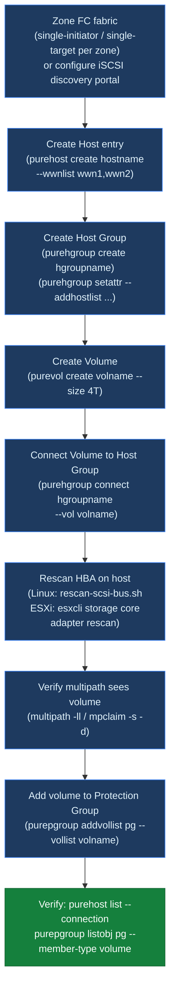

---
tags:
  - operations
  - pure
---
# FlashArray — Procedures


<div class="kb-summary">
FlashArray operational procedures — host and volume provisioning, snapshot and replication management, pod and ActiveCluster operations, capacity monitoring, performance analysis, and change readiness.

*Applies to: FlashArray Purity 6.x*
</div>

```text
Host Volume Provisioning Flow
  ┌───────────────────────────────────────────────────────────────────────────────────────────────────────┐
  │  Zone FC fabric (single-initiator / single-target)  │
  └───────────────────────────────────────────────────────────────────────────────────────────────────────┘
                          ▼
  ┌───────────────────────────────────────────────────────────────────────────────────────────────────────┐
  │  Create Host entry (purehost create + WWN/IQN)      │
  └───────────────────────────────────────────────────────────────────────────────────────────────────────┘
                          ▼
  ┌───────────────────────────────────────────────────────────────────────────────────────────────────────┐
  │  Create Host Group (purehgroup + hosts)             │
  └───────────────────────────────────────────────────────────────────────────────────────────────────────┘
                          ▼
  ┌───────────────────────────────────────────────────────────────────────────────────────────────────────┐
  │  Create Volume (purevol create --size)              │
  └───────────────────────────────────────────────────────────────────────────────────────────────────────┘
                          ▼
  ┌───────────────────────────────────────────────────────────────────────────────────────────────────────┐
  │  Connect Volume to Host Group (purehgroup connect)  │
  └───────────────────────────────────────────────────────────────────────────────────────────────────────┘
                          ▼
  ┌───────────────────────────────────────────────────────────────────────────────────────────────────────┐
  │  Rescan HBA on host → confirm multipath             │
  └───────────────────────────────────────────────────────────────────────────────────────────────────────┘
                          ▼
  ┌───────────────────────────────────────────────────────────────────────────────────────────────────────┐
  │  Add Volume to Protection Group (purepgroup addvol) │
  └───────────────────────────────────────────────────────────────────────────────────────────────────────┘
```

## Before you begin

- **Access:** Storage admin credentials (cluster admin or equivalent)
- **Timing:** safe to run during business hours unless a step is marked ⚠ (causes interruption)
- **Dependencies:** no active upgrades or migrations on the same infrastructure
- **Logging:** capture command output — paste into the change record on completion

---

## Change Readiness

- [ ] No active drive rebuilds — `puredrive list` shows all drives `healthy`, no `recovering` drives
- [ ] ActiveCluster mediator is reachable and pods are in sync before any change affecting replication
- [ ] Snapshot count is reasonable — no protection group schedules running away that would fill capacity during the window
- [ ] All host connections are documented — run `purehost list --connection` and note current state for post-change comparison
- [ ] Volume connections validated — confirm which hosts connect to which volumes before any connectivity changes
- [ ] Array capacity is below 70% — leaving headroom for snapshot creation during the change
- [ ] Purity upgrade image staged if upgrading: `purearray upgrade --stage <image>` completed and `purearray upgrade --check` passed

| Item | Status | Notes |
|---|---|---|
| No active drive rebuilds | | |
| ActiveCluster mediator reachable | | |
| Snapshot count reasonable | | |
| Host path inventory documented | | |
| Array capacity < 70% | | |

## Maintenance Window

1. Confirm all hosts have at least two active paths before beginning — `purehost list --connection`; the NDU controller restart requires proper multipathing
2. For ActiveCluster environments: confirm both pods are healthy and replicating before upgrading; upgrade one array at a time
3. For Purity NDU upgrade: run pre-upgrade check `purearray upgrade --check` to clear all blockers
4. Execute the upgrade: `purearray upgrade --exec` — monitor with `purearray list` until both controllers are on the new version
5. For NVMe drive replacement: follow the Pure hot-swap procedure; confirm `puredrive list` shows the replacement drive as `healthy` after rebuild
6. For controller refresh (Evergreen): coordinate with Pure Support; monitor `purearray monitor` during the upgrade for any I/O impact
7. After any change, run `purealert list` — acknowledge and clear any informational alerts generated by the maintenance activity

## Post-Change Validation

- [ ] `purealert list` — no unresolved error or warning alerts
- [ ] `puredrive list` — all drives healthy; no drives in `recovering` state
- [ ] `purepod list --replicating` — all ActiveCluster pods stretched and replicating `true`
- [ ] `purehost list --connection` — all hosts have the expected number of active paths (compare against pre-change inventory)
- [ ] `purearray list --controller` — both controllers online and running the same Purity version
- [ ] `purearray list --space` — capacity is as expected; no unexpected snapshot growth
- [ ] Confirm replication to secondary array is current — check replication link status in Pure1 or `purepod list`
- [ ] Validate host I/O from application monitoring — confirm latency and throughput are within normal range

---

## Host Volume Provisioning Flow



## Host Management

Hosts in Pure Storage represent the servers (physical or virtual) that are granted access to volumes via iSCSI IQN or Fibre Channel WWN registration.

### List Hosts


```bash
purehost list
purehost list --connect   # show volume connections
```

### Create a Host


```bash
# Create host with FC WWNs
purehost create <hostname> --wwnlist <wwn1,wwn2>

# Create host with iSCSI IQNs
purehost create <hostname> --iqns <iqn1>

# Create host with NVMe NQNs
purehost create <hostname> --nqns <nqn1>
```

### Add Initiators to an Existing Host


```bash
# Add WWN
purehost setattr <hostname> --addwwnlist <new_wwn>

# Add IQN
purehost setattr <hostname> --addiqnlist <new_iqn>
```

### Connect a Volume to a Host


```bash
purehost connect <hostname> --vol <volume_name>
```

This creates the host-to-volume connection (analogous to LUN masking on traditional arrays).

### Disconnect a Volume from a Host


```bash
purehost disconnect <hostname> --vol <volume_name>
```

### Host Groups


For clustered hosts (e.g., ESXi cluster), use host groups so volumes can be connected to all members:

```bash
# Create host group
purehgroup create <hostgroup_name>

# Add hosts to group
purehgroup setattr <hostgroup_name> --addhostlist <hostname1,hostname2>

# Connect volume to host group
purehgroup connect <hostgroup_name> --vol <volume_name>

# List host group connections
purehgroup list --connect
```

### Delete a Host


```bash
# Disconnect all volumes first
purehost disconnect <hostname> --vol <volume_name>

# Delete host
purehost delete <hostname>
```

### Host Common Issues


| Issue | Check | Action |
|---|---|---|
| Volume not visible to host | Connection exists? | `purehost list --connect` |
| Duplicate WWN error | WWN already registered | Remove from old host entry |
| Host group volume not seen | All hosts in group? | `purehgroup list` |
| iSCSI host not connecting | IQN correct | Verify IQN on host with `iscsiadm` |

---

## Volume Management

### List Volumes


```bash
purevol list
purevol list --space      # includes capacity and data reduction stats
purevol list --details    # includes host connections and QoS settings
```

### Create a Volume


```bash
purevol create <volume_name> --size 1T
```

Size suffixes: `K`, `M`, `G`, `T`, `P`.

### Resize a Volume


```bash
purevol setattr <volume_name> --size 2T
```

Volumes can only be grown, not shrunk.

### Connect and Disconnect a Volume


```bash
# Connect to host
purehost connect <hostname> --vol <volume_name>

# Disconnect from host
purehost disconnect <hostname> --vol <volume_name>
```

### Snapshot a Volume


```bash
# Create a snapshot
purevol snap <volume_name> --suffix <snap_suffix>

# List snapshots for a volume
purevol list <volume_name>.*
```

### Restore from Snapshot


```bash
# Overwrite volume with snapshot content
purevol copy <volume_name>.<snap_suffix> --overwrite <volume_name>
```

### Create a Clone


```bash
purevol copy <source_vol> <clone_name>
```

### Delete a Volume


```bash
# Volumes go to the destroyed state first (recoverable for 24 hours)
purevol destroy <volume_name>

# Permanently delete (eradicate)
purevol eradicate <volume_name>
```

### Recover a Destroyed Volume


```bash
purevol recover <volume_name>
```

### Volume Tags


```bash
# Set a tag on a volume
purevol settag <volume_name> --tag-name <key> --tag-value <value>

# List tags
purevol listtags <volume_name>
```

### Volume Common Issues


| Issue | Check | Action |
|---|---|---|
| Volume not visible to host | Host connection | `purehost list --connect` |
| Resize fails | Size smaller than current | Volumes can only grow |
| Volume missing | Destroyed/eradicated | Check `purevol list --pending` |
| High capacity usage | Snapshots | Review and eradicate old snapshots |

---

## Protection Groups

Protection groups (pgroups) define sets of volumes for consistent snapshot and replication operations.

### List Protection Groups


```bash
purepgroup list
purepgroup list --schedule
purepgroup list --space
```

### View Protection Group Members


```bash
purepgroup listobj <pg_name> --member-type volume
```

### Create a Protection Group


```bash
purepgroup create <pg_name>
```

### Add Volumes to a Protection Group


```bash
purepgroup addvollist <pg_name> --vollist <vol1>,<vol2>
```

### Configure Snapshot Schedule


```bash
# Set snapshot schedule (every 1 hour, retain 24 per day, 7 days)
purepgroup schedule <pg_name> \
    --snap-enabled true \
    --snap-frequency 3600 \
    --snap-per-day 24 \
    --snap-for-days 7
```

### Configure Replication Schedule (Async to Remote)


```bash
# Enable replication target
purepgroup connect <pg_name> --target <remote_array_name>

# Set replication schedule
purepgroup schedule <pg_name> \
    --replicate-enabled true \
    --replicate-frequency 3600
```

### Take a Manual Snapshot


```bash
purepgroup snap --pgroup <pg_name> --suffix <snap_name>
```

### List Snapshots


```bash
purepgroup listsnaps <pg_name>
```

### Delete a Protection Group


```bash
purepgroup destroy <pg_name>
purepgroup eradicate <pg_name>
```

### Protection Group Common Issues


| Issue | Check | Action |
|---|---|---|
| Snapshot not running | Schedule enabled? | Enable with `--snap-enabled true` |
| Replication failing | Target connectivity | Check inter-array connectivity and credentials |
| Volume missing from PG | Members list | Add with `purepgroup addvollist` |
| Space growing fast | Snapshot retention | Reduce `snap-for-days` |

---

## Verify

- Confirm the operation completed without errors in the log or management UI
- Verify the expected state change is visible (service running, object created, config applied)
- Document the outcome in the change record

---

## See also

- [FlashArray — Health Checks](health-checks/)
- [FlashArray — CLI Reference](cli-reference/)
- [FlashArray — Common Issues](../troubleshooting/common-issues/)
