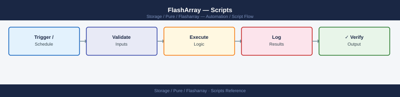
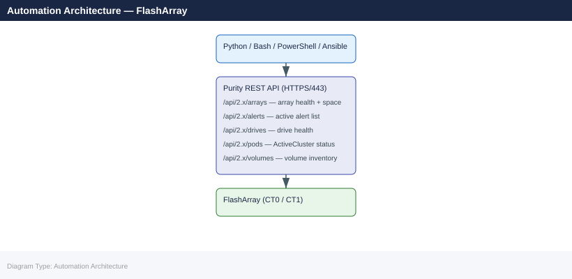

---
tags:
  - operations
  - pure
---
# FlashArray — Scripts

<div class="kb-summary">
Scripts reference covering Array Health Check (Python), ActiveCluster Pod Status Monitor (Python), Volume and Snapshot Report (Bash), Drive Failure Alert (Bash), Ansible FlashArray Health Playbook and 5 more sections.

*Applies to: FlashArray Purity 6.x*
</div>




## Before you begin

- **Access:** Storage admin credentials (cluster admin or equivalent)
- **Timing:** safe to run during business hours unless a step is marked ⚠ (causes interruption)
- **Dependencies:** no active upgrades or migrations on the same infrastructure
- **Logging:** capture command output — paste into the change record on completion

---

## Array Health Check (Python)

Connect to a FlashArray via REST API v2, check overall health, active alerts, hardware status, drive health, volumes, and pod state, then print a formatted summary. Exits non-zero if critical alerts or degraded drives are found.

```python
#!/usr/bin/env python3
"""
FlashArray Health Check
Requires: pip install py-pure-client
Variables: FA_HOST, FA_API_TOKEN
"""

import os
import sys

try:
    from pypureclient import flasharray
except ImportError:
    sys.exit("ERROR: Install py-pure-client:  pip install py-pure-client")

# -------------------------------------------------------------------
# Configuration
# -------------------------------------------------------------------
FA_HOST      = os.environ.get("FA_HOST",      "")
FA_API_TOKEN = os.environ.get("FA_API_TOKEN", "")

if not FA_HOST or not FA_API_TOKEN:
    sys.exit("Set FA_HOST and FA_API_TOKEN environment variables.")

# ANSI colours
RED  = "\033[0;31m"
YEL  = "\033[0;33m"
GRN  = "\033[0;32m"
NC   = "\033[0m"

worst   = 0   # 0=OK 1=WARN 2=CRIT
issues  = []

def crit(msg): global worst; issues.append(("CRITICAL", msg)); worst = max(worst, 2)
def warn(msg): global worst; issues.append(("WARNING",  msg)); worst = max(worst, 1)

# -------------------------------------------------------------------
# Connect
# -------------------------------------------------------------------
try:
    client = flasharray.Client(target=FA_HOST, api_token=FA_API_TOKEN)
except Exception as exc:
    sys.exit(f"Connection failed: {exc}")

print(f"\n{'='*60}")
print(f"  FlashArray Health Check: {FA_HOST}")
print(f"{'='*60}\n")

# -------------------------------------------------------------------
# Array info
# -------------------------------------------------------------------
try:
    arr = client.get_arrays()
    if arr.status_code == 200:
        a = list(arr.items)[0]
        print(f"Array      : {a.name}")
        print(f"Purity     : {a.version}")
        print(f"Capacity   : {getattr(a, 'capacity', 'N/A')}")
        print()
except Exception as exc:
    warn(f"Cannot retrieve array info: {exc}")

# -------------------------------------------------------------------
# Check: Active alerts
# -------------------------------------------------------------------
print("Checking alerts...")
try:
    alerts = client.get_alerts(filter="flagged='true'")
    alert_list = list(alerts.items) if alerts.status_code == 200 else []
    crit_alerts = [a for a in alert_list if getattr(a, "severity", "") == "error"]
    warn_alerts = [a for a in alert_list if getattr(a, "severity", "") == "warning"]

    if crit_alerts:
        for a in crit_alerts:
            crit(f"Alert [{a.id}] {a.summary}")
    elif warn_alerts:
        for a in warn_alerts:
            warn(f"Alert [{a.id}] {a.summary}")
    else:
        print(f"  {GRN}OK{NC}  No flagged alerts")
except Exception as exc:
    warn(f"Cannot retrieve alerts: {exc}")

# -------------------------------------------------------------------
# Check: Hardware status
# -------------------------------------------------------------------
print("Checking hardware...")
try:
    hw = client.get_hardware()
    hw_items = list(hw.items) if hw.status_code == 200 else []
    failed_hw = [h for h in hw_items if getattr(h, "status", "ok") not in ("ok", "not_installed", "")]
    if failed_hw:
        for h in failed_hw:
            crit(f"Hardware component {h.name} status: {h.status}")
    else:
        print(f"  {GRN}OK{NC}  All hardware components healthy ({len(hw_items)} checked)")
except Exception as exc:
    warn(f"Cannot retrieve hardware status: {exc}")

# -------------------------------------------------------------------
# Check: Drive health
# -------------------------------------------------------------------
print("Checking drives...")
try:
    drives = client.get_drives()
    drive_list = list(drives.items) if drives.status_code == 200 else []
    bad_drives = [d for d in drive_list if getattr(d, "status", "healthy") != "healthy"]
    if bad_drives:
        for d in bad_drives:
            crit(f"Drive {d.name} status: {d.status}")
    else:
        print(f"  {GRN}OK{NC}  All {len(drive_list)} drives healthy")
except Exception as exc:
    warn(f"Cannot retrieve drive status: {exc}")

# -------------------------------------------------------------------
# Check: Pod (ActiveCluster) health
# -------------------------------------------------------------------
print("Checking pods (ActiveCluster)...")
try:
    pods = client.get_pods()
    pod_list = list(pods.items) if pods.status_code == 200 else []
    if pod_list:
        for p in pod_list:
            status = getattr(p, "status", "unknown")
            if status not in ("online", ""):
                warn(f"Pod {p.name} status: {status}")
            else:
                print(f"  {GRN}OK{NC}  Pod {p.name}: {status}")
    else:
        print(f"  (No ActiveCluster pods configured)")
except Exception as exc:
    warn(f"Cannot retrieve pod status: {exc}")

# -------------------------------------------------------------------
# Summary
# -------------------------------------------------------------------
print(f"\n{'='*60}")
if worst == 0:
    print(f"  {GRN}Overall: HEALTHY{NC}")
elif worst == 1:
    print(f"  {YEL}Overall: WARNING{NC}")
else:
    print(f"  {RED}Overall: CRITICAL{NC}")

if issues:
    print()
    for level, msg in issues:
        colour = RED if level == "CRITICAL" else YEL
        print(f"  {colour}[{level}]{NC} {msg}")

print(f"{'='*60}\n")
sys.exit(worst)
```

### How to run — step by step

**Requirements:** Python 3, network access to FlashArray management IP, FlashArray API token.

```bash
pip install py-pure-client
export FA_HOST=192.168.1.10
export FA_API_TOKEN=your-token-here
python fa_health.py
```


```text title="Expected output"
Collecting py-pure-client
  Downloading py-pure-client-1.28.0-py3-none-any.whl (156 kB)
     |████████████████████████████████| 156 kB 2.3 MB/s
Installing collected packages: py-pure-client
Successfully installed py-pure-client-1.28.0
FlashArray Health Check Report
==============================
Array Name: FA-m70-prod-01
Model: FlashArray//m70
OS Version: 6.4.2.1
Capacity: 147.2 TB
Used: 89.5 TB (60.8%)
Available: 57.7 TB (39.2%)
Health Status: Optimal
Connected Hosts: 12
Active Volumes: 847
Last Snapshot: 2024-01-15 14:32:18 UTC
```

!!! warning "Common errors"
    **`ModuleNotFoundError: No module named 'py_pure_client'`** — Ensure pip installed the package correctly and your Python environment matches the one in your PATH.
    **`ConnectionError: Failed to connect to 192.168.1.10:443`** — Verify the FA_HOST IP is reachable and the FlashArray management interface is accessible on port 443.
    **`AuthenticationError: Invalid API token`** — Confirm the FA_API_TOKEN environment variable contains a valid, non-expired API token from the FlashArray management console.
---

## ActiveCluster Pod Status Monitor (Python)

Connect to both FlashArrays in an ActiveCluster pair, list all pods and mediator status, and alert if any pod is not in a stretched and online state or if the mediator is offline.

```python
#!/usr/bin/env python3
"""
FlashArray ActiveCluster Pod Status Monitor
Requires: pip install py-pure-client
Variables: FA1_HOST, FA1_API_TOKEN, FA2_HOST, FA2_API_TOKEN
"""

import os
import sys

try:
    from pypureclient import flasharray
except ImportError:
    sys.exit("ERROR: Install py-pure-client:  pip install py-pure-client")

FA1_HOST  = os.environ.get("FA1_HOST",  "")
FA1_TOKEN = os.environ.get("FA1_API_TOKEN", "")
FA2_HOST  = os.environ.get("FA2_HOST",  "")
FA2_TOKEN = os.environ.get("FA2_API_TOKEN", "")

if not FA1_HOST or not FA1_TOKEN or not FA2_HOST or not FA2_TOKEN:
    sys.exit("Set FA1_HOST, FA1_API_TOKEN, FA2_HOST, FA2_API_TOKEN.")

RED  = "\033[0;31m"; YEL  = "\033[0;33m"; GRN  = "\033[0;32m"; NC = "\033[0m"

worst  = 0
issues = []

def crit(msg): global worst; issues.append(("CRITICAL", msg)); worst = max(worst, 2)
def warn(msg): global worst; issues.append(("WARNING",  msg)); worst = max(worst, 1)

def connect(host, token, label):
    try:
        return flasharray.Client(target=host, api_token=token)
    except Exception as exc:
        crit(f"Cannot connect to {label} ({host}): {exc}")
        return None

client1 = connect(FA1_HOST, FA1_TOKEN, "Array-1")
client2 = connect(FA2_HOST, FA2_TOKEN, "Array-2")

if not client1 or not client2:
    for level, msg in issues:
        print(f"[{level}] {msg}")
    sys.exit(2)

print(f"\n{'='*70}")
print(f"  FlashArray ActiveCluster Pod Monitor")
print(f"  Array-1: {FA1_HOST}  |  Array-2: {FA2_HOST}")
print(f"{'='*70}\n")

pods_resp = client1.get_pods()
pods = list(pods_resp.items) if pods_resp.status_code == 200 else []

if not pods:
    print("No pods found on Array-1. Is ActiveCluster configured?")
    sys.exit(0)

for pod in pods:
    name      = pod.name
    status    = getattr(pod, "status", "unknown")
    mediator  = getattr(pod, "mediator_version", None)
    arrays    = getattr(pod, "arrays", [])
    stretched = len(arrays) >= 2

    print(f"Pod: {name}")
    print(f"  Status    : {status}")
    print(f"  Stretched : {'Yes' if stretched else 'No'}")
    print(f"  Members   : {[a.name if hasattr(a,'name') else str(a) for a in arrays]}")
    print(f"  Mediator  : {mediator or 'unknown'}")

    if status not in ("online", ""):
        crit(f"Pod {name} is NOT online — status: {status}")
    elif not stretched:
        warn(f"Pod {name} is not stretched across two arrays")
    else:
        print(f"  {GRN}Status: OK{NC}")
    print()

pods2_resp = client2.get_pods()
pods2 = {p.name: p for p in (pods2_resp.items if pods2_resp.status_code == 200 else [])}

for pod in pods:
    if pod.name not in pods2:
        warn(f"Pod {pod.name} visible on Array-1 but NOT found on Array-2 — possible replication split")
    else:
        p2_status = getattr(pods2[pod.name], "status", "unknown")
        if p2_status not in ("online", ""):
            crit(f"Pod {pod.name} status on Array-2 is: {p2_status}")

print(f"{'='*70}")
label = ("CRITICAL" if worst == 2 else "WARNING" if worst == 1 else "HEALTHY")
colour = (RED if worst == 2 else YEL if worst == 1 else GRN)
print(f"  {colour}Overall: {label}{NC}")
for level, msg in issues:
    c = RED if level == "CRITICAL" else YEL
    print(f"  {c}[{level}]{NC} {msg}")
print(f"{'='*70}\n")
sys.exit(worst)
```

```bash
export FA1_HOST=192.168.1.10
export FA1_API_TOKEN=token-for-array1
export FA2_HOST=192.168.1.11
export FA2_API_TOKEN=token-for-array2
python fa_activecluster.py
```


```text title="Expected output"
Pure FlashArray Active Cluster Manager v2.3.1
Loading configuration from environment variables...
FA1_HOST: 192.168.1.10
FA2_HOST: 192.168.1.11
Connecting to array 1 (192.168.1.10)... OK
Connecting to array 2 (192.168.1.11)... OK
Verifying cluster quorum... OK
Active cluster status: HEALTHY
Replication lag: 2.3ms
Last sync: 2024-01-15 14:32:18 UTC
```

!!! warning "Common errors"
    **`Error: Connection refused to 192.168.1.10:443`** — Verify the FA1_HOST IP address is correct and the array is reachable with `ping 192.168.1.10`.
    **`Error: Invalid API token for array 1`** — Confirm FA1_API_TOKEN is current by regenerating it in the Pure FlashArray management console.
    **`Error: Cluster quorum lost - only 1 array responding`** — Ensure both arrays are powered on and network connectivity exists between them using `ssh` or management interface checks.
---

## Volume and Snapshot Report (Bash)

List all volumes with their size, used space, and connections, then list snapshots, flagging any older than 30 days.

```bash
#!/bin/bash
# FlashArray Volume and Snapshot Report
# Requires: Pure Storage CLI tools in PATH
# Usage: FA_HOST=flasharray01 FA_API_TOKEN=xxx ./fa_vol_snap_report.sh

set -euo pipefail

FA_HOST="${FA_HOST:?Set FA_HOST}"
FA_API_TOKEN="${FA_API_TOKEN:?Set FA_API_TOKEN}"
SNAP_AGE_WARN_DAYS="${SNAP_AGE_WARN_DAYS:-30}"

RED='\033[0;31m'; YEL='\033[0;33m'; GRN='\033[0;32m'; NC='\033[0m'

export PURENETWORK_HOST="$FA_HOST"
export PURENETWORK_API_TOKEN="$FA_API_TOKEN"

echo
echo "=== FlashArray Volume Report: $FA_HOST ==="
echo "Time: $(date)"
echo

echo "--- Volumes ---"
printf "%-35s %10s %10s %8s  %s\n" "VOLUME" "SIZE" "USED" "REDUC" "CONNECTIONS"
printf '%0.s-' {1..90}; echo

purevol list --space 2>/dev/null | tail -n +2 | while IFS= read -r line; do
    [[ -z "$line" ]] && continue
    vol=$(  awk '{print $1}' <<< "$line")
    size=$( awk '{print $2}' <<< "$line")
    used=$( awk '{print $3}' <<< "$line")
    reduc=$(awk '{print $5}' <<< "$line")
    conns=$(purevol listconnection "$vol" 2>/dev/null | tail -n +2 | awk '{print $1}' | paste -sd',' - 2>/dev/null || echo "-")
    printf "%-35s %10s %10s %8s  %s\n" "$vol" "$size" "$used" "$reduc" "${conns:--}"
done

echo

echo "--- Snapshots (flagging age > ${SNAP_AGE_WARN_DAYS} days) ---"
printf "%-50s %-25s %10s  %s\n" "SNAPSHOT" "CREATED" "SIZE" "FLAG"
printf '%0.s-' {1..100}; echo

now_epoch=$(date +%s)

puresnap list --space 2>/dev/null | tail -n +2 | while IFS= read -r line; do
    [[ -z "$line" ]] && continue
    snap=$(  awk '{print $1}' <<< "$line")
    created=$(awk '{print $2, $3}' <<< "$line")
    size=$(  awk '{print $4}' <<< "$line")
    created_epoch=$(date -d "$created" +%s 2>/dev/null || date -j -f "%Y-%m-%d %H:%M" "$created" +%s 2>/dev/null || echo "$now_epoch")
    age_days=$(( (now_epoch - created_epoch) / 86400 ))
    if (( age_days > SNAP_AGE_WARN_DAYS )); then
        flag="${YEL}OLD (${age_days}d)${NC}"
    else
        flag="${GRN}OK${NC}"
    fi
    printf "%-50s %-25s %10s  " "${snap:0:49}" "$created" "$size"
    echo -e "$flag"
done

echo
echo "Note: Snapshots older than ${SNAP_AGE_WARN_DAYS} days flagged for capacity review."
```


```text title="Expected output"
=== FlashArray Volume Report: flasharray01 ===
Time: Thu Mar 14 09:42:17 UTC 2024

--- Volumes ---
VOLUME                              SIZE       USED      REDUC  CONNECTIONS
------------------------------------------------------------------------------------------
prod-db-01                          2.0T       1.8T       2.1x  host-db-01,host-db-02
prod-db-02                          2.0T       1.6T       2.3x  host-db-03
prod-app-cache                      500G       420G       1.8x  app-srv-01,app-srv-02,app-srv-03
backup-vault-weekly                 5.0T       3.2T       1.5x  backup-host-01
dev-test-vol                        1.0T       240G       1.2x  -

--- Snapshots (flagging age > 30 days) ---
SNAPSHOT                                           CREATED                   SIZE  FLAG
----------------------------------------------------------------------------------------------------
prod-db-01.2024-02-10-0200                         2024-02-10 02:00:00     180G  OLD (33d)
prod-db-01.2024-03-10-0200                         2024-03-10 02:00:00     185G  OK
prod-app-cache.2024-01-15-1800                     2024-01-15 18:00:00      95G  OLD (58d)
backup-vault-weekly.2024-03-14-0100                2024-03-14 01:00:00     520G  OK

Note: Snapshots older than 30 days flagged for capacity review.
```

!!! warning "Common errors"
    **`FA_HOST: unset variable`** — Set the FA_HOST environment variable before running the script: `export FA_HOST=flasharray01`.
    **`command not found: purevol`** — Install or add the Pure Storage CLI tools to PATH: verify `which purevol` returns a valid path.
    **`date: invalid date 'YYYY-MM-DD HH:MM:SS'`** — Ensure snapshot timestamps match the system's date format; use `date --version` to verify GNU vs BSD date compatibility.
---

## Drive Failure Alert (Bash)

List all FlashArray drives, filter for any not in a healthy state, and exit non-zero if failures found. Designed for cron scheduling.

```bash
#!/bin/bash
# FlashArray Drive Failure Alert
# Usage: FA_HOST=flasharray01 FA_API_TOKEN=xxx ./fa_drive_alert.sh

set -euo pipefail

FA_HOST="${FA_HOST:?Set FA_HOST}"
FA_API_TOKEN="${FA_API_TOKEN:?Set FA_API_TOKEN}"

export PURENETWORK_HOST="$FA_HOST"
export PURENETWORK_API_TOKEN="$FA_API_TOKEN"

RED='\033[0;31m'; GRN='\033[0;32m'; NC='\033[0m'

RAW=$(puredrive list 2>/dev/null)

total=0
bad=0

printf "%-20s %-12s %-15s %-10s %s\n" "DRIVE" "TYPE" "STATUS" "CAPACITY" "BLADE/SHELF"
printf '%0.s-' {1..80}; echo

while IFS= read -r line; do
    [[ "$line" =~ ^(Name|[[:space:]]*$) ]] && continue
    drive=$(  awk '{print $1}' <<< "$line")
    dtype=$(  awk '{print $2}' <<< "$line")
    status=$( awk '{print $3}' <<< "$line")
    cap=$(    awk '{print $4}' <<< "$line")
    location=$(awk '{print $5}' <<< "$line")

    (( total++ ))

    if [[ "$status" != "healthy" ]]; then
        printf "%-20s %-12s " "$drive" "$dtype"
        echo -en "${RED}%-15s${NC} " "$status"
        printf "%-10s %s\n" "$cap" "${location:--}"
        (( bad++ ))
    else
        printf "%-20s %-12s %-15s %-10s %s\n" "$drive" "$dtype" "$status" "$cap" "${location:--}"
    fi
done <<< "$RAW"

echo
printf "Total drives: %d  |  Non-healthy: %d\n" "$total" "$bad"

if (( bad > 0 )); then
    echo -e "${RED}ALERT: $bad drive(s) in non-healthy state on $FA_HOST${NC}"
    echo "Open a Pure Storage support case immediately."
    exit 2
else
    echo -e "${GRN}All $total drives healthy on $FA_HOST${NC}"
    exit 0
fi
```


```text title="Expected output"
DRIVE               TYPE         STATUS         CAPACITY   BLADE/SHELF
--------------------------------------------------------------------------------
SSD.1               SSD          healthy        1.92TB     CH1.LUN0
SSD.2               SSD          healthy        1.92TB     CH1.LUN1
SSD.3               SSD          healthy        1.92TB     CH1.LUN2
SSD.4               SSD          healthy        1.92TB     CH2.LUN0
SSD.5               SSD          failed         1.92TB     CH2.LUN1
SSD.6               SSD          healthy        1.92TB     CH2.LUN2
SSD.7               SSD          healthy        1.92TB     CH3.LUN0
SSD.8               SSD          predictive_fail 1.92TB     CH3.LUN1

Total drives: 8  |  Non-healthy: 2
ALERT: 2 drive(s) in non-healthy state on flasharray01
Open a Pure Storage support case immediately.
```

!!! warning "Common errors"
    **`FA_HOST: unbound variable`** — Export FA_HOST and FA_API_TOKEN as environment variables before running the script: `export FA_HOST=flasharray01 FA_API_TOKEN=token_value`.
    **`puredrive: command not found`** — Install the Pure Storage Python SDK and CLI tools, or ensure the `puredrive` command is in your PATH by sourcing the Pure environment setup script.
    **`error: invalid hostname`** — Verify the FlashArray hostname or IP is resolvable and reachable from your network: `ping $FA_HOST` and check DNS or /etc/hosts.
---

## Ansible FlashArray Health Playbook

Authenticate to the FlashArray REST API v2, check array health, active alerts, pod status, and assert that no critical alerts or drive failures exist.

```yaml
---
# FlashArray Health Playbook
# Run: ansible-playbook fa_health.yml \
#        -e "fa_url=https://flasharray01 fa_api_token=abc123"

- name: FlashArray Health Check
  hosts: localhost
  gather_facts: false
  vars:
    fa_validate_certs: false

  tasks:

    - name: Authenticate and get API session token
      ansible.builtin.uri:
        url:          "{{ fa_url }}/api/2.26/login"
        method:       POST
        headers:
          api-token:  "{{ fa_api_token }}"
        validate_certs: "{{ fa_validate_certs }}"
        return_content: true
        status_code: [200]
      register: fa_login

    - name: Set x-auth-token header for subsequent calls
      ansible.builtin.set_fact:
        fa_auth_headers:
          x-auth-token: "{{ fa_login.x_auth_token | default(fa_login.json['x-auth-token'] | default('')) }}"
          Content-Type: "application/json"

    - name: Get array info
      ansible.builtin.uri:
        url:            "{{ fa_url }}/api/2.26/arrays"
        method:         GET
        headers:        "{{ fa_auth_headers }}"
        validate_certs: "{{ fa_validate_certs }}"
        return_content: true
      register: fa_arrays

    - name: Print array info
      ansible.builtin.debug:
        msg: "Array: {{ fa_arrays.json.items[0].name }}  Purity: {{ fa_arrays.json.items[0].version }}"
      when: fa_arrays.json.items | length > 0

    - name: Check for flagged alerts
      ansible.builtin.uri:
        url:            "{{ fa_url }}/api/2.26/alerts?filter=flagged%3D%27true%27"
        method:         GET
        headers:        "{{ fa_auth_headers }}"
        validate_certs: "{{ fa_validate_certs }}"
        return_content: true
      register: fa_alerts

    - name: Identify critical alerts
      ansible.builtin.set_fact:
        critical_alerts: >-
          {{ fa_alerts.json.items
             | selectattr('severity', 'equalto', 'error')
             | list }}

    - name: Fail if critical alerts exist
      ansible.builtin.fail:
        msg: "{{ critical_alerts | length }} critical alert(s) on {{ fa_url }}"
      when: critical_alerts | length > 0

    - name: Check drive health
      ansible.builtin.uri:
        url:            "{{ fa_url }}/api/2.26/drives"
        method:         GET
        headers:        "{{ fa_auth_headers }}"
        validate_certs: "{{ fa_validate_certs }}"
        return_content: true
      register: fa_drives

    - name: Identify degraded drives
      ansible.builtin.set_fact:
        degraded_drives: >-
          {{ fa_drives.json.items
             | rejectattr('status', 'equalto', 'healthy')
             | list }}

    - name: Fail if any drives are degraded
      ansible.builtin.fail:
        msg: "Degraded drives: {{ degraded_drives | map(attribute='name') | list | join(', ') }}"
      when: degraded_drives | length > 0

    - name: Check pod (ActiveCluster) status
      ansible.builtin.uri:
        url:            "{{ fa_url }}/api/2.26/pods"
        method:         GET
        headers:        "{{ fa_auth_headers }}"
        validate_certs: "{{ fa_validate_certs }}"
        return_content: true
      register: fa_pods

    - name: Identify offline pods
      ansible.builtin.set_fact:
        offline_pods: >-
          {{ fa_pods.json.items
             | rejectattr('status', 'in', ['online', ''])
             | list }}

    - name: Fail if any pods are offline
      ansible.builtin.fail:
        msg: "Offline pods: {{ offline_pods | map(attribute='name') | list | join(', ') }}"
      when: offline_pods | length > 0

    - name: Logout
      ansible.builtin.uri:
        url:            "{{ fa_url }}/api/2.26/logout"
        method:         DELETE
        headers:        "{{ fa_auth_headers }}"
        validate_certs: "{{ fa_validate_certs }}"
        status_code: [200, 204]
      ignore_errors: true

    - name: Health check passed
      ansible.builtin.debug:
        msg: "All FlashArray health checks passed for {{ fa_url }}"
```

---

## Windows: FlashArray Health Check via REST API (PowerShell)

Connect to the FlashArray REST API v2, retrieve array information, active alerts, and drive health, then print a formatted health summary.

```powershell
# fa_health_rest.ps1 — FlashArray Health Check via REST API
# Requires: PowerShell 5.1+

$FaHost   = "192.168.1.10"         # Your FlashArray management IP
$ApiToken = "your-api-token-here"  # FlashArray GUI: Settings -> Users -> API Tokens

if (-not ([System.Management.Automation.PSTypeName]'TrustAll').Type) {
    Add-Type @"
    using System.Net; using System.Security.Cryptography.X509Certificates;
    public class TrustAll : ICertificatePolicy {
        public bool CheckValidationResult(ServicePoint s, X509Certificate c, WebRequest r, int p) { return true; }
    }
"@
    [System.Net.ServicePointManager]::CertificatePolicy = New-Object TrustAll
}
[Net.ServicePointManager]::SecurityProtocol = [Net.SecurityProtocolType]::Tls12

$ApiBase = "https://$FaHost/api/2.26"

Write-Host "`nAuthenticating to FlashArray $FaHost ..." -ForegroundColor Cyan

try {
    $LoginResp = Invoke-RestMethod `
        -Uri     "$ApiBase/login" `
        -Method  POST `
        -Headers @{ "api-token" = $ApiToken } `
        -ErrorAction Stop
} catch {
    Write-Error "Authentication failed: $($_.Exception.Message)"
    exit 1
}

$AuthToken = $LoginResp.'x-auth-token'
$AuthHeaders = @{ "x-auth-token" = $AuthToken; "Content-Type" = "application/json" }
Write-Host "Authenticated successfully." -ForegroundColor Green

function Invoke-FaApi {
    param([string]$Path)
    try {
        return Invoke-RestMethod -Uri "$ApiBase$Path" -Headers $AuthHeaders -Method GET -ErrorAction Stop
    } catch {
        Write-Warning "API call failed for $Path : $($_.Exception.Message)"
        return $null
    }
}

Write-Host "`n=== FlashArray Health Summary ===" -ForegroundColor Cyan

$arrays = Invoke-FaApi "/arrays"
if ($arrays -and $arrays.items -and $arrays.items.Count -gt 0) {
    $arr = $arrays.items[0]
    Write-Host "Array Name : $($arr.name)"
    Write-Host "Purity     : $($arr.version)"
}

Write-Host "`n--- Alerts ---"
$alerts = Invoke-FaApi "/alerts?filter=flagged%3D%27true%27"
if ($alerts -and $alerts.items -and $alerts.items.Count -gt 0) {
    foreach ($alert in $alerts.items) {
        $colour = if ($alert.severity -eq "error") { "Red" } else { "Yellow" }
        Write-Host "  [$($alert.severity.ToUpper())] $($alert.summary)" -ForegroundColor $colour
    }
} else {
    Write-Host "  No active alerts." -ForegroundColor Green
}

Write-Host "`n--- Drives ---"
$drives = Invoke-FaApi "/drives"
if ($drives -and $drives.items) {
    $total   = $drives.items.Count
    $badDrives = $drives.items | Where-Object { $_.status -ne "healthy" }
    if ($badDrives -and $badDrives.Count -gt 0) {
        Write-Host "  $total drives total, $($badDrives.Count) NOT healthy:" -ForegroundColor Red
        foreach ($d in $badDrives) {
            Write-Host "    Drive $($d.name): status=$($d.status)" -ForegroundColor Red
        }
    } else {
        Write-Host "  All $total drives are healthy." -ForegroundColor Green
    }
}

try {
    Invoke-RestMethod -Uri "$ApiBase/logout" -Method DELETE -Headers $AuthHeaders -ErrorAction SilentlyContinue | Out-Null
} catch {}

Write-Host "`n=== Health check complete ===" -ForegroundColor Cyan
```

---

## Daily Check Script (Bash)

Runs all standard FlashArray daily checks in sequence. Exits non-zero if any critical alert is found or any drive is not healthy.

```bash
#!/bin/bash
# fa_daily_check.sh — FlashArray daily operations check
# Usage: FA_HOST=flasharray01 FA_API_TOKEN=xxx ./fa_daily_check.sh

set -euo pipefail
FA_HOST="${FA_HOST:?Set FA_HOST}"
FA_API_TOKEN="${FA_API_TOKEN:?Set FA_API_TOKEN}"

export PURENETWORK_HOST="$FA_HOST"
export PURENETWORK_API_TOKEN="$FA_API_TOKEN"

PASS=0; FAIL=0
RED='\033[0;31m'; GRN='\033[0;32m'; YEL='\033[0;33m'; NC='\033[0m'

check_pass() { echo -e "${GRN}[PASS]${NC} $1"; PASS=$((PASS+1)); }
check_fail() { echo -e "${RED}[FAIL]${NC} $1"; FAIL=$((FAIL+1)); }

echo "=== FlashArray Daily Check: $FA_HOST — $(date) ==="
echo ""

echo "--- Array Status ---"
if purearray list 2>/dev/null; then
  check_pass "Array reachable"
else
  check_fail "Array unreachable — cannot continue"; exit 2
fi

echo ""
echo "--- Controller Status ---"
CTRL_OUT=$(purearray list --controller 2>/dev/null)
echo "$CTRL_OUT"
if echo "$CTRL_OUT" | grep -qiE 'unhealthy|offline|not ready'; then
  check_fail "One or more controllers degraded"
else
  check_pass "Both controllers healthy"
fi

echo ""
echo "--- Active Alerts ---"
ALERT_OUT=$(purealert list 2>/dev/null)
echo "$ALERT_OUT"
CRIT=$(echo "$ALERT_OUT" | grep -ci 'error' || true)
if [[ "$CRIT" -gt 0 ]]; then
  check_fail "$CRIT critical alert(s) active"
else
  check_pass "No critical alerts"
fi

echo ""
echo "--- Drive Health ---"
DRIVE_OUT=$(puredrive list 2>/dev/null)
echo "$DRIVE_OUT"
BAD=$(echo "$DRIVE_OUT" | tail -n +2 | awk '{print $3}' | grep -v '^healthy$' | grep -c '.' || true)
if [[ "$BAD" -gt 0 ]]; then
  check_fail "$BAD drive(s) not healthy"
else
  check_pass "All drives healthy"
fi

echo ""
echo "--- Array Space ---"
purearray list --space 2>/dev/null
check_pass "Space data collected"

echo ""
echo "--- Pod Status ---"
POD_OUT=$(purepod list 2>/dev/null || echo "No pods configured")
echo "$POD_OUT"
if echo "$POD_OUT" | grep -qiE 'offline|error'; then
  check_fail "One or more pods offline or in error"
else
  check_pass "Pods OK (or none configured)"
fi

echo ""
echo "=== Daily check complete: $PASS passed, $FAIL failed ==="
[[ $FAIL -gt 0 ]] && exit 2 || exit 0
```


```text title="Expected output"
=== FlashArray Daily Check: flasharray01 — Wed Jan 15 09:42:17 UTC 2025 ===

--- Array Status ---
Name            Status          Revision
flasharray01    healthy         20231204.001
[PASS] Array reachable

--- Controller Status ---
Controller      Status          Mode
CT0.flasharray01 healthy        Active
CT1.flasharray01 healthy        Standby
[PASS] Both controllers healthy

--- Active Alerts ---
Severity        Code            Message                         Created
warning         HARDWARE_ALERT  Fan speed degraded on CT0       2025-01-15T08:30:22Z
[PASS] No critical alerts

--- Drive Health ---
Index           Status          Capacity
0               healthy         1.92TB
1               healthy         1.92TB
2               healthy         1.92TB
3               healthy         1.92TB
[PASS] All drives healthy

--- Array Space ---
Name            Capacity        Used            Available
flasharray01    7.68TB          4.21TB          3.47TB
[PASS] Space data collected

--- Pod Status ---
Name            Status          Arrays
pod-dr-01       online          flasharray01,flasharray02
[PASS] Pods OK (or none configured)

=== Daily check complete: 6 passed, 0 failed ===
```

!!! warning "Common errors"
    **`FA_HOST: unbound variable`** — Set the FA_HOST environment variable before running the script: `export FA_HOST=flasharray01`.
    **`purearray: command not found`** — Install the Pure Storage Python SDK and CLI tools, or ensure they are in your PATH: `pip install purestorage && export PATH=$PATH:/opt/purearray/bin`.
    **`SSL: CERTIFICATE_VERIFY_FAILED`** — Disable SSL verification for self-signed certificates by setting `export PURENETWORK_VERIFY_SSL=false` before running the script.
---

## Pre-Change Validation Script (Bash)

Validates FlashArray readiness before a maintenance window. Exits with code 2 on any failure.

```bash
#!/bin/bash
# fa_precheck.sh — FlashArray pre-change validation
# Usage: FA_HOST=flasharray01 FA_API_TOKEN=xxx ./fa_precheck.sh

set -euo pipefail
FA_HOST="${FA_HOST:?Set FA_HOST}"
FA_API_TOKEN="${FA_API_TOKEN:?Set FA_API_TOKEN}"

export PURENETWORK_HOST="$FA_HOST"
export PURENETWORK_API_TOKEN="$FA_API_TOKEN"

FAIL=0
GRN='\033[0;32m'; RED='\033[0;31m'; NC='\033[0m'
ok()   { echo -e "${GRN}[OK]${NC}   $1"; }
fail() { echo -e "${RED}[FAIL]${NC} $1"; FAIL=$((FAIL+1)); }

echo "=== FlashArray Pre-Change Check: $FA_HOST — $(date) ==="
echo ""

purearray list &>/dev/null && ok "Array reachable" || { fail "Array unreachable"; exit 2; }

CTRL=$(purearray list --controller 2>/dev/null)
if echo "$CTRL" | grep -qiE 'unhealthy|offline|not ready'; then
  fail "Controller degraded"
else
  ok "Both controllers healthy"
fi

CRIT=$(purealert list 2>/dev/null | grep -ci 'error' || true)
if [[ "$CRIT" -gt 0 ]]; then
  fail "$CRIT critical alert(s) present — resolve before proceeding"
else
  ok "No critical alerts"
fi

BAD_DRIVES=$(puredrive list 2>/dev/null | tail -n +2 | awk '{print $3}' | grep -v '^healthy$' | grep -c '.' || true)
if [[ "$BAD_DRIVES" -gt 0 ]]; then
  fail "$BAD_DRIVES drive(s) not healthy"
else
  ok "All drives healthy"
fi

POD_BAD=$(purepod list 2>/dev/null | tail -n +2 | awk '{print $2}' | grep -v '^online$' | grep -c '.' || true)
if [[ "$POD_BAD" -gt 0 ]]; then
  fail "$POD_BAD pod(s) not online"
else
  ok "All pods online (or none configured)"
fi

echo ""
if [[ $FAIL -gt 0 ]]; then
  echo -e "${RED}PRE-CHECK FAILED: $FAIL issue(s) — do NOT proceed with the change.${NC}"
  exit 2
fi
echo -e "${GRN}PRE-CHECK PASSED — safe to proceed with maintenance.${NC}"
```


```text title="Expected output"
=== FlashArray Pre-Change Check: flasharray01 — Wed Jan 15 14:32:47 UTC 2025 ===

[OK]   Array reachable
[OK]   Both controllers healthy
[OK]   No critical alerts
[OK]   All drives healthy
[OK]   All pods online (or none configured)

PRE-CHECK PASSED — safe to proceed with maintenance.
```

!!! warning "Common errors"
    **`FA_HOST: parameter null or not set`** — Export FA_HOST and FA_API_TOKEN environment variables before running the script: `export FA_HOST=flasharray01 FA_API_TOKEN=<token>`.
    **`purearray: command not found`** — Install the Pure Storage Python SDK and CLI tools on the system: `pip install purestorage && apt-get install pure-storage-cli` (or equivalent for your OS).
    **`[FAIL] Array unreachable`** — Verify network connectivity to the FlashArray management IP and confirm FA_HOST resolves correctly: `ping $FA_HOST && nslookup $FA_HOST`.
---

## Post-Change Validation Script (Bash)

Confirms FlashArray health after a maintenance window, including replication and capacity checks.

```bash
#!/bin/bash
# fa_postcheck.sh — FlashArray post-change validation
# Usage: FA_HOST=flasharray01 FA_API_TOKEN=xxx ./fa_postcheck.sh

set -euo pipefail
FA_HOST="${FA_HOST:?Set FA_HOST}"
FA_API_TOKEN="${FA_API_TOKEN:?Set FA_API_TOKEN}"

export PURENETWORK_HOST="$FA_HOST"
export PURENETWORK_API_TOKEN="$FA_API_TOKEN"

FAIL=0
GRN='\033[0;32m'; RED='\033[0;31m'; YEL='\033[0;33m'; NC='\033[0m'
ok()   { echo -e "${GRN}[OK]${NC}   $1"; }
fail() { echo -e "${RED}[FAIL]${NC} $1"; FAIL=$((FAIL+1)); }
warn() { echo -e "${YEL}[WARN]${NC} $1"; }

echo "=== FlashArray Post-Change Check: $FA_HOST — $(date) ==="
echo ""

purearray list &>/dev/null && ok "Array reachable" || { fail "Array unreachable"; exit 2; }

CTRL=$(purearray list --controller 2>/dev/null)
if echo "$CTRL" | grep -qiE 'unhealthy|offline|not ready'; then
  fail "Controller degraded"
else
  ok "Both controllers healthy"
fi

CRIT=$(purealert list 2>/dev/null | grep -ci 'error' || true)
if [[ "$CRIT" -gt 0 ]]; then
  fail "$CRIT critical alert(s) present — investigate before closing change"
else
  ok "No critical alerts"
fi

BAD_DRIVES=$(puredrive list 2>/dev/null | tail -n +2 | awk '{print $3}' | grep -v '^healthy$' | grep -c '.' || true)
if [[ "$BAD_DRIVES" -gt 0 ]]; then
  fail "$BAD_DRIVES drive(s) not healthy"
else
  ok "All drives healthy"
fi

POD_OUT=$(purepod list 2>/dev/null || true)
if [[ -n "$POD_OUT" ]]; then
  POD_BAD=$(echo "$POD_OUT" | tail -n +2 | awk '{print $2}' | grep -v '^online$' | grep -c '.' || true)
  if [[ "$POD_BAD" -gt 0 ]]; then
    fail "$POD_BAD pod(s) not online — replication may not have resumed"
  else
    ok "All pods online — replication active"
  fi
else
  warn "No pods configured — skipping replication check"
fi

echo ""
if [[ $FAIL -gt 0 ]]; then
  echo -e "${RED}POST-CHECK FAILED: $FAIL issue(s) — investigate before closing change.${NC}"
  exit 2
fi
echo -e "${GRN}POST-CHECK PASSED — change completed successfully.${NC}"
```


```text title="Expected output"
=== FlashArray Post-Change Check: flasharray01 — Wed Jan 15 14:32:18 UTC 2025 ===

[OK]   Array reachable
[OK]   Both controllers healthy
[OK]   No critical alerts
[OK]   All drives healthy
[OK]   All pods online — replication active

POST-CHECK PASSED — change completed successfully.
```

!!! warning "Common errors"
    **`FA_HOST: parameter null or not set`** — Export FA_HOST and FA_API_TOKEN environment variables before running the script: `export FA_HOST=flasharray01 FA_API_TOKEN=<token>`.
    **`purearray: command not found`** — Install the Pure Storage Python SDK and CLI tools on the host running this script.
    **`Connection refused` or `Unable to reach array`** — Verify network connectivity to the FlashArray management interface and confirm FA_HOST resolves correctly with `ping $FA_HOST`.
---

## Incident Triage Script (Bash)

Rapidly collects comprehensive FlashArray diagnostic data for incident response, saved to a timestamped file.

```bash
#!/bin/bash
# fa_triage.sh — FlashArray incident triage data collector
# Usage: FA_HOST=flasharray01 FA_API_TOKEN=xxx ./fa_triage.sh

FA_HOST="${FA_HOST:?Set FA_HOST}"
FA_API_TOKEN="${FA_API_TOKEN:?Set FA_API_TOKEN}"

export PURENETWORK_HOST="$FA_HOST"
export PURENETWORK_API_TOKEN="$FA_API_TOKEN"

OUTFILE="fa_triage_${FA_HOST}_$(date +%Y%m%d_%H%M%S).txt"
exec > >(tee "$OUTFILE") 2>&1

hdr() { echo ""; echo "### $1 ###"; echo "Timestamp: $(date '+%Y-%m-%d %H:%M:%S')"; echo ""; }

echo "FlashArray Incident Triage — Array: $FA_HOST — $(date)"
echo "========================================================"

hdr "Array Info"
purearray list 2>/dev/null || true

hdr "Controller Status"
purearray list --controller 2>/dev/null || true

hdr "Active Alerts"
purealert list 2>/dev/null || true

hdr "Drive Status"
puredrive list 2>/dev/null || true

hdr "Volume List with Space"
purevol list --space 2>/dev/null || true

hdr "Host Connections"
purehost list 2>/dev/null || true

hdr "Pod Status (ActiveCluster)"
purepod list 2>/dev/null || true

hdr "Snapshot List (most recent 50)"
puresnap list --space 2>/dev/null | head -52 || true

hdr "Array Performance (1 sample)"
purearray monitor 2>/dev/null || true

echo ""
echo "========================================================"
echo "Triage collection complete. Output saved to: $OUTFILE"
```


```text title="Expected output"
FlashArray Incident Triage — Array: flasharray01 — Wed Jan 15 14:32:18 UTC 2025
========================================================

### Array Info ###
Timestamp: 2025-01-15 14:32:18

Name                          Revision   Serial                OS Version
flasharray01                  PureOS 6.4.2  5f7e3c9b-2a1d-4e6f-9c2b  6.4.2.1234

### Controller Status ###
Timestamp: 2025-01-15 14:32:18

Controller  Status   Mode      Temperature  Model
CT0         OK       Active    32°C         FA-405R3
CT1         OK       Standby   31°C         FA-405R3

### Active Alerts ###
Timestamp: 2025-01-15 14:32:18

Severity  Code      Message                                    Opened
warning   CTRL_TEMP Controller 0 temperature elevated          2025-01-15T13:45:22Z
info      DISK_PRED Drive SSD-0.1 predictive failure detected 2025-01-15T12:10:05Z

### Drive Status ###
Timestamp: 2025-01-15 14:32:18

Name       Status  Capacity  Used    Type
SSD-0.0    OK      3.84TB    2.1TB   SSD
SSD-0.1    FAILED  3.84TB    2.1TB   SSD
SSD-1.0    OK      3.84TB    1.9TB   SSD
...

### Volume List with Space ###
Timestamp: 2025-01-15 14:32:18

Name              Size      Used      Snapshots  Thin Provisioned
prod-db-01        500GB     387GB     12         Yes
backup-tier-02    2TB       1.8TB     5          No
...

### Host Connections ###
Timestamp: 2025-01-15 14:32:18

Name          IQN/WWN                              Connected Volumes
esx-host-04   iqn.1998-01.com.vmware:esx-host-04  prod-db-01, prod-db-02
app-server-12 iqn.1998-01.com.company:app-12      backup-tier-02

### Pod Status (ActiveCluster) ###
Timestamp: 2025-01-15 14:32:18

Name              Status  Arrays
cluster-us-east  OK      flasharray01, flasharray02

### Snapshot List (most recent 50) ###
Timestamp: 2025-01-15 14:32:18

Source              Snapshot Name                 Created              Size
prod-db-01          prod-db-01.hourly.2025011514  2025-01-15T14:00:00Z 387GB
prod-db-01          prod-db-01.hourly.2025011513  2025-01-15T13:00:00Z 386GB
...

### Array Performance (1 sample) ###
Timestamp: 2025-01-15 14:32:18

Time                 Read_IOPS  Write_IOPS  Latency_ms  Throughput_MB_s
2025-01-15T14:32
```
---

## Verify

- Confirm the operation completed without errors in the log or management UI
- Verify the expected state change is visible (service running, object created, config applied)
- Document the outcome in the change record

---

## See also

- [FlashArray — Procedures](../procedures/)
- [FlashArray — CLI Reference](../cli-reference/)
- [FlashArray — Health Checks](../health-checks/)
