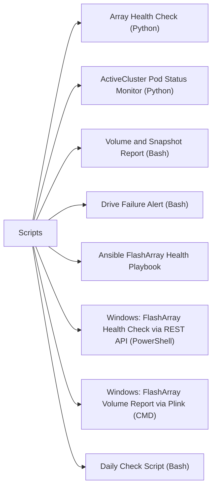

# Scripts

> Part of the [Pure FlashArray](../) reference.

---



## Array Health Check (Python)

Connect to a FlashArray via REST API v2, check overall health, active alerts, hardware status, drive health, volumes, and pod state, then print a formatted summary. Exits non-zero if critical alerts or degraded drives are found.

~~~python
#!/usr/bin/env python3
"""
FlashArray Health Check
Requires: pip install py-pure-client
Variables: FA_HOST, FA_API_TOKEN
"""

import os
import sys

try:
    from pypureclient import flasharray
except ImportError:
    sys.exit("ERROR: Install py-pure-client:  pip install py-pure-client")

# -------------------------------------------------------------------
# Configuration
# -------------------------------------------------------------------
FA_HOST      = os.environ.get("FA_HOST",      "")
FA_API_TOKEN = os.environ.get("FA_API_TOKEN", "")

if not FA_HOST or not FA_API_TOKEN:
    sys.exit("Set FA_HOST and FA_API_TOKEN environment variables.")

# ANSI colours
RED  = "\033[0;31m"
YEL  = "\033[0;33m"
GRN  = "\033[0;32m"
NC   = "\033[0m"

worst   = 0   # 0=OK 1=WARN 2=CRIT
issues  = []

def crit(msg): global worst; issues.append(("CRITICAL", msg)); worst = max(worst, 2)
def warn(msg): global worst; issues.append(("WARNING",  msg)); worst = max(worst, 1)

# -------------------------------------------------------------------
# Connect
# -------------------------------------------------------------------
try:
    client = flasharray.Client(target=FA_HOST, api_token=FA_API_TOKEN)
except Exception as exc:
    sys.exit(f"Connection failed: {exc}")

print(f"\n{'='*60}")
print(f"  FlashArray Health Check: {FA_HOST}")
print(f"{'='*60}\n")

# -------------------------------------------------------------------
# Array info
# -------------------------------------------------------------------
try:
    arr = client.get_arrays()
    if arr.status_code == 200:
        a = list(arr.items)[0]
        print(f"Array      : {a.name}")
        print(f"Purity     : {a.version}")
        print(f"Capacity   : {getattr(a, 'capacity', 'N/A')}")
        print()
except Exception as exc:
    warn(f"Cannot retrieve array info: {exc}")

# -------------------------------------------------------------------
# Check: Active alerts
# -------------------------------------------------------------------
print("Checking alerts...")
try:
    alerts = client.get_alerts(filter="flagged='true'")
    alert_list = list(alerts.items) if alerts.status_code == 200 else []
    crit_alerts = [a for a in alert_list if getattr(a, "severity", "") == "error"]
    warn_alerts = [a for a in alert_list if getattr(a, "severity", "") == "warning"]

    if crit_alerts:
        for a in crit_alerts:
            crit(f"Alert [{a.id}] {a.summary}")
    elif warn_alerts:
        for a in warn_alerts:
            warn(f"Alert [{a.id}] {a.summary}")
    else:
        print(f"  {GRN}OK{NC}  No flagged alerts")
except Exception as exc:
    warn(f"Cannot retrieve alerts: {exc}")

# -------------------------------------------------------------------
# Check: Hardware status
# -------------------------------------------------------------------
print("Checking hardware...")
try:
    hw = client.get_hardware()
    hw_items = list(hw.items) if hw.status_code == 200 else []
    failed_hw = [h for h in hw_items if getattr(h, "status", "ok") not in ("ok", "not_installed", "")]
    if failed_hw:
        for h in failed_hw:
            crit(f"Hardware component {h.name} status: {h.status}")
    else:
        print(f"  {GRN}OK{NC}  All hardware components healthy ({len(hw_items)} checked)")
except Exception as exc:
    warn(f"Cannot retrieve hardware status: {exc}")

# -------------------------------------------------------------------
# Check: Drive health
# -------------------------------------------------------------------
print("Checking drives...")
try:
    drives = client.get_drives()
    drive_list = list(drives.items) if drives.status_code == 200 else []
    bad_drives = [d for d in drive_list if getattr(d, "status", "healthy") != "healthy"]
    if bad_drives:
        for d in bad_drives:
            crit(f"Drive {d.name} status: {d.status}")
    else:
        print(f"  {GRN}OK{NC}  All {len(drive_list)} drives healthy")
except Exception as exc:
    warn(f"Cannot retrieve drive status: {exc}")

# -------------------------------------------------------------------
# Check: Pod (ActiveCluster) health
# -------------------------------------------------------------------
print("Checking pods (ActiveCluster)...")
try:
    pods = client.get_pods()
    pod_list = list(pods.items) if pods.status_code == 200 else []
    if pod_list:
        for p in pod_list:
            status = getattr(p, "status", "unknown")
            if status not in ("online", ""):
                warn(f"Pod {p.name} status: {status}")
            else:
                print(f"  {GRN}OK{NC}  Pod {p.name}: {status}")
    else:
        print(f"  (No ActiveCluster pods configured)")
except Exception as exc:
    warn(f"Cannot retrieve pod status: {exc}")

# -------------------------------------------------------------------
# Summary
# -------------------------------------------------------------------
print(f"\n{'='*60}")
if worst == 0:
    print(f"  {GRN}Overall: HEALTHY{NC}")
elif worst == 1:
    print(f"  {YEL}Overall: WARNING{NC}")
else:
    print(f"  {RED}Overall: CRITICAL{NC}")

if issues:
    print()
    for level, msg in issues:
        colour = RED if level == "CRITICAL" else YEL
        print(f"  {colour}[{level}]{NC} {msg}")

print(f"{'='*60}\n")
sys.exit(worst)
~~~

#### How to run this script — step by step

**Before you start — what you need**
- Python 3 installed (download from python.org — tick "Add Python to PATH" during setup)
- Network access to your FlashArray management IP
- A FlashArray API token (see Step 4 below for how to find it)

**Step 1 — Save the file**

1. Open **Notepad** (press the Windows key, type `Notepad`, press Enter)
2. Copy the entire code block above
3. Click **File → Save As**
4. Change "Save as type" to **All Files**
5. Name it `fa_health.py` — save it to your Desktop

**Step 2 — Find your FlashArray API token**

1. Open a web browser and go to `https://your-flasharray-ip`
2. Log in with your admin credentials
3. Click your username in the top-right corner → **API Tokens**
4. Copy an existing token or click **Create API Token**

**Step 3 — Open Command Prompt and install the package**

Press the Windows key, type `cmd`, press Enter:
```
pip install py-pure-client
```

**Step 4 — Set variables and run**

```
set FA_HOST=192.168.1.10
set FA_API_TOKEN=your-token-here
cd %USERPROFILE%\Desktop
python fa_health.py
```

**What you should see**

The script connects to your FlashArray and prints the array name, Purity version, and capacity. Then it checks alerts, hardware, drives, and pods — printing `OK` in green for each passing check, or `[CRITICAL]`/`[WARNING]` in red/yellow for any issues. The summary at the end shows overall HEALTHY, WARNING, or CRITICAL.

---

## ActiveCluster Pod Status Monitor (Python)

Connect to both FlashArrays in an ActiveCluster pair, list all pods and mediator status, and alert if any pod is not in a stretched and online state or if the mediator is offline.

~~~python
#!/usr/bin/env python3
"""
FlashArray ActiveCluster Pod Status Monitor
Requires: pip install py-pure-client
Variables: FA1_HOST, FA1_API_TOKEN, FA2_HOST, FA2_API_TOKEN
"""

import os
import sys

try:
    from pypureclient import flasharray
except ImportError:
    sys.exit("ERROR: Install py-pure-client:  pip install py-pure-client")

# -------------------------------------------------------------------
# Configuration
# -------------------------------------------------------------------
FA1_HOST  = os.environ.get("FA1_HOST",  "")
FA1_TOKEN = os.environ.get("FA1_API_TOKEN", "")
FA2_HOST  = os.environ.get("FA2_HOST",  "")
FA2_TOKEN = os.environ.get("FA2_API_TOKEN", "")

if not FA1_HOST or not FA1_TOKEN or not FA2_HOST or not FA2_TOKEN:
    sys.exit("Set FA1_HOST, FA1_API_TOKEN, FA2_HOST, FA2_API_TOKEN.")

RED  = "\033[0;31m"; YEL  = "\033[0;33m"; GRN  = "\033[0;32m"; NC = "\033[0m"

worst  = 0
issues = []

def crit(msg): global worst; issues.append(("CRITICAL", msg)); worst = max(worst, 2)
def warn(msg): global worst; issues.append(("WARNING",  msg)); worst = max(worst, 1)

def connect(host, token, label):
    try:
        return flasharray.Client(target=host, api_token=token)
    except Exception as exc:
        crit(f"Cannot connect to {label} ({host}): {exc}")
        return None

# -------------------------------------------------------------------
# Connect to both arrays
# -------------------------------------------------------------------
client1 = connect(FA1_HOST, FA1_TOKEN, "Array-1")
client2 = connect(FA2_HOST, FA2_TOKEN, "Array-2")

if not client1 or not client2:
    for level, msg in issues:
        print(f"[{level}] {msg}")
    sys.exit(2)

print(f"\n{'='*70}")
print(f"  FlashArray ActiveCluster Pod Monitor")
print(f"  Array-1: {FA1_HOST}  |  Array-2: {FA2_HOST}")
print(f"{'='*70}\n")

# -------------------------------------------------------------------
# Collect pods from Array-1 (primary perspective)
# -------------------------------------------------------------------
pods_resp = client1.get_pods()
pods = list(pods_resp.items) if pods_resp.status_code == 200 else []

if not pods:
    print("No pods found on Array-1. Is ActiveCluster configured?")
    sys.exit(0)

# -------------------------------------------------------------------
# Check each pod
# -------------------------------------------------------------------
for pod in pods:
    name      = pod.name
    status    = getattr(pod, "status", "unknown")
    mediator  = getattr(pod, "mediator_version", None)
    arrays    = getattr(pod, "arrays", [])
    stretched = len(arrays) >= 2

    print(f"Pod: {name}")
    print(f"  Status    : {status}")
    print(f"  Stretched : {'Yes' if stretched else 'No'}")
    print(f"  Members   : {[a.name if hasattr(a,'name') else str(a) for a in arrays]}")
    print(f"  Mediator  : {mediator or 'unknown'}")

    # Mediator check via dedicated API
    try:
        med_resp = client1.get_pods_pod_replica_links_remote_volume_snapshots(pod_name=name)
    except Exception:
        med_resp = None  # Mediator check endpoint may vary by Purity version

    if status not in ("online", ""):
        crit(f"Pod {name} is NOT online — status: {status}")
    elif not stretched:
        warn(f"Pod {name} is not stretched across two arrays")
    else:
        print(f"  {GRN}Status: OK{NC}")
    print()

# -------------------------------------------------------------------
# Cross-check from Array-2 perspective
# -------------------------------------------------------------------
pods2_resp = client2.get_pods()
pods2 = {p.name: p for p in (pods2_resp.items if pods2_resp.status_code == 200 else [])}

for pod in pods:
    if pod.name not in pods2:
        warn(f"Pod {pod.name} visible on Array-1 but NOT found on Array-2 — possible replication split")
    else:
        p2_status = getattr(pods2[pod.name], "status", "unknown")
        if p2_status not in ("online", ""):
            crit(f"Pod {pod.name} status on Array-2 is: {p2_status}")

# -------------------------------------------------------------------
# Summary
# -------------------------------------------------------------------
print(f"{'='*70}")
label = ("CRITICAL" if worst == 2 else "WARNING" if worst == 1 else "HEALTHY")
colour = (RED if worst == 2 else YEL if worst == 1 else GRN)
print(f"  {colour}Overall: {label}{NC}")
for level, msg in issues:
    c = RED if level == "CRITICAL" else YEL
    print(f"  {c}[{level}]{NC} {msg}")
print(f"{'='*70}\n")
sys.exit(worst)
~~~

#### How to run this script — step by step

**Before you start — what you need**
- Python 3 installed (download from python.org — tick "Add Python to PATH")
- API tokens for **both** FlashArrays in your ActiveCluster pair — get them from the FlashArray GUI under Settings → Users → API Tokens on each array
- Network access to both FlashArray management IPs

**Step 1 — Save the file**

1. Open **Notepad** (press the Windows key, type `Notepad`, press Enter)
2. Copy the entire code block above
3. Click **File → Save As**
4. Change "Save as type" to **All Files**
5. Name it `fa_activecluster.py` — save it to your Desktop

**Step 2 — Fill in your details**

| Variable | What to put here | Where to find it |
|---|---|---|
| `FA1_HOST` | First FlashArray management IP | Your storage admin |
| `FA1_API_TOKEN` | API token for Array 1 | FlashArray GUI → Settings → Users → API Tokens |
| `FA2_HOST` | Second FlashArray management IP | Your storage admin |
| `FA2_API_TOKEN` | API token for Array 2 | FlashArray GUI → Settings → Users → API Tokens |

**Step 3 — Open Command Prompt and install the package**

```
pip install py-pure-client
```

**Step 4 — Set variables and run**

```
set FA1_HOST=192.168.1.10
set FA1_API_TOKEN=token-for-array1
set FA2_HOST=192.168.1.11
set FA2_API_TOKEN=token-for-array2
cd %USERPROFILE%\Desktop
python fa_activecluster.py
```

**What you should see**

For each pod (ActiveCluster volume group), the script prints the pod name, online/offline status, whether it is stretched across two arrays, the member arrays, and the mediator version. It then cross-checks from Array 2's perspective. The summary shows HEALTHY, WARNING, or CRITICAL, with details on any issues found.

---

## Volume and Snapshot Report (Bash)

List all volumes with their size, used space, and connections, then list snapshots, flagging any that are older than 30 days and may be consuming unexpected capacity.

~~~bash
#!/bin/bash
# FlashArray Volume and Snapshot Report
# Requires: Pure Storage CLI tools (purearray, purevol, puresnap) in PATH
# Usage: FA_HOST=flasharray01 FA_API_TOKEN=xxx ./fa_vol_snap_report.sh

set -euo pipefail

FA_HOST="${FA_HOST:?Set FA_HOST}"
FA_API_TOKEN="${FA_API_TOKEN:?Set FA_API_TOKEN}"
SNAP_AGE_WARN_DAYS="${SNAP_AGE_WARN_DAYS:-30}"

RED='\033[0;31m'; YEL='\033[0;33m'; GRN='\033[0;32m'; NC='\033[0m'

export PURENETWORK_HOST="$FA_HOST"
export PURENETWORK_API_TOKEN="$FA_API_TOKEN"

echo
echo "=== FlashArray Volume Report: $FA_HOST ==="
echo "Time: $(date)"
echo

# ------------------------------------------------------------------
# Volumes
# ------------------------------------------------------------------
echo "--- Volumes ---"
printf "%-35s %10s %10s %8s  %s\n" "VOLUME" "SIZE" "USED" "REDUC" "CONNECTIONS"
printf '%0.s-' {1..90}; echo

purevol list --space 2>/dev/null | tail -n +2 | while IFS= read -r line; do
    [[ -z "$line" ]] && continue
    vol=$(  awk '{print $1}' <<< "$line")
    size=$( awk '{print $2}' <<< "$line")
    used=$( awk '{print $3}' <<< "$line")
    reduc=$(awk '{print $5}' <<< "$line")

    # Get connections for this volume
    conns=$(purevol listconnection "$vol" 2>/dev/null | tail -n +2 | awk '{print $1}' | paste -sd',' - 2>/dev/null || echo "-")

    printf "%-35s %10s %10s %8s  %s\n" "$vol" "$size" "$used" "$reduc" "${conns:--}"
done

echo

# ------------------------------------------------------------------
# Snapshots — flag old ones
# ------------------------------------------------------------------
echo "--- Snapshots (flagging age > ${SNAP_AGE_WARN_DAYS} days) ---"
printf "%-50s %-25s %10s  %s\n" "SNAPSHOT" "CREATED" "SIZE" "FLAG"
printf '%0.s-' {1..100}; echo

now_epoch=$(date +%s)

puresnap list --space 2>/dev/null | tail -n +2 | while IFS= read -r line; do
    [[ -z "$line" ]] && continue
    snap=$(  awk '{print $1}' <<< "$line")
    created=$(awk '{print $2, $3}' <<< "$line")
    size=$(  awk '{print $4}' <<< "$line")

    # Parse the creation date (format varies: "2024-01-15 10:30 UTC" or ISO)
    created_epoch=$(date -d "$created" +%s 2>/dev/null || date -j -f "%Y-%m-%d %H:%M" "$created" +%s 2>/dev/null || echo "$now_epoch")
    age_days=$(( (now_epoch - created_epoch) / 86400 ))

    if (( age_days > SNAP_AGE_WARN_DAYS )); then
        flag="${YEL}OLD (${age_days}d)${NC}"
    else
        flag="${GRN}OK${NC}"
    fi

    printf "%-50s %-25s %10s  " "${snap:0:49}" "$created" "$size"
    echo -e "$flag"
done

echo
echo "Note: Snapshots older than ${SNAP_AGE_WARN_DAYS} days flagged for capacity review."
~~~

#### How to run this script — step by step

**Before you start — what you need**
- The Pure Storage CLI tools (`purevol`, `puresnap`) installed. These are part of the Pure Storage Python REST Client package. Install with: `pip install py-pure-client`
- The CLI tools need to be in your PATH — on Windows, this is easiest in WSL or Git Bash
- A FlashArray API token (see Array Health Check script above for how to find it)

**Step 1 — Save the file**

1. Open **Notepad** (press the Windows key, type `Notepad`, press Enter)
2. Copy the entire code block above
3. Click **File → Save As**
4. Change "Save as type" to **All Files**
5. Name it `fa_vol_snap_report.sh` — save it to your Desktop

**Step 2 — Fill in your details**

| Variable | What to put here | Where to find it |
|---|---|---|
| `FA_HOST` | FlashArray management IP or hostname | Your storage admin |
| `FA_API_TOKEN` | FlashArray API token | FlashArray GUI → Settings → Users → API Tokens |
| `SNAP_AGE_WARN_DAYS` | Days before a snapshot is flagged as old (default: 30) | Your snapshot policy |

**Step 3 — Open WSL or Git Bash**

Open the Ubuntu app (WSL) from the Start menu, or open Git Bash.

**Step 4 — Install the CLI tools**

```
pip install py-pure-client
```

**Step 5 — Set variables and run**

```
export FA_HOST=192.168.1.10
export FA_API_TOKEN=your-token-here
cd /mnt/c/Users/YourName/Desktop
bash fa_vol_snap_report.sh
```

**What you should see**

Two sections: first a table of all volumes with size, used space, data reduction ratio, and which hosts are connected. Then a table of all snapshots with their creation date and size — snapshots older than 30 days are highlighted in yellow as `OLD (Nd)`. Reviewing old snapshots is important for capacity management.

---

## Drive Failure Alert (Bash)

List all FlashArray drives, filter for any that are not in a healthy state, and exit non-zero if non-healthy drives are found. Designed for cron scheduling.

~~~bash
#!/bin/bash
# FlashArray Drive Failure Alert
# Designed for cron scheduling — exits 0 if all drives healthy, 2 if failures found.
# Usage: FA_HOST=flasharray01 FA_API_TOKEN=xxx ./fa_drive_alert.sh

set -euo pipefail

FA_HOST="${FA_HOST:?Set FA_HOST}"
FA_API_TOKEN="${FA_API_TOKEN:?Set FA_API_TOKEN}"

export PURENETWORK_HOST="$FA_HOST"
export PURENETWORK_API_TOKEN="$FA_API_TOKEN"

RED='\033[0;31m'; GRN='\033[0;32m'; NC='\033[0m'

RAW=$(puredrive list 2>/dev/null)

total=0
bad=0

printf "%-20s %-12s %-15s %-10s %s\n" "DRIVE" "TYPE" "STATUS" "CAPACITY" "BLADE/SHELF"
printf '%0.s-' {1..80}; echo

while IFS= read -r line; do
    [[ "$line" =~ ^(Name|[[:space:]]*$) ]] && continue
    drive=$(  awk '{print $1}' <<< "$line")
    dtype=$(  awk '{print $2}' <<< "$line")
    status=$( awk '{print $3}' <<< "$line")
    cap=$(    awk '{print $4}' <<< "$line")
    location=$(awk '{print $5}' <<< "$line")

    (( total++ ))

    if [[ "$status" != "healthy" ]]; then
        printf "%-20s %-12s " "$drive" "$dtype"
        echo -en "${RED}%-15s${NC} " "$status"
        printf "%-10s %s\n" "$cap" "${location:--}"
        (( bad++ ))
    else
        printf "%-20s %-12s %-15s %-10s %s\n" "$drive" "$dtype" "$status" "$cap" "${location:--}"
    fi
done <<< "$RAW"

echo
printf "Total drives: %d  |  Non-healthy: %d\n" "$total" "$bad"

if (( bad > 0 )); then
    echo -e "${RED}ALERT: $bad drive(s) in non-healthy state on $FA_HOST${NC}"
    echo "Open a Pure Storage support case immediately."
    exit 2
else
    echo -e "${GRN}All $total drives healthy on $FA_HOST${NC}"
    exit 0
fi
~~~

#### How to run this script — step by step

**Before you start — what you need**
- The Pure Storage `puredrive` CLI tool installed (`pip install py-pure-client`)
- WSL or Git Bash on Windows (the script uses Bash syntax)
- A FlashArray API token

**Step 1 — Save the file**

1. Open **Notepad** (press the Windows key, type `Notepad`, press Enter)
2. Copy the entire code block above
3. Click **File → Save As**
4. Change "Save as type" to **All Files**
5. Name it `fa_drive_alert.sh` — save it to your Desktop

**Step 2 — Fill in your details**

| Variable | What to put here | Where to find it |
|---|---|---|
| `FA_HOST` | FlashArray management IP or hostname | Your storage admin |
| `FA_API_TOKEN` | FlashArray API token | FlashArray GUI → Settings → Users → API Tokens |

**Step 3 — Open WSL or Git Bash**

Open Ubuntu from the Start menu (WSL), or open Git Bash.

**Step 4 — Set variables and run**

```
export FA_HOST=192.168.1.10
export FA_API_TOKEN=your-token-here
cd /mnt/c/Users/YourName/Desktop
bash fa_drive_alert.sh
```

**What you should see**

A table of all drives in the FlashArray showing drive name, type, status, capacity, and blade/shelf location. Healthy drives show `healthy` in green. Any drive that is not healthy (failed, evacuating, etc.) is highlighted in red and the script prints `ALERT: X drive(s) in non-healthy state` and exits with code 2. A drive failure on a FlashArray is serious — open a Pure Storage support case immediately if you see this.

---

## Ansible FlashArray Health Playbook

Authenticate to the FlashArray REST API v2, check array health, active alerts, pod status, and assert that no critical alerts or drive failures exist.

~~~yaml
---
# FlashArray Health Playbook
# Variables: fa_url, fa_api_token
#
# Run: ansible-playbook fa_health.yml \
#        -e "fa_url=https://flasharray01 fa_api_token=abc123"

- name: FlashArray Health Check
  hosts: localhost
  gather_facts: false
  vars:
    fa_validate_certs: false

  tasks:

    - name: Authenticate and get API session token
      ansible.builtin.uri:
        url:          "{{ fa_url }}/api/2.26/login"
        method:       POST
        headers:
          api-token:  "{{ fa_api_token }}"
        validate_certs: "{{ fa_validate_certs }}"
        return_content: true
        status_code: [200]
      register: fa_login

    - name: Set x-auth-token header for subsequent calls
      ansible.builtin.set_fact:
        fa_auth_headers:
          x-auth-token: "{{ fa_login.x_auth_token | default(fa_login.json['x-auth-token'] | default('')) }}"
          Content-Type: "application/json"

    - name: Get array info
      ansible.builtin.uri:
        url:            "{{ fa_url }}/api/2.26/arrays"
        method:         GET
        headers:        "{{ fa_auth_headers }}"
        validate_certs: "{{ fa_validate_certs }}"
        return_content: true
      register: fa_arrays

    - name: Print array info
      ansible.builtin.debug:
        msg: "Array: {{ fa_arrays.json.items[0].name }}  Purity: {{ fa_arrays.json.items[0].version }}"
      when: fa_arrays.json.items | length > 0

    - name: Check for flagged alerts
      ansible.builtin.uri:
        url:            "{{ fa_url }}/api/2.26/alerts?filter=flagged%3D%27true%27"
        method:         GET
        headers:        "{{ fa_auth_headers }}"
        validate_certs: "{{ fa_validate_certs }}"
        return_content: true
      register: fa_alerts

    - name: Identify critical alerts
      ansible.builtin.set_fact:
        critical_alerts: >-
          {{ fa_alerts.json.items
             | selectattr('severity', 'equalto', 'error')
             | list }}

    - name: Print alert summary
      ansible.builtin.debug:
        msg: "Alert [{{ item.id }}] severity={{ item.severity }} — {{ item.summary }}"
      loop: "{{ fa_alerts.json.items }}"

    - name: Fail if critical alerts exist
      ansible.builtin.fail:
        msg: "{{ critical_alerts | length }} critical alert(s) on {{ fa_url }}: {{ critical_alerts | map(attribute='summary') | list }}"
      when: critical_alerts | length > 0

    - name: Check drive health
      ansible.builtin.uri:
        url:            "{{ fa_url }}/api/2.26/drives"
        method:         GET
        headers:        "{{ fa_auth_headers }}"
        validate_certs: "{{ fa_validate_certs }}"
        return_content: true
      register: fa_drives

    - name: Identify degraded drives
      ansible.builtin.set_fact:
        degraded_drives: >-
          {{ fa_drives.json.items
             | rejectattr('status', 'equalto', 'healthy')
             | list }}

    - name: Print drive summary
      ansible.builtin.debug:
        msg: "Drives: {{ fa_drives.json.items | length }} total, {{ degraded_drives | length }} degraded"

    - name: Fail if any drives are degraded
      ansible.builtin.fail:
        msg: "Degraded drives: {{ degraded_drives | map(attribute='name') | list | join(', ') }}"
      when: degraded_drives | length > 0

    - name: Check pod (ActiveCluster) status
      ansible.builtin.uri:
        url:            "{{ fa_url }}/api/2.26/pods"
        method:         GET
        headers:        "{{ fa_auth_headers }}"
        validate_certs: "{{ fa_validate_certs }}"
        return_content: true
      register: fa_pods

    - name: Identify offline pods
      ansible.builtin.set_fact:
        offline_pods: >-
          {{ fa_pods.json.items
             | rejectattr('status', 'in', ['online', ''])
             | list }}

    - name: Print pod status
      ansible.builtin.debug:
        msg: "Pod {{ item.name }}: status={{ item.status }}"
      loop: "{{ fa_pods.json.items }}"

    - name: Fail if any pods are offline
      ansible.builtin.fail:
        msg: "Offline pods: {{ offline_pods | map(attribute='name') | list | join(', ') }}"
      when: offline_pods | length > 0

    - name: Logout
      ansible.builtin.uri:
        url:            "{{ fa_url }}/api/2.26/logout"
        method:         DELETE
        headers:        "{{ fa_auth_headers }}"
        validate_certs: "{{ fa_validate_certs }}"
        status_code: [200, 204]
      ignore_errors: true

    - name: Health check passed
      ansible.builtin.debug:
        msg: "All FlashArray health checks passed for {{ fa_url }}"
~~~

#### How to run this script — step by step

**Before you start — what you need**
- WSL (Windows Subsystem for Linux) with Ubuntu installed (open Microsoft Store, search "Ubuntu", install it)
- Inside WSL: `sudo apt install ansible`
- A FlashArray API token (see Array Health Check script above for how to get it)
- Network access to your FlashArray management IP

**Step 1 — Save the file**

1. Open **Notepad** (press the Windows key, type `Notepad`, press Enter)
2. Copy the entire code block above
3. Click **File → Save As**
4. Change "Save as type" to **All Files**
5. Name it `fa_health.yml` — save it to your Desktop

**Step 2 — Fill in your details**

You pass all values on the command line — no need to edit the file.

| Variable | What to put here | Where to find it |
|---|---|---|
| `fa_url` | Full URL to your FlashArray, e.g. `https://192.168.1.10` | Your storage admin |
| `fa_api_token` | FlashArray API token | FlashArray GUI → Settings → Users → API Tokens |

**Step 3 — Open WSL**

Open Ubuntu from the Start menu.

**Step 4 — Copy the file and run the playbook**

```
cp /mnt/c/Users/YourName/Desktop/fa_health.yml ~/
cd ~
ansible-playbook fa_health.yml \
  -e "fa_url=https://192.168.1.10 fa_api_token=your-token-here"
```

**What you should see**

Ansible authenticates to the FlashArray REST API and runs through each check in order: array info, alerts, drives, and pods. Each task prints `ok` (passing) or `failed` (with details). If a critical alert exists or any drive is degraded, the playbook stops and prints what was found. If everything passes, it prints `All FlashArray health checks passed.`

---

## Windows: FlashArray Health Check via REST API (PowerShell)

Connect to the FlashArray REST API v2 using an API token, retrieve array information, active alerts, and drive health, then print a formatted health summary. Flags any critical alerts in red.

~~~powershell
# fa_health_rest.ps1 — FlashArray Health Check via REST API (Windows PowerShell)
# Requires: PowerShell 5.1+ (pre-installed on Windows 10/11)
# Run: .\fa_health_rest.ps1

$FaHost   = "192.168.1.10"         # Your FlashArray management IP or hostname
$ApiToken = "your-api-token-here"  # Found in FlashArray GUI: Settings -> Users -> API Tokens

# Handle self-signed SSL certificates (FlashArrays use self-signed certs by default)
if (-not ([System.Management.Automation.PSTypeName]'TrustAll').Type) {
    Add-Type @"
    using System.Net; using System.Security.Cryptography.X509Certificates;
    public class TrustAll : ICertificatePolicy {
        public bool CheckValidationResult(ServicePoint s, X509Certificate c, WebRequest r, int p) { return true; }
    }
"@
    [System.Net.ServicePointManager]::CertificatePolicy = New-Object TrustAll
}
[Net.ServicePointManager]::SecurityProtocol = [Net.SecurityProtocolType]::Tls12

$ApiBase = "https://$FaHost/api/2.26"

# --- Step 1: Authenticate using API token ---
Write-Host "`nAuthenticating to FlashArray $FaHost ..." -ForegroundColor Cyan

try {
    $LoginResp = Invoke-RestMethod `
        -Uri     "$ApiBase/login" `
        -Method  POST `
        -Headers @{ "api-token" = $ApiToken } `
        -ErrorAction Stop
} catch {
    Write-Error "Authentication failed: $($_.Exception.Message)"
    exit 1
}

# The x-auth-token is in the response headers — capture it
$AuthToken = $LoginResp.'x-auth-token'
if (-not $AuthToken) {
    # Some PowerShell versions expose headers differently
    Write-Warning "Could not extract x-auth-token from body. Trying via WebRequest..."
    $wr = [System.Net.WebRequest]::Create("$ApiBase/login")
    $wr.Method = "POST"
    $wr.Headers.Add("api-token", $ApiToken)
    $wresp = $wr.GetResponse()
    $AuthToken = $wresp.Headers["x-auth-token"]
    $wresp.Close()
}

if (-not $AuthToken) {
    Write-Error "Could not obtain x-auth-token. Check API token."
    exit 1
}

$AuthHeaders = @{ "x-auth-token" = $AuthToken; "Content-Type" = "application/json" }
Write-Host "Authenticated successfully." -ForegroundColor Green

function Invoke-FaApi {
    param([string]$Path)
    try {
        return Invoke-RestMethod -Uri "$ApiBase$Path" -Headers $AuthHeaders -Method GET -ErrorAction Stop
    } catch {
        Write-Warning "API call failed for $Path : $($_.Exception.Message)"
        return $null
    }
}

Write-Host "`n=== FlashArray Health Summary ===" -ForegroundColor Cyan
Write-Host ("-" * 60)

# --- Array info ---
$arrays = Invoke-FaApi "/arrays"
if ($arrays -and $arrays.items -and $arrays.items.Count -gt 0) {
    $arr = $arrays.items[0]
    Write-Host "Array Name : $($arr.name)"
    Write-Host "Purity     : $($arr.version)"
    Write-Host "Capacity   : $([math]::Round($arr.capacity / 1TB, 2)) TiB total"
}

# --- Active alerts ---
Write-Host "`n--- Alerts ---"
$alerts = Invoke-FaApi "/alerts?filter=flagged%3D%27true%27"
if ($alerts -and $alerts.items -and $alerts.items.Count -gt 0) {
    foreach ($alert in $alerts.items) {
        $colour = if ($alert.severity -eq "error") { "Red" } else { "Yellow" }
        Write-Host "  [$($alert.severity.ToUpper())] $($alert.summary)" -ForegroundColor $colour
    }
} else {
    Write-Host "  No active alerts." -ForegroundColor Green
}

# --- Drive health ---
Write-Host "`n--- Drives ---"
$drives = Invoke-FaApi "/drives"
if ($drives -and $drives.items) {
    $total   = $drives.items.Count
    $badDrives = $drives.items | Where-Object { $_.status -ne "healthy" }
    if ($badDrives -and $badDrives.Count -gt 0) {
        Write-Host "  $total drives total, $($badDrives.Count) NOT healthy:" -ForegroundColor Red
        foreach ($d in $badDrives) {
            Write-Host "    Drive $($d.name): status=$($d.status)" -ForegroundColor Red
        }
    } else {
        Write-Host "  All $total drives are healthy." -ForegroundColor Green
    }
}

# --- Logout ---
try {
    Invoke-RestMethod -Uri "$ApiBase/logout" -Method DELETE -Headers $AuthHeaders -ErrorAction SilentlyContinue | Out-Null
} catch {}

Write-Host "`n=== Health check complete ===" -ForegroundColor Cyan
~~~

#### How to run this script — step by step

**Before you start — what you need**
- A Windows 10 or Windows 11 PC (PowerShell is already installed — nothing to download)
- Network access to your FlashArray management IP
- A FlashArray API token — log in to your FlashArray GUI at `https://your-flasharray-ip`, click your username in the top-right corner, click **API Tokens**, and copy a token

**Step 1 — Save the file**

1. Open **Notepad** (press the Windows key, type `Notepad`, press Enter)
2. Copy the entire code block above
3. Click **File → Save As**
4. Change "Save as type" to **All Files**
5. Name it `fa_health_rest.ps1` — save it to your Desktop

**Step 2 — Fill in your details**

Open the saved file in Notepad and change these lines near the top:

| Variable | What to put here | Where to find it |
|---|---|---|
| `$FaHost` | FlashArray management IP or hostname | Your storage admin |
| `$ApiToken` | Your FlashArray API token | FlashArray GUI → Settings → Users → API Tokens |

**Step 3 — Open PowerShell as Administrator**

Press the Windows key, type `PowerShell`, right-click **Windows PowerShell**, choose **Run as Administrator**.

**Step 4 — Allow script execution (one-time per session)**

```
Set-ExecutionPolicy -Scope Process -ExecutionPolicy Bypass
```

**Step 5 — Run the script**

```
cd C:\Users\YourName\Desktop
.\fa_health_rest.ps1
```

**What you should see**

The script authenticates to your FlashArray REST API and prints the array name, Purity version, and total capacity. Then it lists any active (flagged) alerts — errors in red, warnings in yellow. Finally it prints drive health: either "All X drives are healthy" in green, or a red list of any unhealthy drives. The script does not require any third-party tools.

---

## Windows: FlashArray Volume Report via Plink (CMD)

Use plink.exe (part of the free PuTTY package) to SSH into your FlashArray and run the Pure CLI commands to list array info, alerts, volumes, and drives. Works from any Windows Command Prompt.

~~~batch
@echo off
REM fa_vol_report.bat — FlashArray Volume Report via Plink (Windows CMD)
REM Uses plink.exe (part of PuTTY) to SSH into the FlashArray.
REM Download PuTTY from: https://www.putty.org (free, trusted tool)
REM
REM FIRST-TIME SETUP: Run once to accept the FlashArray host fingerprint:
REM   plink.exe -ssh pureuser@192.168.1.10
REM   Type 'y' when asked, then Ctrl+C to exit.

set FA_HOST=192.168.1.10
set SSH_USER=pureuser
set PLINK=plink.exe

echo.
echo === FlashArray Report ===
echo Array: %FA_HOST%
echo Time: %date% %time%
echo.

REM --- Array info ---
echo --- Array Info ---
%PLINK% -ssh -l %SSH_USER% -batch %FA_HOST% "purearray list"
if %ERRORLEVEL% neq 0 (
    echo ERROR: Could not connect to %FA_HOST%. Check hostname and that plink.exe is in PATH.
    goto :end
)

echo.

REM --- Active alerts ---
echo --- Active Alerts ---
%PLINK% -ssh -l %SSH_USER% -batch %FA_HOST% "purealert list"

echo.

REM --- Volume list ---
echo --- Volumes ---
%PLINK% -ssh -l %SSH_USER% -batch %FA_HOST% "purevol list"

echo.

REM --- Drive health ---
echo --- Drives ---
%PLINK% -ssh -l %SSH_USER% -batch %FA_HOST% "puredrive list"

echo.
echo === Report complete ===

:end
~~~

#### How to run this script — step by step

**Before you start — what you need**
- PuTTY installed (download from putty.org — it is free). Make sure `plink.exe` is available — it comes with the full PuTTY installer
- Network access to your FlashArray management IP
- The `pureuser` account (or another SSH-enabled account) on the FlashArray. The default SSH user on FlashArray is `pureuser`

**Step 1 — Save the file**

1. Open **Notepad** (press the Windows key, type `Notepad`, press Enter)
2. Copy the entire code block above
3. Click **File → Save As**
4. Change "Save as type" to **All Files**
5. Name it `fa_vol_report.bat` — save it to your Desktop

**Step 2 — Fill in your details**

Open the saved file in Notepad and change these lines near the top:

| Variable | What to put here | Where to find it |
|---|---|---|
| `FA_HOST` | FlashArray management IP or hostname | Your storage admin |
| `SSH_USER` | SSH username (default for FlashArray: `pureuser`) | Your storage admin |

**Step 3 — First-time host key acceptance**

Open Command Prompt and run:
```
plink.exe -ssh pureuser@192.168.1.10
```
Type `y` when prompted, then press Ctrl+C.

**Step 4 — Add your password (optional)**

For unattended use, add `-pw yourpassword` to each plink command after `-batch`.

**Step 5 — Run the script**

Double-click `fa_vol_report.bat` on your Desktop, or run from Command Prompt:
```
cd %USERPROFILE%\Desktop
fa_vol_report.bat
```

**What you should see**

Four sections of output: array name and version from `purearray list`, any active alerts from `purealert list`, a list of all volumes with their size and used space from `purevol list`, and the status of all drives from `puredrive list`. This gives you a quick snapshot of array health using only SSH and the built-in Pure CLI.

---

## Daily Check Script (Bash)

Runs all standard FlashArray daily checks in sequence: array status, active alerts, drive health, space utilisation, pod state, and controller redundancy. Exits non-zero if any critical alert is found or if any drive is not healthy.

~~~bash
#!/bin/bash
# fa_daily_check.sh — FlashArray daily operations check
# Usage: FA_HOST=flasharray01 FA_API_TOKEN=xxx ./fa_daily_check.sh

set -euo pipefail
FA_HOST="${FA_HOST:?Set FA_HOST}"
FA_API_TOKEN="${FA_API_TOKEN:?Set FA_API_TOKEN}"

export PURENETWORK_HOST="$FA_HOST"
export PURENETWORK_API_TOKEN="$FA_API_TOKEN"

PASS=0; FAIL=0
RED='\033[0;31m'; GRN='\033[0;32m'; YEL='\033[0;33m'; NC='\033[0m'

check_pass() { echo -e "${GRN}[PASS]${NC} $1"; PASS=$((PASS+1)); }
check_fail() { echo -e "${RED}[FAIL]${NC} $1"; FAIL=$((FAIL+1)); }
check_warn() { echo -e "${YEL}[WARN]${NC} $1"; }

echo "=== FlashArray Daily Check: $FA_HOST — $(date) ==="
echo ""

# Array info and reachability
echo "--- Array Status ---"
if purearray list 2>/dev/null; then
  check_pass "Array reachable"
else
  check_fail "Array unreachable — cannot continue"; exit 2
fi

# Controller status
echo ""
echo "--- Controller Status ---"
CTRL_OUT=$(purearray list --controller 2>/dev/null)
echo "$CTRL_OUT"
if echo "$CTRL_OUT" | grep -qiE 'unhealthy|offline|not ready'; then
  check_fail "One or more controllers degraded"
else
  check_pass "Both controllers healthy"
fi

# Active alerts
echo ""
echo "--- Active Alerts ---"
ALERT_OUT=$(purealert list 2>/dev/null)
echo "$ALERT_OUT"
CRIT=$(echo "$ALERT_OUT" | grep -ci 'error' || true)
if [[ "$CRIT" -gt 0 ]]; then
  check_fail "$CRIT critical alert(s) active"
else
  check_pass "No critical alerts"
fi

# Drive health
echo ""
echo "--- Drive Health ---"
DRIVE_OUT=$(puredrive list 2>/dev/null)
echo "$DRIVE_OUT"
BAD=$(echo "$DRIVE_OUT" | tail -n +2 | awk '{print $3}' | grep -v '^healthy$' | grep -c '.' || true)
if [[ "$BAD" -gt 0 ]]; then
  check_fail "$BAD drive(s) not healthy"
else
  check_pass "All drives healthy"
fi

# Space utilisation
echo ""
echo "--- Array Space ---"
purearray list --space 2>/dev/null
check_pass "Space data collected"

# Pod status (ActiveCluster)
echo ""
echo "--- Pod Status ---"
POD_OUT=$(purepod list 2>/dev/null || echo "No pods configured")
echo "$POD_OUT"
if echo "$POD_OUT" | grep -qiE 'offline|error'; then
  check_fail "One or more pods offline or in error"
else
  check_pass "Pods OK (or none configured)"
fi

echo ""
echo "=== Daily check complete: $PASS passed, $FAIL failed ==="
[[ $FAIL -gt 0 ]] && exit 2 || exit 0
~~~

---

## Incident Triage Script (Bash)

Rapidly collects comprehensive FlashArray diagnostic data for incident response. Captures array state, alerts, drive status, volume inventory, host connections, pod state, and performance metrics to a timestamped file for sharing with Pure Storage support.

~~~bash
#!/bin/bash
# fa_triage.sh — FlashArray incident triage data collector
# Usage: FA_HOST=flasharray01 FA_API_TOKEN=xxx ./fa_triage.sh
# Output: fa_triage_<host>_<timestamp>.txt

FA_HOST="${FA_HOST:?Set FA_HOST}"
FA_API_TOKEN="${FA_API_TOKEN:?Set FA_API_TOKEN}"

export PURENETWORK_HOST="$FA_HOST"
export PURENETWORK_API_TOKEN="$FA_API_TOKEN"

OUTFILE="fa_triage_${FA_HOST}_$(date +%Y%m%d_%H%M%S).txt"
exec > >(tee "$OUTFILE") 2>&1

hdr() { echo ""; echo "### $1 ###"; echo "Timestamp: $(date '+%Y-%m-%d %H:%M:%S')"; echo ""; }

echo "FlashArray Incident Triage — Array: $FA_HOST — $(date)"
echo "========================================================"

hdr "Array Info"
purearray list 2>/dev/null || true

hdr "Controller Status"
purearray list --controller 2>/dev/null || true

hdr "Active Alerts"
purealert list 2>/dev/null || true

hdr "Drive Status"
puredrive list 2>/dev/null || true

hdr "Volume List with Space"
purevol list --space 2>/dev/null || true

hdr "Host Connections"
purehost list 2>/dev/null || true
purehostgroup list 2>/dev/null || true

hdr "Pod Status (ActiveCluster)"
purepod list 2>/dev/null || true

hdr "Snapshot List (most recent 50)"
puresnap list --space 2>/dev/null | head -52 || true

hdr "Array Performance (1 sample)"
purearray monitor 2>/dev/null || true

echo ""
echo "========================================================"
echo "Triage collection complete. Output saved to: $OUTFILE"
~~~

---

## Change Pre-Check Script (Bash)

Validates FlashArray readiness before a maintenance window. Confirms no active critical alerts, all drives healthy, all pods online, and dual-controller redundancy is intact. Exits with code 2 on any failure so it can be used as a gate in change automation.

~~~bash
#!/bin/bash
# fa_precheck.sh — FlashArray pre-change validation
# Usage: FA_HOST=flasharray01 FA_API_TOKEN=xxx ./fa_precheck.sh

set -euo pipefail
FA_HOST="${FA_HOST:?Set FA_HOST}"
FA_API_TOKEN="${FA_API_TOKEN:?Set FA_API_TOKEN}"

export PURENETWORK_HOST="$FA_HOST"
export PURENETWORK_API_TOKEN="$FA_API_TOKEN"

FAIL=0
GRN='\033[0;32m'; RED='\033[0;31m'; NC='\033[0m'
ok()   { echo -e "${GRN}[OK]${NC}   $1"; }
fail() { echo -e "${RED}[FAIL]${NC} $1"; FAIL=$((FAIL+1)); }

echo "=== FlashArray Pre-Change Check: $FA_HOST — $(date) ==="
echo ""

# Array reachable
purearray list &>/dev/null && ok "Array reachable" || { fail "Array unreachable"; exit 2; }

# Controller health
CTRL=$(purearray list --controller 2>/dev/null)
if echo "$CTRL" | grep -qiE 'unhealthy|offline|not ready'; then
  fail "Controller degraded — $(echo "$CTRL" | grep -iE 'unhealthy|offline|not ready' | head -3)"
else
  ok "Both controllers healthy"
fi

# No critical alerts
CRIT=$(purealert list 2>/dev/null | grep -ci 'error' || true)
if [[ "$CRIT" -gt 0 ]]; then
  fail "$CRIT critical alert(s) present — resolve before proceeding"
else
  ok "No critical alerts"
fi

# All drives healthy
BAD_DRIVES=$(puredrive list 2>/dev/null | tail -n +2 | awk '{print $3}' | grep -v '^healthy$' | grep -c '.' || true)
if [[ "$BAD_DRIVES" -gt 0 ]]; then
  fail "$BAD_DRIVES drive(s) not healthy"
else
  ok "All drives healthy"
fi

# Pod status
POD_BAD=$(purepod list 2>/dev/null | tail -n +2 | awk '{print $2}' | grep -v '^online$' | grep -c '.' || true)
if [[ "$POD_BAD" -gt 0 ]]; then
  fail "$POD_BAD pod(s) not online"
else
  ok "All pods online (or none configured)"
fi

echo ""
if [[ $FAIL -gt 0 ]]; then
  echo -e "${RED}PRE-CHECK FAILED: $FAIL issue(s) — do NOT proceed with the change.${NC}"
  exit 2
fi
echo -e "${GRN}PRE-CHECK PASSED — safe to proceed with maintenance.${NC}"
~~~

---

## Post-Change Validation Script (Bash)

Confirms FlashArray health after a maintenance window. Runs the same checks as pre-check plus verifies that ActiveCluster replication is active and that no new alerts have appeared since the change was made.

~~~bash
#!/bin/bash
# fa_postcheck.sh — FlashArray post-change validation
# Usage: FA_HOST=flasharray01 FA_API_TOKEN=xxx ./fa_postcheck.sh

set -euo pipefail
FA_HOST="${FA_HOST:?Set FA_HOST}"
FA_API_TOKEN="${FA_API_TOKEN:?Set FA_API_TOKEN}"

export PURENETWORK_HOST="$FA_HOST"
export PURENETWORK_API_TOKEN="$FA_API_TOKEN"

FAIL=0
GRN='\033[0;32m'; RED='\033[0;31m'; YEL='\033[0;33m'; NC='\033[0m'
ok()   { echo -e "${GRN}[OK]${NC}   $1"; }
fail() { echo -e "${RED}[FAIL]${NC} $1"; FAIL=$((FAIL+1)); }
warn() { echo -e "${YEL}[WARN]${NC} $1"; }

echo "=== FlashArray Post-Change Check: $FA_HOST — $(date) ==="
echo ""

# Array reachable
purearray list &>/dev/null && ok "Array reachable" || { fail "Array unreachable"; exit 2; }

# Controller health
CTRL=$(purearray list --controller 2>/dev/null)
if echo "$CTRL" | grep -qiE 'unhealthy|offline|not ready'; then
  fail "Controller degraded"
else
  ok "Both controllers healthy"
fi

# No critical alerts
CRIT=$(purealert list 2>/dev/null | grep -ci 'error' || true)
if [[ "$CRIT" -gt 0 ]]; then
  fail "$CRIT critical alert(s) present — investigate before closing change"
else
  ok "No critical alerts"
fi

# All drives healthy
BAD_DRIVES=$(puredrive list 2>/dev/null | tail -n +2 | awk '{print $3}' | grep -v '^healthy$' | grep -c '.' || true)
if [[ "$BAD_DRIVES" -gt 0 ]]; then
  fail "$BAD_DRIVES drive(s) not healthy"
else
  ok "All drives healthy"
fi

# Pod/replication status
POD_OUT=$(purepod list 2>/dev/null || true)
if [[ -n "$POD_OUT" ]]; then
  POD_BAD=$(echo "$POD_OUT" | tail -n +2 | awk '{print $2}' | grep -v '^online$' | grep -c '.' || true)
  if [[ "$POD_BAD" -gt 0 ]]; then
    fail "$POD_BAD pod(s) not online — replication may not have resumed"
  else
    ok "All pods online — replication active"
  fi
else
  warn "No pods configured — skipping replication check"
fi

# Space check — flag if over 80%
SPACE=$(purearray list --space 2>/dev/null)
echo ""
echo "--- Space Summary ---"
echo "$SPACE"
USED_PCT=$(echo "$SPACE" | awk 'NR==2 {gsub(/%/,"",$5); print $5}' 2>/dev/null || echo "0")
if [[ "$USED_PCT" =~ ^[0-9]+$ ]] && [[ "$USED_PCT" -gt 80 ]]; then
  warn "Array utilisation is ${USED_PCT}% — review capacity before closing change"
else
  ok "Array space within normal range"
fi

echo ""
if [[ $FAIL -gt 0 ]]; then
  echo -e "${RED}POST-CHECK FAILED: $FAIL issue(s) — investigate before closing change.${NC}"
  exit 2
fi
echo -e "${GRN}POST-CHECK PASSED — change completed successfully.${NC}"
~~~

---

## Health Check Script (Bash)

Comprehensive single-command FlashArray health summary covering array status, capacity percentage, drive health, pod health, and alert count. Outputs a concise status block suitable for cron/monitoring or a morning ops check. Exits 0 for healthy, 1 for warnings, 2 for critical.

~~~bash
#!/bin/bash
# fa_health.sh — FlashArray comprehensive health summary
# Usage: FA_HOST=flasharray01 FA_API_TOKEN=xxx ./fa_health.sh
# Suitable for cron — exits 0 (OK), 1 (WARN), 2 (CRIT)

FA_HOST="${FA_HOST:?Set FA_HOST}"
FA_API_TOKEN="${FA_API_TOKEN:?Set FA_API_TOKEN}"

export PURENETWORK_HOST="$FA_HOST"
export PURENETWORK_API_TOKEN="$FA_API_TOKEN"

GRN='\033[0;32m'; YEL='\033[0;33m'; RED='\033[0;31m'; NC='\033[0m'
WORST=0   # 0=OK 1=WARN 2=CRIT

status_line() {
  local level="$1" label="$2" detail="$3"
  case "$level" in
    OK)   echo -e "  ${GRN}[OK]${NC}   $label${detail:+  — $detail}" ;;
    WARN) echo -e "  ${YEL}[WARN]${NC} $label${detail:+  — $detail}"; [[ $WORST -lt 1 ]] && WORST=1 ;;
    CRIT) echo -e "  ${RED}[CRIT]${NC} $label${detail:+  — $detail}"; WORST=2 ;;
  esac
}

echo ""
echo "============================================================"
echo "  FlashArray Health Summary: $FA_HOST"
echo "  $(date '+%Y-%m-%d %H:%M:%S')"
echo "============================================================"

# Reachability
if ! purearray list &>/dev/null; then
  echo -e "  ${RED}[CRIT]${NC} Array unreachable at $FA_HOST"
  exit 2
fi
status_line OK "Array reachable"

# Controller redundancy
CTRL=$(purearray list --controller 2>/dev/null)
if echo "$CTRL" | grep -qiE 'unhealthy|offline|not ready'; then
  status_line CRIT "Controller" "degraded — check purearray list --controller"
else
  status_line OK "Dual-controller redundancy"
fi

# Alerts
ALERT_OUT=$(purealert list 2>/dev/null)
CRIT_COUNT=$(echo "$ALERT_OUT" | grep -ci 'error' || true)
WARN_COUNT=$(echo "$ALERT_OUT" | grep -ci 'warning' || true)
if [[ "$CRIT_COUNT" -gt 0 ]]; then
  status_line CRIT "Alerts" "$CRIT_COUNT critical, $WARN_COUNT warning"
elif [[ "$WARN_COUNT" -gt 0 ]]; then
  status_line WARN "Alerts" "$WARN_COUNT warning(s)"
else
  status_line OK "Alerts" "none active"
fi

# Drive health
DRIVE_OUT=$(puredrive list 2>/dev/null)
TOTAL_DRIVES=$(echo "$DRIVE_OUT" | tail -n +2 | grep -c '.' || true)
BAD_DRIVES=$(echo "$DRIVE_OUT" | tail -n +2 | awk '{print $3}' | grep -v '^healthy$' | grep -c '.' || true)
if [[ "$BAD_DRIVES" -gt 0 ]]; then
  status_line CRIT "Drives" "$BAD_DRIVES/$TOTAL_DRIVES not healthy"
else
  status_line OK "Drives" "all $TOTAL_DRIVES healthy"
fi

# Pods (ActiveCluster)
POD_OUT=$(purepod list 2>/dev/null || true)
if [[ -n "$POD_OUT" && $(echo "$POD_OUT" | wc -l) -gt 1 ]]; then
  POD_BAD=$(echo "$POD_OUT" | tail -n +2 | awk '{print $2}' | grep -v '^online$' | grep -c '.' || true)
  POD_TOTAL=$(echo "$POD_OUT" | tail -n +2 | grep -c '.' || true)
  if [[ "$POD_BAD" -gt 0 ]]; then
    status_line CRIT "Pods" "$POD_BAD/$POD_TOTAL not online"
  else
    status_line OK "Pods" "all $POD_TOTAL online"
  fi
else
  status_line OK "Pods" "none configured"
fi

# Capacity
SPACE=$(purearray list --space 2>/dev/null)
RAW_CAPACITY=$(echo "$SPACE" | awk 'NR==2 {print $2}')
RAW_USED=$(echo "$SPACE" | awk 'NR==2 {print $3}')
USED_PCT=$(echo "$SPACE" | awk 'NR==2 {gsub(/%/,"",$5); print $5}' 2>/dev/null || echo "0")
if [[ "$USED_PCT" =~ ^[0-9]+$ ]]; then
  if [[ "$USED_PCT" -ge 90 ]]; then
    status_line CRIT "Capacity" "${USED_PCT}% used (${RAW_USED} of ${RAW_CAPACITY})"
  elif [[ "$USED_PCT" -ge 75 ]]; then
    status_line WARN "Capacity" "${USED_PCT}% used (${RAW_USED} of ${RAW_CAPACITY})"
  else
    status_line OK "Capacity" "${USED_PCT}% used (${RAW_USED} of ${RAW_CAPACITY})"
  fi
else
  status_line OK "Capacity" "$(echo "$SPACE" | awk 'NR==2')"
fi

echo "============================================================"
case $WORST in
  0) echo -e "  ${GRN}Overall: HEALTHY${NC}" ;;
  1) echo -e "  ${YEL}Overall: WARNING${NC}" ;;
  2) echo -e "  ${RED}Overall: CRITICAL${NC}" ;;
esac
echo "============================================================"
echo ""

exit $WORST
~~~
