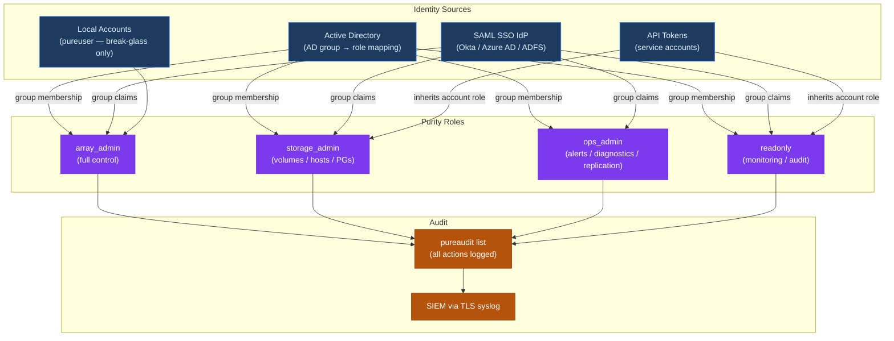

---
tags:
  - pure
  - security
---
# FlashArray — Access Control


<div class="kb-summary">
FlashArray uses a role-based access control (RBAC) model with four built-in roles. Custom roles are not supported.
</div>
```text
┌────────────────────────────────── Pure FlashArray — Access Control ───────────────────────────────────┐
│                                                                                                       │
│   ┌───────────────────────────────────────────────────────────────────────────────────────────────┐   │
│   │        FlashArray access control: RBAC roles, least-privilege, and access audit logging       │   │
│   │        Roles: admin (full), operator (read/modify), read-only (view); map to AD groups        │   │
│   │       Authentication: local accounts, LDAP/AD integration, and MFA for privileged users       │   │
│   │          Audit: log all admin actions; review access logs monthly; rotate credentials         │   │
│   └───────────────────────────────────────────────────────────────────────────────────────────────┘   │
│                                                                                                       │
│    Identify user → assign role → enforce MFA → audit → review quarterly                               │
│                                                                                                       │
│                  ▼                                ▼                                ▼                  │
│                                                                                                       │
│   ┌─────────────────────────────┐  ┌─────────────────────────────┐  ┌─────────────────────────────┐   │
│   │            Layer            │  │          Component          │  │            Notes            │   │
│   │         Controllers         │  │        Active-active        │  │           No SPOF           │   │
│   │            Drives           │  │         DirectFlash         │  │         NVMe native         │   │
│   │           Volumes           │  │       Thin provisioned      │  │        Instant clone        │   │
│   │        ActiveCluster        │  │       Sync replication      │  │           Zero RPO          │   │
│   │           SafeMode          │  │       Immutable snaps       │  │      Ransomware resist      │   │
│   └─────────────────────────────┘  └─────────────────────────────┘  └─────────────────────────────┘   │
│                                                                                                       │
│                          ▼                                                 ▼                          │
│                                                                                                       │
│   ┌───────────────────────────────────────────────────────────────────────────────────────────────┐   │
│   │       Role       │   Permissions    │       Scope       │       Auth       │   Review cycle   │   │
│   │      Admin       │    Full CRUD     │       Global      │   MFA required   │     Monthly      │   │
│   │     Operator     │   Read/modify    │      Assigned     │   MFA required   │    Quarterly     │   │
│   │    Read-only     │    View only     │      Assigned     │     Password     │    Quarterly     │   │
│   │   Service acct   │     API only     │    Specific API   │    Token/cert    │      Annual      │   │
│   └───────────────────────────────────────────────────────────────────────────────────────────────┘   │
│                                                                                                       │
│    Physical: FlashArray//X or //C controllers · DirectFlash NVMe modules · 25/100 GbE / 32Gb FC       │
│                                                                                                       │
│    Key terms:                                                                                         │
│                                                                                                       │
│    FlashArray         = Pure all-NVMe block/file array; inline dedup and compression always enabled   │
│    DirectFlash        = Pure proprietary NVMe modules; direct flash access without SAS translation    │
│    ActiveCluster      = synchronous active-active stretch cluster; hosts see a single namespace       │
│    ActiveDR           = asynchronous replication to DR site; recovery point objective in seconds      │
│    SafeMode           = admin-locked immutable snapshots; cannot be deleted even by array administr...│
│    Protection group   = set of volumes and hosts sharing a snapshot and replication schedule          │
│    purefa CLI         = REST CLI tool for FlashArray; purefa CLI connects via REST API key            │
│    purearray          = purectl CLI command: purearray list and purearray show monitoring             │
│    Volume tag         = user-defined key-value label on volumes for policy and reporting purposes     │
│    Host group         = logical collection of hosts sharing volume access via a host group object     │
│    Inline dedup       = content-based deduplication performed inline before data is written to flash  │
│    Evergreen          = Pure architecture; controllers upgrade non-disruptively, shelves remain in ...│
│                                                                                                       │
└───────────────────────────────────────────────────────────────────────────────────────────────────────┘
```


 All human admin accounts should be mapped through directory service groups (AD or LDAP); individual named local accounts should be limited to break-glass scenarios and service accounts.

---

## RBAC and Access Model



---

## Built-in Roles

| Role | Write Access | Restrictions | Recommended For |
|---|---|---|---|
| `array_admin` | Full array configuration, user management, all data operations | None — full control including account creation, SafeMode, and array-level settings | Storage team leads; break-glass admin accounts; Purity upgrade operators |
| `storage_admin` | Volumes, hosts, host groups, protection groups, snapshots, replication | Cannot modify array-level configuration (network, NTP, DNS, alerts); cannot manage user accounts | Storage admins performing day-to-day provisioning and data management |
| `ops_admin` | Start/stop replication, acknowledge alerts, run diagnostics, view all configuration | Cannot provision volumes; cannot modify array config; cannot manage user accounts | Operations team; on-call engineers who respond to alerts |
| `readonly` | None — read-only access to all array data and configuration | Cannot make any changes | Monitoring integrations; SIEM accounts; read-only access for application teams and auditors |

---

## Assigning Roles to Local Accounts

```bash
# Create a local account with a specific role
pureadmin create --role storage_admin jsmith

# Change an existing account's role
pureadmin setattr jsmith --role ops_admin

# Downgrade to read-only
pureadmin setattr jsmith --role readonly

# List all accounts and their current roles
pureadmin list
```

---

## Assigning Roles to Directory Service Groups

Groups in Active Directory or LDAP are mapped to Purity roles. When a user logs in, Purity checks which AD groups they are a member of and applies the highest-privilege role from the mapped groups.

```bash
# Map an AD group to array_admin role
pureadmin setattr --role array_admin \
    --group "CN=pure-array-admins,OU=Groups,DC=example,DC=com"

# Map an AD group to storage_admin role
pureadmin setattr --role storage_admin \
    --group "CN=pure-storage-admins,OU=Groups,DC=example,DC=com"

# Map an AD group to ops_admin role
pureadmin setattr --role ops_admin \
    --group "CN=pure-ops,OU=Groups,DC=example,DC=com"

# Map an AD group to read-only role
pureadmin setattr --role readonly \
    --group "CN=pure-readonly,OU=Groups,DC=example,DC=com"

# List all mapped groups and their roles
pureadmin list
```

**Group design guidance:**

- Use one AD group per Purity role — do not add the same user to multiple role groups; Purity grants the highest role if a user is in more than one mapped group
- Nest the Purity role groups under a parent OU for easy ACL reporting and audit
- Apply AD group membership reviews quarterly — remove members who have changed roles or left the organisation

---

## API Token Access Control

API tokens provide programmatic access without interactive authentication. They inherit the role of the account they belong to.

```bash
# Create a monitoring service account (read-only)
pureadmin create --role readonly svc-monitoring
pureadmin apitoken create svc-monitoring

# Create a provisioning service account for Terraform / Ansible
pureadmin create --role storage_admin svc-automation
pureadmin apitoken create svc-automation

# Create an account for Veeam FlashArray integration
pureadmin create --role storage_admin svc-veeam
pureadmin apitoken create svc-veeam

# List all accounts and whether they have API tokens
pureadmin list --api-token

# Revoke a token without deleting the account
pureadmin delete svc-old --api-token
```

**Token access matrix:**

| Integration | Recommended Role | Rationale |
|---|---|---|
| Pure1 phone-home (built-in) | Managed by Purity | No token needed — automatic |
| Veeam / Commvault backup | `storage_admin` | Needs to create/delete snapshots and protection groups |
| Terraform provider | `storage_admin` | Needs to create volumes, hosts, protection groups |
| Ansible `purefa_info` module | `readonly` | Read-only inventory collection |
| Monitoring (SNMP, Prometheus) | `readonly` | No write access required |
| vCenter VASA provider | `storage_admin` | Needs to create and manage vVols |
| Custom automation (provisioning) | `storage_admin` | Apply scope restriction at the application layer |
| Audit/compliance tool | `readonly` | Read-only audit collection |

---

## Least Privilege Implementation

Purity does not support resource-level access control (i.e., limiting a `storage_admin` to specific volumes or protection groups). The role grants access to all objects of that type. Compensate for this limitation through:

1. **Process controls:** require change requests for all provisioning; ops team approves requests before storage admins execute
2. **Audit log review:** forward audit logs to SIEM and alert on unexpected destructive operations (volume destroy, protection group delete, snapshot eradication)
3. **Separate environments:** use separate FlashArrays (or separate Pure1 organisations) for production and non-production if strict separation is required
4. **Named accounts only:** never share a `pureuser` credential for routine work — every admin action must be attributable to a named user in the audit log

```bash
# Audit all admin actions in the last 24 hours
pureaudit list --sort time- | head -50

# Find all volume delete (destroy) operations
pureaudit list --filter 'command="purevol" and subcommand="destroy"'

# Find all snapshot eradication operations
pureaudit list --filter 'command="puresnap" and subcommand="eradicate"'

# Find all protection group schedule changes
pureaudit list --filter 'command="purepgroup" and subcommand="schedule"'
```

---

## Account Lifecycle Management

### Onboarding a New Admin

1. Add the new admin's account to the appropriate AD security group for their role
2. Verify they can log into the array with their domain account
3. Confirm their role is correct: `pureadmin list` and check the role column
4. If they need API access, create a named service account or provide them a personal API token tied to their account

### Offboarding an Admin

```bash
# If using AD: remove the user from the relevant AD group — their next login attempt will fail
# Invalidate any active sessions immediately:
pureadmin refresh <username>

# If they had a local account, delete it:
pureadmin delete jsmith

# If they had a personal API token:
pureadmin delete jsmith --api-token
```

If the departing admin had access to any shared credentials (e.g., the vaulted `pureuser` password), rotate those credentials immediately after their departure.

### Periodic Access Review

Run quarterly:

```bash
# Export all admin accounts and roles to CSV for access review
ssh pureuser@<array_ip> "pureadmin list --csv" > admin_review_$(date +%Y%m%d).csv

# Export API token inventory
ssh pureuser@<array_ip> "pureadmin list --api-token --csv" >> admin_review_$(date +%Y%m%d).csv
```

Review output and action:

- Remove AD group memberships for any accounts that should no longer have access
- Revoke API tokens for decommissioned service accounts or integrations
- Confirm that no accounts have `array_admin` that should be `storage_admin`

---

## SNMP Access Control

FlashArray supports SNMPv3 for monitoring integrations. Always use SNMPv3 — never SNMPv1 or SNMPv2c in production.

```bash
# Configure SNMPv3 community (authPriv — SHA auth + AES encryption)
puresnmp create --version v3 \
    --auth-protocol SHA \
    --auth-passphrase "<auth_password>" \
    --privacy-protocol AES \
    --privacy-passphrase "<priv_password>" \
    --user monitoring-user \
    siem-snmp

# List SNMP configuration
puresnmp list

# Configure SNMP trap destination
puresnmptrap create --version v3 \
    --auth-protocol SHA \
    --auth-passphrase "<auth_password>" \
    --privacy-protocol AES \
    --privacy-passphrase "<priv_password>" \
    --user monitoring-user \
    --host <trap_receiver_ip> \
    nms-trap
```

SNMPv3 is read-only by design on FlashArray — it cannot be used to make configuration changes.

---

## Management Network Access Restriction

FlashArray does not provide built-in IP-based ACLs for management plane access. Restrict access at the network layer:

| Control | Implementation |
|---|---|
| Firewall / ACL on management VLAN | Allow SSH (22) and HTTPS (443) only from admin jump hosts and monitoring systems; deny all other inbound |
| Dedicated management VLAN | Place the array management interface on a VLAN separate from data traffic; apply the ACL at the access layer switch |
| Jump host requirement | Require all admin access to originate from a bastion/jump host; the jump host should enforce MFA at the host level |
| SSH key restriction | If using local accounts for CLI access, use SSH key authentication and disable password-based SSH on the jump host (not on the array itself — Purity does not support SSH key auth natively) |

Document the allowed source IP ranges in the firewall change log and review them annually.
